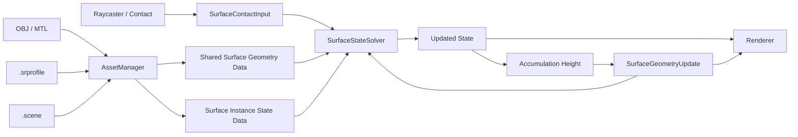

# 데이터 흐름

상태: **설계**

1. OBJ / MTL / Texture / `.scene` / `.srprofile`을 로드한다. [[02_Architecture/Assets-and-Profiles|에셋과 프로필]]
2. 같은 Mesh + Normal Map을 사용하는 인스턴스가 공유할 정적 형상 데이터를 준비한다. [[02_Architecture/Surface-Geometry|형상 정보]]
3. 각 Mesh Instance는 자신의 State를 가진다. [[02_Architecture/Surface-State|표면 상태]]
4. Raycast 등으로 `SurfaceContactInput`을 만들고 Input 항으로 변환한다. [[02_Architecture/Contact-Input|Contact Input]]
5. Solver가 Input / Transport / Decay를 사용해 다음 State를 계산한다. [[02_Architecture/Propagation-Solver|Solver]]
6. State가 형상 적층을 만드는 경우 `Accumulation_Height`를 계산한다. [[02_Architecture/Accumulation|적층]]
7. 적층으로 바뀐 Height / Normal / Distance / Curvature를 후속 Simulation과 Rendering에 다시 반영한다. [[02_Architecture/Surface-Geometry|형상 정보]], [[02_Architecture/Rendering|렌더링]]

> Simulation UV mapping과 Vulkan GPU resource binding / barrier의 상세 데이터 흐름은 아직 별도 설계 전이다.
