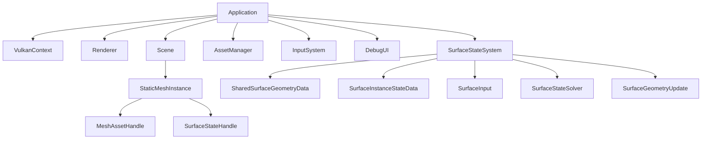

# 전체 엔진 구조

상태: **설계** · 근거: [[05_Assets/Documents/Overall-Engine-Structure.pdf|전체 엔진 구조]]

MDSSP Engine은 C++/Vulkan 기반 렌더링 엔진에 **Material-Dependent Surface State** 시뮬레이션을 추가한다. 현재 구현 범위는 **Static Mesh**다.

핵심 분리는 다음과 같다.

- **Asset / Render Material**: Mesh와 외관 렌더링 정보.
- **Surface Response Profile**: State에 대한 반응 계수.
- **Shared Surface Geometry Data**: 인스턴스 간 공유 가능한 정적 형상 데이터.
- **Surface Instance State Data**: 인스턴스마다 별도로 가지는 동적 상태 데이터.

## 읽는 순서

1. [[02_Architecture/Modules|모듈과 책임]] → [[02_Architecture/Data-Flow|데이터 흐름]]
2. [[02_Architecture/Surface-State|표면 상태와 데이터 구조]] → [[02_Architecture/Assets-and-Profiles|에셋과 프로필]]
3. [[02_Architecture/Contact-Input|Contact Input]] → [[02_Architecture/Propagation-Solver|Propagation Solver]]
4. [[02_Architecture/Surface-Geometry|형상 정보]] → [[02_Architecture/Accumulation|적층]] → [[02_Architecture/Rendering|렌더링]]
5. [[02_Architecture/Demos|목표 데모]] → [[TODO|TODO]]

Simulation UV의 생성·Mesh→Texel mapping·UV seam 연결과 실제 GPU Resource Layout은 **다음 설계 문서에서 별도로 확정할 예정**이며 현재 볼트에는 결론을 만들지 않는다.
