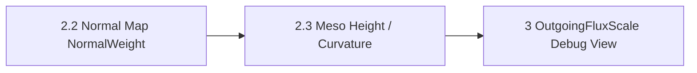

# Branch 2.3 — Solver Meso Geometry from Normal Map

브랜치: `feat/solver-meso-geometry`
선행 조건: Branch 2.2의 Normal Map texel sampling 및 tangent 입력 계약
상태: **계획 · 알고리즘 미확정 · 구현 전**
관련 설계: [[03_Architecture/0005_Surface-Geometry|Surface Geometry]], [[03_Architecture/0004_Surface-State-Update|Surface State Update]], [[05_Development/Experiments/0001_Normal-Map-Integration|Normal Map Integration 실험]]

## 목표

Normal Map에 저장된 tangent-space 표면 방향을 이용해 texel별 `MesoVirtualHeight`를 복원하고, 그 결과로 유효 위치와 Curvature/Concavity 파생값을 생성한다. 결과는 Macro Mesh를 대체하지 않고 기존 표면 위의 미세 geometry 입력으로 사용한다.

Branch 2.2의 직접 Normal Map `NormalWeight` 입력과 역할을 나눈다.

- Branch 2.2: map normal 방향을 이웃 간 전달 가중치에 직접 사용한다.
- Branch 2.3: map normal을 slope field로 보고 일관된 height field 및 파생 geometry를 복원한다.

## 복원 절차 후보

Tangent-space normal `n=(n_x,n_y,n_z)`에서 `n_z`가 유효한 texel은 UV 기준 slope를 `p=-n_x/n_z`, `q=-n_y/n_z`로 계산할 수 있다. 이 slope field를 height gradient로 보고 적분해 `MesoVirtualHeight`를 만든다. 실제 식에는 UV 방향, texel spacing, tangent frame과 height scale을 반영해야 한다.

Normal Map은 noise, bake 오차 또는 비적분 가능 성분을 가질 수 있다. 경로마다 높이가 달라지는 경우가 있어 적분법과 fallback을 이 branch에서 결정한다.

| 후보 | 장점 | 위험 / 비용 |
|---|---|---|
| 경로 누적 적분 | 구현이 단순하고 소규모 진단에 적합 | 적분 경로에 따라 결과가 달라지고 오차가 누적된다. |
| Least-squares / Poisson 적분 | 전체 slope 오차를 줄이고 경로 편향을 완화한다. | boundary 조건, 기준 높이, 해법과 수렴 조건이 필요하다. |
| 정규화된 근사 높이 | 빠르게 Meso offset을 만들 수 있다. | 실제 높이와 단위가 보장되지 않으며 scale 보정이 필요하다. |

초기 추천은 **고정 평균 높이 또는 명시한 boundary를 기준으로 한 least-squares height field**다. Non-Integrable residual이 남는 입력은 residual 크기를 측정하고, 정의한 임계값을 넘으면 fallback 또는 해당 Surface의 복원을 거부한다. 알고리즘·임계값은 fixture 결과를 보고 확정한다.

## 결정할 계약

| 항목                      | branch에서 확정할 질문                                                                             |
| ----------------------- | ------------------------------------------------------------------------------------------- |
| 입력 좌표                   | Simulation UV를 기준으로 사용한다. 전처리 때 각 Simulation texel과 Normal Map sample 좌표를 대응시켜 저장한다. 실제 대응 데이터 형식과 여러 map/material 처리 범위는 branch에서 정한다. |
| 미세 높이 scale             | slope를 월드 길이의 `MesoVirtualHeight`로 바꾸는 물리 scale/authoring parameter                         |
| 적분 경계                   | 열린 chart, UV seam, 여러 disconnected chart마다 높이 기준을 어떻게 고정할지                                  |
| Non-Integrable fallback | least-squares 결과를 허용할 residual 범위와 실패 시 기본값/근사 대안                                           |
| Curvature               | 높이 field에서 mean/principal/Gaussian curvature 중 무엇을 생성할지와 단위·필터링                             |
| Concavity               | Decay의 cavity retention에 쓸 부호 규칙, 범위와 평탄 영역의 기준값                                            |
| 법선 결과                   | 복원 높이의 미분으로 유효 normal을 다시 계산할지, Normal Map sample normal을 유지할지                              |
| 저장 및 cache              | texel별 Meso height/curvature/concavity를 shared geometry에 저장하는 범위와 Map revision invalidation |

CurvatureWeight와 ConcavityWeight는 별도 역할이다. CurvatureWeight는 중립값 `1.0`으로 유지한다. `NormalWeight`가 이웃의 유효 normal 차이를 이미 반영하므로, 방향별 곡률로 전달 감쇠를 더하면 같은 굽힘 효과를 중복할 수 있기 때문이다. 이 branch에서 Meso Curvature를 생성하더라도 이를 TransferWeight에 연결하지 않는다. Normal Map normal을 반영한 `NormalWeight`만 쓴 결과와 비교해 곡률 항의 독립적인 이득이 확인되면 후속 설계에서 재검토한다. `ConcavityWeight`는 기존 Decay 계약의 cavity retention에만 사용하며, 해당 입력의 부호·범위를 명시한다.

## 구현 순서

1. 평탄·볼록·오목·노이즈·Non-Integrable Normal Map synthetic fixture와 실제 texel/UV fixture를 준비한다.
2. Normal Map decode, tangent/UV 방향, slope 단위와 높이 scale을 확정한다.
3. 적분 후보를 비교해 height field, boundary와 Non-Integrable fallback을 선택한다.
4. texel별 `MesoVirtualHeight`를 shared geometry preprocessing 결과에 생성한다.
5. 선택한 Curvature/Concavity 파생값을 계산한다. ConcavityWeight는 Decay 계약에 연결하고, Meso 형상 및 유효 normal 입력은 GeometryDrive/TransferWeight cache에 반영한다. CurvatureWeight는 `1.0`을 유지한다.
6. 결과가 바뀌면 TransferWeight cache를 갱신하고, 동일 입력의 cache 재사용을 확인한다.
7. Meso height 및 curvature/concavity 시각화를 통해 높이의 부호·scale·seam 연속성을 검토한다.
8. 결정한 수식과 GPU layout/cache invalidation을 Architecture 및 ADR에 반영한다.

## 검증

- 평탄 Normal Map은 0 기준의 일정한 Meso height와 기준 Curvature/Concavity를 만든다.
- 적분 가능한 볼록/오목 표본은 입력 방향과 높이 부호 계약에 맞는 형상을 복원한다.
- 경로 비의존성 또는 least-squares residual을 수치로 측정해 Non-Integrable 동작을 분류한다.
- UV seam, chart 경계, tangent handedness, texel 해상도 변경에서 discontinuity와 scale 변화를 측정한다.
- 결과는 finite하고 설정한 height/curvature/concavity 범위 안에 있으며 invalid 입력이 Solver로 누출되지 않는다.
- 생성한 `MesoVirtualHeight`가 GeometryDrive/DistanceWeight 및 선택한 유효 normal에서 예상대로 반영된다.
- Normal Map 또는 UV/tangent revision 변경 시 파생값과 TransferWeight cache가 무효화되고, 입력이 같을 때는 재사용한다.
- preprocessing 시간, 임시 메모리, persistent Runtime 데이터 payload 및 solver GPU 비용을 각각 기록한다.

## 완료 조건

- integrable 및 Non-Integrable 입력 정책과 UV/단위/boundary 계약이 확정된다.
- MesoVirtualHeight와 선택한 Curvature/Concavity 생성 경로가 반복 가능한 fixture로 검증된다.
- seam·scale·fallback 오류가 시각 자료와 수치 결과로 기록된다.
- Architecture, GPU layout, 관련 ADR 및 Normal Map 실험 문서가 구현과 일치한다.

## 제외 범위

- 시간에 따라 변하는 Accumulation geometry
- CurvatureWeight는 `1.0` 유지. `NormalWeight`와 구별되는 곡률 기반 전달 효과의 도입 여부와 수식은 비교 검증 후 재검토
- 자동 UV unwrap 또는 임의 chart 재배치

## 브랜치 흐름

