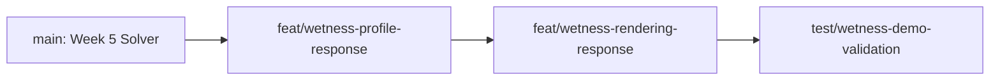

# 6주차 브랜치 계획 — Wetness 구현

상태: **구현 계획** · 상위 계획: [[02_Planning/01_Weekly-Overview/Week-06|Week 06 Overview]]

## 목표

완료된 generic Surface State Solver와 GeometryDrive 계약 위에서 `Wetness` State의 입력·전파·감쇠를 Profile별로 조정하고, Wetness가 재질 색과 roughness에 반응하도록 연결한다.

## 선행 조건

- Week 5 GeometryDrive/TransferWeight와 Solver 검증 작업이 `main`에 병합되어 있어야 한다.
- 기존 Contact Input은 Registry State를 선택해 `InputDelta`로 전달한다. 새 contact API나 별도의 Wetness channel을 고정 enum으로 추가하지 않는다.
- Wetness는 Registry 및 `.SRProfile`에 선언된 State다. 자유 표면의 `SurfaceWater` 모델은 이번 주 범위가 아니다.

## Week 5에서 확정한 Geometry transport 계약

Wetness는 generic Solver의 Geometry transport를 사용한다. 이 브랜치에서 GeometryDrive 수식을 다시 정의하지 않는다.

- `EffectiveHeight = MacroHeight + MesoVirtualHeight`를 instance transform이 반영된 world-length로 평가한다.
- `HeightDrive(i→j) = abs(EffectiveHeight_i - EffectiveHeight_j)`이며 neighbor distance로 나누지 않는다.
- `DirectionDrive`는 instance transform을 반영한 source 면에 투영한 World Gravity와 source→target 방향의 정렬도다. 반대 방향은 0, 퇴화한 투영은 0이다.
- `DistanceWeight`가 실제 이웃 표면 간격의 감쇠를 맡는다.
- `GeometryTransferRate`의 단위는 `State / (world-length · second)`다.

계약의 기준은 [[04_ADR/0015-Geometry-Driven-Transport|ADR 0015]]와 [[03_Architecture/0004_Surface-State-Update|Surface State Update]]다.

## 브랜치 순서

각 브랜치를 앞 단계가 `main`에 병합된 뒤 생성한다.

| 순서 | 브랜치 | 결과물 |
|---:|---|---|
| 1 | `feat/wetness-profile-response` | Wetness의 inputFactor, saturation/geometry transfer rate, decay Profile 조정 및 입력·전파 테스트 |
| 2 | `feat/wetness-rendering-response` | Wetness에 따른 재질 color/roughness 변화 |
| 3 | `test/wetness-demo-validation` | 동일 입력 조건의 재질별 결과 비교와 통합 검증 기록 |

## Branch 1 — Wetness Profile Response

### 작업 범위

- 현재 Profile 구조에 맞춰 Wetness를 지원하는 재질 Profile을 준비한다.
- `inputFactor`, `SaturationTransferRate`, `GeometryTransferRate`, `DecayRate`를 조정한다. 등록된 State 이름은 Registry로 조회한다.
- 동일한 접촉 위치·세기·시간 조건으로 서로 다른 Profile의 Wetness 입력·확산·감쇠를 비교한다.
- 방향 변화와 transform된 instance에서 World Gravity가 면 방향에 맞게 작용하는지 확인한다.
- Rate 튜닝은 geometry transport 단위 계약(ADR 0015)에 맞춘다. 이웃 간 거리 감쇠는 `DistanceWeight`에 남긴다.

### 완료 조건

- Wetness 입력이 선택된 instance/Profile에만 적용된다.
- 입력·포화도 전달·GeometryDrive·Decay가 의도한 Profile 값에 따라 변화한다.
- State 범위, outgoing alpha 및 기존 2-Pass 불변 조건을 유지한다.

## Branch 2 — Wetness Rendering Response

### 작업 범위

- Wetness channel을 material rendering path에서 읽는다.
- Wetness 값에 따라 Base Color와 Roughness가 변하도록 간단한 remap을 연결한다.
- debug heatmap과 실제 material response를 구분하고, Wetness=0 및 높은 Wetness의 시각 결과를 확인한다.
- remap 범위와 기준 색/roughness는 데모 재질에서 검증해 문서화한다.

### 완료 조건

Wetness State 변화가 Demo Scene의 재질에 시각적으로 나타나며, State가 0이면 기존 건조 material appearance로 돌아온다.

## Branch 3 — Wetness 통합 검증

- 같은 Contact event와 동일한 시간 동안 두 개 이상의 재질 Profile 결과를 비교한다.
- 30/60 FPS에서 동일한 discrete input 양이 적용되고 Continuous Transport/Decay만 `DeltaTime`을 사용함을 확인한다.
- support되지 않는 Profile/State 조합, Capacity clamp, pause/reset/debug view를 회귀 확인한다.
- 결과 이미지와 Profile parameter set, test/device 환경, 수식과 구현 차이를 기록한다.

## 제외 범위

- `SurfaceWater` 전용 자유 표면수 모델이나 물리 layer
- Normal Map을 이용한 Meso geometry 생성
- Accumulation 기반 dynamic geometry/displacement
- Solver geometry flux 수식 변경
- 별도 Collider/Contact API 변경

## 참고

- [[04_ADR/0015-Geometry-Driven-Transport|ADR 0015 — Geometry-Driven Transport]]
- [[03_Architecture/0004_Surface-State-Update|Surface State Update]]
- [[03_Architecture/0006_Rendering|Rendering]]
- [[02_Planning/01_Weekly-Overview/Week-06|Week 06 Overview]]
