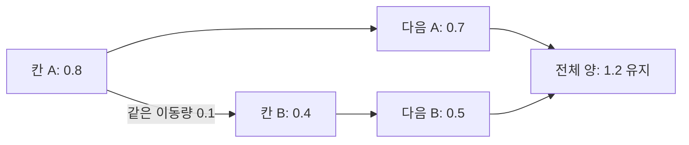

# 포화 상한을 보존하는 유한체적 전달 계산

> **한 줄 요약:** 이웃 칸으로 이동하는 양을 계산할 때 값이 음수가 되거나 포화 상한을 넘지 않도록 만드는 연구다.

- 상태: **적용 검토 — 검증 관점 참고, 알고리즘 직접 채택 없음**
- 최종 확인: 2026-09-28
- 읽은 범위: 공개 원문의 초록·서론, §2.2 식 (2.6)·Proposition 2.2·Theorem 2.4 및 Remark 2.7, §3.2의 계산식, §4 도입부·§4.2. 전문 정독 및 증명 재검산은 미완료.

## 출처

| 항목 | 내용 |
|---|---|
| 제목 | Bound-Preserving Finite-Volume Schemes for Systems of Continuity Equations with Saturation |
| 저자 | Rafael Bailo, José A. Carrillo, Jingwei Hu |
| 출판 | SIAM Journal on Applied Mathematics, 83(3), 1315–1339, 2023 |
| 공식 출처 | [저널 / DOI](https://doi.org/10.1137/22M1488703) |
| 공개 원문 | [arXiv:2110.08186v3](https://arxiv.org/abs/2110.08186v3), [PDF](https://arxiv.org/pdf/2110.08186v3), 2023-01-14 |

## 1. 프로젝트와의 연관

| 프로젝트 영역 | 검토할 질문 | 문서 |
|---|---|---|
| State / Capacity | 포화 기준량과 저장 상한을 같은 개념으로 둘 것인가? | [[../04_Architecture/0002_Surface-State\|State 계약]] |
| Transport | source 유출과 target 유입에 같은 Flux를 반영하고 비음수를 유지하는가? | [[../04_Architecture/0006_Surface-State-Update\|갱신식]] |
| Capacity 초과량 | 입력·유입 초과를 삭제할지 보존할지? | [[05_ADR/0020-State-Overcapacity-Transport\|ADR 0020]] |
| 계산 검증 | timestep·채널·경계 조건 변화에서 무엇을 검사할 것인가? | [[../03_Planning/02_Weekly-Details/Week-05/0006_Branch-Solver-Week5-Validation\|Solver 통합 검증]] |

## 2. 연구 요지와 요약

**물질이 이웃으로 퍼지거나 모이는 모습을 컴퓨터로 계산할 때, 각 칸의 값이 말이 되는 범위를 지키도록 하는 연구다.**

공간을 작은 칸들로 나누고 칸 사이에 이동하는 양을 계산한다고 생각하면 된다. 계산이 잘못되면 없는 양을 내보내 값이 음수가 되거나, 꽉 찬 칸에 계속 들어와 정한 상한을 넘을 수 있다. 이 연구는 **보내는 쪽의 양과 받는 쪽의 포화 상태를 전달 계산에 반영**해 이런 결과를 막는다. [논문 초록·§2.2](https://arxiv.org/pdf/2110.08186v3)

프로젝트에서 참고할 부분은 **이웃에게 보낸 양과 받은 양이 일치하는지, 없는 양을 보내지 않는지**를 확인하는 관점이다. 현재 프로젝트는 초과량을 State에 보관하므로, 논문의 상한을 지키는 알고리즘을 그대로 채택한 상태는 아니다.

## 3. 연구 상세 내용

### 3.1 작은 칸으로 나누고 이동량을 계산한다

유한체적법은 공간을 작은 칸으로 나누고 **각 칸의 평균 밀도**를 계산한다. 밀도에 칸의 부피를 곱하면 그 칸에 들어 있는 양이다. 이웃과 맞닿은 경계를 통과하는 흐름을 **Flux**라고 부른다. [LeVeque, 유한체적법 설명 §1.2](https://www.clawpack.org/fvmhp_materials/sample.pdf)

양으로 표현하면 기본 장부는 다음과 같다.

```text
다음 양 = 현재 양 + 이웃에서 받은 양 - 이웃에게 보낸 양
```

한 경계의 이동량을 양쪽에서 함께 사용해야 한다. A가 B에게 0.1을 보냈다면 A에서는 0.1을 빼고 B에는 0.1을 더한다. 외부 출입이 없다면 전체 양은 유지된다. 크기가 다른 칸의 밀도를 단순 합산하면 전체 양과 다르므로 칸의 크기도 고려해야 한다. [유한체적법의 보존식](https://www.clawpack.org/fvmhp_materials/sample.pdf)



위 숫자는 개념 설명용 예시이며 논문의 실험 결과가 아니다. 프로젝트의 texel State 합과 면적을 반영한 물리량도 같은 방식으로 구분한다.

### 3.2 받는 칸의 포화 상태가 흐름을 줄인다

논문은 포화 상한을 `α`로 쓰며, 상한에 가까워질수록 작아지는 함수 `ψ(ρ)`를 둔다. 대표 예는 `ψ(ρ) = α - ρ`다. **이 α는 프로젝트의 유출 제한 비율 alpha와 다른 기호다.** [§2, Definition 2.1](https://arxiv.org/pdf/2110.08186v3)

식 (2.6b)를 오른쪽으로 흐르는 경우만 표시하면 다음 구조다.

$$
F_{i\to i+1}^{n+1}
=\rho_i^{n+1}
\max\!\left(\psi(\rho_{i+1}^{n+1}),0\right)
 u_{i+1/2}^{n+1},\qquad u_{i+1/2}^{n+1}>0
$$

| 기호 | 직관적인 의미 |
|---|---|
| `ρᵢ` | 보내는 칸의 밀도 |
| `ψ(ρᵢ₊₁)` | 받는 칸의 포화 상태에 따른 흐름 계수 |
| `u` | 경계를 통과하는 이동 속도 |
| `n+1` | 이번 계산으로 구할 다음 시점 |

상한이 1인 예에서 받는 밀도가 0.9라면 위 함수의 값은 0.1이고, 1이라면 0이다. **이 계수만 현재 값에 곱한다고 논문의 상한 보장이 생기는 것은 아니다.** 다음 시점의 값으로 구성한 전체 계산식이 함께 필요하다. [§2.2, 식 (2.6)](https://arxiv.org/pdf/2110.08186v3)

### 3.3 다음 값과 전달량을 함께 구한다

논문의 기본 방식은 **암시적 계산**이다. 다음 밀도와 다음 밀도로 정해지는 Flux가 서로 맞도록 함께 구한다. [§2.2, 식 (2.6a–c)](https://arxiv.org/pdf/2110.08186v3)

$$
\rho_i^{n+1}
=\rho_i^n
-\frac{\Delta t}{\Delta x}
\left(F_{i+1/2}^{n+1}-F_{i-1/2}^{n+1}\right)
$$

`Δt`는 진행할 시간이고 `Δx`는 1차원 칸의 길이다. 여러 이웃에서 들어오는 흐름도 이 장부에 함께 반영된다.

```text
현재 프로젝트: Current로 RawFlux 계산 → 유출 제한 → Next 기록
논문의 기본식: Next와 Next에 따른 Flux가 서로 일치하도록 연립 계산
```

논문의 알고리즘을 적용하려면 다음 값들을 함께 푸는 경로가 필요하다. 현재 프로젝트의 두 pass를 실행하는 것만으로 이 암시적 계산을 수행하는 것은 아니다.

### 3.4 보장과 실험의 범위를 구분한다

Proposition 2.2는 초기 밀도가 `0 ≤ ρ ≤ α`일 때 기본 계산식이 그 범위를 유지한다고 보인다. Gradient flow 조건의 에너지 감소도 다룬다. 여러 종류의 물질에서는 **합계 밀도**에 포화 상한을 적용한다. [§2.2·§3.2](https://arxiv.org/pdf/2110.08186v3)

§4.2는 포화된 정상상태와 명시적·암시적 계산을 비교한다. 암시적 방식의 큰 시간 간격 사용이 정확성이나 시간 간격 독립성을 뜻하지는 않는다. 고차원·비국소 암시적 계산의 비용도 논의한다. [§4.2·Remark 2.7](https://arxiv.org/pdf/2110.08186v3)

현재 프로젝트에는 채널별 Capacity와 상한을 넘을 수 있는 State가 있다. 논문의 합계 밀도 상한·암시적 계산과는 계약이 다르므로 보장도 별도로 검증한다.

### 3.5 프로젝트에서 차이를 읽는 예시

다음은 동일한 크기의 두 칸, 기준량 1, 입력·감쇠 없음, A=0.8·B=0.9에서 A가 B에게 0.2를 보내려는 **설명용 장부**다. 논문 실행 결과를 재현한 수치는 아니다.

| 처리 | 다음 A | 다음 B | 합계 | 해석 |
|---|---:|---:|---:|---|
| 전달 뒤 B를 1로 clamp | 0.6 | 1.0 | 1.6 | 초기 합계 1.7에서 0.1 손실 |
| 이동량 자체를 0.1로 줄이는 예 | 0.7 | 1.0 | 1.7 | 저장 상한과 보존을 함께 지키려는 경우 |
| ADR 0020의 초과량 보존 | 0.6 | 1.1 | 1.7 | 초과량을 같은 State에 남김 |

마지막 행에서는 다음 Solver step의 `State / Capacity`로 받은 양을 다시 전달한다. 실제 이동량은 RawFlux·rate·weight·Δt가 정한다. 이 예는 상한 유지와 초과량 보존의 차이를 설명하며, 중간 행의 단순한 제한만으로 여러 이웃의 동시 전달까지 해결했다고 보지 않는다.

## 4. 프로젝트 적용 계획

다음은 원문 주장과 구분되는 **프로젝트의 적용 판단**이다.

| 검토 내용 | 프로젝트에서 사용할 부분 | 상태 / 이유 |
|---|---|---|
| 비음수 | alpha가 감쇠 후 전체 source 보유량을 넘지 않게 제한하는지 검증 | 검증 관점으로 참고 |
| 보존량 | Input/Decay OFF의 닫힌 graph에서 State 합, ON에서 입력·sink 장부 비교 | 프로젝트 fixture로 검증 필요 |
| 포화 상한 | 현재 결정은 State A/B에 기준량 초과를 허용 | 논문의 상한 보존 방식은 직접 채택하지 않음 |
| timestep 조건 | 같은 총 시간의 1/30·1/60 비교, 큰 rate·Δt의 안정성 평가 | timestep 독립을 주장하지 않음 |
| 다종 모델 | Registry 여러 채널의 지원 여부·전이·보존 조건 분리 | 채널 지원 구조만으로 결합 PDE를 구현했다고 보지 않음 |
| 암시적 계산 | 현재 explicit 2-Pass GPU Solver 유지 | 변경을 위한 비용·품질 실험 없이 채택하지 않음 |

### 확정된 설계와의 관계

ADR 0020은 초과량을 float32 State A/B에 포함하고 Capacity를 포화 기준량으로 쓴다. 전달용 `State / Capacity`는 1을 넘을 수 있다. 받은 양은 다음 Solver step의 RawFlux에서 다시 이동하며 목적지 공간 제한을 추가하지 않는다. 논문의 상한 보존 모델과 계약이 다르므로 논문의 정리·안정성 보장을 이 Solver의 보장으로 인용하지 않는다.

원문은 이 엔진의 texel graph, GeometryDrive·TransferWeight, 재질 Profile, Mud 적층 또는 자유 표면수 모델을 검증하지 않는다. 이를 평가하려면 프로젝트 자체 실험이 필요하다.

## 검증 및 후속

| 질문 | 프로젝트 비교 조건 |
|---|---|
| 초과량이 남는가? | 단일·복수 Input/Incoming, 전체 graph가 기준량 초과인 경우 |
| 정상적인 후속 전달인가? | 동일 Capacity의 1.2→1.0, 1.2↔1.2, Rate/Weight=0 |
| source를 초과해 보내는가? | 큰 rate·Δt, 다른 Capacity, 비음수·finite 확인 |
| 총량 장부가 맞는가? | Input/Decay OFF 및 각각 ON, 닫힌 지원 graph |
| 시간 간격 영향은? | 동일 초기조건·총 시간·discrete 입력, 1/30·1/60 |

이 표는 검증 계획이며 실행 결과가 아니다. 후속 결과는 `06_Development/Experiments/`에 별도 기록한다. 면적을 반영한 물리 질량과 텍셀 State 합은 구분한다.

## 관련

- [[0000_Research-Index|연구 색인]]
- [[05_ADR/0020-State-Overcapacity-Transport|ADR 0020]]
- [[../04_Architecture/0007_Simulation-Optimization|Simulation Optimization]]
- [[../00_Start/Templates/0006_Research-Note|연구 노트 템플릿]]
