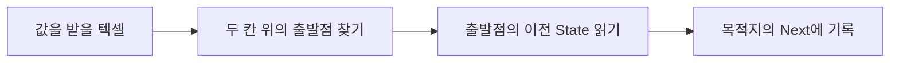

# Semi-Lagrangian Transport와 보존형 전달

> **한 줄 요약:** 각 텍셀이 이동 경로를 거슬러 올라가 이전 값을 가져오는 방식이다. 여러 칸 이동을 한 step에 표현할 수 있지만, 값이 흐릿해지는 문제와 총량 보존은 따로 살펴야 한다.

- 상태: **적용 검토 — 현재 Solver 변경 및 알고리즘 채택 없음**
- 작성·최종 확인: 2026-09-29
- 조사 범위: 논문의 초록, §1, §2 식 (2.1)–(2.7), §3 도입부와 GPU Gems §38.2.4 Advection. 안정성 증명과 실험 표의 재검산은 미완료.

## References

| 항목          | 내용                                                                                                                                                                            |
| ----------- | ----------------------------------------------------------------------------------------------------------------------------------------------------------------------------- |
| 연구 제목       | Conservative Multi-Dimensional Semi-Lagrangian Finite Difference Scheme: Stability and Applications to the Kinetic and Fluid Simulations                                      |
| 저자          | Tao Xiong, Giovanni Russo, Jing-Mei Qiu                                                                                                                                       |
| 공개 연도 / 버전  | 2016, arXiv:1607.07409v1, 2016-07-25                                                                                                                                          |
| 공식 페이지 / 원문 | [arXiv 초록](https://arxiv.org/abs/1607.07409v1), [논문 PDF](https://arxiv.org/pdf/1607.07409v1)                                                                                  |
| 개념 설명       | Mark J. Harris, [GPU Gems Chapter 38, §38.2.4 Advection](https://developer.nvidia.com/gpugems/gpugems/part-vi-beyond-triangles/chapter-38-fast-fluid-dynamics-simulation-gpu) |
| 보존식 배경      | [Clawpack, Advection](https://www.clawpack.org/riemann_book/html/Advection.html)                                                                                              |

## 1. 이 방식을 살펴보는 이유

현재 Solver는 텍셀의 State를 최대 8개 이웃으로 전달한다. 이번 step에 받은 양은 다음 step부터 다시 이동한다. 따라서 한 번의 계산에서 여러 칸을 지나가야 하는 흐름을 표현하려면 시간 간격을 나누거나 다른 이동 방법이 필요하다.

Semi-Lagrangian은 **멀리 있는 이전 값을 직접 찾아오는 방법**이다. 기존 이웃 전달과 어떻게 다른지, 총량 보존을 유지하면서 사용할 수 있는지 조사한다. 현재 설계를 교체하기로 결정한 것은 아니다.

## 2. 원리: “이번에 도착할 값은 원래 어디에 있었을까?”

각 텍셀은 자기 위치에 도착할 값의 출발점을 찾는다. 이동 속도의 반대 방향으로 진행할 시간만큼 되돌아가서, 저장해 둔 이전 State를 읽는다.

설명용으로 다음 조건을 가정한다. 논문의 실험 결과는 아니다.

- 평평한 표면에서 모든 값이 같은 속도로 아래로 흐른다.
- 텍셀 간격은 1 cm, 속도는 초당 10 cm, 시간 간격은 0.2초다.
- 입력, 감쇠, 확산과 경계 밖 유출은 없다.

0.2초 동안 이동할 거리는 2 cm, 즉 두 칸이다.

1. 각 목적지 텍셀에서 **두 칸 위**의 위치를 찾는다.
2. 그 위치의 **이전 State**를 읽는다.
3. 읽은 값을 목적지의 **Next**에 기록한다.
4. 모든 목적지를 계산한 뒤 이전 State와 Next를 교환한다.

중간 텍셀로 한 번 보내고 다시 보내는 계산 없이, 두 칸 떨어진 이전 값을 가져온다.



이 예의 계산은 다음과 같다.

```text
출발 위치 = 현재 위치 − 이동 속도 × 시간 간격
새 State = 출발 위치에서 읽은 이전 State
```

이동 거리가 2.3칸이면 출발점이 텍셀 사이에 놓인다. 이때 주변 텍셀 값을 위치에 맞게 섞어 사용한다. 이 과정을 **보간**이라고 한다. 가장 단순한 선형 보간에서는 두 칸 사이의 값이 0과 1이고 출발점이 정확히 가운데라면 0.5를 읽는다.

여기서 속도는 실제 거리/초 단위다. 같은 거리를 이동해도 해상도를 두 배로 높이면 조회할 출발점이 텍셀 기준으로 두 배 멀어진다. [GPU Gems의 Advection 설명](https://developer.nvidia.com/gpugems/gpugems/part-vi-beyond-triangles/chapter-38-fast-fluid-dynamics-simulation-gpu)

## 3. 왜 값이 흐릿해질까?

**주변 값을 섞으면 날카로운 차이가 완만해지기 때문이다.**

면적이 같은 텍셀의 값이 다음과 같다고 하자. 아래 숫자는 원리를 설명하는 예시이며 실제 측정값이 아니다.

```text
이동 전:             [0, 1,   0]
오른쪽으로 반 칸 이동: [0, 0.5, 0.5]
```

가운데에 모여 있던 값이 두 칸으로 나뉜다. 이런 보간을 반복하면 높은 값은 낮아지고 주변으로 퍼져, 경계가 흐릿해질 수 있다. 수치 계산 때문에 생기는 퍼짐이며 재질의 실제 확산과 구분해야 한다.

**이 예에서 총합은 여전히 1이다.** 흐릿해지는 현상과 총량이 달라지는 현상은 같은 문제가 아니다.

## 4. 왜 총량이 달라질 수 있을까?

**각 목적지가 이전 값을 독립적으로 가져오며, 출발점에서 사용된 양의 합을 맞추는 규칙이 없기 때문이다.**

예를 들어 면적이 같은 여러 목적지의 보간 계산에서 이전의 같은 값 `1`이 각각 `0.75`씩 반영된다면, 그 값이 새 분포에 기여하는 합은 `1.5`가 된다. 반대로 어떤 이전 값의 전체 기여가 너무 적으면 총량이 줄 수 있다. 이는 보간 가중치가 전체에서 맞지 않을 때 생기는 문제를 설명하는 예시이며, 특정 흐름의 오차가 항상 50%라는 뜻은 아니다.

일반적인 보간은 **목적지 하나에서 주변 값을 어떤 비율로 섞을지**를 정한다. 그러나 **출발점 하나의 값이 모든 목적지에 합쳐서 얼마나 반영될지**까지 자동으로 맞추지는 않는다.

현재 RawFlux 방식은 전달량을 출발점에서 빼고 도착점에 같은 크기로 더한다. 단순한 역추적·보간에는 이 장부가 없다. [보존형 Semi-Lagrangian 논문 초록](https://arxiv.org/abs/1607.07409v1)

다만 **보간한다고 항상 총량이 깨지는 것은 아니다.** 균일한 격자에서 모든 값이 일정한 속도로 평행 이동하고, 주기 경계처럼 경계 밖 손실도 없는 조건에서는 선형 보간의 합이 보존될 수 있다. 속도와 텍셀 면적이 달라지는 일반적인 조건까지 보장하려면 별도의 보존형 계산이 필요하다.

또한 흐름이 모이거나 벌어지면 밀도 자체도 달라져야 한다. 이전의 스칼라 값을 그대로 가져오는 것만으로 이러한 밀도 변화를 모두 계산한 것은 아니다. [Clawpack의 밀도와 이동 설명](https://www.clawpack.org/riemann_book/html/Advection.html)

## 5. 보존형 방식은 무엇을 추가할까?

**어느 칸에서 얼마나 나갔고, 어느 칸에 얼마나 들어왔는지를 맞춘다.**

총량을 저장한다면 장부는 다음과 같다.

```text
다음 총량 = 현재 총량 + 받은 총량 − 보낸 총량
```

면적당 값을 저장한다면 받은 양과 보낸 양을 해당 텍셀 면적으로 나누어 반영한다.

```text
다음 면적당 값 = 현재 면적당 값 + (받은 총량 − 보낸 총량) / 텍셀 면적
총량 = 텍셀 면적 × 면적당 값
```

예를 들어 면적이 2인 칸에서 면적이 1인 칸으로 총량 2를 옮긴다고 하자. 출발점의 면적당 값은 1 줄고, 도착점의 면적당 값은 2 늘어난다. 값의 변화량은 다르지만, 빠진 총량과 들어온 총량은 모두 2다. 이것은 Surface 적용을 위한 설명용 장부이며 논문의 격자 수식을 그대로 구현한 것은 아니다.

조사 논문은 역추적 계산에 **Flux, 즉 칸 경계를 통해 이동한 양을 이용한 보존 보정**을 결합한다. 이 보정에는 안정성을 위한 시간 간격 제한이 생긴다. 보존형으로 만들었다고 큰 시간 간격을 무제한 사용할 수 있거나, 음수가 자동으로 방지되는 것은 아니다. [논문 초록과 §1–2](https://arxiv.org/pdf/1607.07409v1)

## 6. 얻는 점과 남는 문제

| 항목 | 의미 |
|---|---|
| 여러 칸 이동 | 먼 출발점의 이전 값을 한 step에서 가져올 수 있다. |
| 정확도 | 시간 간격이 너무 크면 경로와 보간 오차가 커질 수 있다. |
| 흐릿해짐 | 선형 보간을 반복하면 날카로운 State 경계가 퍼질 수 있다. |
| 총량 | 기본 역추적·보간만으로 일반적인 총량 보존을 보장하지 않는다. |
| 비용 | 출발점 찾기, 보간, 보존 보정에도 계산과 메모리 접근이 필요하다. |

속도가 위치나 시간에 따라 바뀌면 출발점을 찾는 과정도 복잡해진다. `현재 위치 − 속도 × 시간`은 일정한 속도 예시의 정확한 식이고, 일반적인 흐름에서는 이동 경로를 따라 속도를 평가해야 한다.

## 7. 현재 엔진에 바로 적용할 수 있을까?

**먼 출발점을 찾는 구조와 이동 속도, 보존 장부를 새로 설계해야 한다.** 다음은 2026-09-29 작업 트리의 소스 확인 결과이며 GPU 실행 검증 결과는 아니다.

| 확인 항목 | 현재 구현 |
|---|---|
| 거리 | `DistanceWeight=clamp(dRef/d,0,1)`로 주변 평균 간격에 비해 긴 간선을 감쇠한다. 거리 보정은 이미 있다. |
| 높이차 | `HeightDrive=abs(dot(NeighborDirection,Up))`로 월드 공간 높이차를 계산한다. |
| Geometry mobility | 기존 높이차×방향에 상한 없는 source State/면적 환산 Capacity를 곱한다. SaturationDrive는 별도다. |
| 시간 | `rawFlux`에서 `Solver.DeltaTime`을 곱한다. 실제 시간×배속을 누적한다. 기본 Fixed ON·Auto OFF는 1/60초 구간으로 계산하고 잔여 시간은 대기한다. Auto ON에서만 Transport 상한으로 세분화하며 Fixed OFF·Auto OFF는 누적 시간을 한 번에 계산한다. [[05_Decisions/0013_Fixed-Timestep-and-Auto-Substepping|Decision 0013]] |
| 보유량 제한 | `alpha=min(1,Available/RawOutgoing)`로 가진 양보다 많이 보내는 것을 막는다. |
| 보존 대상 | State는 texel 총량이다. 같은 Flux를 빼고 더하므로 보존 장부는 `ΣState`다. Capacity·입력·Decay는 실제 면적으로 환산한다. |
| 외부 입력 | Strength × ContactWeight × InputFactor × AreaScale를 사건 한 번 적용한다. Strength는 고정 기준 면적의 양이고 전체 브러시 총량으로 정규화하지 않는다. |
| 면적 표시 | Heatmap의 fragment 미분 면적과 별도로 Macro 삼각형 Jacobian에서 계산한 월드 texel 면적을 Solver Capacity·Decay 및 CPU 입력에 사용한다. |

거리 계산은 `Source/SurfaceStateSystem/GPU/SurfaceGPUResourceLayout.cpp`, 전달 계산은 `Shaders/Simulation/SurfaceSolver/`의 공통 shader와 두 pass를 기준으로 확인했다.

Profile version 2의 `GeometryTransferFactor × BaseGeometryTransferRate(6000)`은 **전달량 계수**다. DemoWetness의 factor `0.5`는 현재 Rate `3000`이다. 초기 기준값 100의 Rate 50에서 흐름을 재보정했다. [[05_Decisions/0012_Geometry-Rate-Recalibration|Decision 0012]] 단위는 `State/(world-length × second)`로, 출발점을 찾는 데 필요한 **이동 속도** `world-length/second`와 다르다. 이 값을 속도로 그대로 사용할 수는 없다. [[05_Decisions/0008_Normalized-Transport-Factors|Decision 0008]]

적용 전에 필요한 검토는 다음과 같다.

- **State의 의미:** 현재 결정은 texel 총량 저장과 면적 환산이다. Semi-Lagrangian 후보도 이 총량 장부를 유지해야 한다. [[05_Decisions/0009_Texel-Area-and-State-Amounts|Decision 0009]]
- **표면을 따라가는 경로:** 월드 공간에서 직선으로 되돌아가면 Mesh 밖으로 벗어날 수 있다. Surface 사이 이동, UV seam과 재질 경계를 처리해야 한다.
- **먼 출발점 조회:** 현재 8-neighbor graph와 역방향 direction index만으로 임의의 먼 위치를 바로 찾을 수는 없다.
- **보존과 경계:** 기존 source alpha만으로 원거리 조회의 총량 보존을 보장하지 못한다. invalid texel과 지원하지 않는 channel을 통과하지 않도록 해야 한다.
- **실행 비용:** 이전 RawFlux cache 구현은 인접 8방향용이었다. 방향별 cache는 Decision 0025에서 제거됐다. 원거리 이동에서도 같은 표현을 그대로 재사용할 수 있다고 가정하지 않는다. 이웃을 계속 따라 출발점을 찾으면 이동 거리에 따라 비용도 늘어난다.

## 8. 논문에서 확인한 범위

조사 논문은 먼저 **균일한 1차원 격자와 주기 경계**를 다룬다. 주기 경계는 한쪽 끝을 나가면 반대쪽 끝으로 이어지는 조건이다.

§2 식 (2.2)–(2.7)에서는 경계를 통해 이동한 Flux의 차이로 각 칸을 갱신한다. 2차원에서는 두 축의 Flux 차이를 사용한다. 급격한 값 변화를 다루기 위한 고차 보간·재구성 기법인 WENO와 경로 추적을 결합한다. 자세한 수식은 [논문 §2](https://arxiv.org/pdf/1607.07409v1)를 따른다.

확인한 범위는 초록, §1, §2와 §3 도입부다. §3–4의 안정성 증명과 허용 시간 간격, §5–6의 실험 결과는 재검산하지 않았다. 특정 시간 간격이나 성능 개선률을 현재 엔진에 적용하지 않는다.

논문의 평면 격자 분석을 UV seam, 비균일 텍셀 면적, 재질 경계, source alpha와 적층이 있는 MDSS Solver의 보장으로 그대로 옮길 수는 없다.

## 9. 검증 계획

| 질문 | 확인 방법 |
|---|---|
| 의도한 거리만큼 이동하는가? | 일정한 속도의 평면에서 실제 이동 거리와 `속도 × 총 시간`을 비교한다. |
| 얼마나 흐릿해지는가? | 날카로운 초기 분포의 최대값과 퍼진 폭을 비교한다. |
| 총량이 보존되는가? | 입력·감쇠 없는 닫힌 영역에서 총량 저장은 `Σm`, 면적당 값은 `ΣA s`를 비교한다. |
| 경계를 올바르게 처리하는가? | UV seam, invalid texel, unsupported channel과 Profile 경계에서 누출과 중복을 확인한다. |
| 비용에 비해 유리한가? | 같은 이동 모델, 초기조건, 총 시뮬레이션 시간과 품질 기준에서 GPU 시간과 메모리를 비교한다. |

큰 시간 간격, 위치에 따라 다른 속도와 비균일 면적에서도 검사한다. 음수, NaN/Inf와 Capacity 초과량 처리도 확인한다.

우선 해상도·시간 간격 실험으로 현재 수식의 의존성을 분리한다. 평면 역추적 prototype과 보존 보정은 이후 별도 후보로 평가한다. 확산, 입력과 감쇠의 처리도 별도로 검토한다.

## 관련 문서

- [[02_Research/0000_Research-Index|연구 색인]]
- [[02_Research/0001_Bound-Preserving-Transport|Bound-Preserving Transport]]
- [[03_Architecture/0006_Surface-State-Update|State Update]]
- [[03_Architecture/0006_Surface-State-Update|Simulation Optimization]]
- Geometry Driven Transport
- Transport Transfer Weights
- [[05_Decisions/0004_State-Overcapacity-Transport|Decision 0004]]
- [[05_Decisions/0008_Normalized-Transport-Factors|Decision 0008]]
- 실험 초안
