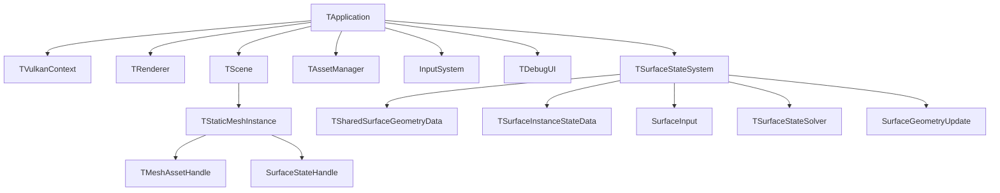

# 전체 엔진 구조

상태: **설계** · 근거: [[07_Assets/Documents/0001_Overall-Engine-Structure.pdf|전체 엔진 구조]]

MDSSP Engine은 C++/Vulkan 기반 렌더링 엔진에 **Material-Dependent Surface State** 시뮬레이션을 추가한다. 현재 구현 범위는 **Static Mesh**다.

핵심 분리는 다음과 같다.

- **Asset / Render Material**: Mesh와 외관 렌더링 정보.
- **Surface Response Profile**: State 종류를 고정하는 목록이 아니라, 각 State에 대한 소재별 반응 파라미터와 Transition.
- **SurfaceStateRegistry**: 로드한 Profile에서 State 이름을 모아 런타임 ID/index로 연결.
- **Runtime Surface Data**: Mesh·Normal Map·Profile Distribution에서 매 실행 시 전처리해 메모리에 생성하는 정적 Geometry/texel 관계 및 texel별 Profile map. 디스크에 `.Surface` 캐시를 저장하지 않는다.
- **Surface Instance State Data**: Registry 채널에 대응하는 instance별 동적 State. 각 State는 `stateCapacity` 범위로 제한한다.

## 읽는 순서

1. [[03_Architecture/0001_Engine-Structure|엔진 모듈과 데이터 흐름]]
2. [[03_Architecture/0002_Surface-State|표면 상태와 전이]] → [[03_Architecture/0003_Assets-and-Profiles|에셋과 프로필]]
3. [[03_Architecture/0004_Surface-State-Update|Surface State 입력과 갱신]]
4. [[03_Architecture/0005_Surface-Geometry|형상과 적층]] → [[03_Architecture/0006_Rendering|렌더링]]
5. [[../02_Planning/00_Project-Overview/0002_Demo|목표 데모]] → [[TODO|TODO]]

Simulation UV의 생성·Mesh→Texel mapping·UV seam 연결은 [[05_Development/Notes/0000_Surface-Simulation-Mapping|Surface Simulation Mapping]], 실제 Vulkan resource와 2-Pass 동기화는 [[05_Development/Notes/0003_Surface-State-GPU-Resource|Surface State GPU Resource]]를 기준으로 한다.
