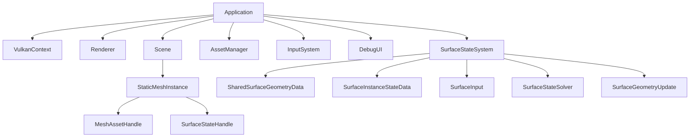

# 전체 엔진 구조

상태: **설계** · 근거: [[07_Assets/Documents/0001_Overall-Engine-Structure.pdf|전체 엔진 구조]]

MDSSP Engine은 C++/Vulkan 기반 렌더링 엔진에 **Material-Dependent Surface State** 시뮬레이션을 추가한다. 현재 구현 범위는 **Static Mesh**다.

핵심 분리는 다음과 같다.

- **Asset / Render Material**: Mesh와 외관 렌더링 정보.
- **Surface Response Profile**: State에 대한 반응 계수.
- **Shared Surface Geometry Data**: 인스턴스 간 공유 가능한 정적 형상 데이터.
- **Surface Instance State Data**: 인스턴스마다 별도로 가지는 동적 상태 데이터.

## 읽는 순서

1. [[03_Architecture/0001_Engine-Structure|엔진 모듈과 데이터 흐름]]
2. [[03_Architecture/0002_Surface-State|표면 상태와 전이]] → [[03_Architecture/0003_Assets-and-Profiles|에셋과 프로필]]
3. [[03_Architecture/0004_Surface-State-Update|Surface State 입력과 갱신]]
4. [[03_Architecture/0005_Surface-Geometry|형상과 적층]] → [[03_Architecture/0006_Rendering|렌더링]]
5. [[03_Architecture/0007_Demos|목표 데모]] → [[TODO|TODO]]

Simulation UV의 생성·Mesh→Texel mapping·UV seam 연결은 [[05_Development/Notes/0000_Surface-Simulation-Mapping|Surface Simulation Mapping]], 실제 Vulkan resource와 2-Pass 동기화는 [[05_Development/Notes/0003_Surface-State-GPU-Resource|Surface State GPU Resource]]를 기준으로 한다.
