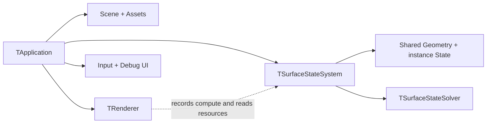

# 전체 엔진 구조

> **한 줄 요약:** MDSS Engine은 C++/Vulkan 기반 렌더링 엔진에 Material-Dependent Surface State 시뮬레이션을 추가한다.

상태: **현재 Architecture 진입점**
근거: [[06_Assets/Documents/0001_Overall-Engine-Structure.pdf|전체 엔진 구조]]

처음부터 끝까지의 기능별 처리 순서는 [[03_Architecture/0010_System-Flows|시스템 흐름 지도]]에서 확인한다.

---

MDSS Engine은 C++/Vulkan 기반 렌더링 엔진에 **Material-Dependent Surface State** 시뮬레이션을 추가한다. 현재 구현 범위는 **Static Mesh**다.

## 주요 구성요소 관계

```mermaid
flowchart LR
  App[TApplication] --> Core[Scene + Assets]
  App --> Surface[TSurfaceStateSystem]
  App --> Render[TRenderer]
  App --> Interaction[Input + Debug UI]
  Render -. records compute and reads resources .-> Surface
  Surface --> Data[Shared Geometry + instance State]
  Surface --> Solver[TSurfaceStateSolver]
```

핵심 분리는 다음과 같다.

- **Asset / Render Material**: Mesh와 외관 렌더링 정보.
- **Surface Response Profile**: State 종류를 고정하는 목록이 아니라, 각 State에 대한 소재별 반응 파라미터와 Transition.
- **SurfaceStateRegistry**: 로드한 Profile에서 State 이름을 모아 런타임 ID/index로 연결.
- **Runtime Surface Data**
  - Mesh·Normal Map·Profile Distribution·해상도 조합에 해당하는 `.Surface` cache를 검증해 읽는다.
  - Cache miss에는 전처리해 저장하고, 결과는 메모리에서 공유한다.
  - 포함 데이터는 정적 Geometry/texel 관계와 Profile map이다. 현재 cache 계약을 따른다 ([[05_Decisions/0006_Resolution-Surface-Cache|Decision 0006]]).
- **Surface Instance State Data**
  - Registry channel에 대응하는 instance별 동적 State다.
  - State는 finite·비음수 전체 양을 저장하고 `stateCapacity`는 포화 기준량으로 쓴다. Capacity 초과 허용 계약을 적용한다 ([[05_Decisions/0004_State-Overcapacity-Transport|Decision 0004]]).

## 읽는 순서

1. [[03_Architecture/0010_System-Flows|System Flows]] — 전체 처리 경로를 먼저 본다.
2. [[03_Architecture/0001_Engine-Structure|엔진 모듈과 데이터 흐름]]
3. [[03_Architecture/0002_Surface-State|표면 상태와 전이]] → [[03_Architecture/0003_Assets-and-Profiles|에셋과 프로필]]
4. [[03_Architecture/0004_Surface-Geometry|형상과 적층]]
5. [[03_Architecture/0005_Surface-Input|외부 접촉 입력 API]]
6. [[03_Architecture/0006_Surface-State-Update|Surface State 갱신과 Solver 최적화 구조]]
7. [[03_Architecture/0007_Surface-GPU-Data-Layout|GPU 데이터 배치와 수명]]
8. [[03_Architecture/0008_Rendering|렌더링]]
9. [[03_Architecture/0009_UI-Interface|UI Interface와 Scene 편집]]

연구 근거와 프로젝트 적용 검토는 [[02_Research/0000_Research-Index|Research 색인]]에 모은다. 설계 결정은 결정 기록에 근거를 남기고 관련 Architecture 문서와 연결한다.

큰 개발 방향과 진행 항목은 [[Roadmap|Roadmap]]과 [[TODO|TODO]]에서 확인하고, 현재 비교 Scene은 Dev Demo를 기준으로 한다. Simulation UV 생성·Mesh→Texel mapping·UV seam 연결은 [[03_Architecture/0004_Surface-Geometry#Simulation Mapping|Surface Simulation Mapping]], 실제 Vulkan resource와 2-Pass 동기화는 [[03_Architecture/0007_Surface-GPU-Data-Layout|Surface State GPU Resource]]를 기준으로 한다.
