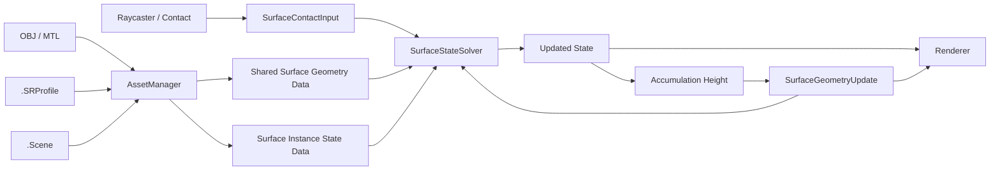

# 엔진 모듈과 데이터 흐름

상태: **설계** · 근거: [[06_Assets/Documents/0001_Overall-Engine-Structure.pdf|전체 엔진 구조]]

| 구성요소 | 책임 |
|---|---|
| `VulkanContext` | Instance / Device, Queue / Command, GPU Resource 기반 관리 |
| `Renderer` | Swapchain, RenderPass / Pipeline, Framebuffer / RenderContext |
| `Scene` | Camera와 `StaticMeshInstance[]` 관리 |
| `StaticMeshInstance` | Transform, `MeshAssetHandle`, `SurfaceStateHandle` 보유 |
| `AssetManager` | Mesh, Texture, Material, SurfaceResponseProfile Asset 관리 |
| `InputSystem` | Mouse / Keyboard, Raycaster 및 Contact Input 생성 |
| `DebugUI` | 상태·형상·Solver 결과 디버깅 |
| `SurfaceStateSystem` | 공유 형상 데이터, 인스턴스 상태, 입력, Solver, 형상 갱신, DebugData 관리 |

`SurfaceStateSystem`의 내부 구성은 다음과 같다.

```text
SurfaceStateSystem
├── SharedSurfaceGeometryData[]
├── SurfaceInstanceStateData[]
├── SurfaceInput
├── SurfaceStateSolver
├── SurfaceGeometryUpdate
└── DebugData
```

실제 C++ 클래스 분할과 Vulkan 리소스 소유권은 구현 단계에서 조정할 수 있다. 이 문서는 **논리적 책임**을 정의한다.

## 데이터 흐름



1. OBJ / MTL / Texture / `.Scene` / `.SRProfile`을 로드한다. [[03_Architecture/0003_Assets-and-Profiles|에셋과 프로필]]
2. 같은 Mesh + Normal Map을 사용하는 인스턴스가 공유할 정적 형상 데이터를 준비한다. [[03_Architecture/0005_Surface-Geometry|형상과 적층]]
3. 각 Mesh Instance는 자신의 State를 가진다. [[03_Architecture/0002_Surface-State|표면 상태]]
4. Raycast 등으로 `SurfaceContactInput`을 만들고 Input 항으로 변환한다. [[03_Architecture/0004_Surface-State-Update|State 갱신]]
5. Solver가 Input / Transport / Decay를 사용해 다음 State를 계산한다.
6. State가 형상 적층을 만드는 경우 Accumulation Height를 계산하고, 바뀐 형상을 후속 Simulation과 Rendering에 반영한다. [[03_Architecture/0005_Surface-Geometry|형상과 적층]], [[03_Architecture/0006_Rendering|렌더링]]

Simulation UV mapping은 [[05_Development/Notes/0000_Surface-Simulation-Mapping|Surface Simulation Mapping]], Vulkan resource binding / barrier는 [[05_Development/Notes/0003_Surface-State-GPU-Resource|Surface State GPU Resource]]를 본다.
