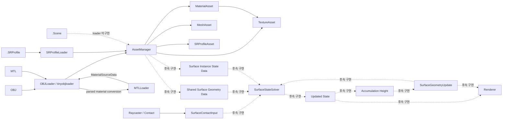

# 엔진 구조와 데이터 흐름

상태: **설계** · 근거: [[07_Assets/Documents/0001_Overall-Engine-Structure.pdf|전체 엔진 구조]]

| 모듈 | 책임 |
|---|---|
| `Application` | 창, Vulkan, 에셋, Scene, Renderer, DebugUI의 수명과 메인 루프 조정 |
| `AssetManager` | Mesh, Texture, Material, Surface Response Profile Asset 관리 |
| `DebugUI` | 카메라·렌더 설정과 로그 진단 UI |
| `InputSystem` | 입력 장치 이벤트, Raycast 및 Contact 입력 생성. 현재 placeholder |
| `Logger` | 모듈별 로그 기록과 로그 항목 조회 |
| `Renderer` | Swapchain, RenderPass/Pipeline, Framebuffer, 프레임 렌더링 |
| `Scene` | Camera와 `StaticMeshInstance[]` 관리 |
| `SurfaceStateSystem` | 공유 형상 데이터, 인스턴스 상태, 입력, Solver, 형상 갱신, DebugData 관리. 현재 placeholder |
| `VulkanContext` | Instance / Device, Queue / Command, GPU Resource 기반 관리 |

`SurfaceStateSystem`의 논리적 구성은 다음과 같다.

```text
SurfaceStateSystem
├── SharedSurfaceGeometryData[]
├── SurfaceInstanceStateData[]
├── SurfaceInput
├── SurfaceStateSolver
├── SurfaceGeometryUpdate
└── DebugData
```

이 구성은 시스템의 **논리적 책임**을 나타낸다. 현재 C++ 클래스 구현 상태와 타입 간 소유·참조 관계는 [[05_Development/Code-Structure/0000_Overview|구현 구조 개요]]를 기준으로 한다.

## 데이터 흐름



1. OBJ 파싱은 `OBJLoader`, MTL 변환은 `MTLLoader`, `.SRProfile` JSON 파싱은 `SRProfileLoader`가 담당하고, `AssetManager`가 생성된 Asset 객체와 handle을 관리한다. Texture는 경로를 기준으로 로드·캐시한다. [[03_Architecture/0003_Assets-and-Profiles|에셋과 프로필]]
2. 같은 Mesh + Normal Map을 사용하는 인스턴스가 공유할 정적 형상 데이터를 준비한다. [[03_Architecture/0005_Surface-Geometry|형상과 적층]]
3. 각 Mesh Instance는 자신의 State를 가진다. [[03_Architecture/0002_Surface-State|표면 상태]]
4. Raycast 등으로 `SurfaceContactInput`을 만들고 Input 항으로 변환한다. [[03_Architecture/0004_Surface-State-Update|State 갱신]]
5. Solver가 Input / Transport / Decay를 사용해 다음 State를 계산한다.
6. State가 형상 적층을 만드는 경우 Accumulation Height를 계산하고, 바뀐 형상을 후속 Simulation과 Rendering에 반영한다. [[03_Architecture/0005_Surface-Geometry|형상과 적층]], [[03_Architecture/0006_Rendering|렌더링]]

Simulation UV mapping은 [[05_Development/Notes/0000_Surface-Simulation-Mapping|Surface Simulation Mapping]], Vulkan resource binding / barrier는 [[05_Development/Notes/0003_Surface-State-GPU-Resource|Surface State GPU Resource]]를 본다.

위 흐름은 모듈 책임을 요약한다. 구체적인 C++ 상속, 소유, handle 참조와 현재 구현 여부는 [[05_Development/Code-Structure/0000_Overview|구현 구조 개요]]에서 확인한다. `.Scene` 로더와 `SurfaceStateSystem` 조정 클래스는 아직 placeholder이며, 현재 동작하는 파서 흐름과 구분한다.
