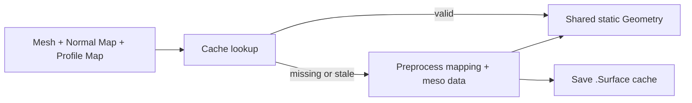
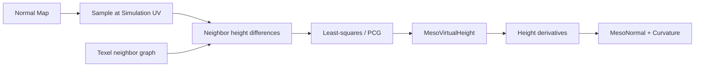
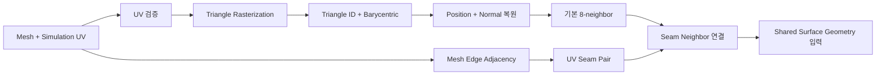
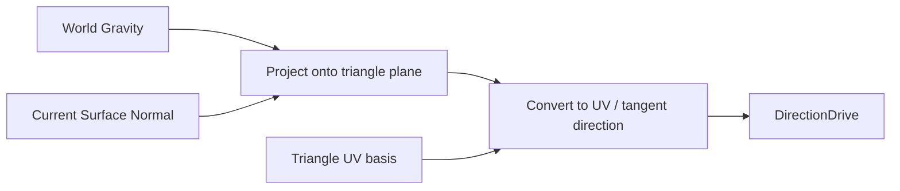
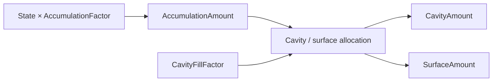
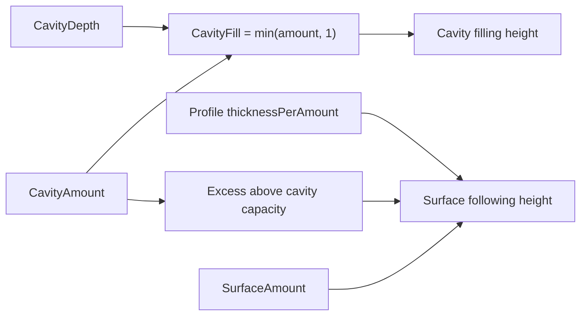
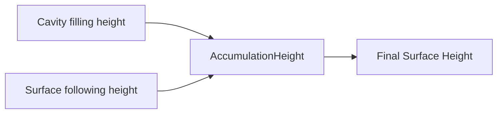

# 형상 정보와 적층

> **한 줄 요약:** Surface Solver가 사용하는 Macro Geometry와 Virtual Meso Geometry, texel 이웃 및 Accumulation Height 기반 동적 Geometry 데이터의 계약을 정의한다.

상태: **현재 Geometry 계약**
근거: [[06_Assets/Documents/0006_Geometry-Integration.pdf|형상 정보 반영]], [[06_Assets/Documents/0002_Surface-System-Data.pdf|시스템 데이터 구조]]

---

## 반영하는 형상 정보

1. Normal
2. Distance
3. Height
4. Curvature / Concavity

Transport에는 거리, 높이·중력 방향, 표면 방향, 국소 요철이 영향을 주고, Decay에는 오목함에 따른 잔류 효과를 반영한다. 실제 Solver 수식은 [[03_Architecture/0006_Surface-State-Update|Surface State Update]]가 기준이다.

## 계산 및 사용 시점

### 정적 Geometry cache 경로



정적 전처리와 캐시는 다음 규칙을 따른다.

- 고유 Mesh·Profile Distribution·해상도 조합에 유효한 `.Surface` 캐시가 없을 때 load 시 전처리한다.
- 유효한 캐시에서는 최종 CPU Geometry를 복원한다.
- 같은 입력 조합의 instance는 Runtime 메모리 결과를 공유한다. 매 frame이나 instance마다 전처리하지 않는다.
- Runtime 전처리 전용 설계에서 해상도별 persistent cache를 재사용하는 설계로 변경했다. 저장 수명과 무효화 규칙을 따른다 ([[05_Decisions/0006_Resolution-Surface-Cache|Decision 0006]]).
- 캐시와 Asset의 관계는 [[03_Architecture/0003_Assets-and-Profiles|에셋과 프로필]]을 본다.

## Macro Geometry and Virtual Meso Geometry

- **Macro Geometry**: 실제 Mesh polygon이 만드는 거시 형상.
- **Virtual Meso Geometry**: Normal Map 등 세부 표면 정보에서 유도해 Solver가 기하 정보처럼 사용하는 중간 규모 형상 표현. 원본 Mesh Geometry는 바꾸지 않으며, Virtual Height와 유효 Normal·Curvature 등으로 구성해 Simulation 입력으로 사용한다. 렌더링은 별도 경로에서 Virtual Height를 이용해 render vertex를 변위할 수 있다.

따라서 `Meso`는 표면 형상의 스케일을, `Virtual`은 실제 Mesh 변형이 아닌 시뮬레이션용 표현 방식을 나타낸다. 이 문서에서 Virtual Meso Geometry 내부의 개별량은 `Virtual Height`, `Normal`, `Curvature` 등으로 부른다.

| 항목        | 개념식 / 의미                                                         |
| --------- | ---------------------------------------------------------------- |
| Normal    | Macro Surface의 tangent basis를 이용해 Virtual Meso Geometry에서 유도한 normal을 변환하여 최종 Normal 구성 |
| Distance  | `Macro_Surface_Distance × Meso_Path_Stretch`                     |
| Height    | `Macro_Height + Meso_Virtual_Height`                             |
| Curvature | `Macro_Curvature + Meso_Curvature`                               |

Normal Map에서 Virtual Height와 유효 Normal을 복원한다 ([[05_Decisions/0003_Normal-Map-Meso-Geometry|Decision 0003]]).

1. Simulation UV에 대응하는 texel에서 Normal Map을 sample한다.
2. 이웃 texel의 mesh-local 위치와 변환한 Normal Map normal로 방향별 높이차를 계산한다.
3. 연결된 neighbor graph 전체에서 높이차를 최소제곱으로 만족하는 height field를 구한다.
4. 적분 가능하지 않은 기울기는 residual을 기록하고 least-squares 해를 사용한다.
5. 유효 sample이 없거나 macro normal과 반대인 texel은 높이 0으로 두고 적분 graph에서 제외한다.

### Normal Map에서 Virtual Meso Geometry 복원



재구성한 값은 Solver에서 다음 입력으로 사용한다.

- Virtual Height → `GeometryDrive`와 `DistanceWeight`
- `MesoNormal` → `TransferWeight`의 normal factor
- Curvature → `ConcavityWeight`

## Virtual Height

Virtual Height는 Virtual Meso Geometry의 높이 성분이며, Normal Map에서 복원한 Macro Geometry 기준 상대 높이다. 구현 필드 이름은 `MesoVirtualHeight`다.

`Meso_Virtual_Height = 0`이면 Macro Geometry 그대로다.

| 값     | 의미                                  |
| ----- | ----------------------------------- |
| `< 0` | Macro Geometry보다 안쪽으로 들어간 Virtual Meso Geometry 형상 |
| `= 0` | Macro Geometry 그대로                  |
| `> 0` | Macro Geometry보다 바깥쪽으로 튀어나온 Virtual Meso Geometry 형상 |

높이 field의 기준과 단위는 다음과 같다.

- 각 연결 component의 첫 유효 texel을 기준점으로 고정해 해의 임의 상수를 제거한다.
- Component 평균 높이를 0으로 이동한다. 끊긴 chart끼리는 기준 높이를 공유하지 않는다.
- UV seam은 Mapping neighbor graph가 연결한 경우에만 함께 적분한다.
- 높이차는 mesh-local 길이 단위다. 별도 `β_meso`나 authoring scale을 곱하지 않는다.
- 따라서 Mesh 크기를 바꾸면 복원 높이도 같은 비율로 바뀐다.

Non-integrable 입력은 임계값으로 거부하지 않는다.

- 최소제곱으로 가장 가까운 일관된 height field를 반환하고 relative edge residual을 전처리 로그에 남긴다.
- 기울기 입력이 invalid하거나 macro normal에 거의 수직·반대인 texel은 높이 0으로 두고 적분에서 제외한다.

## Simulation Mapping

Mesh의 연속 표면은 Solver가 처리할 **simulation texel graph**로 변환한다. Simulation UV는 렌더링 UV와 논리적으로 분리하며, 현재 구현은 자동 unwrap 대신 조건을 만족하도록 준비된 UV를 사용한다.

### Mapping 계약

| 항목 | 현재 기준 |
|---|---|
| 해상도 | `128 × 128`, `256 × 256`, `512 × 512`, 기본 `256 × 256` |
| Mesh → Texel | UV triangle rasterization + barycentric coordinate |
| 유효 texel | Mesh 표면에 대응하는 texel만 Solver에 참여 |
| 이웃 | texel당 최대 8개, 실제 이웃의 index만 저장 |
| UV seam | Mesh topology로 반대편 texel을 찾아 일반 이웃 graph에 연결 |
| 무효 index | `0xFFFFFFFF` |
| 생성 시점 | `.Surface` cache hit이면 로드, miss이면 CPU 전처리 후 저장 |

현재 `TSurfaceLocalID`는 Mesh 안에서 MTL Material 단위의 dense index로 사용한다. Profile 배치는 이 ID와 일대일로 가정하지 않고 texel별 Profile Map / Profile Index로 구분한다.

### 생성 흐름



### UV 검증과 Rasterization

전처리 전에 UV 범위, triangle 면적, 의도하지 않은 overlap, chart padding, Surface ID, non-manifold edge를 검사한다. 실패한 asset을 자동 보정하기보다 원인과 Surface / triangle 정보를 출력하고 mapping 생성을 중단한다.

Triangle은 texel-space bounding box 안에서만 rasterize한다. texel 중심의 포함 여부를 edge function으로 판정하고 공유 edge의 중복은 top-left rule로 정한다. 유효 texel에는 `TriangleID`와 barycentric coordinate를 저장해 위치와 법선을 복원한다.

```text
SurfacePosition = b0 × P0 + b1 × P1 + b2 × P2
SurfaceNormal   = normalize(b0 × N0 + b1 × N1 + b2 × N2)
```

해상도보다 작은 triangle이 texel 중심을 하나도 포함하지 못하면 경고한다. Conservative rasterization은 현재 기본 경로가 아니다.

### Neighbor와 UV Seam

같은 UV chart 안에서는 8-neighbor offset을 후보로 사용한다. 이웃 거리와 방향은 배열에 따로 저장하지 않고 `Position[j] - Position[i]`에서 계산한다.

UV seam은 UV 좌표가 아니라 **원본 Mesh edge topology**로 판정한다. 동일한 실제 edge를 공유하지만 UV endpoint가 갈라진 두 triangle을 찾아 양쪽 경계 texel을 연결한다. 실제 open boundary는 연결하지 않고, non-manifold edge는 자동 seam 연결 대상에서 제외한다.

따라서 Solver는 seam 여부를 별도 분기하지 않는다. `NeighborIndex`가 가리키는 상대가 곧 실제 표면의 이웃이다.

### Mapping 불변조건

- invalid texel은 Input / Transport / Decay에서 제외하고 State를 0으로 유지한다.
- valid texel의 모든 NeighborIndex는 valid texel 또는 invalid sentinel이다.
- 같은 실제 표면의 UV seam은 graph에서 연결되어야 한다.
- Profile 경계와 UV seam은 별개다. Profile 경계는 Profile Map / TransferWeight가, seam은 topology graph가 처리한다.
- Mapping·neighbor graph·Meso geometry는 해상도별 `.Surface` cache variant로 보존한다.

Cache fingerprint와 lifecycle은 [[05_Decisions/0006_Resolution-Surface-Cache|Decision 0006]], packed GPU layout은 Per Texel GPU Data Layout을 따른다.

## Shared Surface Geometry Data

형상 값은 Mesh·Normal Map·해상도에 종속된다. 현재 `TSharedSurfaceGeometryData`는 texel Profile map도 함께 소유하므로 같은 Mesh·Profile Distribution·해상도 조합의 instance가 공유한다.

### Surface Geometry Field

| 항목 | 저장 단위 | 의미 |
|---|---|---|
| `Normal` | Texel별 | Macro mesh의 기저 표면 방향 |
| `TransferNormal` | 전처리 중 CPU texel별 | Simulation mapping의 triangle/barycentric 대응으로 Normal Map을 sample하고 tangent-space 방향을 mesh-local로 바꾼 값. TransferWeight cache 생성에 사용하며 geometric `Normal`이 fallback이다. GPU shared-geometry buffer에는 올리지 않는다. |
| `MesoNormal` | Texel별 CPU/GPU | 적분한 Virtual Height의 국소 미분으로부터 재구성한 mesh-local 유효 normal. 미분 fit이 불가능하면 sampled `TransferNormal`, 그것도 없으면 macro `Normal`을 사용한다. |
| `NeighborIndex` | Texel × 최대 8개 | seam을 포함한 실제 이웃 texel 인덱스 |
| Neighbor Distance | 저장하지 않음 | Solver가 이웃 Position 간 차이에서 필요할 때 계산 |
| `Meso_Virtual_Height` | Texel별 | Virtual Height를 저장하는 구현 필드. Macro Geometry 기준 Normal Map 복원 상대 높이 |
| `MesoMeanCurvature` | Texel별 CPU/GPU | height field의 국소 이차 fit에서 계산한 signed mean curvature. 단위는 1/mesh-local length다. |
| `MesoGaussianCurvature` | Texel별 CPU/GPU | height field의 국소 이차 fit에서 계산한 Gaussian curvature. 단위는 1/(mesh-local length²)다. 곡면이 볼록/오목/안장인지 보조적으로 구분한다. |
| `ConcavityWeight` | Texel별 CPU/GPU | **현재 구현:** Macro Mesh와 Normal Map Meso를 합친 유효 표면의 부호 있는 오목도를 `[0,1]`로 제한한 Decay·Transport 공유 입력. |

- Solver의 Decay와 홈 이탈 Transport는 같은 `ConcavityWeight`를 사용하지만 서로 다른 Profile 계수로 조절한다.
- Mean/Gaussian curvature는 형상 데이터로 생성한다.
- 전처리는 유효 위치·법선의 이웃 변화에서 H와 K 및 주곡률을 구하고, 평균 이웃 간격으로 무차원화한다. 양의 주곡률 합에서 음의 주곡률 합의 두 배를 빼고 gain 8을 적용한 뒤 `[0,1]`로 제한한다. 평면·그릇·홈·돔·안장형 합성 Mesh fixture를 통과했다 ([[05_Decisions/0022_Macro-Meso-Concavity-Field|Decision 0022]]).
- 홈 이탈 Transport는 `cavityExitResistanceFactor`와 source→target 오목도 차이로 감쇠한다. Decay의 `cavityDecayProtectionFactor`는 자연 감소에만 적용된다 ([[05_Decisions/0024_Transport-Role-Names-and-Curvature-Removal|Decision 0024]]).
- `NormalWeight`도 이웃 normal 차이를 반영하므로 곡률 항을 추가하면 굽힘 효과가 중복될 수 있다.
- GPU storage layout은 [[03_Architecture/0007_Surface-GPU-Data-Layout|Surface State GPU Resource]]와 관련 결정에 따른다 ([[05_Decisions/0003_Normal-Map-Meso-Geometry|Decision 0003]]).

### 적층 두께 기준

초기안은 Surface별 `Meso_Height_Reference`로 표면 위 적층량을 높이로 바꾸는 방식이었다. 현재는 `.SRProfile`의 State별 `thicknessPerAmount`를 사용한다. 이 값은 기준 면적당 적층량 1에 대응하는 world-length 두께이며, 특정 Mesh의 Meso 높이에서 산정하지 않는다. 높이 환산값은 State의 저장량이나 입력·Decay 식을 직접 바꾸지 않는다. Accumulation Geometry Update가 켜져 있으면 바뀐 형상이 후속 수송에 간접적으로 영향을 준다 (State Thickness Per Amount).

## World texel 면적

Simulation UV 한 texel이 Macro Mesh에서 차지하는 면적을 계산한다. texel 중심의 삼각형에서 mesh edge와 UV edge를 이용한다.

```text
AreaVector = cross(PositionEdge1, PositionEdge2) / (UV determinant × Width × Height)
WorldTexelArea = length(cofactor(instance linear transform) × AreaVector)
```

Shared CPU texel의 `AreaVector`는 mesh-local 면적 벡터다. instance별 GPU `WorldTexelAreas`는 scalar float32로 저장한다. 비균일 scale과 반사를 반영하며 translation은 영향을 주지 않는다. Capacity·입력·Decay 환산에 사용한다.

Macro footprint 근사이며 Meso 요철·적층의 추가 표면적은 포함하지 않는다. chart 경계에서 부분 footprint를 clip하지 않고 중심의 삼각형 Jacobian을 적용하므로 해상도별 경계 오차가 남는다. [[05_Decisions/0009_Texel-Area-and-State-Amounts|Decision 0009]]


## 해상도별 정적 Geometry 캐시

캐시 지점은 **`BuildMesoGeometry()` 완료 직후, GPU 업로드와 instance별 TransferWeight 생성 전**이다. Normal Map 법선만 저장하면 PCG 높이 적분과 미분 fit 비용이 남으므로 최종 CPU Geometry 전체를 저장한다.

| texel별 저장 필드 | 표현 | 복원하는 의미 |
|---|---|---|
| `Surface`, `Triangle`, `Chart` | 각각 `uint32` | 유효성/sentinel, Surface 소속, 원본 삼각형과 UV chart |
| `Barycentric` | `float32 × 3` | 삼각형 내 표면 대응 |
| `Position`, `Normal` | 각각 `float32 × 3` | mesh-local Macro 위치와 법선 |
| `TransferNormal`, `MesoNormal` | 각각 `float32 × 3` | 샘플 Normal Map 법선과 높이에서 유도한 mesh-local 법선 |
| `HasTransferNormal`, `HasMesoNormal` | 하나의 `uint32`에 두 bit | 기존 법선 fallback 규칙 보존 |
| `MesoVirtualHeight`, `ConcavityWeight`, `MesoMeanCurvature`, `MesoGaussianCurvature` | 각각 `float32` | 최종 상대 높이·오목함·두 곡률 |
| `NeighborIndices[8]` | `uint32 × 8` | seam을 포함한 최종 이웃 graph. invalid entry 포함 |
| texel `ProfileIndex` | `uint32` | 별도 순서 있는 Profile table 참조. render-only sentinel 포함 |
| `AreaVector` | `float32 × 3`, 레코드 끝 | mesh-local texel footprint 면적 벡터 |

각 레코드는 위 필드를 순서대로 저장하며 padding 없는 140 byte다. 이 크기는 디스크 직렬화 크기이며 CPU `sizeof`나 GPU buffer stride를 뜻하지 않는다.

- 파일에는 Surface별 ID와 해상도를 저장한다. Dense range는 load 시 재구성한다.
- Profile 경로·순서, 입력 fingerprint, version metadata도 저장한다.

각 해상도의 Mapping, neighbor graph, PCG 적분과 미분 결과를 별도 파일로 계산·보관한다.

- 지원 해상도: 128, 256, 512
- 높은 해상도 결과를 낮은 해상도로 단순 축소하지 않는다.
- 같은 Mesh·Map에서 해상도를 다시 선택하면 기존 variant를 load할 수 있다.

다음 항목은 `.Surface`에 저장하지 않는다.

- Normal Map image decode 결과, tangent basis, PCG의 RHS·탐색 벡터·잔차 등 전처리 임시값.
- 이웃 Distance와 간선별 Height Difference. 저장한 Position·Normal·Virtual Height에서 계산한다.
- GPU packing으로 생성하는 `ReverseNeighborDirectionIndices`, GPU buffer·descriptor handle.
- instance의 월드 위치·법선, transform/옵션에 의존하는 `TransferWeight` 및 debug averages. Geometry를 로드한 뒤 instance마다 계산한다.
- State A/B, InputDelta, RawOutgoing·RawFlux·OutgoingFluxScale 등 매 실행/step의 동적 데이터와 `.SRProfile` 반응 파라미터.

CPU 저장 표현은 GPU ABI와 분리한다.

- Cache hit는 정적 CPU 전처리를 생략하는 최적화다. GPU 자원 생성, Solver 동작, 동적 적층 설계는 바꾸지 않는다.
- `.Surface` load 결과는 기존 `TSharedSurfaceGeometryData`를 복원한다. Normal fallback, UV seam, TransferWeight, Rendering은 동일한 데이터를 사용한다.

## World Gravity

Static Mesh의 World Gravity를 UV-space 전파 방향으로 반영할 때는 다음 순서를 사용한다.

### World Gravity를 UV 방향으로 변환



Static Mesh이므로 Actor Transform을 사용해 Surface Normal을 World Space로 변환할 수 있다.

## 동적 형상

적층으로 Height가 바뀌면 Normal과 Curvature를 갱신해 후속 Simulation에 반영한다.

- 최신 유효 Position에서 이웃 거리를 계산한다.
- Solver는 원시 거리 대신 간선별 TransferWeight를 geometry revision 동안 cache한다.
- Runtime은 instance별로 모든 지원 State의 적층 높이를 합산하고, step마다 위치·normal·곡률·TransferWeight를 GPU에서 갱신한다.
- Accumulation Geometry Update는 Simulation/Solver의 `Accumulation Geometry Update` 옵션으로 제어하며 기본 ON이다. ON에서는 적층에 따른 동적 형상과 TransferWeight를 후속 수송에 반영한다. OFF에서는 기존 정적 형상과 CPU TransferWeight cache를 사용한다.
- 시뮬레이션은 각 State의 `.SRProfile` `thicknessPerAmount`로 표면 위 두께를 계산한다. 공통 `Lit height display scale`은 렌더링 전용이며 Solver 형상에 영향을 주지 않는다.
- GPU 소유와 동기화는 [[03_Architecture/0006_Surface-State-Update|Simulation Optimization]]과 [[03_Architecture/0007_Surface-GPU-Data-Layout|GPU resource 설계]]를 따른다.

Simulation UV 생성, Mesh→Texel mapping, Valid Texel, UV Seam 및 Neighbor Index는 [[03_Architecture/0004_Surface-Geometry#Simulation Mapping|Surface Simulation Mapping]]에서 정의한다. Shared Geometry의 GPU 배치는 [[03_Architecture/0007_Surface-GPU-Data-Layout|Surface State GPU Resource]]를 본다.

## Accumulation Height

적층은 State를 직접 변경하는 Solver 항이 아니라, 계산된 State를 **형상상의 높이 변화**로 변환하는 후속 Geometry 계산이다.

$$
Accumulation\_Height = Cavity\_Filling\_Height + Surface\_Following\_Height
$$

- **Cavity Filling**: Macro Surface 기준 아래쪽의 Virtual Meso Geometry cavity를 메운다.
- **Surface Following**: 기존 Virtual Meso Geometry의 요철을 따라 표면 바깥쪽으로 쌓인다.

각 State의 형상 기여는 `State`를 해당 texel `Capacity`에서 제한한 뒤 계산한다. Capacity 초과량은 State A/B에 보존되고 전달용 Saturation에도 반영되지만, 그 State의 국소 높이를 Capacity 기준 기여 이상으로 키우지 않는다. Runtime의 동적 적층은 지원되는 모든 State의 제한된 `AccumulationFactor > 0` 기여를 공통 층으로 합산한다. cavity 기여는 한 번만 채우고 1 초과분은 각 State의 cavity 기여 비율대로 표면 위 높이에 배분한다. 시뮬레이션 높이는 Profile 값을 사용하며 렌더 표시 배율과 독립적이다. 선택 State의 Accumulation/Final Geometry 미리보기와 GPU Texel Inspector는 여전히 표시용 projection이다 ([[05_Decisions/0014_Accumulation-Debug-and-Texel-Inspector|Decision 0014]], [[05_Decisions/0015_Texel-Geometry-Preview|Decision 0015]]).

### 전체 적층량과 배분

$$
GeometryState_i = min(max(State_i, 0), Capacity_i)
Accumulation\_Amount_i = (GeometryState_i / AreaScale) \times Accumulation\_Factor_i
$$

- 저장·수송 State는 Capacity 초과량을 포함하며 상한 clamp하지 않는다. 형상 계산에만 `GeometryState_i = min(State_i, Capacity_i)`를 사용한다. 따라서 초과량은 보존·수송되지만 해당 State의 국소 적층 기여를 더 키우지 않는다. (저장·수송 계약: [[05_Decisions/0004_State-Overcapacity-Transport|Decision 0004]], 형상 계약: State Thickness Per Amount)
- `Accumulation_Factor ∈ [0,n]`
- `Accumulation_Factor = 0`이면 State가 있어도 형상 적층을 만들지 않는다.

$$
Cavity\_Amount_i = Accumulation\_Amount_i \times Cavity\_Fill\_Factor_i
$$

$$
Surface\_Amount_i = Accumulation\_Amount_i \times (1-Cavity\_Fill\_Factor_i)
$$

`Cavity_Fill_Factor ∈ [0,1]`이며 `.SRProfile`에서 결정한다. `AreaScale = WorldTexelArea / ReferenceArea`이고 State는 texel 총량이다. `Cavity_Amount`는 전체 cavity 깊이를 100% 채우는 양을 `1`로 둔 정규화 비율이다. 따라서 `0.4`는 깊이의 40%를 채우며, 전체 State의 합이 `1`을 넘는 초과분은 cavity를 더 채우지 않고 Surface Following으로 넘긴다.

### 실제 높이와 Cavity 상한

```text
Cavity_Total = Σ Cavity_Amount_i
Cavity_Fill = min(Cavity_Total, 1)
Cavity_Excess = max(Cavity_Total - 1, 0)
Cavity_Filling_Height_local = Cavity_Fill × max(-Meso_Virtual_Height, 0)
Surface_Following_Height_world = Σ (Surface_Amount_i × thicknessPerAmount_i)
  + Cavity_Excess × (Σ Cavity_Amount_i × thicknessPerAmount_i) / Cavity_Total
Surface_Following_Height_local = Surface_Following_Height_world × |transpose(inverse(ModelLinear)) × MacroNormal_local|
Accumulation_Height_local = Cavity_Filling_Height_local + Surface_Following_Height_local
```

Cavity는 최대 100%까지만 채우며, 제한된 형상 기여량으로 생긴 cavity 초과분은 버리지 않고 각 State의 cavity 기여 비율로 Surface Following에 넘긴다. State의 Capacity 초과 저장량은 이 형상 계산에 다시 더하지 않는다. `Cavity_Total = 0`이면 초과분도 0으로 취급한다. 현재 GPU 변위는 mesh-local Macro normal 방향을 유지하며, 위 변환은 월드 기하 법선 방향으로 측정한 두께가 Profile 값과 일치하도록 한다. 특이한 instance 변환은 기존 Geometry fallback 규칙을 따른다.

#### State량 배분



#### Cavity 채움과 Surface Following



#### 최종 Accumulation Height



### 최종 높이

$$
DynamicFinalHeight = MacroHeight + MesoVirtualHeight + AccumulationHeight
$$

Accumulation Height로 변한 형상은 Rendering뿐 아니라 다음 Simulation의 Normal / Height / Curvature에도 다시 반영한다. Neighbor Distance는 Position 기반으로 필요할 때 계산한다 (Dynamic Accumulation Geometry).

예를 들어 Wetness / Heat / Burn은 형상 적층이 없도록 `accumulationFactor = 0`을 사용할 수 있고, Mud는 적층을 표현할 수 있다. State 종류는 고정 목록이 아니며, SurfaceWater / Snow 등 다른 State의 적층 동작도 해당 Profile 파라미터로 정의한다.
