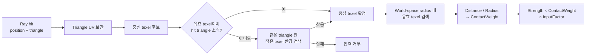
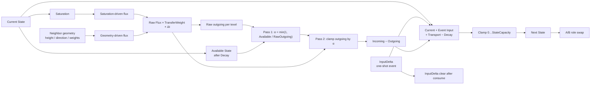

# Surface State Update

상태: **입력 구조·Transport Drive/Weight 분리 및 GeometryDrive 계약 확정** · 근거: [[../04_ADR/0015-Geometry-Driven-Transport|ADR 0015]], [[07_Assets/Documents/0004_Contact-Input.pdf|Contact Input]], [[07_Assets/Documents/0005_Next-State-Calculation.pdf|Next State 계산]]

이 문서는 외부 접촉을 State 입력으로 바꾸는 구조와 각 항의 갱신 규칙을 함께 정의한다.

## Contact Input

`State`는 Registry의 `TStateId`로 지정하며, 입력 적용 시 Registry를 통해 `ChannelIndex`로 해석한다. 입력 경로는 문자열이나 고정 enum에 의존하지 않는다.

외부 접촉은 `TSurfaceContactInput`으로 Surface State System에 전달한다.

```cpp
struct TSurfaceContactInput
{
    TSurfaceInstanceID   TargetInstance;
    TStateId              State;
    glm::vec3           WorldPosition;
    glm::vec3           WorldDirection;
    float               Radius;
    float               Strength;
    float               Falloff;
};
```

### ContactWeight

Input은 접촉 영역 전체에 동일하게 적용하지 않고, texel과 접촉 중심의 거리에 따라 `ContactWeight`를 적용한다.

$$
ContactWeight_i = Falloff\left(\frac{Distance_i}{Radius}\right)
$$

```text
Raycast
→ World Hit Position + Hit Triangle
→ Hit Triangle의 Simulation UV로 후보 texel 탐색
→ 각 후보 texel의 Surface Position과 Hit Position 사이 거리 계산
→ Distance / Radius
→ ContactWeight
```

`ContactWeight ∈ [0,1]`이며 반경 밖의 texel은 0으로 처리한다. `worldDirection`은 입력 방향 정보를 제공한다. 입사각 감쇠를 ContactWeight에 추가할지는 필수 규칙으로 정하지 않았다.



## 파라미터 접미사 네이밍 규칙

| 접미사 | 의미 | 시간과의 관계 | 일반적인 단위 |
|---|---|---|---|
| `Rate` | 단위 시간당 변화 속도 | 보통 `× Δt` | `/s`, `State/s`, `1/s` 등 |
| `Factor` | 입력·계산·변환 결과를 조절하는 계수 | 시간과 직접 관계 없음 | 보통 무차원 |
| `Weight` | texel·방향·인접 관계에서 적용하는 국소 가중치 | 시간과 직접 관계 없음 | 보통 `[0,1]` |

## 전체 State 갱신

$$
State_i^{t+1}
= clamp\left(
State_i^t + Input_i + Transport_i - Decay_i,
0,
stateCapacity_i
\right)
$$

$$
Transport_i = Incoming_i - Outgoing_i
$$

Input은 **Discrete Event**, Transport와 Decay는 **Continuous Update**로 처리한다.

| 항 | 처리 | `Δt` |
|---|---|---|
| Input | 접촉 이벤트 발생 프레임에 즉시 반영 | X |
| Transport | 시간 경과에 따른 State 이동 | O |
| Decay | 시간 경과에 따른 State 감소 | O |

다음 그림은 각 항이 Next State에 합쳐지는 설계 흐름이다. Transport의 Geometry 구동식은 아래에서 별도로 정의하며, 현재 구현 범위와의 차이는 [[0001_Engine-Structure|엔진 데이터 흐름]]에 적혀 있다.



## 1. Input

$$
Input_i = Strength \times ContactWeight_i \times InputFactor_i
$$

`ContactWeight` 정의는 위 절을 따른다.

## 2. Transport

$$
Incoming_i = \sum_j Flux_{j\rightarrow i}
$$

$$
Outgoing_i = \sum_j Flux_{i\rightarrow j}
$$

### Saturation

$$
Saturation_i = \frac{State_i}{stateCapacity_i}
$$

### Raw Flux

Saturation 차이와 Geometry에 의한 전달을 독립적으로 계산한 뒤 합친다.

$$
RawFlux_{i\rightarrow j}
=
\left(
SaturationDrive_{i\rightarrow j}\cdot SaturationTransferRate_i
+
GeometryDrive_{i\rightarrow j}\cdot GeometryTransferRate_i
\right)
\cdot TransferWeight_{i\rightarrow j}
\cdot \Delta t
$$

$$
SaturationDrive_{i\rightarrow j}
=
max(Saturation_i - Saturation_j, 0)
$$

$$
GeometryDrive_{i\rightarrow j}
=
HeightDrive_{i\rightarrow j}
\cdot DirectionDrive_{i\rightarrow j}
$$

`HeightDrive`와 `DirectionDrive`는 각각 높이 차의 크기와 이웃 방향에 대한 중력 정렬도를 담당한다. 높이는 Macro Surface와 `MesoVirtualHeight`를 합친 뒤 instance transform을 반영한 world-length 값으로 평가한다.

$$
EffectiveHeight_i = MacroHeight_i + MesoVirtualHeight_i
$$

$$
HeightDrive_{i\rightarrow j} = |EffectiveHeight_i - EffectiveHeight_j|
$$

높이차를 인접 texel 거리로 나누지 않는다. 실제 이웃 간격은 `DistanceWeight`가 별도로 반영한다. 따라서 `HeightDrive`는 world-length 단위를 가지며, `DirectionDrive`와 `TransferWeight`는 무차원이다.

면 방향과 이웃 방향은 instance transform을 적용해 world space에서 평가한다. Non-uniform scale을 포함해 normal은 normal transform으로 변환한다. source 면에 투영된 중력과 source→target 이웃 방향의 일치도를 DirectionDrive로 사용한다.

$$
GravityOnSurface_i = GravityWorld - NormalWorld_i \cdot (GravityWorld \cdot NormalWorld_i)
$$

$$
DirectionDrive_{i\rightarrow j} =
\begin{cases}
max(0, normalize(GravityOnSurface_i) \cdot normalize(WorldPosition_j - WorldPosition_i)), & |GravityOnSurface_i| > \epsilon \\
0, & otherwise
\end{cases}
$$

중력 투영 방향과 이웃 방향이 맞는 source→target flux가 커지고, 반대 방향 flux는 0이 된다. `GeometryTransferRate` 단위는 `State / (world-length · second)`이며, `GeometryDrive × GeometryTransferRate × Δt`는 State 단위 flux를 만든다.

이 정의는 기존 [[../04_ADR/0002-Transport-Drive-and-Weight|ADR 0002]]의 역할 분리를 구체화한다. `DirectionDrive`는 source 면에 투영한 gravity와 이웃 방향을 비교하고, `NormalWeight`는 이웃 두 면 사이의 Normal 차이를 통해 경로 통과성을 조절하므로 역할이 다르다. `DistanceWeight`만 이웃의 실제 표면 간격 효과를 별도로 반영한다.

### TransferWeight

`GeometryDrive`가 **이동을 발생시키는 방향·구동력**이라면, `TransferWeight`는 **그 이웃 관계를 실제 State가 얼마나 잘 통과하는지** 보정한다.

$$
TransferWeight_{i\rightarrow j}
=
W_{distance}
\cdot W_{normal}
\cdot W_{curvature}
\cdot W_{profileBoundary}
$$

| Weight | 의미 | 계산 기준 |
|---|---|---|
| `DistanceWeight` | 실제 표면상 가까운 이웃으로 전달이 잘 되도록 보정 | Surface Distance |
| `NormalWeight` | 표면 방향이 비슷한 영역 사이에서 전달이 잘 되도록 보정 | Surface Normal |
| `CurvatureWeight` | 홈·요철에 의해 State가 붙잡히거나 이동이 억제되는 정도 | Curvature / Concavity |
| `ProfileBoundaryWeight` | 서로 다른 SRProfile 영역 사이의 전달 정도. 동일 Profile 사이에서는 기본 `1.0` | SRProfile Boundary |

UV Seam은 Profile Boundary와 다른 문제다. 같은 실제 Surface가 UV에서 끊어진 경우에는 전달 가중치를 약화하는 것이 아니라 **올바른 실제 이웃 texel을 연결**한다. 생성 방식은 [[05_Development/Notes/0000_Surface-Simulation-Mapping|Surface Simulation Mapping]]을 따른다.

### 보유량 제한과 alpha

Decay를 먼저 고려한 뒤 보유량보다 많은 Outgoing이 발생하지 않게 모든 Outgoing Flux를 동일 비율로 줄인다.

$$
AvailableState_i = max(State_i - Decay_i, 0)
$$

$$
\alpha_i =
\begin{cases}
1, & RawOutgoing_i = 0 \\
min\left(1, \frac{AvailableState_i}{RawOutgoing_i}\right), & RawOutgoing_i > 0
\end{cases}
$$

$$
Flux_{i\rightarrow j} = \alpha_i \cdot RawFlux_{i\rightarrow j}
$$

2-Pass + `alpha` 저장의 GPU 계산 순서는 [[05_Development/Notes/0002_Next-State-Calculation|Next State 계산 메모]]를 본다.

## 3. Decay

$$
Decay_i
=
DecayRate_i
\cdot
\left(1 - ConcavityWeight_i\cdot CavityRetentionFactor_i\right)
\cdot \Delta t
$$

$$
Decay_i = min(Decay_i, State_i)
$$

`ConcavityWeight`는 현재 texel이 얼마나 오목한지를 나타내는 `[0,1]` 값이다. Solver의 형상 입력 저장 방식은 [[05_Development/Notes/0003_Surface-State-GPU-Resource|Surface State GPU Resource]]에서 다룬다.
