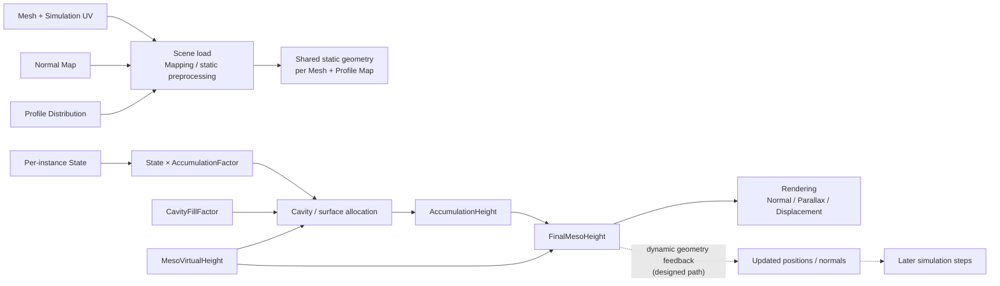
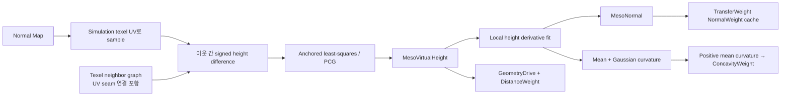
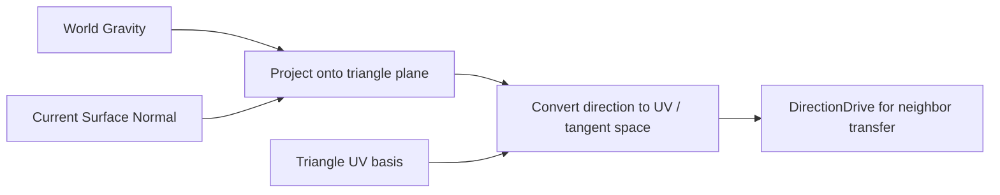
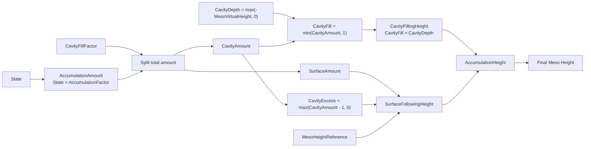

# 형상 정보와 적층

상태: **형상 의미와 반영 범위 확정 / 전처리 알고리즘 일부 검증 필요** · 근거: [[07_Assets/Documents/0006_Geometry-Integration.pdf|형상 정보 반영]], [[07_Assets/Documents/0002_Surface-System-Data.pdf|시스템 데이터 구조]]

## 반영하는 형상 정보

1. Normal
2. Distance
3. Height
4. Curvature / Concavity

Transport에는 거리, 높이·중력 방향, 표면 방향, 국소 요철이 영향을 주고, Decay에는 오목함에 따른 잔류 효과를 반영한다. 실제 Solver 수식은 [[03_Architecture/0004_Surface-State-Update|Surface State Update]]가 기준이다.

## 계산 및 사용 시점



정적 전처리는 애플리케이션 실행 중 고유 Mesh/Profile Distribution 입력 조합마다 load 시 한 번 수행한다. 매 frame이나 Instance마다 반복하지 않으며, 결과를 `.Surface` 파일이나 persistent cache로 저장하지 않는다. 전처리 시점과 수명은 [[../04_ADR/0008-Runtime-Surface-Preprocessing|ADR 0008 — Runtime Surface 전처리]]를 따른다.

## Macro / Meso Geometry

- **Macro Geometry**: 실제 Mesh polygon이 만드는 큰 형상.
- **Meso Geometry**: Normal / Height detail이 만드는 작은 요철.

Normal Map은 실제 Mesh를 바꾸지는 않지만 Simulation에서는 Meso-Structure로 취급한다.

| 항목        | 개념식 / 의미                                                         |
| --------- | ---------------------------------------------------------------- |
| Normal    | Macro Surface의 tangent basis를 이용해 Meso Normal을 변환하여 최종 Normal 구성 |
| Distance  | `Macro_Surface_Distance × Meso_Path_Stretch`                     |
| Height    | `Macro_Height + Meso_Virtual_Height`                             |
| Curvature | `Macro_Curvature + Meso_Curvature`                               |

Normal Map은 Simulation UV에 대응하는 각 texel에서 sample한다. 이웃 texel 간 mesh-local 위치와 변환된 Normal Map normal로 방향별 높이차를 계산한 뒤, 연결 graph 전체에서 그 차이를 최소제곱으로 만족시키는 height field를 구한다. Normal Map의 기울기는 완전히 적분 가능하지 않을 수 있다. 이 경우 residual을 기록하고 least-squares 해를 그대로 사용한다. 유효한 normal sample이 없거나 정규 macro normal과 반대 방향인 texel은 높이 0으로 남기고 적분 graph에서 제외한다. 자세한 수식과 한계는 [[04_ADR/0018-Normal-Map-Meso-Geometry|ADR 0018]]을 따른다.



## Meso Virtual Height

`Meso_Virtual_Height = 0`이면 Macro Geometry 그대로다.

| 값     | 의미                                  |
| ----- | ----------------------------------- |
| `< 0` | Macro Geometry보다 안쪽으로 들어간 Meso 형상   |
| `= 0` | Macro Geometry 그대로                  |
| `> 0` | Macro Geometry보다 바깥쪽으로 튀어나온 Meso 형상 |

각 연결 component에서 첫 유효 texel을 내부 기준점으로 고정해 해의 임의 상수를 없앤 뒤, component 평균 높이를 0으로 이동한다. 서로 끊긴 chart는 같은 기준 높이를 강제로 공유하지 않는다. UV seam은 Mapping neighbor graph가 연결한 경우에만 함께 적분한다. 높이차는 mesh-local 길이 단위이므로 별도 `β_meso` 또는 authoring scale을 곱하지 않는다. 이 선택은 물리적 mesh scale을 사용하므로 Mesh 크기를 바꾸면 복원 높이도 같은 비율로 바뀐다.

Non-integrable 입력에 별도 임계값 기반 거부는 두지 않는다. 최소제곱이 가장 가까운 일관된 height field를 반환하며, relative edge residual을 전처리 로그에 남긴다. 기울기 입력이 invalid하거나 macro normal에 거의 수직/반대인 texel은 neutral height 0으로 두고, 해당 연결은 적분에서 제외한다.

## Shared Surface Geometry Data

같은 Mesh + Normal Map을 사용하는 Instance가 공유할 수 있는 정적 형상 데이터다.

### Surface Geometry Field

| 항목 | 저장 단위 | 의미 |
|---|---|---|
| `Normal` | Texel별 | Macro mesh의 기저 표면 방향 |
| `TransferNormal` | 전처리 중 CPU texel별 | Simulation mapping의 triangle/barycentric 대응으로 Normal Map을 sample하고 tangent-space 방향을 mesh-local로 바꾼 값. TransferWeight cache 생성에 사용하며 geometric `Normal`이 fallback이다. GPU shared-geometry buffer에는 올리지 않는다. |
| `MesoNormal` | Texel별 CPU/GPU | 적분한 Meso height의 국소 미분으로부터 재구성한 mesh-local 유효 normal. 미분 fit이 불가능하면 sampled `TransferNormal`, 그것도 없으면 macro `Normal`을 사용한다. |
| `NeighborIndex` | Texel × 최대 8개 | seam을 포함한 실제 이웃 texel 인덱스 |
| Neighbor Distance | 저장하지 않음 | Solver가 이웃 Position 간 차이에서 필요할 때 계산 |
| `Meso_Virtual_Height` | Texel별 | Macro 기준 Normal Map에서 복원한 상대 높이 |
| `MesoMeanCurvature` | Texel별 CPU/GPU | height field의 국소 이차 fit에서 계산한 signed mean curvature. 단위는 1/mesh-local length다. |
| `MesoGaussianCurvature` | Texel별 CPU/GPU | height field의 국소 이차 fit에서 계산한 Gaussian curvature. 단위는 1/(mesh-local length²)다. 곡면이 볼록/오목/안장인지 보조적으로 구분한다. |
| `ConcavityWeight` | Texel별 CPU/GPU | 양의 signed mean curvature에 평균 이웃 간격을 곱해 `[0,1]`로 clamp한 Decay 전용 cavity retention 입력. 평탄/볼록 영역은 0이다. |

현재 Solver의 Decay는 `ConcavityWeight`를 직접 읽는다. Mean/Gaussian curvature는 형상 데이터로 생성하지만 Transport의 `CurvatureWeight`는 중립값 `1.0`이다. `NormalWeight`가 이웃 유효 normal 차이를 반영하므로 곡률 항을 더하면 굽힘 효과를 중복할 수 있다. GPU storage layout은 [[05_Development/Notes/0003_Surface-State-GPU-Resource|Surface State GPU Resource]]와 ADR 0018을 따른다.

### Geometry Common Parameters

| 항목 | 저장 단위 | 의미 |
|---|---|---|
| `Meso_Height_Reference` | Surface당 1개 | 적층량을 실제 높이로 변환할 때 사용하는 Meso 대표 높이 규모 |

## World Gravity

Static Mesh의 World Gravity를 UV-space 전파 방향으로 반영할 때는 다음 순서를 사용한다.

```text
1. 삼각형의 현재 Surface Normal 계산
2. World Gravity를 해당 삼각형 평면에 투영
3. 투영 벡터를 UV-space 방향으로 변환
4. DirectionDrive 계산에 사용
```

Static Mesh이므로 Actor Transform을 사용해 Surface Normal을 World Space로 변환할 수 있다.



## 동적 형상

적층으로 Height가 변하면 Normal / Curvature가 달라져 **후속 Simulation에 다시 반영**된다. 최신 유효 Position에서 이웃 거리를 계산하며, Solver 성능 경로는 원시 거리 대신 이 값에서 만든 간선별 TransferWeight를 형상 revision 동안 캐시한다. 현재 Runtime은 MesoVirtualHeight를 geometry scalar로 보유하고, instance별 동적 AccumulationHeight 생성은 후속 구현이다. 높이 또는 갱신 normal이 바뀌면 해당 instance TransferWeight cache를 다시 준비한다. GPU 소유와 동기화는 [[03_Architecture/0010_Surface-Solver-Cache|Surface Solver Cache]]와 [[05_Development/Notes/0003_Surface-State-GPU-Resource|GPU resource 설계]]를 따른다.

Simulation UV 생성, Mesh→Texel mapping, Valid Texel, UV Seam 및 Neighbor Index는 [[05_Development/Notes/0000_Surface-Simulation-Mapping|Surface Simulation Mapping]]에서 정의한다. Shared Geometry의 GPU 배치는 [[05_Development/Notes/0003_Surface-State-GPU-Resource|Surface State GPU Resource]]를 본다.

## Accumulation Height

적층은 State를 직접 변경하는 Solver 항이 아니라, 계산된 State를 **형상상의 높이 변화**로 변환하는 후속 Geometry 계산이다.

$$
Accumulation\_Height = Cavity\_Filling\_Height + Surface\_Following\_Height
$$

- **Cavity Filling**: Macro Surface 기준 아래쪽의 Meso cavity를 메운다.
- **Surface Following**: 기존 Meso 요철을 따라 표면 바깥쪽으로 쌓인다.

### 전체 적층량과 배분

$$
Accumulation\_Amount = State \times Accumulation\_Factor
$$

- `State ∈ [0, stateCapacity]`
- `Accumulation_Factor ∈ [0,n]`
- `Accumulation_Factor = 0`이면 State가 있어도 형상 적층을 만들지 않는다.

$$
Cavity\_Amount = Accumulation\_Amount \times Cavity\_Fill\_Factor
$$

$$
Surface\_Amount = Accumulation\_Amount \times (1-Cavity\_Fill\_Factor)
$$

`Cavity_Fill_Factor ∈ [0,1]`이며 SRProfile에서 결정한다. `Cavity_Amount`는 전체 cavity 깊이를 100% 채우는 양을 `1`로 둔 정규화 비율이다. 따라서 `0.4`는 깊이의 40%를 채우며, `1`을 넘는 초과분은 cavity를 더 채우지 않고 Surface Following으로 넘긴다.

### 실제 높이와 Cavity 상한

```text
Cavity_Depth = max(-Meso_Virtual_Height, 0)
Cavity_Fill = min(Cavity_Amount, 1)
Cavity_Excess = max(Cavity_Amount - 1, 0)
Cavity_Filling_Height = Cavity_Fill × Cavity_Depth
Surface_Following_Height = (Surface_Amount + Cavity_Excess)
                           × Meso_Height_Reference
Accumulation_Height = Cavity_Filling_Height + Surface_Following_Height
```

Cavity는 최대 100%까지만 채우며, 초과 적층량은 버리지 않고 Surface Following으로 넘긴다.



### 최종 높이

$$
DynamicFinalHeight = MacroHeight + MesoVirtualHeight + AccumulationHeight
$$

Accumulation Height로 변한 형상은 Rendering뿐 아니라 다음 Simulation의 Normal / Height / Curvature에도 다시 반영한다. Neighbor Distance는 Position 기반으로 필요할 때 계산한다. [[04_ADR/0003-Dynamic-Accumulation-Geometry|ADR 0003]]

예를 들어 Wetness / Heat / Burn은 형상 적층이 없도록 `accumulationFactor = 0`을 사용할 수 있고, Mud는 적층을 표현할 수 있다. State 종류는 고정 목록이 아니며, SurfaceWater / Snow 등 다른 State의 적층 동작도 해당 Profile 파라미터로 정의한다.
