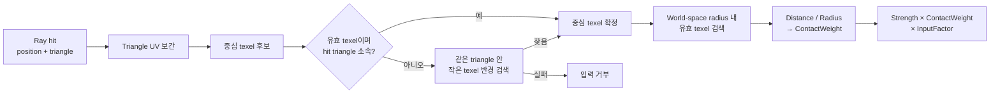
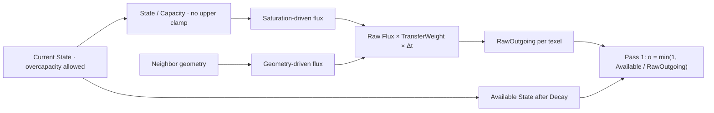
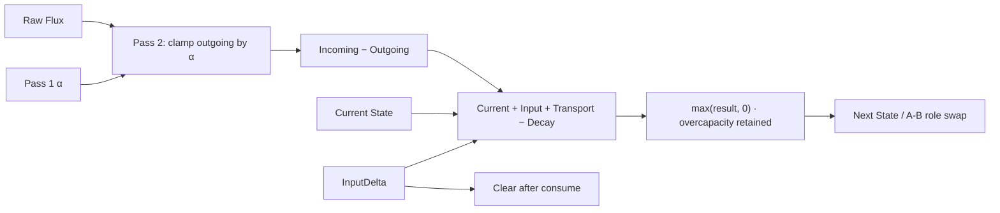
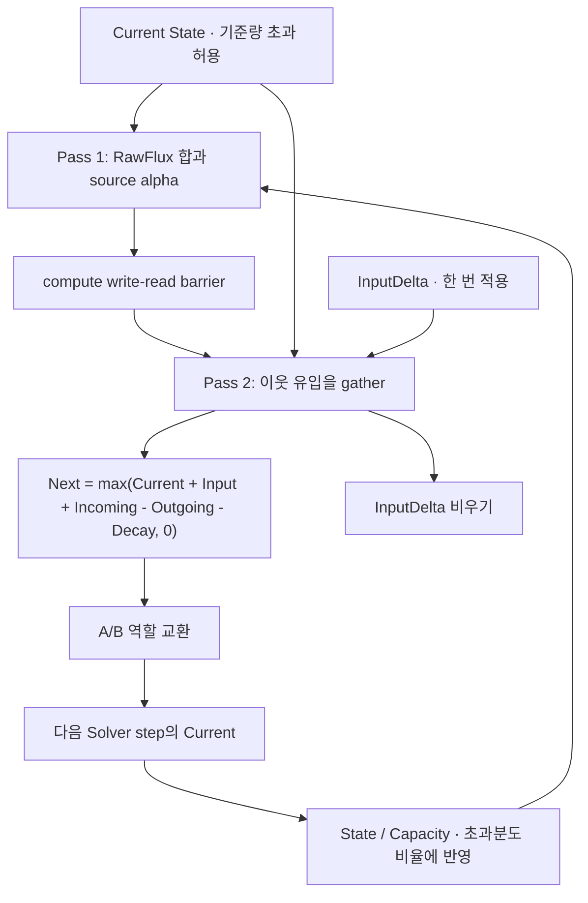

# Surface State Update

> **한 줄 요약:** 이 문서는 외부 접촉을 State 입력으로 바꾸는 구조와 각 항의 갱신 규칙을 함께 정의한다.

상태: **현재 Solver 계약**
근거: Geometry Driven Transport, [[06_Assets/Documents/0004_Contact-Input.pdf|Contact Input]], [[06_Assets/Documents/0005_Next-State-Calculation.pdf|Next State 계산]]

---

이 문서는 외부 접촉을 State 입력으로 바꾸는 구조와 각 항의 갱신 규칙을 함께 정의한다.


## 면적과 시간의 현재 계약

State는 texel별 총량이고 `AreaScale_i = WorldTexelArea_i / (1/256²)`다. 고정 기준 면적은 선택 해상도와 함께 바꾸지 않는다. Capacity·Strength·DecayRate는 이 기준 면적에 대한 값이며 실제 texel 면적으로 환산한다. Strength는 사건 한 번의 기준 면적 입력량이고 브러시 전체 총량은 아니다.

Geometry 원시 전달에는 출발 `Saturation_i`를 곱하며 **상한 1을 두지 않는다**. SaturationDrive의 이웃 포화도 차이는 별도로 유지한다. 같은 포화도·경사에서 Geometry가, 평평한 포화도 차이에서 Saturation이 작동한다. SaturationDrive OFF도 Geometry의 출발 포화도를 없애지 않는다.

실제 경과 시간×배속을 누적한다. 기본값은 **Fixed timestep ON·Auto substepping OFF**이며 1/60초씩 반복한다. Profile 계수나 면적은 이 기본 dt를 바꾸지 않는다. 같은 frame의 후속 step은 갱신된 State를 읽는다. Contact 입력은 첫 step에서 한 번 소비하고 RawFlux·alpha는 매번 갱신한다.

### 시간 구간과 자동 세분화

| Fixed timestep | Auto substepping | 시간 소비 |
|---|---|---|
| ON | OFF | 1/60초가 모이면 dt=1/60초 한 번. 남은 시간은 대기 |
| ON | ON | 1/60초가 모이면 Transport 상한 이하로 나눠 실행. 마지막 짧은 step까지 합쳐 구간 완료 |
| OFF | OFF | 누적된 경과 시간을 한 번의 dt로 실행 |
| OFF | ON | Transport 상한 이하로 나누고 마지막 잔여 시간까지 실행 |

frame당 최대 8 Solver 실행을 기록한다. Auto ON의 고정 구간이 중간에 끊기면 남은 구간을 다음 frame에서 재개한다. 잔여 구간은 PendingTime에 포함되며 시간 budget을 중복 누적하지 않는다. 옵션 변경은 State나 clock를 초기화하지 않는다. Auto OFF 전환은 진행 중인 고정 구간의 잔여 길이를 한 번 마무리한 뒤 새 구간부터 1/60초를 사용한다.

Pause는 시간을 누적·소비하지 않는다. 수동 Step은 Auto OFF에서 1/60초, ON에서 Transport 상한으로 Solver 한 번이며 기존 backlog를 소비하지 않는다. Reset·Scene·해상도 변경은 미완료 구간도 초기화한다. Auto OFF에서는 CPU Transport 시간 상한 계산을 호출하지 않는다.

자동 상한은 원시 Transport 유출 비율 90% 이하를 목표로 한 보수적 조건이다. alpha는 모든 옵션에서 유지한다. GPU 과부하에서는 미처리 시간이 쌓일 수 있다. 계약은 [[05_Decisions/0013_Fixed-Timestep-and-Auto-Substepping|Decision 0013]], 초기 시간 상한의 식은 [[05_Decisions/0011_Accumulated-Simulation-Timestep|Decision 0011]], 용어·공식 문서는 [[02_Research/0004_Substepping-and-Adaptive-Time-Stepping|Substepping과 Adaptive Time Stepping]]을 따른다.

결정: [[05_Decisions/0009_Texel-Area-and-State-Amounts|면적·총량]], [[05_Decisions/0010_Geometry-Transport-Mobility|Geometry 비례 전달]]. HeightDrive, DistanceWeight와 2-Pass 구조는 유지한다.


## Contact Input

`State`는 Registry의 `TStateId`로 지정하며, 입력 적용 시 Registry를 통해 `ChannelIndex`로 해석한다. 입력 경로는 문자열이나 고정 enum에 의존하지 않는다.

외부 접촉은 `TSurfaceContactInput`으로 Surface State System에 전달한다.

```cpp
struct TSurfaceContactInput
{
    TSurfaceInstanceID   TargetInstance;
    TStateId              State;
    glm::vec3           WorldPosition;
    glm::vec3           WorldDirection;
    float               Radius;
    float               Strength;
    float               Falloff;
};
```

### ContactWeight

Input은 접촉 영역 전체에 동일하게 적용하지 않고, texel과 접촉 중심의 거리에 따라 `ContactWeight`를 적용한다.

$$
ContactWeight_i = Falloff\left(\frac{Distance_i}{Radius}\right)
$$

```text
Raycast
→ World Hit Position + Hit Triangle
→ Hit Triangle의 Simulation UV로 후보 texel 탐색
→ 각 후보 texel의 Surface Position과 Hit Position 사이 거리 계산
→ Distance / Radius
→ ContactWeight
```

`ContactWeight ∈ [0,1]`이며 반경 밖의 texel은 0으로 처리한다. `worldDirection`은 입력 방향 정보를 제공한다. 입사각 감쇠를 ContactWeight에 추가할지는 필수 규칙으로 정하지 않았다.

#### Contact 위치에서 State 입력까지



## 파라미터 접미사 네이밍 규칙

| 접미사 | 의미 | 시간과의 관계 | 일반적인 단위 |
|---|---|---|---|
| `Rate` | 단위 시간당 변화 속도 | 보통 `× Δt` | `/s`, `State/s`, `1/s` 등 |
| `Factor` | 입력·계산·변환 결과를 조절하는 계수 | 시간과 직접 관계 없음 | 보통 무차원 |
| `Weight` | texel·방향·인접 관계에서 적용하는 국소 가중치 | 시간과 직접 관계 없음 | 보통 `[0,1]` |

## 전체 State 갱신

$$
State_i^{t+1}
= max\left(
State_i^t + Input_i + Transport_i - Decay_i,
0
\right)
$$

$$
Transport_i = Incoming_i - Outgoing_i
$$

Input은 **Discrete Event**, Transport와 Decay는 **Continuous Update**로 처리한다.

| 항 | 처리 | `Δt` |
|---|---|---|
| Input | 이벤트 뒤 처음 실행되는 Solver Pass 2의 Next에 한 번 반영 | X |
| Transport | 시간 경과에 따른 State 이동 | O |
| Decay | 시간 경과에 따른 State 감소 | O |

다음 그림은 각 항이 Next State에 합쳐지는 설계 흐름이다. Transport의 `GeometryDrive` 계산식은 아래에서 별도로 정의하며, 현재 구현 범위와의 차이는 [[03_Architecture/0001_Engine-Structure|엔진 데이터 흐름]]에 적혀 있다.

### Flux와 outgoing 제한 계산



### Next State 갱신과 입력 소비



## 1. Input

$$
Input_i = Strength \times ContactWeight_i \times InputFactor_i \times AreaScale_i
$$

`ContactWeight` 정의는 위 절을 따른다.

## 2. Transport

$$
Incoming_i = \sum_j Flux_{j\rightarrow i}
$$

$$
Outgoing_i = \sum_j Flux_{i\rightarrow j}
$$

### Saturation

$$
Saturation_i = \frac{State_i}{Capacity_i},\quad Capacity_i = ProfileStateCapacity_i\cdot AreaScale_i
$$

Saturation은 1을 초과할 수 있고 Transport에서 상한 clamp하지 않는다. 예를 들어 동일 Capacity=1인 두 이웃의 State가 `1.2`, `1.0`이면 SaturationDrive는 `0.2`다. 둘 다 `1.2`이고 GeometryDrive가 0이면 이 Drive도 0이다. Heatmap의 표시 정규화는 이 값에 영향을 주지 않는다.

### Raw Flux

`.SRProfile`은 `[0,1]` 무차원 `saturationSpreadFactor`와 `gravityFlowFactor`를 저장한다. GPU Profile 레코드는 기존 필드명으로 같은 값을 저장한다. Solver에서 아래 실제 속도로 변환한 뒤 flux에 사용한다 ([[05_Decisions/0008_Normalized-Transport-Factors|Decision 0008]]).

$$
SaturationTransferRate_i = saturationSpreadFactor_i \cdot BaseSaturationTransferRate
$$

$$
GeometryTransferRate_i = gravityFlowFactor_i \cdot BaseGeometryTransferRate
$$

| Solver 상수 | 현재 값 | 단위 |
|---|---:|---|
| `BaseSaturationTransferRate` | `1.0` | `State / second` |
| `BaseGeometryTransferRate` | `6000.0` | `State / (world-length · second)` |

초기 Geometry 기준값은 100이었으며 면적·총량 모델의 흐름을 재보정해 6000으로 변경했다 ([[05_Decisions/0012_Geometry-Rate-Recalibration|Decision 0012]]). `State` 단위는 Registry에 등록된 해당 State의 시뮬레이션 상태량 단위이며, 기준 상수는 모든 channel의 해당 전달 경로에 공통 적용한다. 두 상수는 C++/GLSL 공용 `SurfaceSolverRates.h`에 정의해 Pass 1/2와 CPU 안전 시간 간격 계산에 동일하게 적용한다. 프로파일 계수의 정규화는 Saturation 상한 clamp나 높이차의 거리 정규화를 추가하지 않는다.

현재 구현은 `SaturationDrive`와 `GeometryDrive`에 의한 전달을 독립적으로 계산한 뒤 합친다.

$$
RawFlux_{i\rightarrow j}
=
\left(
SaturationDrive_{i\rightarrow j}\cdot SaturationTransferRate_i
+
GeometryDrive_{i\rightarrow j}\cdot GeometryTransferRate_i\cdot Saturation_i
\right)
\cdot TransferWeight_{i\rightarrow j}
\cdot \Delta t
$$

$$
SaturationDrive_{i\rightarrow j}
=
max(Saturation_i - Saturation_j, 0)
$$

$$
GeometryDrive_{i\rightarrow j}
=
HeightDrive_{i\rightarrow j}
\cdot DirectionDrive_{i\rightarrow j}
$$

### 홈 이탈 방향의 Transport 보유 — 구현

RawFlux는 Decision 0022의 Macro/Meso 통합 `ConcavityWeight`와 `.SRProfile` State별 `cavityExitResistanceFactor`를 사용한다. Decay의 `cavityDecayProtectionFactor`는 자연 감소에만 적용한다.

- 방향 항은 `exit(i→j) = max(ConcavityWeight_i − ConcavityWeight_j, 0)`이다.
- 감쇠는 `1 − cavityExitResistanceFactor × exit(i→j)`이다. 두 texel GPU fixture에서 홈 이탈·진입 비대칭과 총량 보존을 확인했다. 실제 형상별 체감 세기는 시각 검증이 남아 있다.
- 방향 항은 SaturationDrive와 GeometryDrive를 합친 RawFlux에 적용해 State 전체가 홈에서 이탈하는 양을 줄인다.
- `.SRProfile`에서 이 계수를 생략하면 0을 사용해 기존 전달 결과를 유지한다 ([[05_Decisions/0022_Macro-Meso-Concavity-Field|Decision 0022]], [[05_Decisions/0023_Directional-Cavity-Transport-Retention|Decision 0023]]).

`HeightDrive`와 `DirectionDrive`는 각각 높이 차의 크기와 이웃 방향에 대한 중력 정렬도를 담당한다. 높이는 Macro Surface와 `MesoVirtualHeight`를 합친 뒤 instance transform을 반영한 world-length 값으로 평가한다.

$$
EffectiveHeight_i = MacroHeight_i + MesoVirtualHeight_i
$$

$$
HeightDrive_{i\rightarrow j} = |EffectiveHeight_i - EffectiveHeight_j|
$$

높이차를 인접 texel 거리로 나누지 않는다. 실제 이웃 간격은 `DistanceWeight`가 별도로 반영한다. 따라서 `HeightDrive`는 world-length 단위를 가지며, `DirectionDrive`와 `TransferWeight`는 무차원이다.

면 방향과 이웃 방향은 instance transform을 적용해 world space에서 평가한다. Non-uniform scale을 포함해 normal은 normal transform으로 변환한다. source 면에 투영된 중력과 source→target 이웃 방향의 일치도를 DirectionDrive로 사용한다.

DirectionDrive의 NormalWorld는 기본 ON에서 복원된 MesoNormal을 사용하며 sampled TransferNormal, macro normal 순으로 fallback한다. UI `DirectionDrive: MesoNormal`을 OFF로 두면 기본 mesh normal을 선택한다. 동적 `AccumulationHeight`와 그에 따른 normal은 아직 공급되지 않는다.

현재 Z-up 데모의 world gravity는 `(0, 0, -1)`이다. 따라서 `EffectiveHeight`는 반대 방향인 world `+Z` 축으로 투영한다.

$$
GravityOnSurface_i = GravityWorld - NormalWorld_i \cdot (GravityWorld \cdot NormalWorld_i)
$$

$$
DirectionDrive_{i\rightarrow j} =
\begin{cases}
max(0, normalize(GravityOnSurface_i) \cdot normalize(WorldPosition_j - WorldPosition_i)), & |GravityOnSurface_i| > \epsilon \\
0, & otherwise
\end{cases}
$$

중력 투영 방향과 이웃 방향이 맞는 source→target flux가 커지고, 반대 방향 flux는 0이 된다. `GeometryTransferRate` 단위는 `State / (world-length · second)`이며, `GeometryDrive × GeometryTransferRate × Δt`는 State 단위 flux를 만든다.

이 정의는 기존 역할 분리를 구체화한다 (Transport Drive and Weight). `DirectionDrive`는 source 면에 투영한 gravity와 이웃 방향을 비교한다. `NormalWeight`는 이웃 두 면 사이의 Normal 차이를 통해 경로 통과성을 조절한다. 두 항은 역할이 다르며, `DistanceWeight`는 이웃의 실제 표면 간격 효과를 별도로 반영한다.

### TransferWeight

`GeometryDrive`가 높이 차이와 중력 방향으로 이동을 구동한다. `TransferWeight`는 거리·법선·Profile 경계에 따라 이웃 간 전달량을 보정한다. 홈에서 밖으로 나가는 흐름은 방향별 `cavityExitResistanceFactor`가 별도로 줄인다.

$$
TransferWeight_{i\rightarrow j}
=
W_{distance}
\cdot W_{normal}
\cdot W_{profileBoundary}
$$

| Weight | 의미 | 계산 기준 |
|---|---|---|
| `DistanceWeight` | 주변 이웃보다 먼 연결의 전달량을 낮춤 | 정규화된 world-space Surface Distance |
| `NormalWeight` | 이웃 texel의 유효 표면 방향 차이가 클수록 전달량을 낮춤 | 복원된 MesoNormal을 우선 사용하고 sampled TransferNormal, geometric normal 순으로 fallback한 뒤 instance inverse-transpose를 적용한 world normal 내적 |
| `ProfileBoundaryWeight` | 같은 Profile 사이 `1.0`, 다른 Profile 사이 고정 `0.5`로 전달량을 낮춤 | SRProfile ID 비교 |

현재 `DistanceWeight`는 각 endpoint의 평균 유효 이웃 간격을 `dRef`로 삼는다. `dRef(i,j) = 0.5 × (meanDistance_i + meanDistance_j)`이고, `d(i,j)`는 두 texel의 world-space 거리다.

$$
DistanceWeight_{i\rightarrow j} = clamp\left(\frac{dRef(i,j)}{d(i,j)}, 0, 1\right)
$$

- 유효 이웃 간격이나 endpoint 거리가 epsilon 이하이거나 유한하지 않으면 가중치를 0으로 둔다.
- 거리는 MesoVirtualHeight와 향후 AccumulationHeight를 반영한 최신 유효 Position과 Neighbor 관계에서 계산한다.
- 간선별 TransferWeight와 Pass 1의 `RawOutgoing` 합계는 저장해 재사용한다. 방향별 RawFlux는 Pass 1에서 합산하고 Pass 2에서 재평가한다 ([[0006_Surface-State-Update#Solver 최적화 구조|Solver 최적화 구조]], [[05_Decisions/0025_RawFlux-Cache-Removal|Decision 0025]]).

$$
NormalWeight_{i\rightarrow j} = clamp\left(NormalWorld_i \cdot NormalWorld_j, 0, 1\right)
$$

두 normal은 최신 변형 Geometry의 normal에 instance transform의 inverse-transpose를 적용한 뒤 정규화한다. 유효하지 않은 normal은 가중치 0으로 처리한다. `ProfileBoundaryWeight`는 별도 Profile parameter가 아닌 Solver 공통 규칙이다. 거리·법선·Profile 경계 식과 곡률 보류 범위에 따른다 (Transport Transfer Weights).

UV Seam은 Profile Boundary와 다른 문제다. 같은 실제 Surface가 UV에서 끊어진 경우에는 `TransferWeight`를 약화하는 것이 아니라 **올바른 실제 이웃 texel을 연결**한다. 생성 방식은 [[03_Architecture/0004_Surface-Geometry#Simulation Mapping|Surface Simulation Mapping]]을 따른다.

### 보유량 제한과 alpha

Decay를 먼저 고려한 뒤 보유량보다 많은 Outgoing이 발생하지 않게 모든 Outgoing Flux를 동일 비율로 줄인다. Capacity를 넘은 State도 전체 보유량으로 사용하며 목적지의 남은 공간은 검사하지 않는다.

$$
AvailableState_i = max(State_i - Decay_i, 0)
$$

$$
\alpha_i =
\begin{cases}
0, & inactive_i \\
1, & \neg inactive_i \land RawOutgoing_i = 0 \\
min\left(1, \frac{AvailableState_i}{RawOutgoing_i}\right), & \neg inactive_i \land RawOutgoing_i > 0
\end{cases}
$$

$$
Flux_{i\rightarrow j} = \alpha_i \cdot RawFlux_{i\rightarrow j}
$$

`inactive` source는 다음 중 하나에 해당한다.

- Unsupported/invalid texel-channel
- 감쇠 후 `AvailableState = 0`
- `dt = 0`

현재 GPU 구현은 비활성 항목의 RawOutgoing·alpha를 0으로 기록하고 RawFlux 평가·쓰기를 생략한다.

- Pass 2는 source alpha가 0이면 cache를 읽지 않고 실제 전달량을 0으로 처리한다.
- 비활성 RawFlux에는 이전 값이나 미초기화 값이 남을 수 있다. 값을 읽고 alpha=0을 곱하는 방식은 사용하지 않는다.
- Target의 incoming·입력·Next 갱신은 계속 수행한다. 받은 값의 outgoing 전달은 다음 step부터 시작한다.

Pass 1에서 source의 Profile·Saturation·지원 여부는 channel당, source 형상은 geometry를 쓰는 invocation당 한 번 준비하여 이웃 평가에서 재사용한다. instance 공통 선형 행렬·inverse-transpose·gravity up은 CPU가 dispatch당 한 번 준비한다. 캐시 및 source 재사용은 전달 수식을 바꾸지 않으며 실행·유효성 계약은 [[0006_Surface-State-Update#Solver 최적화 구조|Solver 최적화 구조]]를 따른다.

2-Pass + `alpha` 저장의 GPU 계산 순서는 [[0006_Surface-State-Update#전체 State 갱신|전체 State 갱신]]를 본다.

### Capacity 초과량의 후속 전달

Capacity는 포화 기준량이고 저장 상한이 아니다. 입력과 여러 이웃의 Incoming이 기준량을 넘으면 전체 결과를 Next State에 기록한다. 초과량은 `max(State - Capacity, 0)`으로 필요할 때 구하며 추가 버퍼로 저장하지 않는다.

#### Capacity 초과량의 다음 Step 전달



| 단계 | 초과량 처리 | 유지하는 자원·동기화 |
|---|---|---|
| Pass 1 | 전체 Current를 가용량으로 사용하고 기존 RawFlux·alpha 계산 | RawOutgoing, OutgoingFluxScale |
| Pass 2 | 자신의 Next에 전체 합을 기록. 받는 texel의 공간 제한 없음 | State A/B, InputDelta, 기존 gather |
| 다음 step | 받은 양을 포함한 Current로 RawFlux 계산 | 기존 ping-pong 및 두 pass 사이 barrier |

alpha는 source가 가진 양 이상을 보내지 않도록 하는 비율이며 최대 1이다. 초과량을 강제로 전량 내보내는 추가 항은 없다. 이번 step에 받은 양을 같은 step 안에서 다시 넘기지 않으며 후속 이동은 다음 Solver step의 rate·TransferWeight·Δt에 따른다. 이웃이 없거나 rate/weight가 0이면 초과량이 남는다. 모든 이웃의 Saturation이 같고 GeometryDrive가 0이면 초과 상태라도 전달되지 않는다.

추가 Overflow buffer·채널·수용 비율(beta)·pass는 없다. 입력·Decay가 없고 지원되는 닫힌 이웃 graph에서는 같은 Flux를 source에서 빼고 target에 더하는 총량 장부를 검증한다. Capacity 상한에 의한 손실을 제거해도 큰 Δt의 안정성·FPS 독립성·물리 질량 보존이 자동 보장되지는 않는다.

## 3. Decay

$$
Decay_i
=
DecayRate_i
\cdot AreaScale_i
\cdot
\left(1 - ConcavityWeight_i\cdot CavityRetentionFactor_i\right)
\cdot \Delta t
$$

$$
Decay_i = min(Decay_i, State_i)
$$

Decay 식은 현재 texel의 `[0,1]` `ConcavityWeight`로 감소량을 줄인다. 이 값은 Macro Mesh와 Normal Map Meso의 유효 형상에서 만든다 ([[05_Decisions/0022_Macro-Meso-Concavity-Field|Decision 0022]]). Solver의 형상 입력 저장 방식은 [[03_Architecture/0007_Surface-GPU-Data-Layout|Surface State GPU Resource]]에서 다룬다.

## Solver 최적화 구조

이 절은 계산 의미를 바꾸지 않고 반복 비용을 줄이는 현재 구조만 요약한다. 실측 비교는 Solver Performance에서 관리한다.

| 범위 | 현재 처리 | 줄이는 비용 |
|---|---|---|
| TransferWeight | Instance별로 준비한다. 정적 형상에서 순수 translation·rotation은 재사용하고 scale·가중치 설정이 바뀔 때 갱신한다. Scene 형상 교체는 새 resource를 만든다. | RawFlux 내부의 반복 `DistanceWeight`·`NormalWeight` 계산 |
| RawOutgoing | Pass 1 합계를 저장하여 Pass 2가 재사용 | 자기 outgoing 합계의 재계산 |
| 방향별 RawFlux | 저장하지 않는다. Pass 1은 방향 flux 합만 RawOutgoing에 더하고 Pass 2가 이웃 source의 역방향 slot으로 flux를 재평가한다. | 방향별 scratch 쓰기·읽기와 `texel × channel × 8` 메모리 |
| Pass 1 source 계산 | 지원 여부·Profile·Saturation은 channel당 준비, source 법선 변환·중력 투영·위치는 geometry를 쓰는 invocation당 한 번 준비 | 같은 source를 이웃 8개·여러 채널에서 반복 준비하는 비용 |
| instance 계산 | CPU가 solver dispatch당 선형 행렬·inverse-transpose·gravity up을 준비해 128-byte push constant로 전달 | 텍셀별 공통 행렬 계산 |
| 동적 source Geometry | DynamicGeometry에 저장한 위치와 local normal을 Solver에서 다시 읽는다. normal fitting은 geometry update pass에서 수행한다. | Pass 2 유입 source의 이웃 순회 least-squares normal 재계산 |
| 비활성 source | unsupported/invalid, 감쇠 후 가용량=0 또는 dt=0이면 RawOutgoing·alpha만 0으로 기록 | outgoing 평가 |
| 시뮬레이션 해상도 | Low 128, Medium 256, High 512, 기본 Medium | Surface별 texel 수와 이에 비례하는 작업·버퍼 payload |

- 모든 texel은 dispatch 대상이며 invocation 분기로 비싼 source 계산을 생략한다.
- 빈 target도 Pass 2에서 incoming·InputDelta·Next를 처리한다. 별도 활동 mask나 추가 pass는 없다.
- 해상도 선택 UI는 [[03_Architecture/0009_UI-Interface|UI Interface]]를 따른다.
- Buffer 배치와 유효성은 [[03_Architecture/0007_Surface-GPU-Data-Layout|GPU Data Layout]]을 따른다.
- 성능은 State 분포와 GPU에 따라 달라진다. 기존 ON/OFF 측정은 방향별 RawFlux 제거 이전의 역사적 기록이다. 현재 경로의 비용은 Pass 1·Pass 2 타임스탬프로 별도 측정한다.
