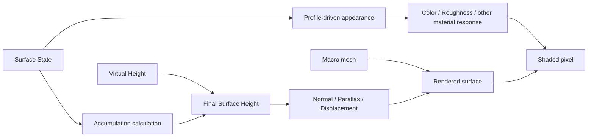

# Surface State Rendering

> **한 줄 요약:** Rendering은 State에 따른 외관 변화와 Accumulation에 따른 형상 높이 변화를 구분한다.

상태: **현재 Rendering 구조**
근거: [[06_Assets/Documents/0006_Geometry-Integration.pdf|형상 정보 반영]], [[06_Assets/Documents/0007_Target-Demos.pdf|목표 데모]]

---

Rendering은 State에 따른 **외관 변화**와 Accumulation에 따른 **형상 높이 변화**를 구분한다.

## Appearance와 Geometry 반영 흐름

이 그림은 목표 구조를 나타낸다. 현재 구현 범위는 다음과 같다.

- 기본 Material·Normal Map, Surface Debug와 Texel Inspector, texel 연결면의 높이 표시·묶음 grid, Heat·Mud 데모 Lit 반응과 Mud 표시 형상을 사용한다.
- 완전히 뒤집힌 데모 Mesh와 Overlay도 보이도록 채운 표면은 양면 렌더링하고, 뒷면에서는 표시용 법선을 카메라 쪽으로 뒤집는다. Wireframe은 기존 뒷면 제거를 유지한다.
- 각 swapchain image의 framebuffer는 해당 image 전용 depth attachment를 사용해 프레임 간 depth 쓰기가 겹치지 않게 한다.
- 원본 Mesh를 Base로 유지한다. 기본은 누적 높이의 공통 윗면에서 State 재질을 합성하고 경계에 옆면을 만든다. `Transparent surface`를 켜면 물을 제외한 불투명 공통 윗면과 물을 포함한 최종 높이의 투명 WaterFilm 윗면을 그린다 ([[05_Decisions/0028_Shared-Accumulation-Top-and-Optional-Transparent-WaterFilm|Decision 0028]]).
- `Visual smoothing`은 공통 윗면의 Mud·Lava 영역과 선택적 투명 WaterFilm 윗면에 각각 렌더링용 3×3 가우시안 필터를 적용한다. `Height-field smoothing`은 해당 영역의 필터를 함께 켠다. Solver 높이는 바꾸지 않는다.
- `Overlay only (debug)`는 Lit 뷰에서 Base Surface를 생략해 생성된 State Overlay만 확인한다. 이 옵션을 켜면 `Both`·`Top only`·`Sides only` 표시 모드를 고를 수 있다. 옵션을 끄면 다음 Lit 뷰에서 전체 Overlay를 다시 그린다.

## 저장량과 표시 범위

State는 Capacity를 넘을 수 있다 ([[05_Decisions/0004_State-Overcapacity-Transport|Decision 0004]]). Heatmap과 외관 remap은 필요하면 `clamp(State / Capacity, 0, 1)`을 표시용으로 사용하되 GPU State 및 Transport용 Saturation은 바꾸지 않는다.

- State Heatmap은 선택 State의 `State / (Profile Capacity × AreaScale)`를 표시한다. 100% 초과는 주황색으로 구분한다. 실제 총량은 Texel Inspector에서 확인한다.
- Heat·Mud의 Lit 반응과 옵션형 Solver 적층 형상 피드백을 사용한다. 형상 피드백은 기본 OFF다.

## 외관 변화 (State-based Appearance Changes)

- `Heat`: State saturation에 따라 원래 albedo를 설정된 빨간색으로 점진적으로 보간한다.
- `Burn`: 그을림·탄 정도 변화.
- `Mud`: 외관 변화 + `AccumulationHeight`.
- `SurfaceWater`(확장 예정): 표면 물기 / 고임 + Accumulation Height 가능.

## 형상 높이 변화 (Accumulation-based Geometry Height Changes)

최종 Virtual Height는 다음과 같다.

$$
FinalMesoHeight
=
MesoVirtualHeight
+
AccumulationHeight
$$

Simulation 관점의 전체 높이는 다음과 같다.

$$
DynamicFinalHeight
=
MacroHeight + MesoVirtualHeight + AccumulationHeight
$$

Mud·Snow처럼 실제 두께 변화가 중요한 적층은 화면상 외관 변화만으로 표현하기 어려울 수 있다. 현재 렌더링 구조는 상태 기반 외관 변화와 적층 형상 표현을 분리해 다룬다.

적층 계산은 [[03_Architecture/0004_Surface-Geometry|적층과 Accumulation Height]]을 본다.

## 적층 디버그 미리보기

Accumulation은 선택 State의 Capacity 제한·기준면적 환산량에서 총 높이·Cavity·Following·Fill 비율을 계산한다. Capacity 초과량은 State 저장과 수송에 남지만 해당 State의 형상 기여에는 포함하지 않는다. Accumulation Geometry Update도 같은 Capacity 제한을 모든 적층 State에 적용해, 화면과 시뮬레이션이 같은 높이 변환을 사용한다. Compute는 최신 State와 Meso 높이에서 texel별 표시 위치·법선을 만들고, vertex shader는 그 결과를 원본 triangle과 texel 중심으로 세분한 연결면에 표시한다. Final Geometry와 Accumulation heatmap은 같은 변위 면을 사용한다. Meso Color/Displacement도 texel 연결면을 사용하며 적층을 제외한다. 초기 원본 메시 정점 변위의 밀도 제한을 제거했고, 원본 position/edge topology의 공통 높이 stencil과 경계 분할로 UV seam을 봉합한다 ([[05_Decisions/0017_Source-Topology-Seam-Stitching|Decision 0017]]). 원본 메시의 열린 경계는 유지한다. 원본 Normal Map은 중복 적용하지 않는다.

Inspector는 같은 GPU 식의 선택 texel 결과를 완료 frame fence 이후 표시한다. `.SRProfile`의 State별 `thicknessPerAmount`를 사용하고, 공통 `Lit height display scale`은 렌더링 전용이다. Simulation은 같은 Profile 두께값으로 모든 지원 State의 물리 높이를 합산하며 표시 배율을 읽지 않는다. 렌더링은 같은 정적 texel topology에서 `H_total`을 기본 공통 윗면에 사용한다. 투명 옵션에서는 물을 제외한 `H_opaque`와 물을 포함한 `H_total`을 각각 사용한다. 물리적 다중 Layer Stack은 없다. [[05_Decisions/0014_Accumulation-Debug-and-Texel-Inspector|Decision 0014]], [[05_Decisions/0015_Texel-Geometry-Preview|Decision 0015]], [[05_Decisions/0028_Shared-Accumulation-Top-and-Optional-Transparent-WaterFilm|Decision 0028]]을 따른다.

## Heat·Mud·WaterFilm 데모 Lit

Registry는 로드된 `.SRProfile`의 State 종류를 유지한다. 데모 adapter가 `heat`·`mud`·`waterfilm`·`lava` 이름의 현재 ID를 조회하고, Shader는 해당 texel의 Profile 지원과 면적 보정 Capacity를 확인한다. Heat는 saturation에 따라 Base albedo를 빨간색으로 점진적으로 보간한다. 공통 윗면의 fragment shader는 Heat·Mud·WaterFilm·Lava 재질을 합성한다. 기본 WaterFilm은 얇은 막 재질 반응이다. 투명 옵션에서는 물을 포함한 최종 높이에서 WaterFilm을 alpha blend하고 depth를 기록하지 않는다. 경계 옆면은 GPU가 만들며 Overlay에 원본 Normal Map을 중복 적용하지 않는다.

`Lit height display scale`은 Lit과 선택 State 디버그 미리보기가 공유하는 렌더링 설정이다. 표시 설정은 State·Solver에 피드백하지 않는다. 범용 State ID→효과 시스템, 물리 재질별 다중 layer·환경 조명은 후속 설계다. Texel Grid와 초기 Wetness Lit 구현 이력은 [[05_Decisions/0016_Texel-Grid-and-Demo-Lit-Effects|Decision 0016]], 현재 Heat appearance는 [[05_Decisions/0027_Heat-Red-Lit-Demo|Decision 0027]]을 따른다.

[[05_Decisions/0019_Base-Surface-and-Accumulation-Overlay|Decision 0019]]에서 Base와 Overlay를 분리했다. 후속 [[05_Decisions/0028_Shared-Accumulation-Top-and-Optional-Transparent-WaterFilm|Decision 0028]]에서 State별 Overlay Draw를 공통 누적 윗면과 선택적 투명 WaterFilm으로 바꿨다. Accumulation Geometry Update는 렌더 옵션과 무관하게 모든 지원 State의 `H_total`을 다음 Solver step에 사용한다. 화면 품질과 성능 검증은 진행 중이다.

## 주요 Rendering Shader 인터페이스

렌더링 쪽에서는 아래 이름만 외부 계약으로 본다. `Demo*` 필드는 현재 데모 adapter의 인터페이스이며 범용 State 효과 시스템을 뜻하지 않는다.

| 이름 | 의미 |
|---|---|
| `BaseColor` | base color texture에 곱하는 material 색상 |
| `FlipNormalY`, `NormalStrength` | normal map 방향/세기 |
| `DebugStateChannel`, `StateChannelCount` | 디버그 대상 State와 Registry channel 수 |
| `DemoStateChannels` | Heat / Mud / WaterFilm channel ID와 demo 활성 여부 |
| `DemoExtraStateChannels` | Lava ID와 투명 WaterFilm 렌더 모드 |
| `DemoOptions`, `DemoEffectOptions` | 표시용 roughness, opacity, strength, height scale 등의 데모 파라미터 |
| `FragNormal`, `FragTangent`, `FragTangentSign` | fragment stage의 world normal과 tangent basis |
| `FragUV`, `FragSurfaceIndex` | texture / Surface State sampling 좌표와 Surface 식별자 |
| `FragMesoNormalWS`, `FragWorldPosition` | Meso 법선과 world position |

표시 파라미터는 Solver State나 Simulation 물리값을 바꾸지 않는다.
