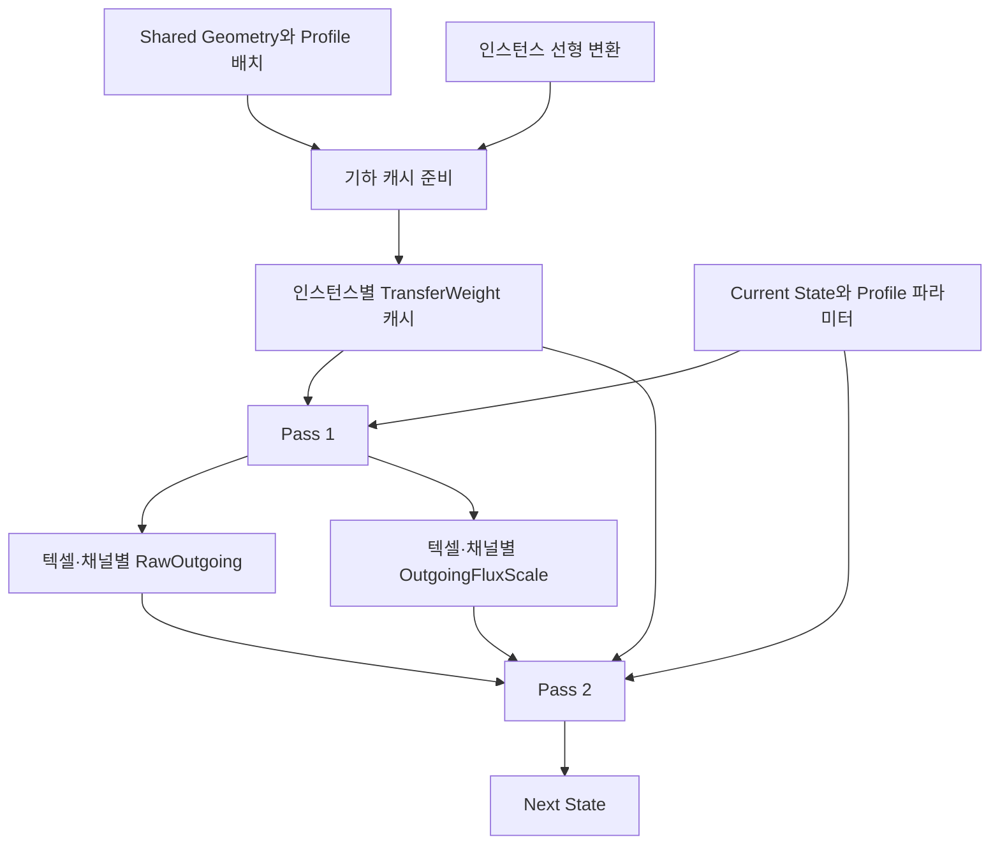
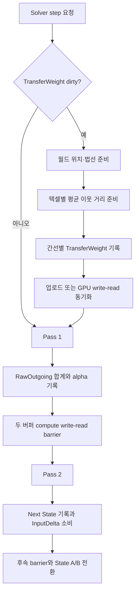

# Surface Solver Cache

상태: **구현 완료 · GPU 동등성/성능 측정은 미검증** · 근거: [[04_ADR/0017-Solver-Transfer-Cache|ADR 0017]], [[../05_Development/Notes/0003-Surface-State-GPU-Resource|Surface State GPU Resource]]

현재 Solver는 간선 가중치와 RawOutgoing 합계를 즉시 계산하고 재사용하지 않는다. 이 문서는 인스턴스별 TransferWeight 캐시와 Pass 간 RawOutgoing 재사용을 정의한다. 수식은 [[03_Architecture/0004_Surface-State-Update|Surface State Update]]를 유지한다.

## 소유권과 값의 수명



공유 Geometry는 Mesh 로컬 위치·normal과 texel별 `MesoVirtualHeight`를 보유한다. 각 instance transform을 적용해 월드 유효 위치를 만들며, 향후 동적 적층이 도입되면 그 Accumulation Geometry도 최신 값으로 합친다. DistanceWeight와 NormalWeight는 변형을 반영한 최신 유효 표면 위치와 normal에서 계산한다. transform이 instance마다 다르므로 캐시도 instance별이다. 채널 독립인 TransferWeight는 State 종류가 늘어도 크기가 늘지 않는다.

### 인스턴스별 지속 캐시

| 값 | 원소 타입·인덱스 | 갱신 조건 | 소비 위치 |
|---|---|---|---|
| TransferWeight | float32, `texel × 8 + slot` | 최초 생성, MesoVirtualHeight/AccumulationHeight를 반영한 유효 위치·normal revision, 이웃·Surface/Profile 배치, instance 선형 변환, weight 규칙 변경 | Pass 1/2 rawFlux |

### 인스턴스별 step 임시 결과

| 값 | 원소 타입·인덱스 | 갱신 조건 | 소비 위치 |
|---|---|---|---|
| RawOutgoing | float32, `texel × ChannelCount + channel` | 매 실행 step의 Pass 1 | Pass 2 자신의 outgoing 계산 |
| OutgoingFluxScale | 기존 float32, 동일 인덱스 | 매 실행 step의 Pass 1 | Pass 2 자신의 outgoing와 이웃 incoming 제한 |

invalid/unsupported texel-channel의 RawOutgoing과 alpha는 Pass 1에서 0으로 기록한다. RawOutgoing는 매 step 완전히 덮어쓰므로 매 frame 별도 clear하지 않는다. pause 중 합계는 오래된 중간값이며 재개/step의 Pass 1에서 갱신된 뒤에만 소비한다. reset 직후에도 다음 Pass 1 전에는 소비하지 않는다.

### 준비용 계산값

| 값 | 계산 | 수명 |
|---|---|---|
| Normal matrix | 인스턴스 선형 행렬의 inverse-transpose와 유효성 판정 | instance 선형 변환 또는 유효 형상 normal 갱신 시 한 번 |
| 월드 위치·법선 | 유효 displaced Position과 갱신 normal에 instance 변환 적용 | 캐시 준비 동안 재사용 |
| MeanNeighborDistance | 최신 유효 위치 기준, 유효한 최대 8개 이웃까지의 월드 거리 평균 | 텍셀당 한 번 계산해 간선 가중치 준비에 재사용 |

현재 cache builder는 CPU에서 공유 Geometry의 유효 local position `Position + Normal × MesoVirtualHeight`와 instance transform을 적용해 world position을 만들고, inverse-transpose로 world normal을 만든다. 텍셀마다 유효 이웃까지의 평균 거리를 한 번 구한 다음 슬롯별 TransferWeight를 만든다. CPU scratch는 WorldPositions, WorldNormals, MeanNeighborDistances, validity flags다. AccumulationHeight와 별도 동적 normal 갱신은 아직 런타임에 존재하지 않으므로 추가될 때 이 cache builder 입력과 invalidation을 연결해야 한다.

cache는 resource 생성 시 준비한다. `TSurfaceStateSystem::RecordStep`은 instance의 3×3 선형 transform이 이전 cache 생성 때와 달라졌는지 확인하고, dirty instance가 하나라도 있으면 Graphics queue를 idle시킨 뒤 해당 cache를 CPU에서 재생성해 host-visible buffer에 업로드한다. 순수 translation은 비교 대상이 아니므로 재생성하지 않는다. Geometry/topology/Profile ID layout 수정 경로가 생기면 `InvalidateTransferWeightCache`로 명시적으로 무효화해야 한다. 현재 매개변수 UI의 Profile 수치 변경은 index 배치를 바꾸지 않으므로 cache를 무효화하지 않는다.

## 준비와 Solver 실행



Pass 1은 현재 State로 각 유효 이웃의 RawFlux를 계산해 RawOutgoing buffer에 합계를 저장한다. 감쇠 후 가용량으로 기존 alpha를 계산한다. Pass 2는 저장된 합계로 outgoing을 구하고, incoming만 이웃→자신 방향의 rawFlux를 계산한다. 현재 TransferWeight 식은 양 endpoint를 바꾸어도 같은 값이므로 incoming flux는 현재 texel의 이웃 슬롯에 저장한 값을 사용한다. RawFlux 전체는 saturation/GeometryDrive 방향이 있어 대칭으로 취급하지 않는다.

```text
RawOutgoing_i = Σ RawFlux(i→j)                       // Pass 1
alpha_i = RawOutgoing_i > 0 ? min(1, Available_i / RawOutgoing_i) : 1
Outgoing_i = StoredRawOutgoing_i × alpha_i          // Pass 2
Incoming_i = Σ RawFlux(j→i) × alpha_j
Next_i = clamp(Current_i + InputDelta_i + Incoming_i - Outgoing_i - Decay_i,
               0, Capacity_i)
```

무효 Geometry, 거리 epsilon, 퇴화한 법선의 가중치 0 처리는 ADR 0016과 동일하다. dirty cache는 해당 buffer upload 뒤에만 dispatch한다. transform 변경에 따른 CPU overwrite 전 Graphics queue를 idle시켜 이전 GPU read 완료를 보장한다. Pass 1 뒤 alpha/RawOutgoing write→read barrier를 적용하고, Pass 2 이후 다음 step write 재사용을 위한 read→write dependency를 적용한다. 실제 descriptor binding은 [[0007_Surface-GPU-Data-Layout|Surface GPU Data Layout]]에 기재했다.

## Virtual Geometry 경계

현재 구현은 MesoVirtualHeight만 geometry scalar로 보유한다. AccumulationHeight의 instance별 저장·갱신은 미구현이며, 구현 후 해당 geometry revision도 cache dependency에 포함한다. DistanceWeight와 NormalWeight는 base Position/Normal이 아니라 현재 유효 형상을 사용한다. 유효 위치는 `BasePosition + BaseNormal × (MesoVirtualHeight + AccumulationHeight)`를 instance transform으로 변환한다. 유효 normal은 동적 Geometry 갱신 경로가 산출한 normal을 사용하고, instance inverse-transpose를 적용한다. GeometryDrive의 effective height와 방향도 이 최신 가상 형상 및 gravity를 사용한다.

TransferWeight cache는 현재 구현된 MesoVirtualHeight 또는 향후 AccumulationHeight가 갱신된 뒤 다시 만든다. 이 값들이 매 step 바뀌는 동적 적층에서는 cache preparation도 매 step 한 번 수행하며, 고정된 동안에는 재사용한다. Geometry update와 normal 생성 완료를 Solver cache preparation보다 앞에 두고, GPU 경로 사이의 write-read barrier를 보장한다. MesoVirtualHeight/AccumulationHeight와 중력은 TransferWeight에서의 역할이 다르다. 높이 변경은 유효 형상·가중치를 바꾸므로 cache dirty이고, 중력 변경은 GeometryDrive만 바꾸므로 TransferWeight cache를 무효화하지 않는다.

## 메모리와 예상 연산량

| 방안 | 선택 | 추가 payload | 갱신 조건 | 연산 상한 변화 |
|---|---|---|---|---|
| TransferWeight 캐시 | 구현 | 인스턴스당 48 MiB | 생성, 선형 transform 변경, 명시적 geometry invalidation | cache가 유지되는 동안 Solver 내 중첩 평균 거리 순회를 제거. CPU rebuild당 텍셀별 평균 거리 계산 1회 |
| RawOutgoing 저장 | 구현 | 인스턴스당 채널당 6 MiB | 매 step | rawFlux 상한 24→16회/텍셀·채널 |
| 간선별 Raw flux | 후속 검토 | 인스턴스당 채널당 48 MiB 및 역방향 조회 정보 | 매 step | 기존 대비 rawFlux 24→8회/텍셀·채널 |

가정은 6 Surface × 512×512, 이웃 8개, float32, 원소 padding 없음이다. 채널 수는 Registry에서 결정하며 데모 측정은 1채널이다. 선택한 두 버퍼의 추가 payload는 데모 인스턴스당 총 54 MiB이며 allocator alignment와 scratch를 제외한다. invalid 슬롯도 할당한다. 캐시 준비 시 최신 유효 위치로 평균 이웃 거리를 텍셀당 한 번 계산하고 간선 가중치를 최대 8개 계산한다. 지금은 MesoVirtualHeight만 cache 입력으로 사용하며 AccumulationHeight는 후속 Dynamic Geometry 구현이 제공할 때부터 같은 invalidation 규칙을 적용한다. 따라서 형상이 매 step 바뀌어도 rawFlux 호출 안에서 수행하던 endpoint별 평균 재순회는 캐시 준비의 텍셀당 1회 평균 계산으로 바뀐다. 모든 texel/neighbor가 valid인 소스 수준 상한이며 컴파일러 최적화나 실제 GPU 시간을 뜻하지 않는다.

가중치 캐시가 유효한 step에서는 준비 비용이 없다. 선형 transform이 매 step 달라지면 매 step CPU 준비와 queue idle 비용이 발생하므로 성능 측정에서 별도 보고해야 한다. 간선별 Raw flux 저장은 RawOutgoing 저장에 추가로 67%가 줄어드는 방식이 아니며, 기존 24회 대비 최종 8회가 되는 별도 후속 설계다. 이번 구현에서 baseline 대비 실제 GPU 시간이 얼마나 줄었는지는 아직 측정하지 않았다.

## 후속 최적화 후보: 대칭 TransferWeight의 공유 저장

현재 설계는 `texel × neighborSlot`마다 TransferWeight를 저장한다. 이웃 간선의 양방향 슬롯에 같은 값을 각각 보관하므로 payload 추정은 48 MiB다. 현재 TransferWeight 식은 양 endpoint를 바꾸어도 값이 같다. DistanceWeight는 endpoint 거리와 양 endpoint 평균 간격으로, NormalWeight는 법선 내적으로 계산하며, 현재 ProfileBoundaryWeight도 같은/다른 Profile 비교라 대칭이다. 따라서 `TransferWeight(A→B) = TransferWeight(B→A)`다.

후속 최적화에서는 하나의 무방향 간선당 가중치를 한 번 저장하고 두 방향 flux가 같은 값을 읽도록 할 수 있다. 단, RawFlux 자체는 포화도 차이와 GeometryDrive 방향 때문에 양방향에서 다를 수 있으므로 공유하지 않는다. 이 변경은 결과 수식은 유지하고 캐시 주소 표현만 바꾼다.

무방향 간선 배열에서 값을 찾는 edge mapping이 필요하다. 직접 32비트 간선 ID를 모든 이웃 슬롯에 추가하면 인덱스 버퍼가 커져 weight 절감분을 상쇄할 수 있다. 압축된 순번과 텍셀별 시작 offset은 가능한 주소 방식의 한 예이며, 현재 구현 계약이 아니다. 주소 계산 비용, 실제 유효 edge 수, 버퍼 크기, Solver GPU 시간을 측정한 뒤 이 방식을 적용할지 결정한다. 따라서 이번 브랜치에서는 방향별 슬롯 캐시를 사용하고, 무방향 공유 저장은 후속 최적화로 보류한다.

## 검증 계약

최적화 전후 동일 입력에서 Next State, RawOutgoing, alpha와 총 State를 허용 오차로 비교한다. invalid/unsupported, seam, 다른 Capacity/Profile, 큰 전달률, 비균일 scale, transform 변경, 가상 높이·중력 변경을 포함한다. 캐시 갱신 조건별 변경과 unchanged step의 재사용을 확인한다. 동일 build/device/scene/해상도/채널/State와 충분한 warm-up으로 GPU 시간의 반복 표본을 기록한다. cache 준비 시간과 steady-state 시간을 나누고 Validation 오류를 검사한다.
