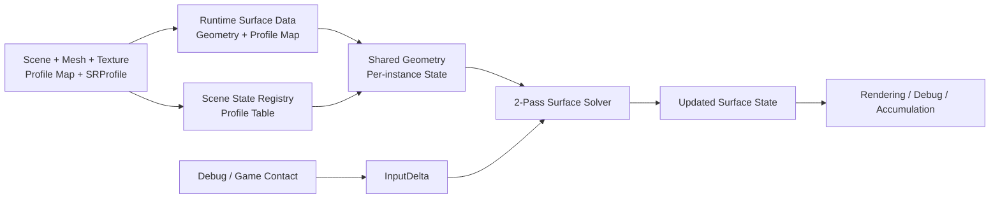
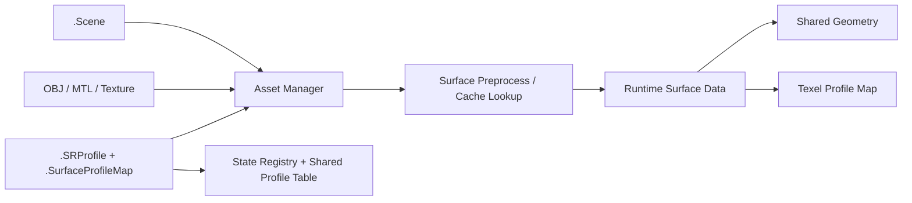
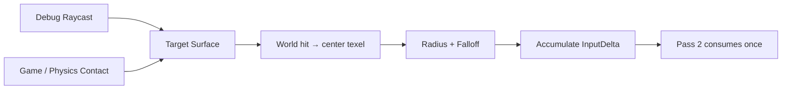
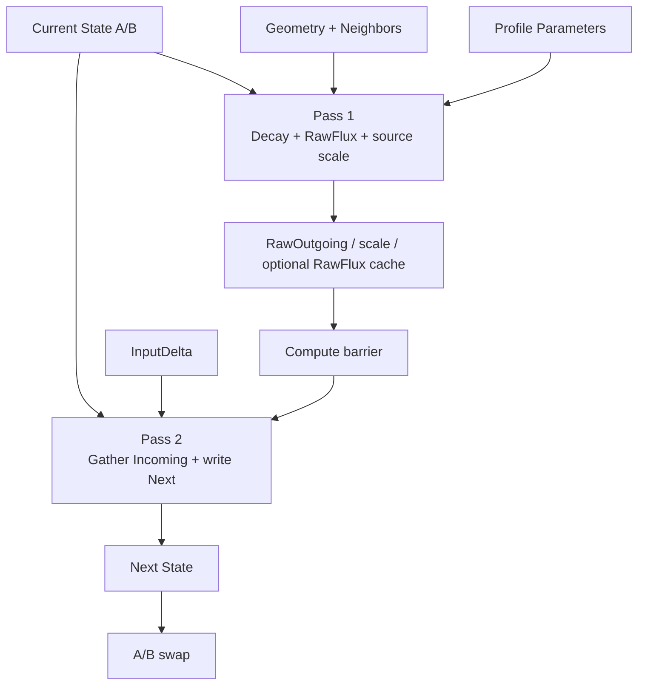
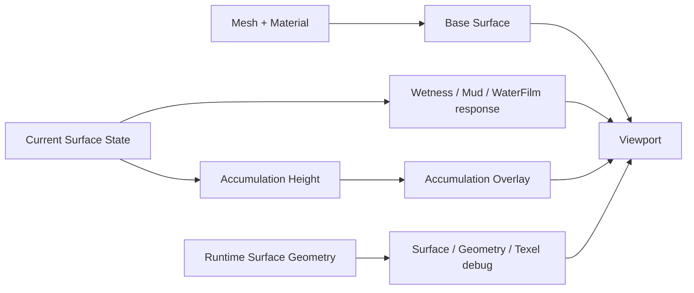

# System Flows

> **한 줄 요약:** Asset 로딩부터 Surface State 갱신과 Rendering까지의 전체 경로를 네 개의 짧은 흐름도로 연결한다.

이 문서는 **길찾기용**이다. 데이터의 정확한 의미와 수식은 각 Architecture 문서에서 정의한다.

## 전체 흐름

## Asset → Runtime Surface Data

- 파일과 Asset 연결: [[03_Architecture/0003_Assets-and-Profiles|Assets and Profiles]]
- 형상 전처리: [[03_Architecture/0004_Surface-Geometry|Surface Geometry]]
- GPU 소유 범위: [[03_Architecture/0007_Surface-GPU-Data-Layout|Surface GPU Data Layout]]

## Contact → InputDelta

세부 API와 실패 조건은 [[03_Architecture/0005_Surface-Input|Surface Contact Input]]에서 정의한다.

## Solver Step

갱신식과 시간 계약은 [[03_Architecture/0006_Surface-State-Update|Surface State Update]]를 기준으로 한다.

## State → Rendering

렌더링 계약은 [[03_Architecture/0008_Rendering|Surface State Rendering]], 조작 UI는 [[03_Architecture/0009_UI-Interface|UI Interface]]를 본다.
