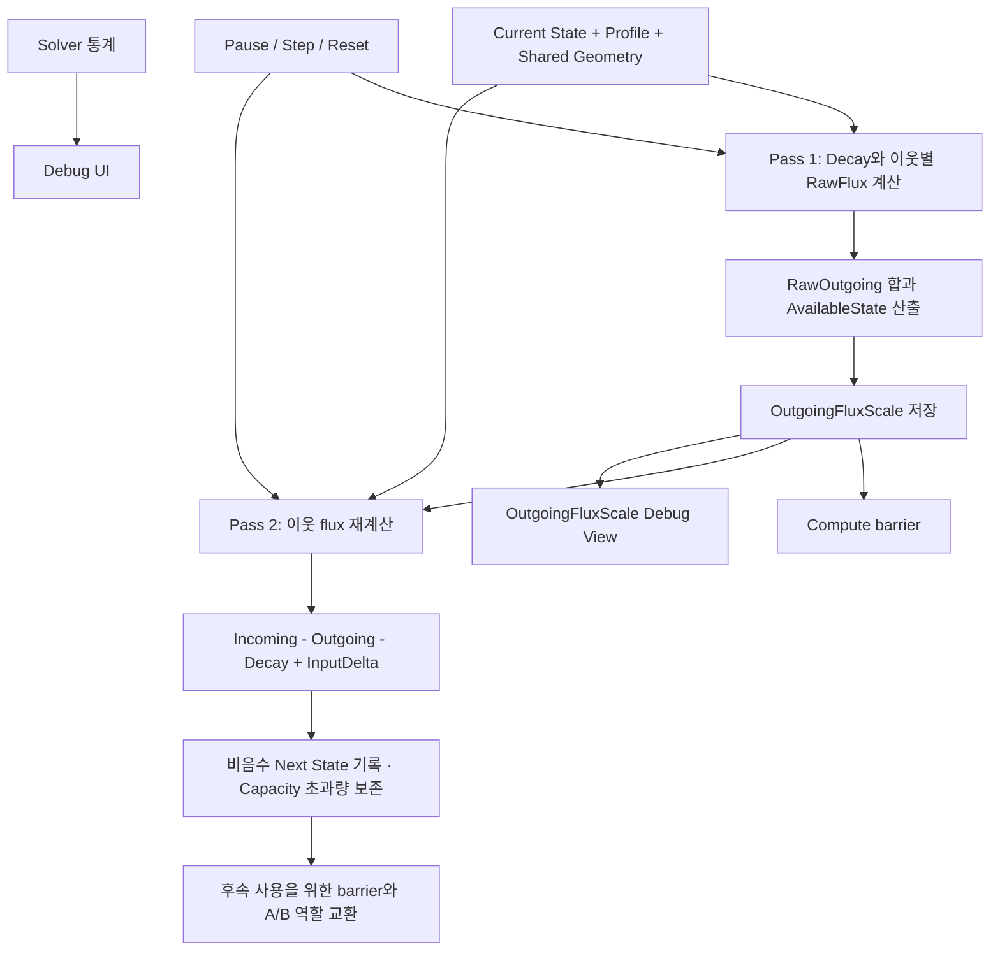
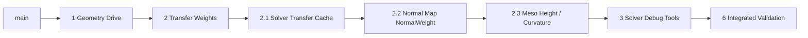

# 5주차 구현 상세 계획 — Solver 확장과 검증

> **한 줄 요약:** 4주차에 구축한 2-Pass Solver 경로를 바탕으로 Geometry 구동, Normal Map 기반 표면 방향, 이웃 전달 가중치를 추가하고, 계산 중간값과 실행 상태를 Debug UI에서 확인한다.

상태: **구현 중** · 상위 계획: [[03_Planning/01_Weekly-Overview/Week-05|Week 05 Overview]]

## 목표와 완료 기준

4주차에 구축한 2-Pass Solver 경로를 바탕으로 Geometry 구동, Normal Map 기반 표면 방향, 이웃 전달 가중치를 추가하고, 계산 중간값과 실행 상태를 Debug UI에서 확인한다. 수식의 보존·source 보유량 제한·초과량 처리·경계 처리를 자동 테스트와 GPU 실행으로 검증한다.

5주차 완료 시 다음을 재현할 수 있어야 한다.

- 같은 조건에서 Solver 결과가 반복 가능하고, 각 State 값이 finite·비음수이며 Capacity 초과 입력·유입량도 보존한다.
- Geometry 입력이 없는 상태에서는 기존 Saturation 전달 결과가 유지된다.
- Geometry 구동과 각 TransferWeight가 의도한 이웃 방향·Profile 경계에 영향을 준다.
- Normal Map의 방향 정보가 `NormalWeight`에 반영되고, 맵 부재 시 기본 Mesh normal 경로가 동작한다.
- Normal Map에서 복원한 `MesoVirtualHeight`가 위치에 반영되고, Curvature/Concavity 파생값이 정의된 입력·단위·범위 계약을 따른다.
- `Combined TransferWeight`, `DistanceWeight`, `NormalWeight`, `ProfileBoundaryWeight`를 Solver Debug 히트맵에서 구분해 확인할 수 있다.
- `OutgoingFluxScale`을 채널별로 화면에서 확인할 수 있다.
- Solver를 pause, 한 step 진행, 전체 State 초기화할 수 있고 실행 통계를 확인할 수 있다.
- Validation layer에서 새 동기화·descriptor 오류가 없으며, 지원되는 GPU 환경에서 GPU 테스트를 통과한다.

[[05_ADR/Simulation/0020-State-Overcapacity-Transport|ADR 0020]]에서 Capacity는 포화 기준량으로 변경했다. 아래 흐름·완료 기준은 새 계약이며 Saturation 상한과 Next Capacity clamp 제거는 구현했고 빌드는 통과했다. GPU 실행 검증은 대기 중이다. 기존 완료 기록은 이전 상한 계약의 결과이므로 새 계약 통과로 간주하지 않는다. Branch 6에는 초과 입력·유입·다음 step 후속 전달을 포함한다.

## 현재 기준선과 범위 경계

4주차에는 State A/B, OutgoingFluxScale, InputDelta GPU 리소스, 2-Pass compute dispatch와 barrier, ping-pong, Contact 입력 연결이 구현되었다. 따라서 이번 주에는 리소스 생성·descriptor 기본 구성·2-Pass 구조 자체를 다시 만들지 않는다.

현재 구현은 GeometryDrive, 네 가지 TransferWeight, TransferWeight 캐시, Normal Map 기반 `NormalWeight`, Normal Map에서 복원한 Meso 높이와 Curvature/Concavity 파생값을 포함한다. `ConcavityWeight`는 Decay의 cavity retention에 사용한다. Surface Debug에는 State Heatmap, Validity, Surface ID, Neighbor Count, UV Seam이 있고, Solver Debug에는 TransferWeight와 구성 가중치 히트맵이 있다. Branch 3 `feat/solver-debug-tools`에서 `OutgoingFluxScale` 뷰, Solver 제어·통계 UI 구현도 완료했다. Branch 2.1의 캐시 동등성·성능 검증과 Branch 2.3의 fixture/런타임 시각 검증은 아직 남아 있으며, 전체 통합 검증은 Branch 6에서 수행한다.

이번 계획에는 Normal Map의 tangent-space normal을 `NormalWeight`에 연결하는 Branch 2.2와 Normal Map에서 Meso height 및 Curvature/Concavity를 생성하는 Branch 2.3이 포함된다. 동적 Accumulation geometry와 State transition은 제외한다. Branch 2.3은 [[05_ADR/Simulation/0018-Normal-Map-Meso-Geometry|ADR 0018]]에서 graph least-squares 적분, scale, chart boundary, fallback과 곡률 정의를 결정했다. fixture 및 데모 검증이 남아 있다.

## 데이터 흐름

Pass 1/2의 바탕 구조는 유지한다. 이번 작업은 공통 flux 계산식과 전달 가중치, 관측 UI, 검증을 확장한다. Pass 1과 Pass 2는 같은 공통 함수를 사용해 계산이 어긋나지 않도록 한다.

## 작업 순서

### 0. 확정된 GeometryDrive 계약과 후속 weight 결정

GeometryDrive의 역할·높이차·방향 정렬·거리 소유권·단위는 [[05_ADR/Simulation/0015-Geometry-Driven-Transport|ADR 0015]]와 [[04_Architecture/0006_Surface-State-Update|Surface State Update]]에 확정했다. Branch 1은 이 계약을 구현하며 새 수식을 임의로 선택하지 않는다.

- `EffectiveHeight = MacroHeight + MesoVirtualHeight`를 instance transform이 반영된 world-length로 평가한다.
- `HeightDrive(i→j) = abs(EffectiveHeight_i - EffectiveHeight_j)`로 계산하며 neighbor distance로 나누지 않는다.
- 면에 투영한 gravity와 world-space neighbor 방향의 정렬도로 `DirectionDrive`를 구한다.
- 이웃 표면 거리의 효과는 `DistanceWeight`만 담당한다.
- `GeometryTransferRate`는 `State / (world-length · second)`다.

Branch 2에서 확정한 거리·법선·프로파일 경계 가중치 규칙은 ADR 0016을 따른다. Branch 2.2에서 Normal Map 샘플의 UV 기준, tangent-space에서 Solver world normal로의 변환, 맵 누락·비정상 샘플 fallback을 결정하고 구현한다. Branch 2.3에서 normal-to-height 적분 후보, 높이 기준/scale, non-integrable 오차 처리와 높이에서 Curvature/Concavity를 만드는 방법을 결정하고 구현한다. Timestep tolerance는 Branch 6의 비교 결과로 정한다. GPU ABI나 descriptor가 바뀌면 [[04_Architecture/0008_Surface-GPU-Data-Layout|Surface GPU Data Layout]] 및 관련 GPU resource note를 같은 브랜치에서 갱신한다.

### 1. 기존 Solver 기준 테스트 고정

현재 GPU 테스트의 입력 소비와 포화도 전달 결과를 기준선으로 유지한다. 이후 Geometry·Weight 경로를 켜고 끌 수 있는 작은 fixture를 추가해 기존 결과의 회귀 여부를 분리한다.

- GeometryDrive가 0인 경우 기존 saturation-only 테스트 결과가 바뀌지 않는다.
- Decay와 InputDelta를 제외한 전달에서 총 State가 보존된다.
- 입력이 없는 균일한 State는 saturation flux를 만들지 않는다.

### 2. GeometryDrive와 TransferWeight 적용

- 공통 GLSL 함수에서 SaturationDrive와 GeometryDrive를 각각 계산하고 합산한다.
- 이웃별 Distance/Normal/Curvature/Profile Boundary 가중치를 곱한 뒤 `DeltaTime`을 적용한다.
- Pass 1과 Pass 2가 동일한 계산 함수를 사용한다.
- 양쪽 texel 모두 해당 Registry State를 지원하는 경우에만 flux를 계산한다.
- invalid neighbor, unsupported State, 0 또는 비정상 geometry 값이 flux에 유입되지 않도록 경계 처리를 둔다.
- 어떤 Profile 입력이 필요한지 먼저 확정하고, 필요할 때만 CPU/GPU ABI·descriptor를 변경한다. 이미 존재하는 `GeometryTransferRate`와 geometry buffer를 우선 활용한다.

### 3. OutgoingFluxScale 디버그 뷰

`OutgoingFluxScale` buffer는 texel × State channel마다 `[0,1]` scalar 하나를 저장한다. Solver 수식에서 이 값은 alpha처럼 유출량 제한 비율로 사용된다. 1이면 제한이 없고, 0에 가까울수록 Pass 1에서 계산한 outgoing을 더 크게 제한한다.

- Surface Debug 뷰 목록에 `Outgoing Flux Scale`을 추가한다.
- 현재 State Heatmap처럼 Registry에서 채널 하나를 선택해 해당 채널의 scale 값을 표시한다.
- Surface Debug fragment shader가 기존 graphics descriptor set의 binding 10에서 instance별 OutgoingFluxScale buffer를 읽는다. Descriptor layout은 이미 fragment stage visibility를 포함한다.
- 색상은 `0–1`의 의미를 보여주는 단순한 연속 ramp로 표시하고 범례와 양 끝의 의미를 UI에 적는다. State saturation heatmap과 혼동되지 않도록 라벨을 분리한다.
- valid/unsupported/invalid 표시는 기존 Surface Debug view의 규칙과 일관되게 처리한다.

### 4. Solver 제어와 통계 UI

기존 UI의 Surface Debug 그룹 아래에 Solver 섹션을 둔다. 화면 렌더링과 Contact 입력 UI는 계속 동작하고 Solver step만 제어한다.

| 항목 | 동작 계약 |
|---|---|
| Pause | 켜져 있으면 Solver dispatch와 A/B 역할 교환을 멈춘다. 제출된 접촉 입력은 다음 실행 step이 소비할 수 있도록 보존한다. |
| Step | 일시 정지 상태에서 현재 프레임의 `DeltaTime`으로 Solver를 정확히 한 번 실행하고 역할을 한 번 교환한다. |
| Reset State | 모든 simulated instance의 State A/B와 InputDelta를 0으로 만들고, OutgoingFluxScale은 지원 채널에서 중립값 1(제한 없음), invalid/unsupported 위치에서 0으로 초기화한 뒤 현재 State 역할을 A로 되돌린다. 이미 대기 중인 CPU Contact 입력도 비운다. 요청 직전에 graphics queue를 idle로 만든 뒤 host-visible buffers를 초기화한다. |
| Texel 통계 | Scene에서 Solver가 관리하는 instance별 texel 수를 합산하고, valid texel 수와 valid 비율을 표시한다. 공유 Geometry는 instance마다 State가 별도이므로 Solver 작업량 통계에는 instance마다 포함한다. |
| Ping-pong 상태 | 다음 step이 읽을 Current buffer가 A인지 B인지 표시한다. |
| 최근 GPU Solver 시간 | GPU timestamp query로 가장 최근 완료된 Solver step의 시간을 표시한다. 선택된 장치/compute queue가 timestamp를 지원하지 않으면 CPU 시간을 GPU 시간으로 오인해 표시하지 말고 `N/A`로 나타낸다. |

Reset은 매 frame 초기화하지 않고 사용자가 명시적으로 눌렀을 때만 수행한다. pause 중 입력은 누적되며, Step 또는 재개 후 첫 Solver update에서 한 번 소비된다.

### 5. 검증과 기록

| 검증 | 확인 사항 |
|---|---|
| 균일 상태 | 동일 saturation의 이웃 사이 saturation-driven flux가 0이다. GeometryDrive를 켠 경우 geometry에 의한 예상 이동만 발생한다. |
| 단일 source / 보존 | decay와 input을 끈 fixture에서 이웃으로 퍼지고 총량이 허용 오차 안에서 보존된다. |
| Capacity 차이 | 절대 State가 같고 Capacity가 다를 때 saturation 차이 방향으로 flux가 난다. |
| Outgoing 제한 | 큰 transfer rate와 `DeltaTime`에서도 outgoing 합이 Decay 후 가용량을 넘지 않는다. `OutgoingFluxScale`이 계산한 제한과 일치한다. |
| Geometry 방향 | 높이와 gravity를 반전한 fixture에서 전달 방향도 예상대로 반전되거나 0이 된다. |
| 각 TransferWeight | 각 가중치를 독립적으로 0/1 또는 기준값에 두어 어떤 이웃 flux를 억제하는지 확인한다. |
| Profile 경계 | 같은 Profile 내부와 Profile 경계를 가로지르는 flux가 결정한 규칙을 따른다. |
| invalid / seam / dynamic channel | invalid texel에 State가 남지 않고, seam 이웃 및 Registry channel 수가 달라도 기존 계약을 유지한다. |
| timestep | 같은 총 시간의 `1/30`과 `1/60` 결과 차이를 기록한 허용 오차와 비교한다. |
| Debug controls | pause 중 값과 Current buffer가 변하지 않고, Step 한 번은 한 update만 하며, Reset 뒤 State와 입력이 0이고, OutgoingFluxScale은 지원 채널에서 1·invalid/unsupported 위치에서 0이며 Current가 A다. |
| GPU timing / validation | timestamp 지원 여부, 최근 측정값, Vulkan validation 결과를 실행 환경과 함께 기록한다. GPU를 사용할 수 없는 환경의 test skip은 실패와 구분해 보고한다. |

GPU 테스트는 기존 `SurfaceGPUResourceTests` 경로를 확장한다. 화면 스크린샷만으로 수식 정확성을 판정하지 않는다. 수식별 작은 GPU fixture를 우선하고, 실제 Demo Scene은 UI 통합과 시각 확인에 사용한다.

## 브랜치 순서와 상세 문서

기본적으로 각 브랜치는 앞 브랜치의 결과를 기준으로 생성한다. 성능 Branch 2.1은 `perf/solver-transfer-cache`에서 완료됐다. Normal Map 직접 방향 반영 Branch 2.2는 캐시 구현 뒤 생성하고, Meso geometry 복원 Branch 2.3은 Branch 2.2 결과를 기준으로 생성한다. 동시에 여러 브랜치를 미리 파지 않는다. 각 단계는 빌드 가능한 상태를 유지하며, 해당 단계의 테스트를 함께 추가한다.

| 순서 | 브랜치 | 결과물 |
|---:|---|---|
| 1 | `feat/solver-geometry-drive` | GeometryDrive 식·단위 확정, 구현 및 방향 테스트 |
| 2 | `feat/solver-transfer-weights` | 네 TransferWeight 식과 flux 적용·경계 테스트 |
| 2.1 | `perf/solver-transfer-cache` | TransferWeight 캐시와 RawOutgoing 합계 재사용·성능 검증 |
| 2.2 | `feat/solver-normal-map-weights` | Normal Map 방향을 NormalWeight에 연결하고 fallback·cache 갱신 검증 (구현 완료) |
| 2.3 | `feat/solver-meso-geometry` | Normal Map에서 MesoVirtualHeight 및 Curvature/Concavity 생성 (구현 완료, fixture/runtime 시각 검증 대기) |
| 3 | `feat/solver-debug-tools` | OutgoingFluxScale view, pause/step/reset, texel·valid·A/B·GPU 시간 통계 (구현 완료) |
| 6 | `test/solver-week5-validation` | timestep/회귀/통합 검증과 결과 기록 (미착수) |

### 설계 결정 선행 조건

Branch 1의 HeightDrive/DirectionDrive 분리, height 차이에서 neighbor distance를 나누지 않는 규칙, instance transform이 반영된 중력 투영은 [[03_Planning/02_Weekly-Details/Week-05/0001_Branch-Solver-Geometry-Drive|Branch 1 계획]]에 확정했다. DistanceWeight의 구체식과 나머지 TransferWeight는 Branch 2에서 정한다. Timestep tolerance는 Branch 6의 비교 결과로 설정한다. GPU ABI나 descriptor가 바뀌면 [[04_Architecture/0008_Surface-GPU-Data-Layout|Surface GPU Data Layout]] 및 관련 GPU resource note를 같은 브랜치에서 갱신한다.

### 브랜치별 상세 계획

- [[03_Planning/02_Weekly-Details/Week-05/0001_Branch-Solver-Geometry-Drive|1. Solver Geometry Drive]]
- [[0002_00_Branch-Solver-Transfer-Weights|2. Solver Transfer Weights]]
- [[03_Planning/02_Weekly-Details/Week-05/0002_01_Branch-Solver-Transfer-Cache|2.1. Solver Transfer Cache]]
- [[03_Planning/02_Weekly-Details/Week-05/0002_02_Branch-Solver-Normal-Map-Weights|2.2. Solver Normal Map Weights]]
- [[03_Planning/02_Weekly-Details/Week-05/0002_03_Branch-Solver-Meso-Geometry|2.3. Solver Meso Geometry from Normal Map]]
- [[03_Planning/02_Weekly-Details/Week-05/0003_Branch-Solver-Debug-Tools|3. Solver Debug Tools (기존 Branch 3·4·5 통합)]]
- [[03_Planning/02_Weekly-Details/Week-05/0006_Branch-Solver-Week5-Validation|6. Solver 통합 검증]]

## 참고 문서

- [[03_Planning/01_Weekly-Overview/Week-05|Week 05 Overview]]
- [[04_Architecture/0006_Surface-State-Update|Surface State Update]]
- [[06_Development/Notes/0002_Next-State-Calculation|Next State 계산 메모]]
- [[06_Development/Notes/0003_Surface-State-GPU-Resource|Surface State GPU Resource]]
- [[06_Development/Experiments/0000_Solver-Pass-Comparison|Solver Pass 비교]]
- [[07_Testing/0000_Testing-Guide|Testing Guide]]
