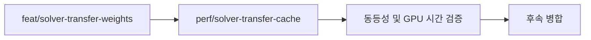

# Branch 2.1 — Solver Transfer Cache

> **한 줄 요약:** 반복되는 이웃 TransferWeight와 RawOutgoing 계산 결과를 재사용하도록 Solver 캐시를 추가한다.

브랜치: `perf/solver-transfer-cache`  
분기 기준: 현재 `feat/solver-transfer-weights`의 HEAD  
상태: **브랜치 생성 · 구현 완료 · 성능/런타임 검증 대기**
관련 설계: [[05_ADR/0017-Solver-Transfer-Cache|ADR 0017]], [[04_Architecture/0007_Simulation-Optimization|Simulation Optimization]]

## 목표

Branch 2의 전달 수식을 유지하며 중복 Geometry 계산과 Pass 2의 유출 합계 재계산을 제거한다. 구현은 `perf/solver-transfer-cache`에서 진행한다. 커밋·merge는 별도 요청 전에는 하지 않는다.

## 확정 범위와 갱신 조건

| 항목 | 구현 | 갱신 조건 |
|---|---|---|
| 인스턴스별 TransferWeight 버퍼 | 채택 | 최초 생성, 현재 MesoVirtualHeight 및 향후 AccumulationHeight를 반영한 유효 위치·normal revision, 이웃·Surface/Profile 배치, 인스턴스 선형 변환, weight 규칙 변경 |
| 텍셀·채널별 RawOutgoing 버퍼 | 채택 | 매 Solver step의 Pass 1에서 덮어쓰기 |
| 간선별 Raw flux 버퍼 | 보류 | 후속 채택 시 매 Solver step |
| GeometryDrive 캐시 | 제외 | 기존 경로에서 최신 Virtual Height·중력·변환을 사용 |

현재 구현은 instance의 3×3 선형 transform 변경을 dirty로 처리하며 순수 translation은 cache를 유지한다. Profile 수치 파라미터 편집과 State/InputDelta 변경은 TransferWeight를 무효화하지 않는다. Profile ID 배치나 유효 Geometry가 바뀌는 미래 경로는 명시적 invalidation을 호출해야 한다.

## 작업 순서

1. **구현 완료:** CPU cache builder가 현재 MesoVirtualHeight를 위치에 반영하고 Mesh geometric normal을 world space로 변환해 텍셀당 MeanNeighborDistance와 TransferWeight를 생성한다. 현재 cache는 Normal Map 방향을 사용하지 않는다. Branch 2.2에서 Normal Map 기반 normal 입력을 붙이고 해당 데이터가 바뀔 때 cache를 무효화한다. AccumulationHeight와 동적 normal 입력은 해당 런타임 구현 때 연결한다.
2. **구현 완료:** instance별 TransferWeight float32 buffer, binding 14, 선형 transform dirty 갱신 및 업로드를 추가했다. cache 갱신 전 Graphics queue idle을 보장한다.
3. **구현 완료:** RawOutgoing float32 texel-major buffer, binding 15를 추가했다. Pass 1에서 매 step 저장하고 Pass 2에서 outgoing 합계를 재사용한다.
4. **구현 완료:** invalid/unsupported 항목은 RawOutgoing과 alpha에 0을 쓴다. Pass 간 및 다음 step 재사용 barrier를 추가했다.
5. **구현 완료:** GPU Layout·resource note에 binding, payload, scratch 및 갱신 계약을 기록했다.
6. **미검증:** 기존 uncached 기준과 동등성/GPU 시간 baseline, 런타임 Vulkan validation, virtual geometry/Profile/topology invalidation 흐름은 별도 검증 대상으로 남는다.

## 예상 비용

가정: 6 Surface × 512×512, float32 4 byte, 이웃 8개 방향 이웃, 원소 padding 없음, 인스턴스별 소유. weight 48 MiB + 채널당 합계 6 MiB의 payload가 추가된다. 데모 1채널에서는 54 MiB이며 scratch/할당 overhead는 별도다. rawFlux 호출 상한은 24→16회로 줄고, 캐시 유효 시 평균 거리용 중첩 순회는 없어지며 실제 실행 시간 개선율은 측정한다.

## 검증과 완료 조건

- 기존 GPU fixture 및 동일 입력의 uncached/cached State·RawOutgoing·alpha·총량을 비교한다. tolerance는 실제 부동소수점 차이를 근거로 기록한다.
- invalid/unsupported, seam, Profile 경계, Capacity 차이, 큰 rate/DeltaTime과 동적 Registry 채널 수를 검증한다.
- 선형 transform·비균일 scale과 현재 MesoVirtualHeight 변경과 향후 AccumulationHeight 변경 때 유효 위치·normal에 따른 cache 갱신을 확인한다. 중력만 변경하면 TransferWeight cache는 재사용하면서 GeometryDrive가 새 중력을 반영하는지 확인한다. 동적 Geometry 업데이트가 매 step인 경로는 매 step 준비 비용을 측정한다.
- Branch 2.2에서 Normal Map 내용 또는 해당 texel mapping/tangent frame이 바뀌면 cache가 갱신되고, Profile 파라미터 편집처럼 Normal Map과 무관한 변경은 cache를 불필요하게 갱신하지 않는지 확인한다.
- GPU 사용 중 CPU overwrite, descriptor와 barrier 오류가 없도록 Validation으로 확인한다.
- 동일 환경에서 준비 비용과 steady-state Solver GPU 시간을 반복 측정해 전후 결과, payload/scratch peak memory를 기록한다. 매 step 변환이 달라지는 경우도 별도 측정한다.
- 수식 동등성과 새 Validation 오류 없음, 중첩 평균 거리 순회 제거, Pass 2 outgoing 재계산 제거, 측정 결과 문서화를 완료 조건으로 삼는다.

## 제외 범위

Surface/재료 통합, Simulation 해상도 변경, 간선별 Raw flux 저장은 이번 브랜치에서 구현하지 않는다.

## 브랜치 관계

기존 주차 순서의 예외로 Branch 2를 main에 먼저 병합하지 않고 현재 HEAD에서 직접 분기한다. 기존 미커밋 변경은 작업 트리에 유지되며 새 브랜치를 만든 것만으로 parent commit에 저장되지 않는다.
