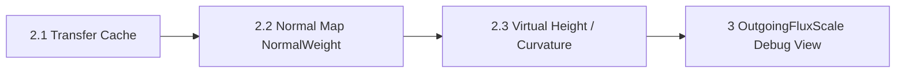

# Branch 2.2 — Solver Normal Map Weights

> **한 줄 요약:** Simulation texel별 Normal Map 방향을 TransferNormal으로 변환해 NormalWeight에 사용한다.

브랜치: `feat/solver-normal-map-weights`
선행 조건: Branch 2.1의 TransferWeight cache가 포함된 최신 작업 HEAD
상태: **구현 및 로컬 검증 완료 · 라이브 에셋 핫리로드는 미지원**
관련 설계: [[05_ADR/Simulation/0016-Transport-Transfer-Weights|ADR 0016]], [[04_Architecture/0007_Surface-Solver-Cache|Surface Solver Cache]], [[06_Development/Experiments/0001_Normal-Map-Integration|Normal Map Integration 실험]]

## 목표

현재 `NormalWeight`는 Mesh의 geometric normal만 사용한다. Material의 Normal Map이 표현하는 표면 방향도 TransferWeight 계산에 반영해, 미세한 표면 방향 차이가 이웃 간 전달을 낮추도록 한다.

이 branch에서 다루는 것은 **Normal Map normal을 `NormalWeight` 입력으로 연결하는 것**이다. Normal Map을 적분해 `MesoVirtualHeight`나 곡률을 복원하는 문제와 Non-Integrable 입력 fallback은 [[03_Planning/02_Weekly-Details/Week-05/0002_03_Branch-Solver-Meso-Geometry|Branch 2.3]]에서 다룬다.

## 구현 전 기준 동작

1. 텍셀마다 Mesh의 geometric normal을 읽는다.
2. 인스턴스 inverse-transpose 행렬로 world normal을 만든다.
3. 이웃 world normal의 내적을 `clamp(dot(N_i, N_j), 0, 1)`로 계산해 `NormalWeight`로 사용한다.
4. Distance 및 Profile 경계 가중치와 곱한 결과를 인스턴스 TransferWeight cache에 저장한다.

현재 경로는 Material Normal Map과 texel의 UV/tangent frame을 읽지 않는다.

## 선택한 계약

| 항목 | 계약 |
|---|---|
| 입력 좌표 | Simulation UV가 기준이다. Mapping 단계에서 각 Simulation texel에 이미 대응된 triangle과 barycentric 좌표로 mesh의 Material UV를 보간해 Normal Map sample 좌표를 얻는다. 별도의 두 번째 UV-to-texel 검색은 하지 않는다. |
| 샘플링 | CPU 전처리에서 선형 필터와 repeat 주소 지정을 적용한다. GPU material sampler와 같은 설정을 쓴다. |
| tangent 변환 | texel triangle의 barycentric 좌표로 tangent를 보간하고 texel normal에 직교화한다. 보간한 tangent handedness로 bitangent 부호를 정한 뒤, tangent-space sample을 mesh-local transfer normal로 변환한다. |
| `NormalWeight` | 기존 `clamp(dot(N_i, N_j), 0, 1)` 식을 유지한다. 입력 normal은 Normal Map에서 복원한 transfer normal을 우선 사용하고, instance inverse-transpose로 world 변환한다. |
| Map 누락·오류 | Normal Map이 없는 Material, invalid sample, 퇴화 tangent frame은 texel geometric normal을 사용한다. |
| 소유권과 cache | map에서 만든 texel transfer normal은 Mesh가 공유하는 CPU geometry 전처리 결과다. instance별 world normal과 최종 TransferWeight는 기존 cache 생성 시 계산한다. map/UV/tangent 변경은 공유 전처리 데이터와 그에 의존하는 instance cache를 다시 만들 때 반영한다. 현재 자산은 load 시 고정된다. |

Normal Map의 map normal을 `NormalWeight`에 직접 사용한다. Normal Map 적분으로 높이를 복원하고 변형 surface normal을 만드는 경로는 별도 [[03_Planning/02_Weekly-Details/Week-05/0002_03_Branch-Solver-Meso-Geometry|Branch 2.3]]에서 다룬다. 이 branch는 두 경로를 혼합하지 않는다.

## 구현 순서 및 결과

1. [x] Simulation texel mapping의 triangle/barycentric 정보, mesh Material UV와 tangent frame을 사용해 Normal Map sample을 CPU 전처리한다.
2. [x] sample tangent-space normal을 mesh-local transfer normal로 바꿔 shared CPU geometry에 보관한다. 사용할 수 없는 입력은 geometric normal fallback 표식으로 남긴다.
3. [x] cache 생성 시 transfer normal을 instance inverse-transpose로 world 변환하고 기존 dot/clamp `NormalWeight`에 연결한다.
4. [x] Surface Debug 아래 Solver Debug의 `NormalWeight` 히트맵과 GPU fixture에서 map normal이 flux에 반영되는 것을 확인한다.
5. [x] map이 없는 경우의 geometric normal fallback을 fixture로 확인하고 Architecture, ADR, 실험 문서에 계약을 반영한다.

## 검증

- 평탄 normal map은 geometric-normal-only 경로와 같은 NormalWeight를 만든다.
- 이웃 방향이 달라지는 normal map은 해당 경계에서 NormalWeight 및 flux를 예상 방향으로 낮춘다.
- tangent handedness, mirrored UV, UV seam, map 경계, 서로 다른 texel density를 fixture에 포함한다.
- invalid sample와 퇴화 tangent에서 값이 finite `[0,1]` 범위에 있고 geometric normal fallback이 적용된다.
- Normal Map/UV/tangent가 바뀌어 전처리 geometry를 재생성하면 해당 instance cache도 그 결과로 다시 만들어진다. 관련 없는 Profile 수치 변경은 cache를 재생성하지 않는다.
- map 없는 기존 데모와 GPU fixture의 동작을 회귀 확인한다.
- CPU texture sample/normal 전처리 비용, 추가 메모리, cache rebuild 시간을 기록한다.

## 검증 결과

2026-09-27 로컬 Apple M1 환경에서 다음을 확인했다.

| 검증 | 결과 |
|---|---|
| CPU Normal Map 전처리 fixture | 통과 — flat/tilted normal, barycentric UV, 서로 다른 UV chart, repeat 주소 지정, tangent handedness, 퇴화 tangent와 잘못된 입력 fallback을 확인했다. |
| GPU TransferWeight/flux fixture | 통과 — Normal Map에서 만든 endpoint normal이 캐시 `NormalWeight`와 실제 Solver flux에 반영되고, Map normal이 없는 texel은 geometric normal로 대체되는 것을 확인했다. |
| 전체 CTest | 통과 — 5/5 테스트. |
| 전체 빌드 | 통과 — `MDSS` 및 관련 테스트 target. |
| 데모 런타임 | 통과 — `--frames 1` 정상 종료. BrickCube의 1,572,864개 Simulation texel에서 Normal Map transfer normal 전처리를 확인했다. |
| Vulkan validation | 오류 없음. Best-practice 경고는 남아 있다: 작은 GPU 할당의 suballocation 권고와 transient depth attachment 권고. |
| 관련 런타임 주의 | Bunny mapping이 eight-neighbor 제한 때문에 34개 bidirectional UV seam link를 버렸다는 기존 경고가 있다. 이는 Normal Map 전처리 실패나 Vulkan 오류가 아니며, 이 branch에서 변경하지 않았다. |

현재 AssetManager는 Normal Map/UV/tangent 입력을 asset load 시 고정해 Runtime Surface geometry를 만든다. 런타임 중 파일 변경을 감지하는 hot reload/revision 시스템은 없다. 자산을 다시 load해 Runtime Surface geometry와 instance GPU resource를 재생성할 때 새 Normal Map 결과가 새 TransferWeight cache에 반영된다. Hot reload 지원과 revision별 자동 무효화는 별도 후속 범위다.

## 완료 조건

- [x] Simulation UV 대응, tangent frame 입력 계약과 fallback이 문서화되고 CPU fixture로 확인된다.
- [x] 현재 asset load 수명 안에서 precomputed transfer normal을 instance TransferWeight cache에 반영한다. Live hot reload/revision tracking은 별도 범위다.
- [x] NormalWeight debug view가 있고 GPU flux fixture에서 Normal Map normal 반영을 확인한다.
- [x] 전체 build, 관련 GPU 테스트와 현재 지원 장치(Apple M1)의 Vulkan validation 결과를 기록한다.
- [x] Architecture와 ADR 계약이 구현 경로와 일치한다.

## 제외 범위

- Normal Map 적분을 통한 MesoVirtualHeight 복원 (Branch 2.3)
- Curvature/Concavity 생성
- Non-Integrable Normal Map의 높이 복원 fallback
- 동적 Accumulation geometry

## 브랜치 흐름

