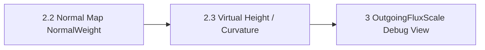

# Branch 2.3 — Solver Virtual Meso Geometry from Normal Map

> **한 줄 요약:** Normal Map 방향을 적분해 MesoVirtualHeight와 곡률·오목도 파생 데이터를 생성한다.

브랜치: `feat/solver-meso-geometry`
선행 조건: Branch 2.2의 Normal Map texel sampling 및 tangent 입력 계약
상태: **구현 완료 · fixture/runtime 시각 검증 미실시**
관련 설계: [[04_Architecture/0004_Surface-Geometry|Surface Geometry]], [[04_Architecture/0006_Surface-State-Update|Surface State Update]], [[06_Development/Experiments/0001_Normal-Map-Integration|Normal Map Integration 실험]]

## 목표

Normal Map에 저장된 tangent-space 표면 방향을 이용해 texel별 `MesoVirtualHeight`를 복원하고, 그 결과로 유효 위치와 Curvature/Concavity 파생값을 생성한다. 결과는 Macro Mesh를 대체하지 않고 기존 표면 위의 미세 geometry 입력으로 사용한다.

Branch 2.2의 직접 Normal Map `NormalWeight` 입력과 역할을 나눈다.

- Branch 2.2: map normal 방향을 이웃 간 전달 가중치에 직접 사용한다.
- Branch 2.3: map normal을 slope field로 보고 일관된 height field 및 파생 geometry를 복원한다.

## 복원 절차 후보

Tangent-space normal `n=(n_x,n_y,n_z)`에서 `n_z`가 유효한 texel은 UV 기준 slope를 `p=-n_x/n_z`, `q=-n_y/n_z`로 계산할 수 있다. 이 slope field를 height gradient로 보고 적분해 `MesoVirtualHeight`를 만든다. 실제 식에는 UV 방향, texel spacing, tangent frame과 height scale을 반영해야 한다.

Normal Map은 noise, bake 오차 또는 비적분 가능 성분을 가질 수 있다. 경로마다 높이가 달라지는 경우가 있어 적분법과 fallback을 이 branch에서 결정한다.

| 후보 | 장점 | 위험 / 비용 |
|---|---|---|
| 경로 누적 적분 | 구현이 단순하고 소규모 진단에 적합 | 적분 경로에 따라 결과가 달라지고 오차가 누적된다. |
| Least-squares / Poisson 적분 | 전체 slope 오차를 줄이고 경로 편향을 완화한다. | boundary 조건, 기준 높이, 해법과 수렴 조건이 필요하다. |
| 정규화된 근사 높이 | 빠르게 Virtual Height offset을 만들 수 있다. | 실제 높이와 단위가 보장되지 않으며 scale 보정이 필요하다. |

채택안은 **mesh-local 이웃 길이에서 edge별 signed height difference를 만들고, connected texel graph 전체에서 PCG least-squares height field를 구하는 방식**이다. component별 내부 기준 texel을 pin한 뒤 component mean을 0으로 이동한다. Non-Integrable 입력도 가장 가까운 least-squares height로 유지하고 relative edge residual을 기록한다. invalid/급경사 normal sample은 해당 texel을 높이 0으로 두고 적분에서 제외한다. 수식 및 상수는 [[05_ADR/0018-Normal-Map-Meso-Geometry|ADR 0018]]을 따른다.

## 결정할 계약

| 항목 | 결정 |
|---|---|
| 입력 좌표 | Simulation texel의 triangle/barycentric UV를 사용해 Normal Map을 sample한다. |
| 높이 scale | edge 방향 slope에 mesh-local projected edge length를 곱한다. height 결과는 mesh-local 길이이며 별도 authoring scale은 없다. |
| 경계와 seam | 기존 neighbor graph를 그대로 사용한다. graph component마다 별도 gauge를 두고 component mean height를 0으로 정규화한다. mapping graph가 연결하지 않은 seam은 높이 연속을 강제하지 않는다. |
| Non-Integrable | PCG least-squares 결과를 유지하고 edge relative RMS mismatch를 로그로 남긴다. high residual도 자동 거부하지 않는다. |
| Curvature | 높이 이웃을 국소 quadratic fit해 signed mean curvature와 Gaussian curvature를 생성한다. 단위는 각각 `1/length`, `1/length²`다. |
| Concavity | `ConcavityWeight = clamp(H × meanProjectedNeighborSpacing, 0, 1)`. 양의 H를 cavity로 보며 Decay만 읽는다. 평탄·볼록은 0이다. |
| Normal | Virtual Height의 국소 미분으로 생성한다. fit이 부족/특이하면 TransferNormal, 그것도 없으면 macro Normal을 사용한다. |
| 저장 및 cache | CPU shared Geometry가 height, mean/Gaussian curvature, ConcavityWeight, MesoNormal을 보유한다. GPU GeometryScalar는 4 float로 확장하고 MesoNormal은 별도 vec4(binding 17)로 올린다. Normal/height 결과 변경은 instance별 TransferWeight cache를 갱신한다. |
| CurvatureWeight | `1.0` 유지. 생성된 곡률은 Transport에 연결하지 않으며, ConcavityWeight와 역할을 분리한다. |

CurvatureWeight와 ConcavityWeight는 별도 역할이다. CurvatureWeight는 중립값 `1.0`으로 유지한다. `NormalWeight`가 이웃의 유효 normal 차이를 이미 반영하므로, 방향별 곡률로 전달 감쇠를 더하면 같은 굽힘 효과를 중복할 수 있기 때문이다. 이 branch에서 Virtual Height-derived Curvature를 생성하더라도 이를 TransferWeight에 연결하지 않는다. Normal Map normal을 반영한 `NormalWeight`만 쓴 결과와 비교해 곡률 항의 독립적인 이득이 확인되면 후속 설계에서 재검토한다. `ConcavityWeight`는 기존 Decay 계약의 cavity retention에만 사용하며, 해당 입력의 부호·범위를 명시한다.

## 구현 순서

1. 평탄·볼록·오목·노이즈·Non-Integrable Normal Map synthetic fixture와 실제 texel/UV fixture를 준비한다.
2. [x] Simulation UV로 sample한 Normal Map을 mesh-local normal로 만들고 neighbor graph의 signed edge height delta로 변환한다.
3. [x] component mean-zero gauge, PCG least-squares 적분과 invalid normal fallback을 구현한다.
4. [x] `MesoVirtualHeight`, MesoNormal, mean/Gaussian curvature와 ConcavityWeight를 shared geometry 전처리에 생성한다.
5. [x] height/normal을 GeometryDrive와 TransferWeight cache에 연결하고 Virtual Height/Offset, Heatmap relief view를 추가한다.
6. [x] CPU/GPU ABI와 Architecture/ADR 문서를 갱신한다.
7. [ ] 평탄·ramp·bowl·dome·non-integrable 및 UV seam fixture 수치 검증을 수행한다.
8. [ ] 데모의 Virtual Height/Offset 및 State Heatmap relief를 확인하고, 조밀한 render tessellation 한계를 기록한다.

## Virtual Meso Geometry 디버그 표시

뷰 모드에서 `Meso`를 선택하면 하위 표시 방식을 라디오 버튼으로 고른다. `Meso`는 현재 UI 항목 이름이며, `Height`와 `Offset`은 Virtual Height의 상호 배타적인 표시 방식이다.

| 표시 | 동작 |
|---|---|
| `Height` | texel별 signed `MesoVirtualHeight`를 파랑/중립/주황색으로 표시한다. 부호와 chart 경계 artifact를 확인하며 메시 위치는 이동하지 않는다. |
| `Offset` | vertex shader가 각 render vertex UV의 Simulation texel height를 읽고 `Position + Normal × MesoVirtualHeight`로 변위한다. 표현 detail은 render mesh vertex density에 제한된다. |

`Macro` 표시는 변형하지 않은 원본 메시를 보여준다. State Heatmap을 표시할 때 State 색을 유지하며, 형상 음영은 별도 `Relief Shading` 토글로 켜고 끈다. Branch 2.3 이후에는 Virtual Height의 미분으로 만든 normal을 사용한다. Offset은 render vertex마다 한 texel 높이를 사용하므로 저밀도 메시에서는 세부 relief가 제한된다.

## 검증

- 평탄 Normal Map은 0 기준의 일정한 Virtual Height와 기준 Curvature/Concavity를 만든다.
- 적분 가능한 볼록/오목 표본은 입력 방향과 높이 부호 계약에 맞는 형상을 복원한다.
- 경로 비의존성 또는 least-squares residual을 수치로 측정해 Non-Integrable 동작을 분류한다.
- UV seam, chart 경계, tangent handedness, texel 해상도 변경에서 discontinuity와 scale 변화를 측정한다.
- 결과는 finite하고 설정한 height/curvature/concavity 범위 안에 있으며 invalid 입력이 Solver로 누출되지 않는다.
- 생성한 `MesoVirtualHeight`가 GeometryDrive/DistanceWeight 및 선택한 유효 normal에서 예상대로 반영된다.
- Normal Map 또는 UV/tangent revision 변경 시 파생값과 TransferWeight cache가 무효화되고, 입력이 같을 때는 재사용한다.
- preprocessing 시간, 임시 메모리, persistent Runtime 데이터 payload 및 solver GPU 비용을 각각 기록한다.

## 완료 조건

- integrable 및 Non-Integrable 입력 정책과 UV/단위/boundary 계약이 확정된다.
- MesoVirtualHeight와 선택한 Curvature/Concavity 생성 경로가 반복 가능한 fixture로 검증된다.
- seam·scale·fallback 오류가 시각 자료와 수치 결과로 기록된다.
- Architecture, GPU layout, 관련 ADR 및 Normal Map 실험 문서가 구현과 일치한다.

## 제외 범위

- 시간에 따라 변하는 Accumulation geometry
- CurvatureWeight는 `1.0` 유지. `NormalWeight`와 구별되는 곡률 기반 전달 효과의 도입 여부와 수식은 비교 검증 후 재검토
- 자동 UV unwrap 또는 임의 chart 재배치

## 브랜치 흐름

## 후속 변경 (2026-09-28)

위 branch 범위는 초기 구현 기록이다. 현재는 CurvatureWeight 기본 OFF(1.0)를 유지하며 Virtual Height에서 유도한 사전 계산 mean curvature 감쇠를 ON으로 비교할 수 있다. [[05_ADR/0019-Optional-Curvature-Transfer-Weight|ADR 0019]]를 따른다.
