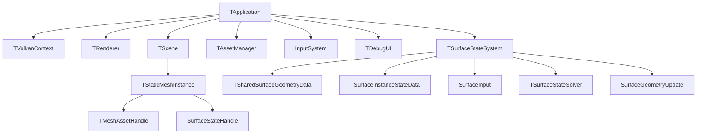

# 전체 엔진 구조

> **한 줄 요약:** MDSSP Engine은 C++/Vulkan 기반 렌더링 엔진에 Material-Dependent Surface State 시뮬레이션을 추가한다.

상태: **설계** · 근거: [[08_Assets/Documents/0001_Overall-Engine-Structure.pdf|전체 엔진 구조]]

MDSSP Engine은 C++/Vulkan 기반 렌더링 엔진에 **Material-Dependent Surface State** 시뮬레이션을 추가한다. 현재 구현 범위는 **Static Mesh**다.

핵심 분리는 다음과 같다.

- **Asset / Render Material**: Mesh와 외관 렌더링 정보.
- **Surface Response Profile**: State 종류를 고정하는 목록이 아니라, 각 State에 대한 소재별 반응 파라미터와 Transition.
- **SurfaceStateRegistry**: 로드한 Profile에서 State 이름을 모아 런타임 ID/index로 연결.
- **Runtime Surface Data**: Mesh·Normal Map·Profile Distribution에서 매 실행 시 전처리해 메모리에 생성하는 정적 Geometry/texel 관계 및 texel별 Profile map. 디스크에 `.Surface` 캐시를 저장하지 않는다.
- **Surface Instance State Data**: Registry 채널에 대응하는 instance별 동적 State. State는 finite·비음수 전체 양을 저장하고 `stateCapacity`는 포화 기준량으로 쓴다. Capacity 초과 허용 계약은 [[05_ADR/0020-State-Overcapacity-Transport|ADR 0020]]에 확정했으며 Shader의 상한 clamp 제거는 구현했으며 GPU 실행 검증은 대기 중이다.

## 읽는 순서

1. [[04_Architecture/0000_Overview|프로젝트 전체 개요]]
2. [[04_Architecture/0001_Engine-Structure|엔진 모듈과 데이터 흐름]]
3. [[04_Architecture/0002_Surface-State|표면 상태와 전이]] → [[04_Architecture/0003_Assets-and-Profiles|에셋과 프로필]]
4. [[04_Architecture/0004_Surface-Geometry|형상과 적층]]
5. [[04_Architecture/0005_Surface-Input|외부 접촉 입력 API]]
6. [[04_Architecture/0006_Surface-State-Update|Surface State 입력과 갱신]]
7. [[04_Architecture/0007_Simulation-Optimization|Simulation Optimization]]
8. [[04_Architecture/0008_Surface-GPU-Data-Layout|GPU 데이터 배치와 수명]]
9. [[04_Architecture/0009_Rendering|렌더링]]
10. [[04_Architecture/0010_UI-Interface|UI Interface와 Scene 편집]]

연구 근거와 프로젝트 적용 검토는 [[../02_Research/0000_Research-Index|Research 색인]]에 모으고, 확정한 결정은 ADR과 이 Architecture에 연결한다.

목표 시연과 진행 항목은 [[../03_Planning/00_Project-Overview/0002_Final_Demo|목표 데모]]와 [[TODO|TODO]]에서 확인한다. Simulation UV 생성·Mesh→Texel mapping·UV seam 연결은 [[../06_Development/Notes/0000_Surface-Simulation-Mapping|Surface Simulation Mapping]], 실제 Vulkan resource와 2-Pass 동기화는 [[../06_Development/Notes/0003_Surface-State-GPU-Resource|Surface State GPU Resource]]를 기준으로 한다.
