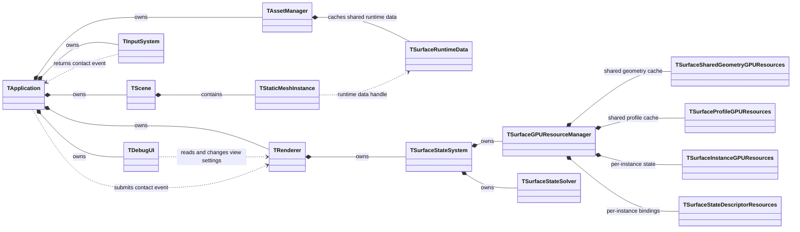
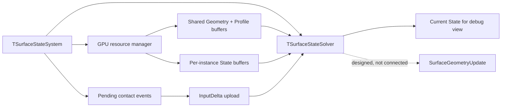
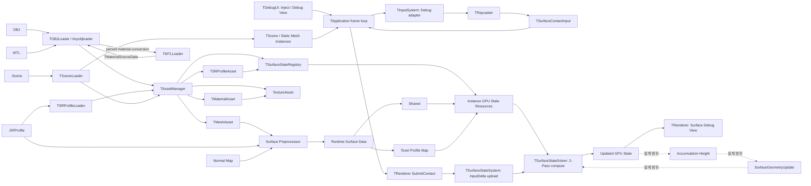

# 엔진 구조와 데이터 흐름

> **한 줄 요약:** 엔진 모듈의 책임과 Scene·Asset·Surface State 간 데이터 흐름 및 소유 관계를 정의한다.

상태: **현재 구현 흐름과 설계 범위** · 최종 확인: 2026-09-26 · 근거: [[08_Assets/Documents/0001_Overall-Engine-Structure.pdf|전체 엔진 구조]]

| 모듈 | 책임 |
|---|---|
| `TApplication` | 창, Vulkan, 에셋, Scene, Renderer, DebugUI의 수명과 메인 루프 조정 |
| `TAssetManager` | Mesh, Texture, Material, Surface Response Profile Asset 관리 |
| `TDebugUI` | 카메라·렌더·State 디버그 설정, Inject 제어, Scene 열기/저장과 오브젝트 편집, 로그 UI |
| `TInputSystem` | 현재는 Debug Inject용 Space 입력, 중앙 Raycast, 접촉 입력 생성. 게임 Physics 입력 어댑터는 설계 범위이며 미연결 |
| `TLogger` | 모듈별 로그 기록과 로그 항목 조회 |
| `TRenderer` | Swapchain, RenderPass/Pipeline, Framebuffer와 Scene 렌더링. `TSurfaceStateSystem` 소유 및 프레임 compute 기록 |
| `TScene` | Camera, `TStaticMeshInstance[]`, Scene 원본 경로 관리 |
| `TSurfaceStateSystem` | instance별 GPU State resource, 접촉 입력 누적·업로드, 2-pass Solver dispatch 관리 |
| `TVulkanContext` | Instance / Device, Queue / Command, GPU Resource 기반 관리 |

아래 관계도는 객체와 자원의 **소유**를 실선 합성(`*--`), handle 참조를 점선으로 표시한다. 예를 들어 Scene Instance는 Runtime Surface Data를 직접 소유하지 않고 handle로 가리킨다.

현재 코드에서 `TRenderer`가 `TSurfaceStateSystem`을 소유한다. Surface Runtime Geometry와 로컬 Profile table은 `TAssetManager`가 Scene 로딩 중 생성·공유한다. GPU resource manager는 Runtime data handle별 Geometry와 Scene 전체의 고유 Profile 테이블을 각각 공유하며 instance별 State buffer와 descriptor를 관리한다. 상세 구현 관계는 [[../06_Development/Code-Structure/0000_Overview|구현 구조 개요]]를 본다.

설계상 `TSurfaceStateSystem`이 맡을 전체 책임은 다음과 같다. 형상 갱신은 현재 구현 흐름에 연결되지 않은 설계 항목이다.

이 구성은 시스템의 **논리적 책임**을 나타낸다. 현재 C++ 클래스 구현 상태와 타입 간 소유·참조 관계는 [[06_Development/Code-Structure/0000_Overview|구현 구조 개요]]를 기준으로 한다.

## 데이터 흐름

1. `TSceneLoader`가 `.Scene`을 읽고 AssetManager로 OBJ 및 선택 Profile Map을 불러온다. Runtime Surface Data는 Scene object가 지정한 Mesh/Profile Map 조합별로 생성되어 같은 입력끼리 공유한다. Scene 편집 UI는 같은 Loader의 저장 기능도 사용한다.
2. Renderer가 현재 Scene의 참조 Profile로 Registry를 구성하고, GPU resource manager가 Scene 공유 Profile table과 Runtime별 Geometry를 만든다. instance별 State GPU buffer는 0으로 초기화된다. Scene 교체 성공 시 State 선택·튜닝 값을 초기화하며, 자원 준비 실패 시 이전 Registry와 GPU 자원으로 복원한다. [[05_ADR/0027-Scene-State-Registry-and-Shared-Profile-Table|ADR 0027]]을 따른다.
3. 현재 Debug 입력 경로는 Inject mode, State, Strength를 `TDebugUI`에서 설정하고, `TInputSystem`이 Space 입력 edge에 중앙 카메라 Raycast를 수행해 접촉 payload를 만든다. 게임용 Physics adapter는 아직 연결되지 않았다. 접촉 입력 API 계약은 [[04_Architecture/0005_Surface-Input|Surface Contact Input]]을 따른다.
4. `TRenderer::SubmitContact`가 입력을 `TSurfaceStateSystem`에 전달한다. Surface system은 접촉 범위의 texel별 `InputDelta`를 CPU에서 누적하고, 새 입력이 있을 때 graphics queue idle 후 instance GPU buffer에 업로드한다.
5. Renderer는 매 프레임 2-pass compute Solver를 기록한다. Solver가 `InputDelta`, State, Saturation 기반 이웃 전달, Decay를 적용하고 State A/B 역할을 교환한다. 선택한 State와 Surface Mapping 진단 모드는 렌더 패스에서 GPU State/Geometry를 읽는다.
6. Accumulation에 따른 동적 형상 갱신과 State 기반 최종 Material 표현은 설계 범위에 남아 있다. [[04_Architecture/0004_Surface-Geometry|형상과 적층]], [[04_Architecture/0009_Rendering|렌더링]]

State 저장 계약은 [[05_ADR/0020-State-Overcapacity-Transport|ADR 0020]]에 따라 전체 State A/B에 기준량 초과분까지 보존하도록 변경했다. Capacity는 포화 기준량이고 Transport는 상한 없는 `State / Capacity`를 사용한다. 현재 Shader는 Saturation·Next의 상한 clamp를 제거해 이 계약을 구현했다. GPU 실행 검증은 대기 중이다. 기존 2-Pass, gather, InputDelta 소비 시점과 A/B 소유권은 유지한다.

Simulation UV mapping은 [[06_Development/Notes/0000_Surface-Simulation-Mapping|Surface Simulation Mapping]], Vulkan resource binding / barrier는 [[06_Development/Notes/0003_Surface-State-GPU-Resource|Surface State GPU Resource]]를 본다.

위 흐름의 실선은 현재 연결된 경로, 점선은 설계되었지만 아직 현재 실행 경로에 연결되지 않은 기능이다. 구체적인 C++ 소유, handle 참조와 코드 위치는 [[06_Development/Code-Structure/0000_Overview|구현 구조 개요]]에서 확인한다. UI 패널과 입력 조작 계약은 [[0010_UI-Interface|UI Interface]]를 본다.
