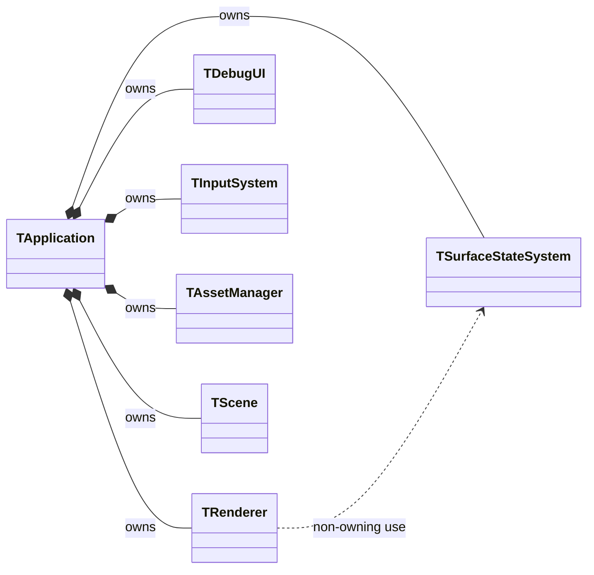
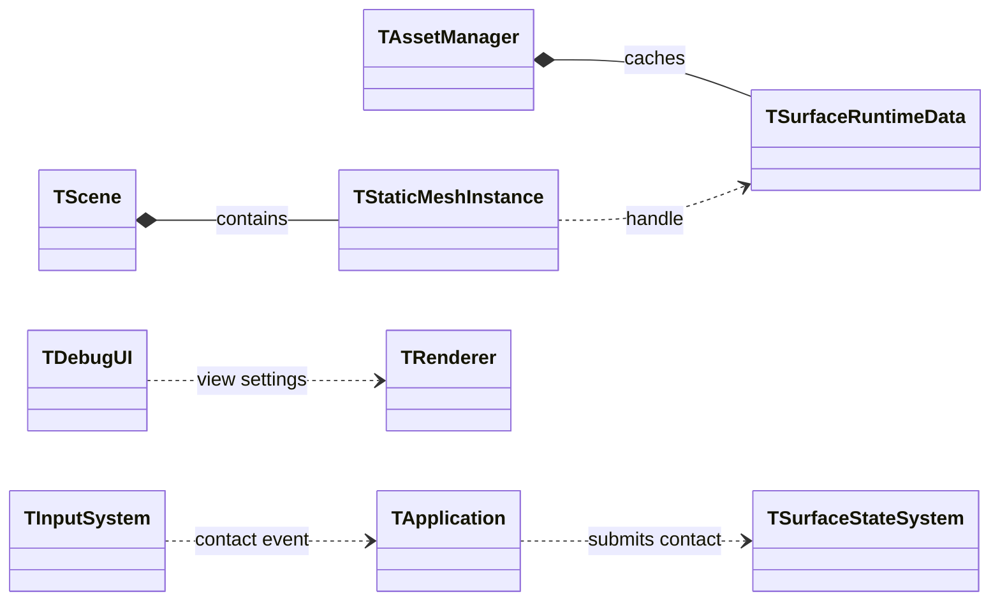
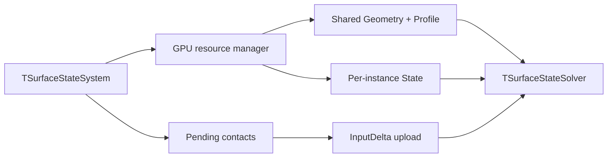
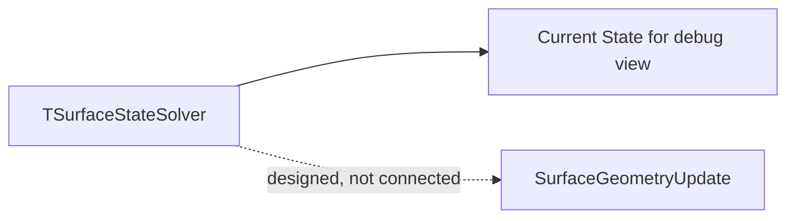
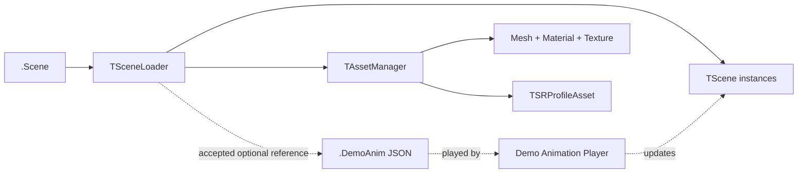
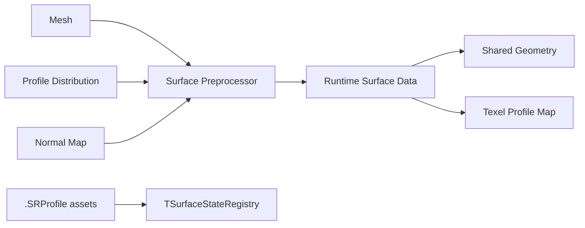
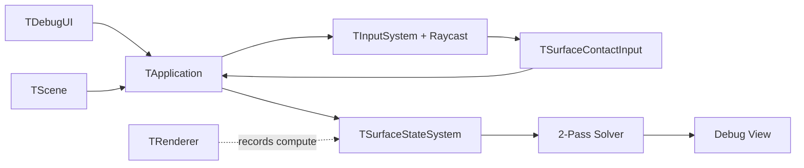

# 엔진 구조와 데이터 흐름

> **한 줄 요약:** 엔진 모듈의 책임과 Scene·Asset·Surface State 간 데이터 흐름 및 소유 관계를 정의한다.

상태: **현재 구현 흐름과 설계 범위**
최종 확인: 2026-10-01
근거: [[08_Assets/Documents/0001_Overall-Engine-Structure.pdf|전체 엔진 구조]]

---

| 모듈 | 책임 |
|---|---|
| `TApplication` | 창, Vulkan, 에셋, Scene, Surface State System, Renderer, DebugUI의 수명과 메인 루프 조정 |
| `TAssetManager` | Mesh, Texture, Material, Surface Response Profile Asset 관리 |
| `TDebugUI` | 카메라·렌더·State 디버그 설정, Inject 제어, Scene 열기/저장과 오브젝트 편집, 로그 UI |
| `TInputSystem` | 현재는 Debug Inject용 Space 입력, 중앙 Raycast, 접촉 입력 생성. 게임 Physics 입력 어댑터는 설계 범위이며 미연결 |
| `TLogger` | 모듈별 로그 기록과 로그 항목 조회 |
| `TRenderer` | Swapchain, RenderPass/Pipeline, Framebuffer와 Scene 렌더링. Application 소유 `TSurfaceStateSystem`을 참조해 프레임 compute 기록과 State 렌더링 수행 |
| `TScene` | Camera, `TStaticMeshInstance[]`, Scene 원본 경로 관리 |
| Demo Animation (accepted, implementation pending) | `.Scene`이 선택적으로 참조하는 버전형 `.DemoAnim`을 읽어 object transform과 camera keyframe을 재생. 애니메이션 시계와 Simulation 제어는 독립 |
| `TSurfaceStateSystem` | instance별 GPU State resource, 접촉 입력 누적·업로드, 2-pass Solver dispatch 관리 |
| `TVulkanContext` | Instance / Device, Queue / Command, GPU Resource 기반 관리 |

아래 관계도는 객체와 자원의 **소유**를 실선 합성(`*--`), handle 참조를 점선으로 표시한다. 예를 들어 Scene Instance는 Runtime Surface Data를 직접 소유하지 않고 handle로 가리킨다.

## 엔진 모듈 소유 관계

GPU resource manager의 소유·공유 관계는 별도 그림으로 표시한다.

## Scene, Asset, UI 참조 관계

- `TApplication`이 `TSurfaceStateSystem`과 `TRenderer`의 수명을 각각 소유한다. 선언·파괴 순서상 Renderer가 먼저 파괴되고 Surface State System이 그다음 파괴된다.
- `TRenderer`는 `TSurfaceStateSystem&` 비소유 참조로 Solver dispatch를 기록하고 GPU State resource를 렌더링에 사용한다 ([[05_ADR/0040-Application-Owned-Surface-State-System|ADR 0040]]).
- `TAssetManager`는 Scene load 중 Surface Runtime Geometry와 로컬 Profile table을 생성·공유한다.
- GPU resource manager는 Runtime data handle별 Geometry와 Scene 고유 Profile table을 공유한다. Instance별 State buffer와 descriptor도 관리한다.
- 기능별 실행 관계는 [[../Flow-Maps/0000_Overview|시스템 흐름 지도]]를 본다.

설계상 `TSurfaceStateSystem`이 맡을 전체 책임은 다음과 같다. 형상 갱신은 현재 구현 흐름에 연결되지 않은 설계 항목이다.

## Surface State System 자원과 실행 흐름

## Solver 결과와 설계 중 형상 갱신

이 구성은 시스템의 **논리적 책임과 현재 C++ 소유·참조 관계**를 함께 나타낸다. 기능별 실행 순서는 [[../Flow-Maps/0000_Overview|시스템 흐름 지도]]를 기준으로 한다.

## 데이터 흐름

### Scene 및 Asset 로드

#### Scene loader와 Asset 로드 흐름

### Runtime Surface Data 준비

#### 전처리와 Runtime Surface Data 생성

### Contact와 Solver 흐름

#### Contact 입력에서 Solver까지

1. `TSceneLoader`가 `.Scene`을 읽고 AssetManager로 OBJ 및 선택 Profile Map을 불러온다. Runtime Surface Data는 Scene object가 지정한 Mesh/Profile Map 조합별로 생성되어 같은 입력끼리 공유한다. Scene 편집 UI는 같은 Loader의 저장 기능도 사용한다.
2. Application 초기화 시 현재 Scene의 참조 Profile로 Registry와 `TSurfaceStateSystem`을 만들고 Renderer에 비소유 참조를 전달한다. GPU resource manager는 Scene 공유 Profile table과 Runtime별 Geometry를 만들며 instance별 State GPU buffer는 0으로 초기화된다. Scene 교체 시에는 새 Registry·GPU 자원·render pipeline을 준비한 뒤 Application 소유 시스템 객체의 내부 Scene 자원만 교체한다. 실패하면 이전 Registry와 GPU 자원을 유지한다 ([[05_ADR/0027-Scene-State-Registry-and-Shared-Profile-Table|ADR 0027]], [[05_ADR/0040-Application-Owned-Surface-State-System|ADR 0040]]).
3. 현재 Debug 입력 경로는 Inject mode, State, Strength를 `TDebugUI`에서 설정하고, `TInputSystem`이 Space 입력 edge에 중앙 카메라 Raycast를 수행해 접촉 payload를 만든다. 게임용 Physics adapter는 아직 연결되지 않았다. 접촉 입력 API 계약은 [[04_Architecture/0005_Surface-Input|Surface Contact Input]]을 따른다.
4. `TApplication`이 접촉 입력을 자신이 소유한 `TSurfaceStateSystem`에 직접 전달한다. Surface system은 접촉 범위의 texel별 `InputDelta`를 CPU에서 누적하고, 새 입력이 있을 때 graphics queue idle 후 instance GPU buffer에 업로드한다.
5. Renderer는 비소유 참조로 Surface State System의 `RecordStep`을 호출한다. 실제 경과 시간×배속을 누적하고 2-pass compute Solver를 필요한 만큼 기록한다. 기본 Fixed timestep ON·Auto substepping OFF는 1/60초씩 계산하며, Auto ON에서만 Transport 조건에 따라 세분화한다. frame당 최대 8회이고 미처리 시간과 미완료 고정 구간은 이월한다. 반복마다 면적 환산 Capacity, 포화도 차이와 Geometry mobility, Decay를 적용하고 State A/B를 교환한다. `InputDelta`는 첫 실행 step에서 한 번 소비한다. 선택한 State와 Surface Mapping 진단 모드는 렌더 패스에서 GPU State/Geometry를 읽는다.
6. Accumulation에 따른 동적 형상 갱신과 State 기반 최종 Material 표현은 설계 범위에 남아 있다. [[04_Architecture/0004_Surface-Geometry|형상과 적층]], [[04_Architecture/0009_Rendering|렌더링]]

## 데모 애니메이션 — 구현

`.Scene`은 선택적으로 `Assets/Animations/*.DemoAnim` JSON 파일을 참조한다. 공통 C++ 재생기는 고유 object ID를 대상으로 위치·회전·크기 및 선택적 카메라 keyframe을 적용한다. 파일이 없는 기존 Scene도 계속 유효하다 ([[05_ADR/0042-Scene-Referenced-Demo-Animation|ADR 0042]]).

- 애니메이션의 재생·일시정지와 Simulation의 Run·Pause·Step은 서로 독립된 UI 제어와 시간 진행을 가진다.
- 둘 다 재생 중이면 각 Solver step은 그 시점에 평가된 현재 오브젝트 transform을 사용한다. Simulation이 멈춰도 애니메이션은 계속 재생할 수 있고, 이때 Surface State는 갱신되지 않는다.
- 애니메이션 재생은 Surface State를 초기화하지 않는다. 애니메이션만으로 접촉 입력이나 물질 이동을 만들지 않는다.
- 자동 접촉 입력 생성은 이번 애니메이션 기능 범위에서 제외한다. 향후 접촉 드라이버는 별도 설계로 추가한다.
- `TSceneLoader`가 `.DemoAnim`을 검증해 로드하고, `TApplication`이 매 frame 애니메이션 시간을 갱신한다. UI의 Animation 버튼은 Simulation 제어와 독립적이다.
- 기본 네 Scene은 12초 주기의 연속 회전을 사용한다. 같은 Scene의 같은 형상은 회전 시점과 위상을 맞춘다. Mountain Scene의 넓은 지형 세 개는 수직축으로 돌고, 머드 산 위에 놓인 뒤집힌 산은 고정한다.

전체 State A/B에 기준량 초과분까지 보존하며, Capacity는 포화 기준량이고 Transport는 상한 없는 `State / Capacity`를 사용한다 ([[05_ADR/0020-State-Overcapacity-Transport|ADR 0020]]).

- Shader 변경과 선택 GPU 회귀 fixture는 통과했다.
- 5주차 통합 검증과 timestep 비교는 대기 중이다.
- 기존 2-Pass, gather, InputDelta 소비 시점과 A/B 소유권은 유지한다.

Simulation UV mapping은 [[../06_Development/Notes/Surface-Simulation-Mapping|Surface Simulation Mapping]], Vulkan resource binding / barrier는 [[../06_Development/Notes/Surface-State-GPU-Resource|Surface State GPU Resource]]를 본다.

- 실선은 현재 연결된 경로, 점선은 설계되었지만 실행 경로에 연결되지 않은 기능이다.
- C++ 소유·handle 참조와 기능별 연결은 [[../Flow-Maps/0000_Overview|시스템 흐름 지도]]에서 확인한다.
- UI 패널과 입력 조작 계약은 [[0010_UI-Interface|UI Interface]]를 본다.
