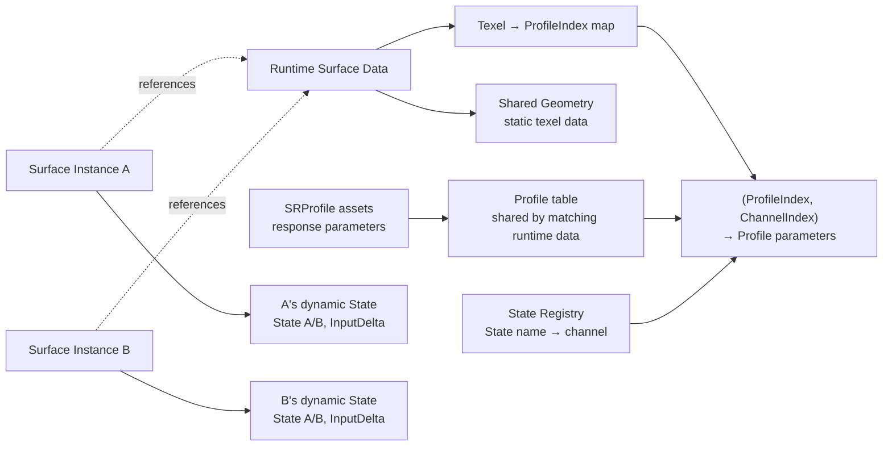
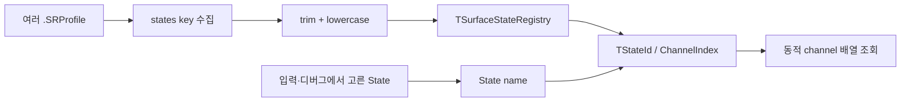
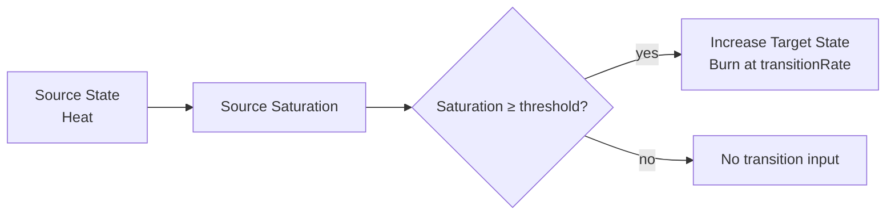

# 표면 상태와 데이터 구조

> **한 줄 요약:** State Registry와 Profile, 공유 Surface 데이터 및 인스턴스별 동적 상태의 구조를 설명한다.

상태: **핵심 의미 확정 · 초과량 보존 구현 완료 · GPU 실행 검증 대기** · 근거: [[08_Assets/Documents/0002_Surface-System-Data.pdf|시스템 데이터 구조]]

## 전체 데이터 분류



`SurfaceResponseProfile`은 여러 Instance가 공유 가능한 소재 반응 데이터이고, `SurfaceData`는 시뮬레이션에 필요한 형상·상태 데이터다.

## State 식별과 런타임 채널

State 종류는 C++ enum에 고정하지 않는다. 로드된 `.SRProfile`의 `states` key를 모아 `TSurfaceStateRegistry`를 만들며, Registry가 문자열 State 이름을 런타임 `TStateId` 또는 `ChannelIndex`에 연결한다. 별도의 `SurfaceStateSchema` 파일은 두지 않는다.

State 이름은 앞뒤 whitespace를 제거하고 lowercase로 정규화하며, 그 외 문자와 내부 공백·구두점은 그대로 보존한다. 예를 들어 `" Wetness "`와 `"WETNESS"`는 `wetness`로 합쳐지지만 `surface_heat`, `surface-heat`, `surface heat`는 서로 다른 이름이다. Transition의 source와 target에도 같은 규칙을 적용한다.



`.SRProfile`은 State 종류의 전역 목록이 아니라, 해당 Profile이 지원하는 각 State의 반응 파라미터와 Transition을 정의한다. 런타임 Solver와 GPU는 문자열을 직접 분기 기준으로 쓰지 않고 Registry가 부여한 ID/index를 사용한다. ID의 배정과 저장 레이아웃은 구현 계약에서 정한다. 상세 결정은 [[05_ADR/0006-Dynamic-State-Registry|ADR 0006 — SRProfile 기반 동적 State Registry]]를 따른다.

## State / Capacity / Saturation

```text
stateCapacity = Saturation이 1이 되는 포화 기준량; 저장 상한이 아님
State         = Capacity 초과량을 포함한 전체 상태량
Saturation    = State / stateCapacity; 전달 계산에서는 상한 clamp 없음
Excess        = max(State - stateCapacity, 0); 별도 저장하지 않는 파생값
```

$$
State_i \ge 0, \quad State_i \text{ is finite}
$$

$$
Saturation_i = \frac{State_i}{stateCapacity_i}
$$

- `stateCapacity`는 State별 SRProfile 독립 파라미터이며 기본값은 `1.0`이다.
- `stateCapacity > 1`도 가능하다. 값은 포화 기준을 조정하며, State의 저장 상한을 설정하지 않는다.
- `Saturation`은 저장 파라미터가 아니라 런타임 파생값이며 1을 넘을 수 있다. 표시용 `[0,1]` clamp는 전달 계산과 분리한다.
- Saturation 계산 때문에 `stateCapacity`는 유한한 양수로 사용한다. 양수 검증만으로 모든 연산의 NaN/Inf를 방지하는 것은 아니다.

[[05_ADR/0020-State-Overcapacity-Transport|ADR 0020]]에 따라 State A/B에 초과량까지 보존한다. Shader의 Saturation `[0,1]` clamp 및 Next State의 Capacity 상한 clamp 제거를 구현했다. 빌드는 통과했으며 GPU 실행 검증은 대기 중이다. `TempState`나 별도 Overflow 채널을 추가하지 않는다.

## Surface Response Profile

`.SRProfile`의 직렬화 형식은 [[04_Architecture/0003_Assets-and-Profiles|에셋과 프로필]]에서 다룬다. 파라미터의 **의미와 범위는 이 문서가 기준**이다.

### State Parameters

| Parameter                | 의미                                         |       범위 |   기본값 |
| ------------------------ | ------------------------------------------ | -------: | ----: |
| `stateCapacity`          | 해당 State의 포화 기준량                           | `(0, n]` | `1.0` |
| `inputFactor`            | 외부 Source 입력을 해당 State에 얼마나 반영할지 결정        |  `[0,n]` | `1.0` |
| `saturationTransferFactor` | Saturation 전달 기준 속도에 곱하는 무차원 계수 | `[0,1]` | `0.0` |
| `geometryTransferFactor` | Geometry 전달 기준 속도에 곱하는 무차원 계수 | `[0,1]` | `0.0` |
| `decayRate`              | State가 시간 경과에 따라 자연 감소하는 단위 시간당 기본 속도      | `[0, n]` | `0.0` |
| `cavityRetentionFactor`  | 오목한 영역에서 Decay가 억제되는 정도                    |  `[0,1]` | `0.0` |
| `accumulationFactor`     | State를 형상상의 적층량으로 변환하는 정도                  |  `[0,n]` | `0.0` |
| `cavityFillFactor`       | 적층량 중 Cavity를 채우는 데 우선 배분할 비율              |  `[0,1]` | `0.0` |

두 TransferFactor는 유한한 `[0,1]` 값으로 검증한다. 실제 속도는 Solver에서 `SaturationTransferFactor × 1.0 State/s`, `GeometryTransferFactor × 100.0 State/(world-length·s)`로 계산한다. 기준값은 기존 데모 속도를 유지하기 위한 초기 보정값이며 물성 검증값이 아니다 ([[05_ADR/0029-Normalized-Transport-Factors|ADR 0029]]). Saturation 및 State의 Capacity 초과 허용은 유지한다.

State Transition 규칙과 전이 파라미터의 의미는 [[04_Architecture/0002_Surface-State|State Transition]]에서 정의한다.

State Transition의 사용 예는 [[04_Architecture/0002_Surface-State|State Transition]]을 본다.

## Surface Instance State Data

State별로 현재 상태와 Solver 계산 과정의 임시값을 각각 스칼라 채널로 다룬다.

| 항목 | 저장 단위 | 범위 | 의미 |
|---|---|---|---|
| `State` | Texel·Registry 채널별 | finite, `≥ 0`; Capacity 초과 허용 | 초과량까지 포함한 전체 상태량 |
| `TempState` | Texel별 | Solver에 따라 다름 | Solver 계산 중 필요한 임시 상태값 |

`TempState`는 영구 상태 채널이 아니라 Solver 계산 중 사용하는 임시 데이터다. Capacity 초과량은 전체 State에 이미 포함하며 별도 임시값으로 저장하지 않는다. 구체적인 임시값과 GPU 배치는 [[06_Development/Notes/0003_Surface-State-GPU-Resource|Surface State GPU Resource]]를 본다.

CPU 상태 데이터는 Registry의 State 수에 대응하는 동적 채널 집합으로 표현한다. 구체적인 컨테이너와 GPU 배치는 이 문서가 고정하지 않으며 [[06_Development/Notes/0003_Surface-State-GPU-Resource|Surface State GPU Resource]]에서 다룬다. CPU 도메인 표현과 GPU 메모리 ABI는 별도 계약이다.

## State Transitions

State Transition은 한 State가 조건을 만족했을 때 다른 State를 증가시키는 규칙이다.

예:

```text
Heat → Burn
```

| Parameter | 의미 |
|---|---|
| `source` | 전이의 원인이 되는 State |
| `target` | 전이 결과 증가하는 State |
| `threshold` | source Saturation의 임계값 |
| `transitionRate` | 조건 만족 후 target State의 단위 시간당 증가 속도 |

예를 들어 `threshold = 0.7`이면 source의 Saturation이 `0.7` 이상일 때 전이 조건을 만족한다. 새 계약의 Saturation은 1을 넘을 수 있으므로 전이 구현 시 이 범위를 함께 검증한다. State Transition의 실제 Solver 적용은 미구현이다. Transition의 실행 순서와 Solver 패스 배치는 [[06_Development/Notes/0002_Next-State-Calculation|Next State 계산 메모]]에서 다룬다.


