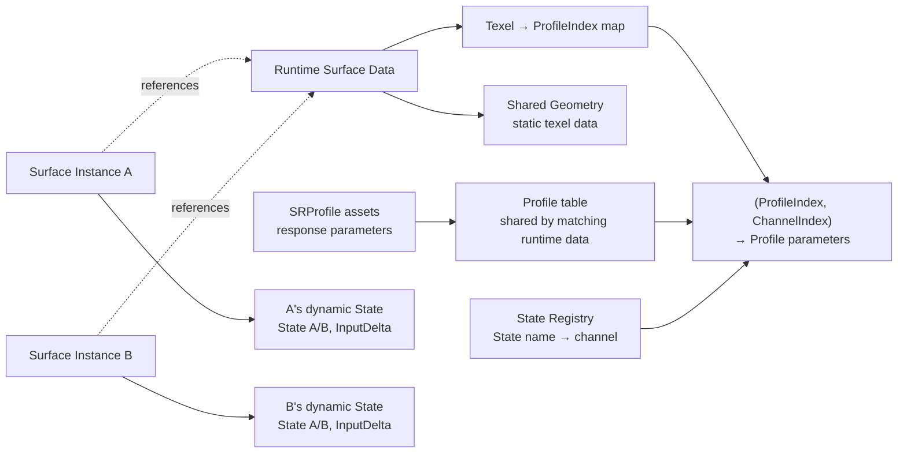
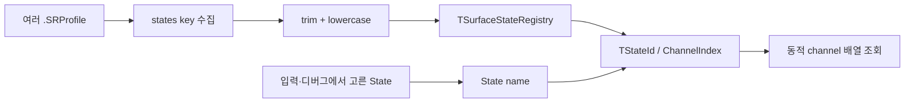
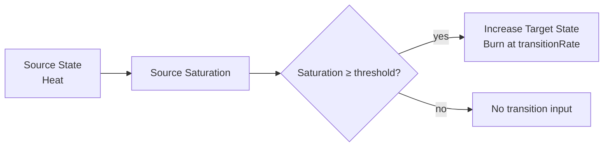

# 표면 상태와 데이터 구조

> **한 줄 요약:** State Registry와 Profile, 공유 Surface 데이터 및 인스턴스별 동적 상태의 구조를 설명한다.

상태: **핵심 의미 확정 · 초과량 보존 구현 완료 · 선택 GPU 회귀 통과 · 통합 검증 대기**
근거: [[08_Assets/Documents/0002_Surface-System-Data.pdf|시스템 데이터 구조]]

---

## 전체 데이터 분류

### 공유 데이터와 Instance State



`SurfaceResponseProfile`은 여러 Instance가 공유 가능한 소재 반응 데이터이고, `SurfaceData`는 시뮬레이션에 필요한 형상·상태 데이터다.

## State 식별과 런타임 채널

State 종류는 C++ enum에 고정하지 않는다. 로드된 `.SRProfile`의 `states` key를 모아 `TSurfaceStateRegistry`를 만들며, Registry가 문자열 State 이름을 런타임 `TStateId` 또는 `ChannelIndex`에 연결한다. 별도의 `SurfaceStateSchema` 파일은 두지 않는다.

State 이름은 앞뒤 whitespace를 제거하고 lowercase로 정규화한다. 그 외 문자와 내부 공백·구두점은 보존한다.

- `" Wetness "`와 `"WETNESS"`는 `wetness`로 합쳐진다.
- `surface_heat`, `surface-heat`, `surface heat`는 서로 다른 이름이다.
- Transition의 source와 target에도 같은 정규화 규칙을 적용한다.

### Runtime State ID 생성



`.SRProfile`은 전역 State 종류 목록이 아니라 해당 Profile이 지원하는 State의 반응 파라미터와 Transition을 정의한다.

- Runtime Solver와 GPU는 문자열 대신 Registry가 부여한 ID/index를 사용한다.
- ID 배정과 저장 레이아웃은 구현 계약에서 정한다. ([[05_ADR/0006-Dynamic-State-Registry|ADR 0006]])

## State / Capacity / Saturation

```text
Profile.stateCapacity = 고정 기준 면적의 포화 기준량
Capacity_i    = Profile.stateCapacity × AreaScale_i; 저장 상한이 아님
State_i       = Capacity 초과량을 포함한 texel별 총량
Saturation_i  = State_i / Capacity_i; 전달 계산에서는 상한 clamp 없음
GeometryState_i = min(State_i, Capacity_i); 형상 기여 계산에만 사용
Excess_i      = max(State_i - Capacity_i, 0); 별도 저장하지 않는 파생값
```

$$
State_i \ge 0, \quad State_i \text{ is finite}
$$

$$
Saturation_i = \frac{State_i}{Capacity_i},\quad Capacity_i = ProfileStateCapacity_i\cdot AreaScale_i
$$

- `stateCapacity`는 State별 SRProfile 독립 파라미터이며 기본값은 `1.0`이다.
- `stateCapacity > 1`도 가능하다. 값은 포화 기준을 조정하며, State의 저장 상한을 설정하지 않는다.
- `Saturation`은 저장 파라미터가 아니라 런타임 파생값이며 1을 넘을 수 있다. 표시용 `[0,1]` clamp는 전달 계산과 분리한다.
- Accumulation geometry는 각 State의 기여량을 계산하기 전에 `State`를 `[0, Capacity]`로 제한한다. 이 제한은 State A/B나 전달용 Saturation에 적용하지 않으며, Capacity 초과량은 계속 보존·수송한다. 높이 환산은 [[0004_Surface-Geometry|Geometry]]와 [[../05_ADR/0039-State-Thickness-Per-Amount|ADR 0039]]를 따른다.
- Saturation 계산 때문에 `stateCapacity`는 유한한 양수로 사용한다. 양수 검증만으로 모든 연산의 NaN/Inf를 방지하는 것은 아니다.

State A/B에는 Capacity 초과량까지 보존한다 ([[05_ADR/0020-State-Overcapacity-Transport|ADR 0020]]).

- Shader에서 Saturation `[0,1]` clamp와 Next State의 Capacity 상한 clamp를 제거했다.
- 선택 GPU 회귀 fixture는 통과했으며, 5주차 통합 검증과 timestep 비교는 대기 중이다.
- `TempState`나 별도 Overflow 채널은 추가하지 않는다.

## State 총량과 월드 texel 면적

State는 **texel별 총량**이다. 면적당 양을 보려면 `State / WorldTexelArea`로 환산한다. 전체 보존량은 `ΣState`이며 면적을 다시 곱하지 않는다.

```text
ReferenceArea = 1 / (256 × 256) world-length²   // 선택 해상도와 무관한 고정 기준
AreaScale_i = WorldTexelArea_i / ReferenceArea
Capacity_i = Profile.stateCapacity × AreaScale_i
Saturation_i = State_i / Capacity_i              // 1에서 자르지 않음
```

Profile `stateCapacity`는 **고정 기준 면적의 포화 기준량**이다. 실제 texel Capacity는 면적에 따라 달라진다. 같은 밀도에서 texel 면적이 1/4이면 State와 Capacity도 1/4이고 Saturation은 같다. Capacity·외부 입력·Decay에 같은 면적 환산을 적용한다. 면적의 생성·근사 범위는 [[0004_Surface-Geometry|Geometry]], 결정은 [[../05_ADR/0030-Texel-Area-and-State-Amounts|ADR 0030]]을 따른다.


## Surface Response Profile

`.SRProfile`의 직렬화 형식은 [[04_Architecture/0003_Assets-and-Profiles|에셋과 프로필]]에서 다룬다. 파라미터의 **의미와 범위는 이 문서가 기준**이다.

### State Parameters

| Parameter                | 의미                                         |       범위 |   기본값 |
| ------------------------ | ------------------------------------------ | -------: | ----: |
| `stateCapacity`          | 고정 기준 면적의 해당 State 포화 기준량; 동일한 기준이 형상 기여량 clamp에 사용됨 | `(0, n]` | `1.0` |
| `inputFactor`            | 외부 Source 입력을 해당 State에 얼마나 반영할지 결정        |  `[0,n]` | `1.0` |
| `saturationTransferFactor` | Saturation 전달 기준 속도에 곱하는 무차원 계수 | `[0,1]` | `0.0` |
| `geometryTransferFactor` | Geometry 전달 기준 속도에 곱하는 무차원 계수 | `[0,1]` | `0.0` |
| `decayRate`              | 고정 기준 면적의 초당 자연 감소량      | `[0, n]` | `0.0` |
| `cavityRetentionFactor`  | 오목한 영역에서 Decay가 억제되는 정도                    |  `[0,1]` | `0.0` |
| `accumulationFactor`     | State를 형상상의 적층량으로 변환하는 정도                  |  `[0,n]` | `0.0` |
| `cavityFillFactor`       | 적층량 중 Cavity를 채우는 데 우선 배분할 비율              |  `[0,1]` | `0.0` |
| `thicknessPerAmount`     | 기준 면적당 적층량 1에 대한 표면 위 State 두께 (world-length) | `[0,n]` | `0.01` |

두 TransferFactor는 유한한 `[0,1]` 값으로 검증한다. 실제 속도는 Solver에서 `SaturationTransferFactor × 1.0 State/s`, `GeometryTransferFactor × 6000.0 State/(world-length·s)`로 계산한다. Geometry 기준값은 초기 100에서 6000으로 재보정했다. 기준 면적을 사용하는 단순 수직면에서 Factor 0.5의 국소 이동률은 약 0.101 world-length/s다. 물성 검증값은 아니며 모든 Surface의 동일 속도를 보장하지 않는다 ([[05_ADR/0033-Geometry-Rate-Recalibration|ADR 0033]]). Saturation 및 State의 Capacity 초과 허용은 유지한다.

State Transition 규칙과 전이 파라미터의 의미는 [[04_Architecture/0002_Surface-State|State Transition]]에서 정의한다.

State Transition의 사용 예는 [[04_Architecture/0002_Surface-State|State Transition]]을 본다.

## Surface Instance State Data

State별로 현재 상태와 Solver 계산 과정의 임시값을 각각 스칼라 채널로 다룬다.

| 항목 | 저장 단위 | 범위 | 의미 |
|---|---|---|---|
| `State` | Texel·Registry 채널별 | finite, `≥ 0`; Capacity 초과 허용 | 초과량까지 포함한 전체 상태량 |
| Solver scratch | 목적별 | GPU resource 설계에 따름 | 현재는 `OutgoingFluxScale`, `RawOutgoing`, `InputDelta`, 선택적 `RawFlux` 등으로 나눈다. 단일 `TempState` buffer는 두지 않는다. |

- 초기 자료의 `TempState`는 Solver 중간 데이터의 일반 개념이며 현재 buffer 이름이 아니다.
- Capacity 초과량은 전체 State에 포함한다. 별도 임시값으로 저장하지 않는다.
- Scratch 종류와 GPU 배치는 [[../06_Development/Notes/Surface-State-GPU-Resource|Surface State GPU Resource]]를 본다.

- CPU 상태 데이터는 Registry State 수에 대응하는 동적 channel 집합으로 표현한다.
- 구체적인 container와 GPU 배치는 [[../06_Development/Notes/Surface-State-GPU-Resource|Surface State GPU Resource]]에서 다룬다.
- CPU 도메인 표현과 GPU 메모리 ABI는 별도 계약이다.

## State Transitions

State Transition은 한 State가 조건을 만족했을 때 다른 State를 증가시키는 규칙이다.

예:

```text
Heat → Burn
```

| Parameter | 의미 |
|---|---|
| `source` | 전이의 원인이 되는 State |
| `target` | 전이 결과 증가하는 State |
| `threshold` | source Saturation의 임계값 |
| `transitionRate` | 조건 만족 후 target State의 단위 시간당 증가 속도 |

- `threshold = 0.7`이면 source Saturation이 `0.7` 이상일 때 전이 조건을 만족한다.
- Saturation은 1을 넘을 수 있으므로 Transition 구현에서 이 범위를 검증한다.
- State Transition의 Solver 적용은 미구현이다.
- 실행 순서와 Solver pass 배치는 [[../06_Development/Notes/Next-State-Calculation|Next State 계산 메모]]에서 다룬다.

### State Transition 조건 평가


