# 에셋과 Surface Response Profile

> **한 줄 요약:** 이 문서는 데이터의 파일 직렬화와 Asset 연결 관계만 정의한다.

상태: **파일 구조 설계 / 해상도별 `.Surface` 캐시 구현** · 근거: [[08_Assets/Documents/0003_Asset-Structure.pdf|에셋 구조]]

이 문서는 데이터의 **파일 직렬화와 Asset 연결 관계**만 정의한다. SRProfile 파라미터의 의미와 범위는 [[04_Architecture/0002_Surface-State|표면 상태와 데이터 구조]]를 기준으로 한다.

## 파일 형식

| 용도 | 확장자 | 비고 |
|---|---|---|
| OBJ Mesh | `.obj` | 정점, UV, Normal, Face, Surface별 Material 할당 |
| Render Material | `.mtl` | OBJ Surface의 외관용 Material |
| Texture | `.png`, `.jpg` 등 | Albedo, Normal 등 |
| Scene | `.Scene` | JSON 형식. 배치, Asset 연결 관계 및 시뮬레이션 해상도 |
| Surface Response Profile | `.SRProfile` | JSON 형식. Surface State 반응 데이터 |
| Surface Profile Distribution | `.SurfaceProfileMap` | JSON 형식. Scene object가 경로를 선택하며, Surface별 SRProfile 할당을 기록 |
| Surface Preprocessing Cache | `.Surface` | 해상도별 최종 CPU Geometry·Texel 관계·Profile map을 저장하는 생성 바이너리 캐시 |
| Runtime Surface Data | 메모리 객체 | 유효한 `.Surface`를 로드하거나 전처리해 생성하고, 같은 Mesh·Map·해상도의 instance끼리 공유 |

파일 이름만 보는 대신 아래 연결을 따라가면 Scene에서 GPU 시뮬레이션 입력까지 데이터가 만들어지는 경로를 볼 수 있다.

```mermaid
flowchart LR
  SceneFile[".Scene"] --> Loader["TSceneLoader"]
  Loader --> Instance["Scene object / Mesh instance"]
  Instance --> Mesh[".obj"]
  Instance --> Map[".SurfaceProfileMap"]
  Mesh --> MTL[".mtl"]
  MTL --> Textures["Albedo / Normal textures"]
  Map --> ProfilePaths[".SRProfile paths"]
  ProfilePaths --> Profiles["TSRProfileAsset collection"]
  Profiles --> Registry["State Registry"]
  Mesh --> Lookup["Cache lookup / input fingerprint"]
  Textures -->|Normal Map| Lookup
  Map --> Lookup
  Lookup --> Cache["Resolution-specific .Surface"]
  Cache -->|valid| Runtime["Runtime Surface Data\nshared by Mesh + Map + resolution"]
  Lookup -->|missing / stale / corrupt| Build["Runtime Preprocessor"]
  Build -->|save final CPU geometry| Cache
  Build --> Runtime
  Runtime --> Geometry["Shared texel geometry\nand neighbors"]
  Runtime --> TexelMap["Texel → ProfileIndex"]
  TexelMap --> ProfileTable["Profile parameters per channel"]
  Profiles --> ProfileTable
  Registry --> ProfileTable
```



## `.Scene` 시뮬레이션 해상도

최상위 `simulationResolution`은 Scene 내 모든 simulated Surface에 적용할 정사각형 grid의 한 변 크기다. 정수 128·256·512만 허용하며 필드가 없으면 256을 사용한다. 기존 Scene의 활성 해상도는 새 파일의 기본값에 영향을 주지 않는다.

`TSceneLoader`는 이 값을 먼저 검증한 뒤 `LoadSurfaceData`에 명시적으로 전달한다. Loader가 후보 Scene을 읽는 동안 활성 해상도는 유지하고, Renderer의 GPU 자원 교체가 성공하면 새 Scene의 해상도를 적용한다. UI 변경은 현재 `TScene`에도 반영하며 `Save Scene`은 값을 파일에 기록한다. 자세한 전환 계약은 [[05_ADR/0023-Simulation-Resolution-Presets|ADR 0023]]을 따른다.

## Surface와 Profile의 관계

Render Material과 Surface Response Profile은 서로 다른 책임이다. Render Material은 외관을 정의하고, `.SRProfile`은 State에 대한 반응 파라미터와 Transition을 정의한다. 현재 입력 계약에서는 각 Surface/Material 할당에 SRProfile 하나를 지정하며, 그 Surface의 모든 valid texel이 해당 Profile을 사용한다.

Runtime 전처리 결과는 유효한 각 UV texel에 `ProfileIndex` 하나를 저장하는 dense Profile Map을 포함한다. 각 texel은 별도 Profile 테이블의 반응 파라미터를 이 인덱스로 조회한다. 현재는 Surface/Material 할당 하나에 Profile 하나를 연결한 뒤 해당 Surface의 texel마다 같은 인덱스를 확장한다. dense map은 조회 표현이며, Surface 내부를 여러 Profile 영역으로 나누는 authoring 기능까지 의미하지 않는다. 그 세분화는 후속 기능으로 남긴다. Profile Map은 `.Surface`에 정적 데이터로 저장하고 Runtime에서는 공유 Geometry의 일부로 로드한다. Profile table의 경로와 순서를 함께 저장하되, `.SRProfile`의 반응 파라미터와 Runtime Asset handle은 저장하지 않는다. [[05_ADR/0009-Texel-Profile-Index-Map|ADR 0009 — Texel별 Profile Index Map]]

```text
UV Texel
├── Render Material assignment (rendering)
└── SurfaceProfileMap
    └── ProfileIndex → SRProfile response data
```

Runtime Surface Data는 Mesh, Normal Map, Profile Distribution과 Simulation 해상도에 대응하는 정적 데이터다. `.Scene`의 각 object가 사용할 `.SurfaceProfileMap` 경로를 선택한다. 같은 Mesh·Map·해상도 조합의 instance들은 하나의 메모리 결과를 공유하며, 실행 간에는 `.Surface`로 최종 CPU 전처리 결과를 재사용한다. 다른 Map이나 해상도는 별도 캐시 변형으로 유지한다. 구체 경로 계약은 [[05_ADR/0012-Scene-Profile-Distribution-Reference|ADR 0012 — Scene별 Surface Profile Map 참조]]를 따른다. 데이터 범위는 다음과 같다.

| Runtime Surface Data에 포함 | Runtime Surface Data에 포함하지 않음 |
|---|---|
| 유효성, Normal, Virtual Height, Curvature/Concavity 등 정적 Geometry 값 | 시간에 따라 변하는 instance별 State |
| 최종 Neighbor index, Chart 및 UV seam 연결. Distance와 간선별 Height Difference는 저장하지 않음 | `.SRProfile`의 반응 파라미터와 Transition |
| Texel → `ProfileIndex` map | Instance별 `SurfaceInstanceStateData` |

초기 `.Surface` 설계는 Mesh당 단일 파일을 두었고, 이후 ADR 0008에서 Runtime 전처리만 수행하도록 단순화했다. 현재는 시작 시 전처리 비용을 줄이기 위해 해상도별 캐시를 유지한다. 현재 결정은 [[05_ADR/0026-Resolution-Surface-Cache|ADR 0026 — 해상도별 Surface 전처리 캐시]]를 따르며 ADR 0007·0008은 이전 결정 이력으로 보존한다.

## `.Surface` 캐시 경로와 유효성

`.Surface`는 직접 편집하는 authoring 입력이 아니라, `BuildMesoGeometry()`까지 완료한 최종 CPU `TSharedSurfaceGeometryData`와 texel별 Profile map의 캐시다. `.Scene`은 계속 Mesh와 `.SurfaceProfileMap` 원본을 참조하며 캐시 파일 경로를 지정하지 않는다.

```text
Cache/Surface/<MeshName>_<MeshMapIdentity>/<MeshName>_<Resolution>.Surface
예: Cache/Surface/Cube_<identity>/Cube_128.Surface
    Cache/Surface/Cube_<identity>/Cube_256.Surface
    Cache/Surface/Cube_<identity>/Cube_512.Surface
```

`MeshMapIdentity`는 정규화한 절대 Mesh·Map 경로 쌍의 64-bit FNV-1a 값이다. 같은 이름의 Mesh나 다른 Map 조합이 충돌하지 않도록 조합별 디렉터리를 둔다. 내용 변경은 같은 해상도 파일을 재생성하고, 다른 해상도 파일은 유지한다. 초기 실행과 해상도 변경 시 필요한 변형만 생성하며 모든 해상도를 일괄 전처리하지 않는다. Cache root는 CMake의 `MDSS_SURFACE_CACHE_DIR`로 프로젝트의 `Cache/Surface/`에 지정하고 Git에서 제외한다. 프로젝트 경로를 옮기면 해당 위치에서 캐시를 다시 생성한다.

| 유효성 입력 | 판정에 포함하는 내용 |
|---|---|
| 파싱된 Mesh | 정점 Position·Normal·UV·Tangent/handedness, triangle의 render vertex·원본 Position/UV index·Surface ID |
| Normal Map | Surface별 정규화 경로와 원본 파일 bytes. 같은 파일은 fingerprint 계산 중 한 번 읽음 |
| Profile Distribution | `.SurfaceProfileMap` 경로와 파일 bytes, Surface별 Profile index, 순서 있는 Profile table 경로 |
| Simulation grid | Surface별 ID·Width·Height. 현재 프리셋은 128·256·512, 기본값은 256 |
| 생성 규칙 | `PreprocessVersion`. Mapping·sample·높이 적분·미분 규칙 변경 시 증가 |
| 파일 표현 | 별도의 `FormatVersion`, magic, payload checksum, 배열 개수와 길이 |

입력 fingerprint는 64-bit FNV-1a이며 캐시 무효화용으로 사용한다. 파일 시각이나 크기만으로 입력 동일성을 판정하지 않는다. `.SRProfile`의 파라미터·Transition·`states`는 Geometry fingerprint에 포함하지 않고 매 Runtime에 Profile loader와 `TSurfaceStateRegistry`로 읽는다. Profile 경로/순서와 배치가 같으면 반응 수치나 Registry channel 종류를 바꿔도 Geometry 캐시는 재사용한다.

## 캐시 로드·재생성 및 파일 계약

1. 이미 로드한 Mesh·Map·해상도 조합은 Runtime 메모리 결과를 공유한다.
2. 새 조합은 원본 Map과 Profile을 로드하고 Surface·Normal Map 입력으로 fingerprint를 계산한다.
3. 유효한 `.Surface`가 있으면 최종 Geometry를 복원한다. Mapping·Normal Map CPU sample·PCG 높이 적분·곡률 계산은 수행하지 않는다.
4. 파일이 없거나 stale·손상된 경우 기존 CPU 전처리 경로로 Geometry를 생성한 뒤 캐시를 저장한다.
5. 복원하거나 생성한 Geometry에서 GPU 버퍼와 instance별 TransferWeight·State 자원을 준비한다.

파일은 **format version 3**을 사용하며 이전 `.Surface` v1/v2는 호환 변환하지 않고 재생성한다. 정수는 명시적 little-endian `uint32`/`uint64`, 실수는 IEEE-754 `float32`로 기록하며 C++ 구조체 메모리를 그대로 덤프하지 않는다. Header는 magic·format/preprocess version·input fingerprint·Surface/Profile/triangle/texel count·payload checksum을 포함한다. Payload에는 Surface 정의, 순서 있는 Profile 경로와 texel 레코드를 저장한다. 각 texel 레코드는 padding 없는 128 byte이며, 세부 필드는 [[04_Architecture/0004_Surface-Geometry#해상도별 정적 Geometry 캐시|형상 정보의 캐시 계약]]을 따른다.

로드는 현재 입력으로 예상 파일 길이와 개수를 먼저 확인한다. checksum, Surface·Profile table 대응, 유한한 형상 값, 법선 유효성, invalid sentinel, 이웃 범위·중복·양방향 연결을 검사한 뒤 Runtime에 등록한다. 캐시 오류는 재생성 사유로 로그에 남긴다. 원본 Asset 오류는 기존과 같이 load 실패다.

저장은 같은 디렉터리의 고유한 임시 파일에 기록하고 flush·close 후 rename으로 완성 파일을 교체한다. 실패 시 임시 파일을 제거하고 기존 완성 파일은 보존한다. 캐시 저장 실패는 경고를 남기고 이미 생성한 Runtime Geometry로 계속 실행한다. 캐시는 삭제해도 재생성되며, 저장 실패가 시뮬레이션 입력 실패로 바뀌지 않는다.

현재 구현은 동기 load/save와 자동 재생성이다. 별도 Asset Build 도구, 압축, streaming IO, 캐시 용량 제한/자동 정리 및 source Asset hot reload는 후속 기능이다. 해상도 전환 시 CPU 캐시가 hit해도 GPU 자원 재생성과 State 초기화는 [[05_ADR/0023-Simulation-Resolution-Presets|ADR 0023]]의 기존 규칙을 유지한다.

## State Registry

`.SRProfile`의 `states` key가 State 이름을 제공한다. 현재 Scene의 Runtime Profile 테이블에 참조된 Profile만으로 `TSurfaceStateRegistry`를 구성하고, 문자열 State 이름을 런타임 숫자 `TStateId`/`ChannelIndex`로 변환한다. 이전 Scene 또는 실패한 로드의 자산이 캐시에 남아 있어도 활성 Registry에는 포함하지 않는다. Scene 전환과 공유 GPU Profile 테이블은 [[05_ADR/0027-Scene-State-Registry-and-Shared-Profile-Table|ADR 0027]], 이름 정규화와 데이터 주도 처리 원칙은 [[05_ADR/0006-Dynamic-State-Registry|ADR 0006]]을 따른다.

## `.SRProfile` 예시

아래 수치는 **튜닝 전 예시값**이며, Profile이 여러 State 응답을 정의할 수 있음을 보여준다. 예시 State 이름은 고정된 전역 채널 목록이 아니다.

```json
{
  "type": "SurfaceResponseProfile",
  "version": 1,
  "name": "Brick",
  "states": {
    "wetness": {
      "stateCapacity": 1.0,
      "inputFactor": 0.75,
      "saturationTransferRate": 0.40,
      "geometryTransferRate": 0.05,
      "decayRate": 0.06,
      "cavityRetentionFactor": 0.50,
      "accumulationFactor": 0.0,
      "cavityFillFactor": 0.0
    },
    "heat": {
      "stateCapacity": 1.0,
      "inputFactor": 0.30,
      "saturationTransferRate": 0.30,
      "geometryTransferRate": 0.0,
      "decayRate": 0.10,
      "cavityRetentionFactor": 0.0,
      "accumulationFactor": 0.0,
      "cavityFillFactor": 0.0
    },
    "burn": {
      "stateCapacity": 1.0,
      "inputFactor": 0.0,
      "saturationTransferRate": 0.0,
      "geometryTransferRate": 0.0,
      "decayRate": 0.01,
      "cavityRetentionFactor": 0.0,
      "accumulationFactor": 0.0,
      "cavityFillFactor": 0.0
    },
    "mud": {
      "stateCapacity": 1.0,
      "inputFactor": 0.65,
      "saturationTransferRate": 0.04,
      "geometryTransferRate": 0.08,
      "decayRate": 0.04,
      "cavityRetentionFactor": 0.80,
      "accumulationFactor": 0.65,
      "cavityFillFactor": 0.60
    }
  },
  "transitions": [
    {
      "source": "heat",
      "target": "burn",
      "threshold": 0.7,
      "transitionRate": 0.2
    }
  ]
}
```

## `.Scene` 연결 예시

각 Scene object는 Mesh와 선택적인 Profile Distribution 파일을 지정한다. 두 경로는 Scene 파일의 디렉터리를 기준으로 한 상대 경로다. 같은 Mesh를 여러 Scene에서 쓰더라도 서로 다른 `.SurfaceProfileMap`을 선택할 수 있다. Map 내부의 `.SRProfile` 경로는 Map 파일 위치를 기준으로 해석한다.

```json
{
  "type": "TScene",
  "version": 1,
  "objects": [
    {
      "mesh": "../Models/clothes.obj",
      "surfaceProfileMap": "../SurfaceProfiles/clothes_default.SurfaceProfileMap",
      "transform": {
        "position": [0.0, 0.0, 0.0],
        "rotationDegrees": [0.0, 0.0, 0.0],
        "scale": [1.0, 1.0, 1.0]
      }
    }
  ]
}
```

Simulation grid 해상도는 `.Scene`의 `simulationResolution`에 저장하며 Simulation 탭에서 Low(128), Medium(256), High(512)를 선택한다. 필드가 없으면 Medium을 사용하고 Scene의 모든 simulated Surface에 같은 해상도를 적용한다. 해상도별 캐시를 재사용하되 전환 시 State는 초기화한다. [[05_ADR/0023-Simulation-Resolution-Presets|ADR 0023]]

`.Scene`에서 `surfaceProfileMap`을 생략한 object는 렌더링 전용이며 Runtime Surface simulation data를 만들지 않는다. Scene 경로와 Profile map 참조 정책은 [[05_ADR/0012-Scene-Profile-Distribution-Reference|ADR 0012]]에 정의한다.

Simulation UV는 렌더링 UV와 논리적으로 분리한다. UV 생성·검증과 현재 구현 범위는 [[06_Development/Notes/0000_Surface-Simulation-Mapping|Surface Simulation Mapping]]을 본다.
