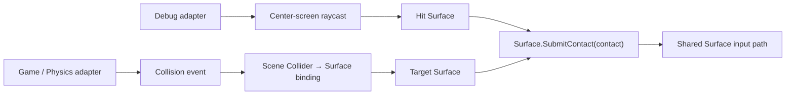
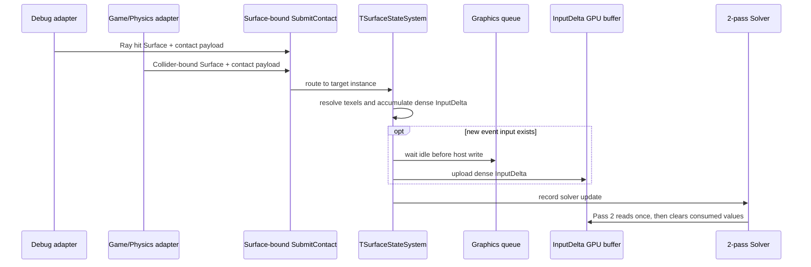
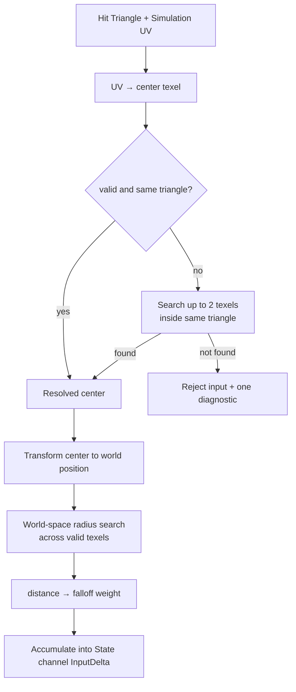

# Surface Contact Input

> **한 줄 요약:** Surface 대상 접촉 입력을 공개 API에서 받아 texel별 State 입력으로 전달하는 방식을 정의한다.

상태: **MVP API 설계** · 근거: [[../08_Assets/Documents/0004_Contact-Input|Contact Input API]] · 결정: [[05_ADR/Architecture/0014-Surface-Contact-Target-API|ADR 0014]]

Assets의 `SurfaceContactInput`은 대상 Surface와 접촉 정보를 한 구조체에 담는 예시다. 모듈을 사용하는 게임 코드가 내부 `SurfaceInstanceID`를 직접 찾고 매 접촉마다 넘기지 않도록, MVP 공개 API에서는 대상 Surface를 제출 함수의 주체로 정하고 접촉 정보만 전달한다.

```cpp
// 개념 예시이며 현재 구현된 함수 선언은 아니다.
struct SurfaceContact
{
    SurfaceStateType stateType;      // 어떤 State에 대한 입력인지
    glm::vec3 worldPosition;         // 접촉 중심 위치
    glm::vec3 worldDirection;        // 입력이 들어오는 방향
    float radius;                    // 영향을 주는 범위
    float strength;                  // 외부 입력 자체의 세기
    float falloff;                   // 중심에서 멀어질수록 입력이 감소하는 정도
};

surface.SubmitContact({stateType, worldPosition, worldDirection, radius, strength, falloff});
```

## 대상 Surface 연결

접촉 입력은 대상 Surface에 바인딩된 하나의 공개 `SubmitContact` 경로로 들어간다. Debug 입력 어댑터와 게임 입력 어댑터는 입력 출처만 다르고, 접촉 payload와 제출 경로는 공유한다.

- **Debug 입력 어댑터**는 중앙 Raycast hit에서 대상 Surface를 얻는다.
- **게임 입력 어댑터**는 Scene에 미리 등록한 Collider–Surface 관계를 통해 대상 Surface를 얻는다. MVP에서는 Collider 하나가 Surface instance 하나를 가리킨다.
- 두 어댑터 모두 대상 Surface의 `SubmitContact(contact)`를 호출한다. Debug 입력만을 위한 별도 Surface 입력 경로를 만들지 않는다.



따라서 입력 어댑터는 접촉마다 내부 Surface ID를 payload에 넣지 않는다. 어댑터가 대상 Surface를 정한 뒤 접촉 위치와 방향, State·반경·세기·감쇠 정도만 제출한다. Debug Raycast 역시 hit 결과에서 대상 Surface를 정하고 게임 입력과 같은 공개 제출 경로를 사용한다.

위 공개 API는 아키텍처 계약이다. 현재 내부 구현의 `TSurfaceContactInput`은 GPU 자원을 찾기 위해 `TargetInstance`를 보유하며, Debug Raycast는 hit instance index를 이 내부 입력으로 변환한다. 이는 내부 라우팅 정보이며 외부 contact payload에 Surface ID를 요구한다는 뜻은 아니다. 현재 C++ 코드에는 Surface-bound 공개 wrapper와 Collider 등록 기능이 아직 연결되어 있지 않다.

아래 순서는 두 입력 출처가 같은 Surface-bound API에 합류한 뒤, 내부에서 GPU 입력으로 바뀌는 설계를 보여준다. 현재 구현은 Debug 경로의 내부 입력까지만 연결되어 있다.



## 접촉 위치의 내부 처리

입력 API는 월드 공간 접촉 위치와 실제 영향 반경을 받는다. 모듈 내부에서는 이 위치를 대상 Surface의 Triangle과 Simulation UV에 대응시켜 중심 texel을 정한 뒤, 실제 영향 범위를 월드 공간 거리로 계산한다. 입력을 제출하는 쪽은 Triangle ID나 texel index를 알거나 전달하지 않는다.

중심 texel 선택과 주변 영향 범위는 서로 다른 두 단계다.

1. 대상 Surface에서 접촉 위치에 해당하는 hit Triangle과 Simulation UV를 얻고, UV를 texel 좌표로 변환한다. Debug Raycast는 ray hit의 Triangle 및 barycentric 보간 UV를 사용한다.
2. 매핑된 texel이 유효하고 hit Triangle에 속하면 그 texel을 중심으로 삼는다. invalid이거나 다른 Triangle에 속하면 같은 Surface와 같은 Triangle 안에서만 fallback을 검색한다.
3. Fallback은 `max(|dx|, |dy|) <= 2`인 범위로 제한한다. 즉 각 축에서 중심으로 최대 2 texel 떨어진 격자 안에서 유효 texel을 찾고, grid 거리 제곱이 가장 작은 것을 선택한다. 동률이면 고정된 탐색 순서를 따른다. 찾지 못하면 해당 입력을 거부하고 입력 event당 진단 로그를 최대 한 번 남긴다.
4. 선택한 중심 texel의 월드 위치를 기준으로 `radius` 안에 있는 valid texel을 영향 대상으로 찾고 `falloff`를 계산한다. 이 단계는 UV 해상도와 무관한 실제 표면 거리 기준이다. 반경 안에 물리적으로 가까운 다른 면이나 Surface texel이 있으면 함께 영향을 받을 수 있다.

입력 중심과 영향 영역을 나누어 보면 fallback은 hit triangle 주변의 중심 텍셀을 정하고, World radius 검색은 최종 영향 texel을 고른다.



현재 구현의 falloff는 선형 감쇠를 지수로 조절한다.

```text
normalizedDistance = clamp(distance / radius, 0, 1)
linearWeight = 1 - normalizedDistance
contactWeight = falloff == 0 ? 1 : pow(linearWeight, falloff)
```

`falloff = 1`이면 중심에서 반경 경계까지 선형으로 감소한다. `falloff > 1`이면 중심 주변에 더 집중되고, `0 < falloff < 1`이면 완만하게 감소한다. `falloff = 0`은 반경 안에 균일하게 적용한다. 반경 밖 texel은 후보에서 제외되므로 입력을 받지 않는다. Debug Inject는 현재 `falloff = 1`을 사용한다.

Fallback은 UV→texel 변환 과정에서 빈 texel이나 경계에 걸린 중심을 보정한다. 월드 공간 반경 검색은 그 중심 주변에 영향을 줄 texel 집합을 정한다. 두 검색은 서로 대체하지 않는다.

## 접촉 정보 필드

| 필드 | 의미 |
|---|---|
| `stateType` | 입력 대상 State 종류를 지정한다. |
| `worldPosition` | 접촉 중심을 월드 좌표로 나타낸다. |
| `worldDirection` | 입력이 들어오는 방향을 월드 좌표로 나타낸다. |
| `radius` | 접촉 입력이 영향을 미치는 범위를 지정한다. |
| `strength` | 외부에서 가하는 입력의 세기를 지정한다. |
| `falloff` | 접촉 중심에서 멀어질 때 입력이 감소하는 정도를 지정한다. |

Assets 예시의 `targetSurface`는 대상 지정이라는 의미를 나타낸다. 모듈 공개 API에서는 그 역할을 Surface에 대한 `SubmitContact` 호출과 Scene의 Collider-Surface 연결로 표현한다. 위의 texel 변환과 영향 범위 계산은 모듈 내부 처리 계약이며, 게임 코드가 texel index를 만들거나 넘기는 API 계약은 아니다. 입력 누적·소비 시점과 GPU 동기화 방식은 별도 구현 세부사항으로 둔다.
