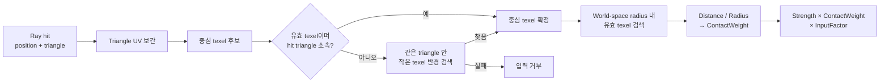
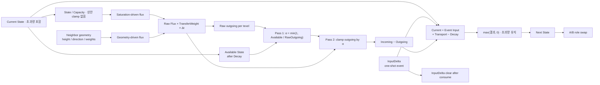
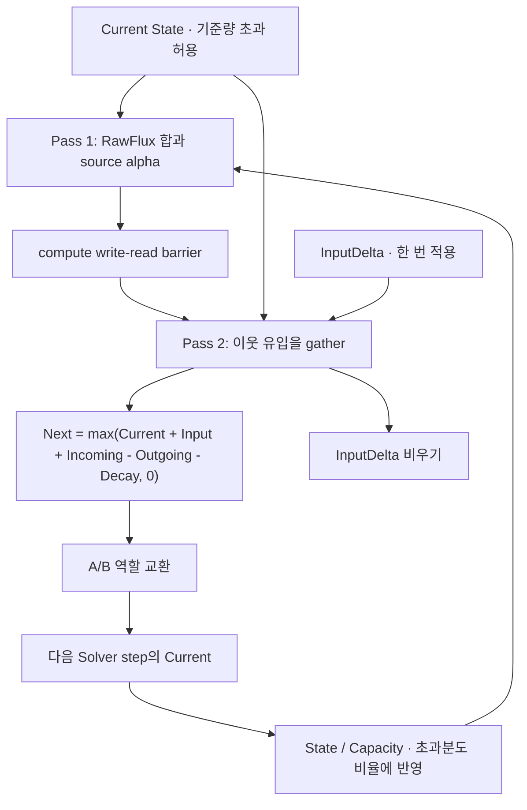

# Surface State Update

> **한 줄 요약:** 이 문서는 외부 접촉을 State 입력으로 바꾸는 구조와 각 항의 갱신 규칙을 함께 정의한다.

상태: **입력 구조·Transport Drive/Weight 분리 및 GeometryDrive 계약 확정** · 근거: [[05_ADR/Simulation/0015-Geometry-Driven-Transport|ADR 0015]], [[08_Assets/Documents/0004_Contact-Input.pdf|Contact Input]], [[08_Assets/Documents/0005_Next-State-Calculation.pdf|Next State 계산]]

이 문서는 외부 접촉을 State 입력으로 바꾸는 구조와 각 항의 갱신 규칙을 함께 정의한다.

> **계약과 구현:** 아래 갱신식은 [[05_ADR/Simulation/0020-State-Overcapacity-Transport|ADR 0020]]의 확정 계약이다. Shader에서 Saturation `[0,1]` clamp 및 Next의 Capacity 상한 clamp를 제거했다. 빌드는 통과했으며 초과량 보존의 GPU 실행 검증은 대기 중이다. GeometryDrive·TransferWeight와 기존 2-Pass 자원 구조는 유지한다.

## Contact Input

`State`는 Registry의 `TStateId`로 지정하며, 입력 적용 시 Registry를 통해 `ChannelIndex`로 해석한다. 입력 경로는 문자열이나 고정 enum에 의존하지 않는다.

외부 접촉은 `TSurfaceContactInput`으로 Surface State System에 전달한다.

```cpp
struct TSurfaceContactInput
{
    TSurfaceInstanceID   TargetInstance;
    TStateId              State;
    glm::vec3           WorldPosition;
    glm::vec3           WorldDirection;
    float               Radius;
    float               Strength;
    float               Falloff;
};
```

### ContactWeight

Input은 접촉 영역 전체에 동일하게 적용하지 않고, texel과 접촉 중심의 거리에 따라 `ContactWeight`를 적용한다.

$$
ContactWeight_i = Falloff\left(\frac{Distance_i}{Radius}\right)
$$

```text
Raycast
→ World Hit Position + Hit Triangle
→ Hit Triangle의 Simulation UV로 후보 texel 탐색
→ 각 후보 texel의 Surface Position과 Hit Position 사이 거리 계산
→ Distance / Radius
→ ContactWeight
```

`ContactWeight ∈ [0,1]`이며 반경 밖의 texel은 0으로 처리한다. `worldDirection`은 입력 방향 정보를 제공한다. 입사각 감쇠를 ContactWeight에 추가할지는 필수 규칙으로 정하지 않았다.



## 파라미터 접미사 네이밍 규칙

| 접미사 | 의미 | 시간과의 관계 | 일반적인 단위 |
|---|---|---|---|
| `Rate` | 단위 시간당 변화 속도 | 보통 `× Δt` | `/s`, `State/s`, `1/s` 등 |
| `Factor` | 입력·계산·변환 결과를 조절하는 계수 | 시간과 직접 관계 없음 | 보통 무차원 |
| `Weight` | texel·방향·인접 관계에서 적용하는 국소 가중치 | 시간과 직접 관계 없음 | 보통 `[0,1]` |

## 전체 State 갱신

$$
State_i^{t+1}
= max\left(
State_i^t + Input_i + Transport_i - Decay_i,
0
\right)
$$

$$
Transport_i = Incoming_i - Outgoing_i
$$

Input은 **Discrete Event**, Transport와 Decay는 **Continuous Update**로 처리한다.

| 항 | 처리 | `Δt` |
|---|---|---|
| Input | 이벤트 뒤 처음 실행되는 Solver Pass 2의 Next에 한 번 반영 | X |
| Transport | 시간 경과에 따른 State 이동 | O |
| Decay | 시간 경과에 따른 State 감소 | O |

다음 그림은 각 항이 Next State에 합쳐지는 설계 흐름이다. Transport의 Geometry 구동식은 아래에서 별도로 정의하며, 현재 구현 범위와의 차이는 [[0001_Engine-Structure|엔진 데이터 흐름]]에 적혀 있다.



## 1. Input

$$
Input_i = Strength \times ContactWeight_i \times InputFactor_i
$$

`ContactWeight` 정의는 위 절을 따른다.

## 2. Transport

$$
Incoming_i = \sum_j Flux_{j\rightarrow i}
$$

$$
Outgoing_i = \sum_j Flux_{i\rightarrow j}
$$

### Saturation

$$
Saturation_i = \frac{State_i}{stateCapacity_i}
$$

Saturation은 1을 초과할 수 있고 Transport에서 상한 clamp하지 않는다. 예를 들어 동일 Capacity=1인 두 이웃의 State가 `1.2`, `1.0`이면 SaturationDrive는 `0.2`다. 둘 다 `1.2`이고 GeometryDrive가 0이면 이 Drive도 0이다. Heatmap의 표시 정규화는 이 값에 영향을 주지 않는다.

### Raw Flux

Saturation 차이와 Geometry에 의한 전달을 독립적으로 계산한 뒤 합친다.

$$
RawFlux_{i\rightarrow j}
=
\left(
SaturationDrive_{i\rightarrow j}\cdot SaturationTransferRate_i
+
GeometryDrive_{i\rightarrow j}\cdot GeometryTransferRate_i
\right)
\cdot TransferWeight_{i\rightarrow j}
\cdot \Delta t
$$

$$
SaturationDrive_{i\rightarrow j}
=
max(Saturation_i - Saturation_j, 0)
$$

$$
GeometryDrive_{i\rightarrow j}
=
HeightDrive_{i\rightarrow j}
\cdot DirectionDrive_{i\rightarrow j}
$$

`HeightDrive`와 `DirectionDrive`는 각각 높이 차의 크기와 이웃 방향에 대한 중력 정렬도를 담당한다. 높이는 Macro Surface와 `MesoVirtualHeight`를 합친 뒤 instance transform을 반영한 world-length 값으로 평가한다.

$$
EffectiveHeight_i = MacroHeight_i + MesoVirtualHeight_i
$$

$$
HeightDrive_{i\rightarrow j} = |EffectiveHeight_i - EffectiveHeight_j|
$$

높이차를 인접 texel 거리로 나누지 않는다. 실제 이웃 간격은 `DistanceWeight`가 별도로 반영한다. 따라서 `HeightDrive`는 world-length 단위를 가지며, `DirectionDrive`와 `TransferWeight`는 무차원이다.

면 방향과 이웃 방향은 instance transform을 적용해 world space에서 평가한다. Non-uniform scale을 포함해 normal은 normal transform으로 변환한다. source 면에 투영된 중력과 source→target 이웃 방향의 일치도를 DirectionDrive로 사용한다.

DirectionDrive의 NormalWorld는 기본 ON에서 복원된 MesoNormal을 사용하며 sampled TransferNormal, macro normal 순으로 fallback한다. UI `DirectionDrive: MesoNormal`을 OFF로 두면 기본 mesh normal을 선택한다. 동적 적층 높이·법선은 아직 공급되지 않는다.

현재 Z-up 데모의 world gravity는 `(0, 0, -1)`이다. 따라서 유효 높이는 반대 방향인 world `+Z` 축으로 투영한다.

$$
GravityOnSurface_i = GravityWorld - NormalWorld_i \cdot (GravityWorld \cdot NormalWorld_i)
$$

$$
DirectionDrive_{i\rightarrow j} =
\begin{cases}
max(0, normalize(GravityOnSurface_i) \cdot normalize(WorldPosition_j - WorldPosition_i)), & |GravityOnSurface_i| > \epsilon \\
0, & otherwise
\end{cases}
$$

중력 투영 방향과 이웃 방향이 맞는 source→target flux가 커지고, 반대 방향 flux는 0이 된다. `GeometryTransferRate` 단위는 `State / (world-length · second)`이며, `GeometryDrive × GeometryTransferRate × Δt`는 State 단위 flux를 만든다.

이 정의는 기존 [[05_ADR/Simulation/0002-Transport-Drive-and-Weight|ADR 0002]]의 역할 분리를 구체화한다. `DirectionDrive`는 source 면에 투영한 gravity와 이웃 방향을 비교하고, `NormalWeight`는 이웃 두 면 사이의 Normal 차이를 통해 경로 통과성을 조절하므로 역할이 다르다. `DistanceWeight`만 이웃의 실제 표면 간격 효과를 별도로 반영한다.

### TransferWeight

`GeometryDrive`가 **이동을 발생시키는 방향·구동력**이라면, `TransferWeight`는 **그 이웃 관계를 실제 State가 얼마나 잘 통과하는지** 보정한다.

$$
TransferWeight_{i\rightarrow j}
=
W_{distance}
\cdot W_{normal}
\cdot W_{curvature}
\cdot W_{profileBoundary}
$$

| Weight | 의미 | 계산 기준 |
|---|---|---|
| `DistanceWeight` | 주변 이웃보다 먼 연결의 전달량을 낮춤 | 정규화된 world-space Surface Distance |
| `NormalWeight` | 이웃 texel의 유효 표면 방향 차이가 클수록 전달량을 낮춤 | 복원된 MesoNormal을 우선 사용하고 sampled TransferNormal, geometric normal 순으로 fallback한 뒤 instance inverse-transpose를 적용한 world normal 내적 |
| `CurvatureWeight` | 기본 OFF는 고정 `1.0`; ON은 사전 계산된 Meso mean curvature 크기로 감쇠 | 대칭 mesh-local 간선 가중치, [[05_ADR/Simulation/0019-Optional-Curvature-Transfer-Weight\|ADR 0019]] |
| `ProfileBoundaryWeight` | 같은 Profile 사이 `1.0`, 다른 Profile 사이 고정 `0.5`로 전달량을 낮춤 | SRProfile ID 비교 |

현재 `DistanceWeight`는 각 endpoint의 평균 유효 이웃 간격을 `dRef`로 삼는다. `dRef(i,j) = 0.5 × (meanDistance_i + meanDistance_j)`이고, `d(i,j)`는 두 texel의 world-space 거리다.

$$
DistanceWeight_{i\rightarrow j} = clamp\left(\frac{dRef(i,j)}{d(i,j)}, 0, 1\right)
$$

유효 이웃 간격이나 endpoint 거리가 epsilon 이하이거나 유한하지 않으면 가중치를 0으로 둔다. 거리는 MesoVirtualHeight와 향후 AccumulationHeight를 반영한 최신 유효 Position 및 Neighbor 관계로 계산한다. 초기 구현은 즉시 계산하며, 확정된 최적화 설계는 [[04_Architecture/0007_Surface-Solver-Cache|Surface Solver Cache]]에 따라 간선별 TransferWeight와 Pass 1의 RawOutgoing를 저장해 재사용한다. 이 캐시 경로는 구현되어 있다.

$$
NormalWeight_{i\rightarrow j} = clamp\left(NormalWorld_i \cdot NormalWorld_j, 0, 1\right)
$$

두 normal은 최신 변형 Geometry의 normal에 instance transform의 inverse-transpose를 적용한 뒤 정규화한다. 유효하지 않은 normal은 가중치 0으로 처리한다. `ProfileBoundaryWeight`는 별도 Profile parameter가 아닌 Solver 공통 규칙이다. 거리·법선·Profile 경계 식과 곡률 보류 범위는 [[05_ADR/Simulation/0016-Transport-Transfer-Weights|ADR 0016]]을 따른다.

UV Seam은 Profile Boundary와 다른 문제다. 같은 실제 Surface가 UV에서 끊어진 경우에는 전달 가중치를 약화하는 것이 아니라 **올바른 실제 이웃 texel을 연결**한다. 생성 방식은 [[06_Development/Notes/0000_Surface-Simulation-Mapping|Surface Simulation Mapping]]을 따른다.

### 보유량 제한과 alpha

Decay를 먼저 고려한 뒤 보유량보다 많은 Outgoing이 발생하지 않게 모든 Outgoing Flux를 동일 비율로 줄인다. Capacity를 넘은 State도 전체 보유량으로 사용하며 목적지의 남은 공간은 검사하지 않는다.

$$
AvailableState_i = max(State_i - Decay_i, 0)
$$

$$
\alpha_i =
\begin{cases}
1, & RawOutgoing_i = 0 \\
min\left(1, \frac{AvailableState_i}{RawOutgoing_i}\right), & RawOutgoing_i > 0
\end{cases}
$$

$$
Flux_{i\rightarrow j} = \alpha_i \cdot RawFlux_{i\rightarrow j}
$$

2-Pass + `alpha` 저장의 GPU 계산 순서는 [[06_Development/Notes/0002_Next-State-Calculation|Next State 계산 메모]]를 본다.

### Capacity 초과량의 후속 전달

Capacity는 포화 기준량이고 저장 상한이 아니다. 입력과 여러 이웃의 Incoming이 기준량을 넘으면 전체 결과를 Next State에 기록한다. 초과량은 `max(State - Capacity, 0)`으로 필요할 때 구하며 추가 버퍼로 저장하지 않는다.



| 단계 | 초과량 처리 | 유지하는 자원·동기화 |
|---|---|---|
| Pass 1 | 전체 Current를 가용량으로 사용하고 기존 RawFlux·alpha 계산 | RawOutgoing, OutgoingFluxScale |
| Pass 2 | 자신의 Next에 전체 합을 기록. 받는 texel의 공간 제한 없음 | State A/B, InputDelta, 기존 gather |
| 다음 step | 받은 양을 포함한 Current로 RawFlux 계산 | 기존 ping-pong 및 두 pass 사이 barrier |

alpha는 source가 가진 양 이상을 보내지 않도록 하는 비율이며 최대 1이다. 초과량을 강제로 전량 내보내는 추가 항은 없다. 이번 step에 받은 양을 같은 step 안에서 다시 넘기지 않으며 후속 이동은 다음 Solver step의 rate·TransferWeight·Δt에 따른다. 이웃이 없거나 rate/weight가 0이면 초과량이 남는다. 모든 이웃의 Saturation이 같고 GeometryDrive가 0이면 초과 상태라도 전달되지 않는다.

추가 Overflow buffer·채널·수용 비율(beta)·pass는 없다. 입력·Decay가 없고 지원되는 닫힌 이웃 graph에서는 같은 Flux를 source에서 빼고 target에 더하는 총량 장부를 검증한다. Capacity 상한에 의한 손실을 제거해도 큰 Δt의 안정성·FPS 독립성·물리 질량 보존이 자동 보장되지는 않는다.

## 3. Decay

$$
Decay_i
=
DecayRate_i
\cdot
\left(1 - ConcavityWeight_i\cdot CavityRetentionFactor_i\right)
\cdot \Delta t
$$

$$
Decay_i = min(Decay_i, State_i)
$$

`ConcavityWeight`는 현재 texel이 얼마나 오목한지를 나타내는 `[0,1]` 값이다. Solver의 형상 입력 저장 방식은 [[06_Development/Notes/0003_Surface-State-GPU-Resource|Surface State GPU Resource]]에서 다룬다.
