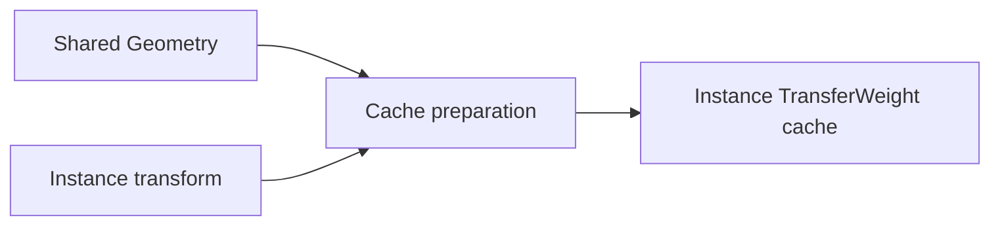
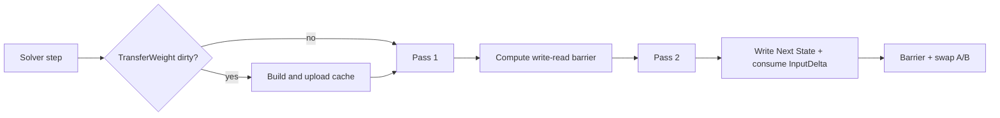
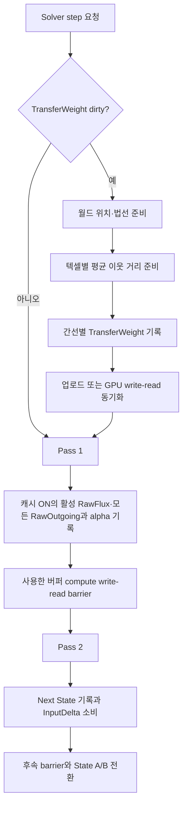

# Simulation Optimization

> **한 줄 요약:** 현재 Solver는 TransferWeight 캐시와 Pass 1의 RawOutgoing·방향별 RawFlux를 재사용한다.

상태: **구현 및 GPU 기능 검증 완료 · 실제 Scene 성능 개선은 미확정**
근거: [[05_ADR/0017-Solver-Transfer-Cache|ADR 0017]], [[../06_Development/Notes/Surface-State-GPU-Resource|Surface State GPU Resource]]

---

초기 Solver는 간선 가중치와 RawOutgoing 합계를 즉시 계산하고 재사용하지 않았다. 현재 Solver는 TransferWeight cache와 Pass 1의 RawOutgoing 합계를 재사용하며, 방향·채널별 RawFlux와 공유 역방향 슬롯 정보도 보관한다 ([[05_ADR/0021-Directional-RawFlux-Cache|ADR 0021]]). 수식은 [[04_Architecture/0006_Surface-State-Update|Surface State Update]]를 유지한다.

## 현재 적용된 성능 최적화

| 범위 | 현재 처리 | 줄이는 비용 |
|---|---|---|
| TransferWeight | Instance별로 준비한다. 정적 형상에서 순수 translation·rotation은 재사용하고 scale·가중치 설정이 바뀔 때 갱신한다. Scene 형상 교체는 새 resource를 만든다. | RawFlux 내부의 반복 `DistanceWeight`·`NormalWeight` 계산 |
| RawOutgoing | Pass 1 합계를 저장하여 Pass 2가 재사용 | 자기 outgoing 합계의 재계산 |
| 방향별 RawFlux | 선택적으로 ON에서 활성 source의 8개 슬롯을 저장하고 Pass 2가 이웃 source의 역방향 값을 읽음. 기본값은 OFF | incoming의 RawFlux·GeometryDrive 재평가 |
| Pass 1 source 계산 | 지원 여부·Profile·Saturation은 channel당 준비, source 법선 변환·중력 투영·위치는 geometry를 쓰는 invocation당 한 번 준비 | 같은 source를 이웃 8개·여러 채널에서 반복 준비하는 비용 |
| instance 계산 | CPU가 solver dispatch당 선형 행렬·inverse-transpose·gravity up을 준비해 128-byte push constant로 전달 | 텍셀별 공통 행렬 계산 |
| 비활성 source | unsupported/invalid, 감쇠 후 가용량=0 또는 dt=0이면 RawOutgoing·alpha만 0으로 기록 | outgoing 평가와 8개 RawFlux 슬롯의 불필요한 0 쓰기 |
| 시뮬레이션 해상도 | Low 128, Medium 256, High 512, 기본 Medium | Surface별 texel 수와 이에 비례하는 작업·버퍼 payload |

- 모든 texel은 dispatch 대상이며 invocation 분기로 비싼 source 계산을 생략한다.
- 빈 target도 Pass 2에서 incoming·InputDelta·Next를 처리한다. 별도 활동 mask나 추가 pass는 없다.
- 캐시 ON/OFF와 해상도 선택 UI는 [[0010_UI-Interface|UI Interface]]를 따른다.
- Buffer 배치와 유효성은 [[0008_Surface-GPU-Data-Layout|GPU Data Layout]]을 따른다.
- 성능 개선률은 State 분포와 GPU에 따라 달라진다. 측정 기록은 [[../06_Development/Experiments/0003_Pass1-Cost-Analysis|Pass 1 비용 분석]], [[../06_Development/Experiments/0004_RawFlux-Cache-Comparison|초기 ON/OFF 비교]], [[../05_ADR/0025-Inactive-RawFlux-Write-Elision|비활성 쓰기 생략의 전후 검증]]에 조건별로 정리한다.

## 초과량 보존 계약과 구현 상태

전체 State A/B를 유지하고 Capacity를 포화 기준량으로 사용한다 ([[05_ADR/0020-State-Overcapacity-Transport|ADR 0020]]).

- 상한 없는 Saturation과 Next State 식을 Shader에 구현했다.
- Build가 통과했다. GPU 회귀에서 source 유출 제한, 여러 이웃의 초과 유입 보존, 서로 다른 Capacity, 입력 소비를 확인했다.
- RawOutgoing·alpha·TransferWeight cache와 기존 두 pass·barrier는 유지한다.
- 추가 GPU payload는 `0 B`다.

State 변화와 Capacity 수치 편집은 RawFlux에 영향을 주므로 RawFlux·RawOutgoing와 alpha를 다음 Pass 1에서 다시 계산한다. TransferWeight는 이 수치에 의존하지 않아 캐시를 무효화하지 않는다. Profile ID 배치·Geometry 변경에 따른 기존 invalidation은 유지한다.

## 면적 환산과 반복 step의 비용

instance별 월드 면적은 `float32 × texelCount`, padding 없이 texel당 4 B다. 6 Surface, channel 수와 무관한 면적 buffer만 계산하면 Low 0.375 MiB, Medium 1.5 MiB, High 6 MiB다. Vulkan allocation overhead는 제외한다. CPU shared geometry/cache에는 면적 벡터 `float32×3`가 추가되며 GPU 공유 geometry stride는 유지한다.

면적은 선형 transform 변경 시 갱신하고 step마다 기하 면적을 재계산하지 않는다. Geometry mobility는 기존 source saturation을 재사용하므로 pass를 추가하지 않는다.

실제 시간을 누적해 frame당 최대 8 Solver step을 실행한다. 기본 Fixed ON·Auto OFF는 1/60초 구간을 사용하며, Auto ON에서만 Transport 시간 상한의 CPU 계산을 호출한다. 상한은 Profile·term·transform 변경에 따라 갱신한다. Auto ON의 고정 구간이 한도에서 끊기면 다음 frame에서 재개한다.

RawFlux cache는 **step 안에서** 재사용하며 step 사이에는 바뀐 State로 갱신한다. GPU 시간은 frame의 모든 반복 합이다. 작은 간격을 요구하면 GPU 비용과 backlog가 늘 수 있으므로 성능 개선과 시뮬레이션 시간 추종을 분리해서 측정한다. [[../05_ADR/0034-Fixed-Timestep-and-Auto-Substepping|ADR 0034]]


## 소유권과 값의 수명

### 회전 시 TransferWeight 유지 — 구현

현재 GPU resource manager는 `TTransform.Scale`이 달라질 때 TransferWeight와 WorldTexelAreas를 다시 만든다. 정적 Geometry와 크기가 고정된 순수 translation·rotation에서는 두 값을 유지한다. 강체 회전은 이웃 거리, 법선 내적, mesh-local 곡률 및 월드 텍셀 면적을 보존한다.

- 회전 중에도 Solver는 최신 model 행렬과 World Gravity를 사용해 월드 높이 차와 중력 방향을 GPU에서 매 step 계산한다.
- 실제 캐시 입력이 변해 CPU가 buffer를 갱신할 때만 queue idle과 업로드를 수행한다.
- 크기 또는 가중치 규칙이 바뀌면 정적 캐시를 갱신한다. Scene의 형상·배치 변경은 resource 교체로 반영하며, 동적 적층 형상은 별도 GPU 경로에서 처리한다.
- Auto substepping 상한의 CPU 계산은 별도 캐시이며 회전 시 다시 계산한다. 회전별 중력값 사전 계산은 별도 최적화다 ([[05_ADR/0043-Rotation-Invariant-Transfer-Cache|ADR 0043]], [[../03_Planning/03_Future-Plans/0001_Angle-Sampled-Gravity-Cache|각도별 중력 캐시 후속 검토]]).

### TransferWeight cache 생성



### Step 임시값의 생산과 소비




- 공유 Geometry는 Mesh-local Position·Normal과 texel별 `MesoVirtualHeight`를 보유한다.
- Instance transform으로 world-space 유효 위치를 만든다. 동적 적층 도입 후에는 Accumulation Geometry도 합친다.
- `DistanceWeight`와 `NormalWeight`는 변형이 반영된 최신 위치·normal에서 계산한다.
- Transform이 instance마다 다르므로 cache도 instance별이다.
- Channel과 독립인 TransferWeight는 State 종류가 늘어도 크기가 늘지 않는다.

### 인스턴스별 지속 캐시

| 값 | 원소 타입·인덱스 | 갱신 조건 | 소비 위치 |
|---|---|---|---|
| TransferWeight | float32, `texel × 8 + slot` | 최초 생성, MesoVirtualHeight/AccumulationHeight를 반영한 유효 위치·normal revision, 이웃·Surface/Profile 배치, instance 선형 변환, weight 규칙 변경 | Pass 1 rawFlux |
| DynamicConcavityWeight | float32, `texel` | Accumulation Geometry Update에서 해당 texel 또는 이웃 형상이 변경될 때, 전체 재계산 요청 때 | Decay와 방향별 cavity transport |

### 인스턴스별 step 임시 결과

| 값 | 원소 타입·인덱스 | 갱신 조건 | 소비 위치 |
|---|---|---|---|
| RawFlux | float32, `slot × TexelCount × ChannelCount + texel × ChannelCount + channel` | 캐시 ON의 활성 source에 대해 Pass 1이 매 step 모든 슬롯 갱신 | Pass 2가 alpha>0인 이웃 source의 역방향 incoming 조회 |
| RawOutgoing | float32, `texel × ChannelCount + channel` | 매 실행 step의 Pass 1 | Pass 2 자신의 outgoing 계산 |
| OutgoingFluxScale | 기존 float32, 동일 인덱스 | 매 실행 step의 Pass 1 | Pass 2 자신의 outgoing와 이웃 incoming 제한 |

비활성 texel-channel의 RawOutgoing·alpha는 Pass 1에서 0으로 기록하며 RawFlux는 갱신하지 않는다. 활성 source는 캐시 ON에서 8개 슬롯을 모두 기록하며 invalid 이웃이나 rate/weight=0인 간선은 0으로 덮어쓴다. 특히 활성 source의 RawOutgoing=0 경로는 alpha=1이므로 해당 0 쓰기를 유지한다.

- RawFlux는 생성·reset 시 clear하지 않는다.
- Pass 2는 **RawFlux를 읽기 전에 source alpha를 검사**한다. alpha=0이면 stale·미초기화 슬롯을 읽지 않는다.
- 값을 먼저 읽고 0을 곱하는 방식은 NaN에 안전하지 않으므로 alpha 검사를 유지한다.
- 다시 활성화된 source는 다음 Pass 1이 모든 슬롯을 새로 기록한다.
- 공유 `ReverseNeighborSlots`는 texel당 uint32 하나에 슬롯별 4 bit를 사용한다. 이웃에서 자신을 가리키는 슬롯 0–7 또는 invalid `0xf`를 보관한다.
- Topology 생성 때 CPU에서 역방향 슬롯을 준비하므로 UV seam에서도 고정 반대 방향을 가정하지 않는다.
- RawOutgoing·alpha는 매 step 덮어쓴다. Pause 중에는 직전 step 값이며 다음 Pass 1 전에는 현재 step 값으로 소비하지 않는다.

### TransferWeight cache builder의 준비용 계산값

| 값 | 계산 | 수명 |
|---|---|---|
| Normal matrix | 인스턴스 선형 행렬의 inverse-transpose와 유효성 판정 | instance 선형 변환 또는 유효 형상 normal 갱신 시 한 번 |
| 월드 위치·법선 | 유효 displaced Position과 갱신 normal에 instance 변환 적용 | 캐시 준비 동안 재사용 |
| MeanNeighborDistance | 최신 유효 위치 기준, 유효한 최대 8개 이웃까지의 월드 거리 평균 | 텍셀당 한 번 계산해 간선 가중치 준비에 재사용 |

- Cache builder는 공유 Geometry의 유효 local position `Position + Normal × MesoVirtualHeight`에 instance transform을 적용해 world position을 만든다.
- Instance inverse-transpose로 world normal을 계산한다.
- Texel마다 유효 이웃까지의 평균 거리를 한 번 구한 뒤 슬롯별 TransferWeight를 만든다.
- CPU scratch: WorldPositions, WorldNormals, MeanNeighborDistances, validity flags
- AccumulationHeight와 동적 normal 갱신은 아직 Runtime에 없다. 구현 시 cache builder 입력과 invalidation에 연결한다.

Cache는 resource 생성 시 준비한다. `TSurfaceStateSystem::RecordStep`은 다음을 수행한다.

1. Instance의 3×3 선형 transform이 cache 생성 당시 값과 달라졌는지 확인한다.
2. Dirty instance가 있으면 Graphics queue를 idle시킨다.
3. 해당 cache를 CPU에서 재생성해 host-visible buffer에 업로드한다.

순수 translation은 비교하지 않으므로 cache를 다시 만들지 않는다.

- Geometry, topology 또는 Profile ID layout 수정 경로는 `InvalidateTransferWeightCache`를 호출해 명시적으로 무효화한다.
- 현재 Profile parameter UI는 index 배치를 바꾸지 않으므로 cache를 무효화하지 않는다.

## 준비와 Solver 실행

### Dirty cache 준비와 Solver 실행



Accumulation Geometry Update는 동적 위치·normal을 기록한 뒤 같은 dirty 대상에서 texel별 concavity를 한 번 계산해 cache에 쓴다. Solver는 dynamic feedback이 켜진 동안 그 값을 읽으며, 꺼진 동안에는 공유 정적 GeometryScalar 값을 읽는다.

Pass 1은 source의 감쇠 후 가용량을 먼저 확인한다. 비활성 source는 RawOutgoing·alpha만 0으로 갱신하고 RawFlux 평가·기록을 생략한다. 활성 source는 RawFlux 합과 가용량으로 alpha를 구한다. Pass 2는 모든 유효 target에서 저장된 RawOutgoing·alpha로 outgoing을 계산하고 incoming·입력·감쇠를 반영한다.

- Cache ON은 활성 source의 RawFlux를 저장한다. Pass 2는 이웃 alpha가 양수일 때 공유 역방향 슬롯으로 저장값을 읽는다.
- Cache ON에서는 incoming의 RawFlux·GeometryDrive를 재계산하지 않는다.
- Cache OFF는 RawFlux 읽기·쓰기를 생략하고 Pass 2에서 같은 source→target 값을 재평가한다.
- 두 모드 모두 실제 source의 역방향 슬롯에 대응하는 TransferWeight를 사용한다.
- Saturation과 GeometryDrive 방향 때문에 RawFlux의 양방향 값은 달라질 수 있다.
- 상호 이웃 연결은 Mapping validation 계약이다. 역방향 슬롯이 invalid이면 gather를 건너뛴다.

```text
RawOutgoing_i = inactive_i ? 0 : Σ RawFlux(i→j)     // Pass 1
alpha_i = inactive_i ? 0 : (RawOutgoing_i > 0 ? min(1, Available_i / RawOutgoing_i) : 1)
Outgoing_i = StoredRawOutgoing_i × alpha_i          // Pass 2
Incoming_i = Σ_{j: alpha_j > 0} StoredRawFlux(j, channel, ReverseSlot(i→j)) × alpha_j
Next_i = max(Current_i + InputDelta_i + Incoming_i - Outgoing_i - Decay_i, 0)
```

- 무효 Geometry, 거리 epsilon, 퇴화한 법선은 가중치 0으로 처리한다 ([[05_ADR/0016-Transport-Transfer-Weights|ADR 0016]]).
- Dirty cache는 해당 buffer upload 뒤에만 dispatch한다.
- Transform 변경으로 CPU가 cache를 덮어쓰기 전에 Graphics queue를 idle시켜 이전 GPU read 완료를 보장한다.
- Pass 1 뒤 alpha·RawOutgoing에 write→read barrier를 적용한다. 캐시 ON에서는 RawFlux도 포함한다.
- Pass 2 뒤 다음 step의 write 재사용을 위한 read→write dependency를 적용한다. 캐시 OFF에서는 RawFlux를 제외한다.
- Descriptor binding은 [[0008_Surface-GPU-Data-Layout|Surface GPU Data Layout]]에 정리한다.

## RawFlux 캐시 ON/OFF 실행 경로

두 compute pass 각각 캐시 ON/OFF용 pipeline을 미리 생성한다. shader specialization constant 0으로 사용하지 않는 경로를 제거하고, CPU의 SolverFlags bit 5로 pipeline 및 RawFlux barrier 포함 여부를 선택한다. 두 모드 모두 source 재사용·가용량 검사·기존 두 pass를 유지하므로 캐시 접근과 incoming 재평가의 차이를 비교할 수 있다.

- 전환 전에 이전 GPU 작업 완료를 기다린 뒤 모드를 바꾸고 기존 timestamp·UI 평균을 폐기한다.
- State·A/B 방향·입력·buffer 할당은 유지한다. Scene resource 재구성 뒤에도 모드를 다시 적용한다.
- OFF에서도 RawFlux와 공유 역방향 슬롯 메모리는 유지한다. VRAM 절감 기능이 아니라 실행 비용 비교 기능이다.
- 고정 시간 간격, 같은 initial State·입력·설정·warmup 조건으로 비교한다.

## Virtual Geometry 경계

- Shared geometry는 MesoVirtualHeight를 보유한다. `Accumulation feedback`이 ON이면 instance별 DynamicGeometry buffer에 현재 State에서 계산한 displaced position과 갱신 normal을 매 step 생성한다.
- Runtime dynamic TransferWeight pass는 이 위치·normal과 재구성된 곡률로 edge cache를 매 step 다시 쓴다. OFF에서는 기존 CPU cache를 유지한다.
- `DistanceWeight`와 `NormalWeight`는 feedback ON에서 base Position/Normal이 아닌 현재 유효 형상을 사용한다.
- 유효 위치는 `BasePosition + BaseNormal × (MesoVirtualHeight + AccumulationHeight)`를 instance transform으로 변환해 구한다.
- 유효 normal은 동적 Geometry 갱신 결과에 instance inverse-transpose를 적용한다.
- GeometryDrive의 유효 높이와 방향도 최신 가상 형상과 gravity를 사용한다.

- Feedback ON에서 적층 높이는 매 step State로부터 다시 계산하므로 동적 geometry와 TransferWeight 갱신도 매 step 수행한다.
- Geometry update와 normal 생성은 cache preparation보다 먼저 끝나야 하며, GPU 경로 사이 write→read barrier를 보장한다.
- Feedback OFF의 정적 cache invalidation은 기존대로 유지한다. Feedback ON은 매 step GPU pass에서 덮어쓴다.
- Gravity 변경은 GeometryDrive만 바꾸므로 TransferWeight cache는 무효화하지 않는다.

## 메모리와 예상 연산량

| 방안 | 선택 | 추가 payload | 갱신 조건 | 연산 상한 변화 |
|---|---|---|---|---|
| TransferWeight 캐시 | 구현 | 인스턴스당 48 MiB | 생성, 선형 transform 변경, 명시적 geometry invalidation | cache가 유지되는 동안 Solver 내 중첩 평균 거리 순회를 제거. CPU rebuild당 텍셀별 평균 거리 계산 1회 |
| RawOutgoing 저장 | 구현 | 인스턴스당 채널당 6 MiB | 매 step | rawFlux 상한 24→16회/텍셀·채널 |
| 간선별 RawFlux | 구현 | 인스턴스당 채널당 48 MiB | 매 step | 직전 구현의 rawFlux 16→8회/텍셀·채널, Pass 2 재평가 제거 |
| 역방향 슬롯 | 구현 | 공유 Geometry당 6 MiB | topology 생성 때 | 매 step 이웃의 역방향 슬롯 탐색 제거 |
| DynamicGeometry | feedback ON | 인스턴스당 32 B × texel 수 | 매 step | Meso+적층 position/normal, geometry 및 edge-weight compute dispatch 2회 |

- 메모리 추정 가정: 6 Surface × 512×512, 이웃 8개, float32, 원소 padding 없음
- DynamicGeometry는 local position·normal 각 16-byte `vec4`, texel당 32 byte이며 instance별이다. 256×256 texel의 단일 instance는 2 MiB, 512×512은 8 MiB다. 옵션 OFF에서도 descriptor 계약을 위해 buffer는 할당 상태로 유지한다.
- Registry가 채널 수를 결정하며 데모 측정은 1채널이다.
- TransferWeight·RawOutgoing·RawFlux payload는 인스턴스당 총 102 MiB다.
- 역방향 슬롯은 uint32 원소에 8개 슬롯의 4 bit를 pack한다. 공유 Geometry당 6 MiB를 추가한다.
- 이번 변경의 증가분은 인스턴스·채널당 48 MiB와 공유 Geometry당 6 MiB다. Allocator alignment와 CPU scratch는 제외하며 invalid 슬롯도 할당한다.
- Cache 준비 시 최신 유효 위치로 평균 이웃 거리를 texel당 한 번 계산하고, edge별 weight를 최대 8개 계산한다.
- Feedback ON에서는 cache 입력에 MesoVirtualHeight와 모든 지원 State의 AccumulationHeight를 사용한다.
- 이로써 매 step마다 하던 endpoint별 평균 거리 재계산을 cache 준비 시 texel당 한 번으로 줄인다.
- 모든 texel과 neighbor가 valid한 경우의 source 수준 상한이다. Compiler 최적화나 실제 GPU 시간은 뜻하지 않는다.

가중치 cache가 유효한 step에서는 준비 비용이 없다. 선형 transform이 매 step 달라지면 매 step CPU 준비와 queue idle 비용이 발생하므로 성능 측정에서 별도 보고해야 한다. Edge별 RawFlux 저장은 직전 구현의 최대 16회에서 8회로 줄고, 초기 24회 기준으로는 최종 8회다. 호출 상한 감소를 실제 Scene FPS 개선률로 해석하지 않는다. 측정 조건과 결과를 기록한다 ([[05_ADR/0021-Directional-RawFlux-Cache|ADR 0021]]).

## 후속 최적화 후보: 대칭 TransferWeight의 공유 저장

현재 설계는 `texel × neighborSlot`마다 TransferWeight를 저장한다. 양방향 슬롯에 같은 값을 각각 보관하므로 payload는 약 48 MiB다. 현재 식은 endpoint 순서를 바꾸어도 대칭이다.

- DistanceWeight는 endpoint 거리와 양 endpoint의 평균 간격으로 계산한다.
- NormalWeight는 normal 내적으로 계산한다.
- ProfileBoundaryWeight는 같은 Profile인지 비교한다.
- 따라서 `TransferWeight(A→B) = TransferWeight(B→A)`다.

후속 최적화에서는 무방향 edge당 weight 하나를 저장해 양방향 flux가 공유할 수 있다. RawFlux는 Saturation 차이와 GeometryDrive 방향에 따라 달라질 수 있어 공유하지 않는다. 결과 수식은 유지하고 cache 주소 표현만 바꾸는 변경이다.

- 무방향 edge array를 읽으려면 edge mapping이 필요하다.
- 모든 neighbor slot에 32-bit edge ID를 추가하면 index buffer가 커져 weight 절감분을 상쇄할 수 있다.
- 압축 순번과 texel별 시작 offset은 가능한 주소 방식의 예이며 현재 구현 계약은 아니다.
- 주소 계산 비용, 유효 edge 수, buffer 크기, Solver GPU 시간을 측정한 뒤 적용 여부를 결정한다.
- 이번 브랜치에서는 방향별 slot cache를 사용하고 무방향 공유 저장은 보류한다.

## 검증 계약

- 같은 입력의 최적화 전후 Next State, RawOutgoing, alpha, 총 State를 허용 오차로 비교한다.
- 검증 사례: invalid/unsupported, seam, 다른 Capacity/Profile, 큰 전달률, 비균일 scale, transform 변경, Virtual Height 변경, 중력 변경
- Cache invalidation 조건별 갱신과 unchanged step의 재사용을 확인한다.
- 같은 build/device/scene/해상도/channel/State와 충분한 warm-up을 사용해 GPU 시간 반복 표본을 기록한다.
- Cache 준비 시간과 steady-state 시간을 나누고 Validation 오류를 확인한다.

## GeometryDrive 반복 계산 축소 (2026-09-28)

초기 구현은 Pass 1의 각 invocation에서 instance inverse-transpose와 gravity의 높이 축을 준비했다. CPU가 이를 dispatch당 한 번 준비해 128-byte push constant로 전달하도록 변경했다 ([[05_ADR/0022-Pass1-Source-Reuse|ADR 0022]]).

- 실제 geometry 전달이 필요한 channel이 있을 때 source normal 변환·정규화, 중력 투영 방향, displaced source 위치를 invocation당 한 번 준비한다.
- Source Saturation·Profile parameter·지원 여부는 channel당 재사용한다.
- RawFlux의 GeometryDrive는 mesh-local displaced endpoint 차이를 instance 선형 변환해 높이차와 방향에 함께 사용한다. Translation은 상쇄된다.
- 기본 ON에서는 MesoNormal의 binding 17을 읽는다. `DirectionDrive: MesoNormal`이 OFF이면 macro normal의 binding 3을 읽는다.
- 선택은 push constant flag bit 4로 Pass 1 계산에 적용하며 TransferWeight cache를 무효화하지 않는다.
- 재사용 값은 invocation-local이며 별도 GPU buffer는 추가하지 않는다.
- 여러 channel의 edge GeometryDrive를 배열로 재사용하는 후보는 1-channel에서 안정적인 개선이 없어 채택하지 않았다.

DistanceWeight·NormalWeight·ProfileBoundaryWeight 옵션 변경은 TransferWeight cache를 무효화한다. 각 pass의 timestamp 시작·끝은 compute stage로 맞춘다. 이는 동일 stage 완료 경계 사이의 측정이며 driver latch 특성과 barrier overhead가 있어 순수 ALU 시간은 아니다.

## 빈 Source의 incoming 계산 생략 — 초기 구현

- Pass 2는 이웃 source의 Current State≤0, alpha≤0 또는 edge TransferWeight≤0이면 incoming RawFlux 평가를 생략한다.
- State는 비음수이고 alpha는 감쇠 후 보유량으로 제한되므로 이 경우 실제 전달량은 0이다.
- Pass 1의 RawOutgoing·alpha 계산과 기록은 유지한다.
- Event Input은 Transport 뒤에 적용한다. 빈 source에 이번 step에서 들어온 입력은 다음 step부터 전달하며 InputDelta는 기존대로 소비·clear한다.
- Pass 2의 inverse-transpose 준비는 첫 유효 incoming 평가까지 미룬다. 추가 buffer와 barrier는 없다.
- 절감 효과는 빈/감쇠 State 분포에 따라 달라지며 State가 넓게 퍼질수록 작아진다.

Pass 2는 RawFlux를 재평가하는 대신 저장된 값을 gather한다 ([[05_ADR/0021-Directional-RawFlux-Cache|ADR 0021]]). alpha가 0 이하인 source는 gather를 생략한다. 이벤트 입력 소비 시점은 유지하며 빈 source의 새 입력은 다음 step에서 이동한다.

초기 구현은 texel·channel의 감쇠 후 가용량이 0이거나 dt=0이면 RawFlux 평가를 생략하고 8개 RawFlux 슬롯·RawOutgoing·alpha를 0으로 기록했다 ([[05_ADR/0022-Pass1-Source-Reuse|ADR 0022]]). 이후 unsupported/invalid, 가용량=0 또는 dt=0 경로에서 RawOutgoing·alpha만 0으로 기록하고 RawFlux 쓰기는 생략하도록 바꿨다 ([[05_ADR/0025-Inactive-RawFlux-Write-Elision|ADR 0025]]).

- RawFlux는 alpha가 양수인 source에 대해서만 현재 step 값이 보장된다.
- Pass 2의 이웃 유입·이벤트 입력·Next 갱신은 계속 수행한다.
- 별도 활동 마스크나 pass는 추가하지 않는다.
- 제한 전 RawOutgoing과 alpha의 debug 표시는 초기 구현과 다를 수 있지만 실제 outgoing과 Next State는 보존한다.
