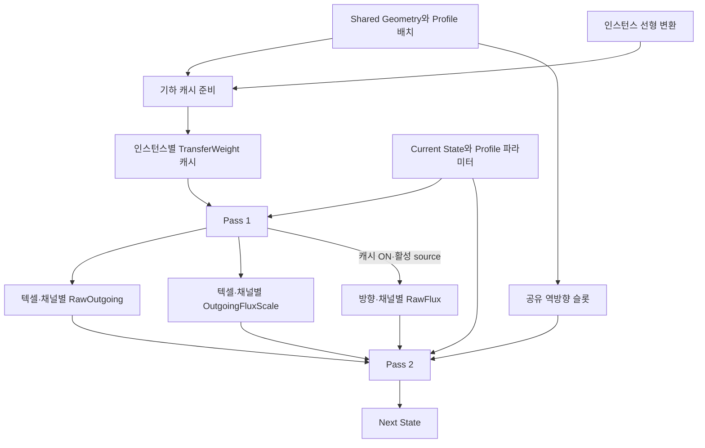
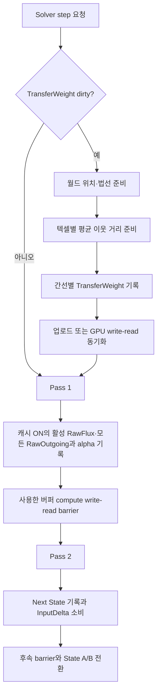

# Surface Solver Cache

> **한 줄 요약:** 현재 Solver는 TransferWeight 캐시와 Pass 1의 RawOutgoing·방향별 RawFlux를 재사용한다.

상태: **구현 및 GPU 기능 검증 완료 · 실제 Scene 성능 개선은 미확정** · 근거: [[05_ADR/Simulation/0017-Solver-Transfer-Cache|ADR 0017]], [[../06_Development/Notes/0003-Surface-State-GPU-Resource|Surface State GPU Resource]]

초기 Solver는 간선 가중치와 RawOutgoing 합계를 즉시 계산하고 재사용하지 않았다. 현재 Solver는 TransferWeight cache와 Pass 1의 RawOutgoing 합계를 재사용한다. 초기 캐시는 RawOutgoing 합계만 보관했다. [[05_ADR/Simulation/0021-Directional-RawFlux-Cache|ADR 0021]]부터 방향·채널별 RawFlux와 공유 역방향 슬롯 정보도 보관한다. 수식은 [[04_Architecture/0006_Surface-State-Update|Surface State Update]]를 유지한다.

## 현재 적용된 성능 최적화

| 범위 | 현재 처리 | 줄이는 비용 |
|---|---|---|
| TransferWeight | instance별로 준비하고 선형 transform·형상·가중치 설정이 바뀔 때만 갱신 | RawFlux 내부의 반복 거리·법선 가중치 계산 |
| RawOutgoing | Pass 1 합계를 저장하여 Pass 2가 재사용 | 자기 outgoing 합계의 재계산 |
| 방향별 RawFlux | 기본 ON에서 활성 source의 8개 슬롯을 저장하고 Pass 2가 이웃 source의 역방향 값을 읽음 | incoming의 RawFlux·GeometryDrive 재평가 |
| Pass 1 source 계산 | 지원 여부·Profile·포화도는 channel당 준비, source 법선 변환·중력 투영·위치는 geometry를 쓰는 invocation당 한 번 준비 | 같은 source를 이웃 8개·여러 채널에서 반복 준비하는 비용 |
| instance 계산 | CPU가 solver dispatch당 선형 행렬·inverse-transpose·gravity up을 준비해 128-byte push constant로 전달 | 텍셀별 공통 행렬 계산 |
| 비활성 source | unsupported/invalid, 감쇠 후 가용량=0 또는 dt=0이면 RawOutgoing·alpha만 0으로 기록 | outgoing 평가와 8개 RawFlux 슬롯의 불필요한 0 쓰기 |
| 시뮬레이션 해상도 | Low 128, Medium 256, High 512, 기본 Medium | Surface별 texel 수와 이에 비례하는 작업·버퍼 payload |

모든 texel은 여전히 dispatch 대상이며, 각 invocation의 분기로 비싼 source 계산을 생략한다. 빈 target도 Pass 2에서 incoming·InputDelta·Next를 처리한다. 별도 활동 mask나 추가 pass는 없다. 캐시 ON/OFF와 해상도 선택 UI는 [[0010_UI-Interface|UI Interface]], 버퍼 배치와 유효성은 [[0008_Surface-GPU-Data-Layout|GPU Data Layout]]을 따른다. 성능 개선률은 State 분포·GPU에 따라 달라지며 측정 기록은 [[../06_Development/Experiments/0003_Pass1-Cost-Analysis|Pass 1 비용 분석]], [[../06_Development/Experiments/0004_RawFlux-Cache-Comparison|초기 ON/OFF 비교]], [[../05_ADR/Simulation/0025-Inactive-RawFlux-Write-Elision|비활성 쓰기 생략의 전후 검증]]에서 조건별로 구분한다.

## 초과량 보존 계약과 구현 상태

[[05_ADR/Simulation/0020-State-Overcapacity-Transport|ADR 0020]]은 전체 State A/B를 유지하고 Capacity를 포화 기준량으로 사용한다. 아래 Next 식과 상한 없는 Saturation은 Shader에 구현했다. 빌드는 통과했으며 GPU 회귀에서 source 유출 제한·여러 이웃의 초과 유입 보존·서로 다른 Capacity와 입력 소비를 확인했다. RawOutgoing·alpha·TransferWeight 캐시의 배치와 기존 두 pass·barrier는 유지하며 이 결정으로 추가되는 GPU payload는 0 B다.

State 변화와 Capacity 수치 편집은 RawFlux에 영향을 주므로 RawFlux·RawOutgoing와 alpha를 다음 Pass 1에서 다시 계산한다. TransferWeight는 이 수치에 의존하지 않아 캐시를 무효화하지 않는다. Profile ID 배치·Geometry 변경에 따른 기존 invalidation은 유지한다.

## 소유권과 값의 수명



공유 Geometry는 Mesh 로컬 위치·normal과 texel별 `MesoVirtualHeight`를 보유한다. 각 instance transform을 적용해 월드 유효 위치를 만들며, 향후 동적 적층이 도입되면 그 Accumulation Geometry도 최신 값으로 합친다. DistanceWeight와 NormalWeight는 변형을 반영한 최신 유효 표면 위치와 normal에서 계산한다. transform이 instance마다 다르므로 캐시도 instance별이다. 채널 독립인 TransferWeight는 State 종류가 늘어도 크기가 늘지 않는다.

### 인스턴스별 지속 캐시

| 값 | 원소 타입·인덱스 | 갱신 조건 | 소비 위치 |
|---|---|---|---|
| TransferWeight | float32, `texel × 8 + slot` | 최초 생성, MesoVirtualHeight/AccumulationHeight를 반영한 유효 위치·normal revision, 이웃·Surface/Profile 배치, instance 선형 변환, weight 규칙 변경 | Pass 1 rawFlux |

### 인스턴스별 step 임시 결과

| 값 | 원소 타입·인덱스 | 갱신 조건 | 소비 위치 |
|---|---|---|---|
| RawFlux | float32, `slot × TexelCount × ChannelCount + texel × ChannelCount + channel` | 캐시 ON의 활성 source에 대해 Pass 1이 매 step 모든 슬롯 갱신 | Pass 2가 alpha>0인 이웃 source의 역방향 incoming 조회 |
| RawOutgoing | float32, `texel × ChannelCount + channel` | 매 실행 step의 Pass 1 | Pass 2 자신의 outgoing 계산 |
| OutgoingFluxScale | 기존 float32, 동일 인덱스 | 매 실행 step의 Pass 1 | Pass 2 자신의 outgoing와 이웃 incoming 제한 |

비활성 texel-channel의 RawOutgoing·alpha는 Pass 1에서 0으로 기록하며 RawFlux는 갱신하지 않는다. 활성 source는 캐시 ON에서 8개 슬롯을 모두 기록하며 invalid 이웃이나 rate/weight=0인 간선은 0으로 덮어쓴다. 특히 활성 source의 RawOutgoing=0 경로는 alpha=1이므로 해당 0 쓰기를 유지한다.

RawFlux는 생성·reset 시 clear하지 않는다. Pass 2는 **RawFlux 읽기 전에 source alpha를 검사**하고 alpha=0이면 stale·미초기화 슬롯을 읽지 않는다. 값을 읽어 0을 곱하는 방식은 NaN에 안전하지 않으므로 이 분기를 유지한다. 다시 활성화된 source는 다음 Pass 1이 모든 슬롯을 새로 기록한다. 공유 `ReverseNeighborSlots`는 texel당 uint32 하나에 슬롯별 4 bit를 사용하며, 이웃에서 자신을 가리키는 슬롯 0–7 또는 invalid 0xf를 보관한다. topology 생성 때 CPU에서 준비하므로 UV seam에서도 고정 반대 방향을 가정하지 않는다. RawOutgoing·alpha는 매 step 완전히 덮어쓴다. pause 중에는 직전 step의 값이며 다음 Pass 1 전에 현재 step 값으로 소비하지 않는다.

### TransferWeight cache builder의 준비용 계산값

| 값 | 계산 | 수명 |
|---|---|---|
| Normal matrix | 인스턴스 선형 행렬의 inverse-transpose와 유효성 판정 | instance 선형 변환 또는 유효 형상 normal 갱신 시 한 번 |
| 월드 위치·법선 | 유효 displaced Position과 갱신 normal에 instance 변환 적용 | 캐시 준비 동안 재사용 |
| MeanNeighborDistance | 최신 유효 위치 기준, 유효한 최대 8개 이웃까지의 월드 거리 평균 | 텍셀당 한 번 계산해 간선 가중치 준비에 재사용 |

현재 cache builder는 CPU에서 공유 Geometry의 유효 local position `Position + Normal × MesoVirtualHeight`와 instance transform을 적용해 world position을 만들고, inverse-transpose로 world normal을 만든다. 텍셀마다 유효 이웃까지의 평균 거리를 한 번 구한 다음 슬롯별 TransferWeight를 만든다. CPU scratch는 WorldPositions, WorldNormals, MeanNeighborDistances, validity flags다. AccumulationHeight와 별도 동적 normal 갱신은 아직 런타임에 존재하지 않으므로 추가될 때 이 cache builder 입력과 invalidation을 연결해야 한다.

cache는 resource 생성 시 준비한다. `TSurfaceStateSystem::RecordStep`은 instance의 3×3 선형 transform이 이전 cache 생성 때와 달라졌는지 확인하고, dirty instance가 하나라도 있으면 Graphics queue를 idle시킨 뒤 해당 cache를 CPU에서 재생성해 host-visible buffer에 업로드한다. 순수 translation은 비교 대상이 아니므로 재생성하지 않는다. Geometry/topology/Profile ID layout 수정 경로가 생기면 `InvalidateTransferWeightCache`로 명시적으로 무효화해야 한다. 현재 매개변수 UI의 Profile 수치 변경은 index 배치를 바꾸지 않으므로 cache를 무효화하지 않는다.

## 준비와 Solver 실행



Pass 1은 source의 감쇠 후 가용량을 먼저 확인한다. 비활성 source는 RawOutgoing·alpha만 0으로 갱신하고 RawFlux 평가·기록을 생략한다. 활성 source는 RawFlux 합과 가용량으로 alpha를 구한다. Pass 2는 모든 유효 target에서 저장된 RawOutgoing·alpha로 outgoing을 계산하고 incoming·입력·감쇠를 반영한다.

캐시 ON은 활성 source의 RawFlux도 저장하고, Pass 2는 이웃 alpha가 양수일 때 공유 역방향 슬롯으로 그 source의 저장값을 읽는다. incoming의 rawFlux·GeometryDrive를 재계산하지 않는다. 캐시 OFF는 RawFlux 쓰기·읽기를 모두 생략하고 Pass 2에서 같은 source→target 값을 재평가한다. 두 모드 모두 실제 source의 역방향 슬롯에 해당하는 TransferWeight를 사용한다. RawFlux는 saturation/GeometryDrive 방향 때문에 양방향 값이 달라질 수 있다. 상호 이웃 연결은 Mapping validation 계약이며 역방향 슬롯이 invalid이면 gather를 건너뛴다.

```text
RawOutgoing_i = inactive_i ? 0 : Σ RawFlux(i→j)     // Pass 1
alpha_i = inactive_i ? 0 : (RawOutgoing_i > 0 ? min(1, Available_i / RawOutgoing_i) : 1)
Outgoing_i = StoredRawOutgoing_i × alpha_i          // Pass 2
Incoming_i = Σ_{j: alpha_j > 0} StoredRawFlux(j, channel, ReverseSlot(i→j)) × alpha_j
Next_i = max(Current_i + InputDelta_i + Incoming_i - Outgoing_i - Decay_i, 0)
```

무효 Geometry, 거리 epsilon, 퇴화한 법선의 가중치 0 처리는 ADR 0016과 동일하다. dirty cache는 해당 buffer upload 뒤에만 dispatch한다. transform 변경에 따른 CPU overwrite 전 Graphics queue를 idle시켜 이전 GPU read 완료를 보장한다. Pass 1 뒤 alpha·RawOutgoing에 write→read barrier를 적용하고 캐시 ON에서 RawFlux도 포함한다. Pass 2 이후 다음 step write 재사용을 위한 read→write dependency를 적용하며 OFF는 RawFlux를 대상에서 제외한다. 실제 descriptor binding은 [[0008_Surface-GPU-Data-Layout|Surface GPU Data Layout]]에 기재했다.

## RawFlux 캐시 ON/OFF 실행 경로

두 compute pass 각각 캐시 ON/OFF용 pipeline을 미리 생성한다. shader specialization constant 0으로 사용하지 않는 경로를 제거하고, CPU의 SolverFlags bit 5로 pipeline 및 RawFlux barrier 포함 여부를 선택한다. 두 모드 모두 source 재사용·가용량 검사·기존 두 pass를 유지하므로 캐시 접근과 incoming 재평가의 차이를 비교할 수 있다.

전환 시 이전 GPU 작업 완료를 기다린 뒤 모드를 바꾸고 이전 timestamp·UI 평균을 폐기한다. State·A/B 방향·입력·버퍼 할당은 유지하며 Scene resource 재구성 뒤에도 모드를 재적용한다. OFF에서도 RawFlux와 공유 역방향 슬롯의 메모리를 유지한다. 따라서 이 전환은 실행 비용을 비교하는 기능이며 VRAM 절감 기능은 아니다. 고정 시간 간격과 동일 initial State·입력·설정·warmup 조건으로 측정한다.

## Virtual Geometry 경계

현재 구현은 MesoVirtualHeight만 geometry scalar로 보유한다. AccumulationHeight의 instance별 저장·갱신은 미구현이며, 구현 후 해당 geometry revision도 cache dependency에 포함한다. DistanceWeight와 NormalWeight는 base Position/Normal이 아니라 현재 유효 형상을 사용한다. 유효 위치는 `BasePosition + BaseNormal × (MesoVirtualHeight + AccumulationHeight)`를 instance transform으로 변환한다. 유효 normal은 동적 Geometry 갱신 경로가 산출한 normal을 사용하고, instance inverse-transpose를 적용한다. GeometryDrive의 effective height와 방향도 이 최신 가상 형상 및 gravity를 사용한다.

TransferWeight cache는 현재 구현된 MesoVirtualHeight 또는 향후 AccumulationHeight가 갱신된 뒤 다시 만든다. 이 값들이 매 step 바뀌는 동적 적층에서는 cache preparation도 매 step 한 번 수행하며, 고정된 동안에는 재사용한다. Geometry update와 normal 생성 완료를 Solver cache preparation보다 앞에 두고, GPU 경로 사이의 write-read barrier를 보장한다. MesoVirtualHeight/AccumulationHeight와 중력은 TransferWeight에서의 역할이 다르다. 높이 변경은 유효 형상·가중치를 바꾸므로 cache dirty이고, 중력 변경은 GeometryDrive만 바꾸므로 TransferWeight cache를 무효화하지 않는다.

## 메모리와 예상 연산량

| 방안 | 선택 | 추가 payload | 갱신 조건 | 연산 상한 변화 |
|---|---|---|---|---|
| TransferWeight 캐시 | 구현 | 인스턴스당 48 MiB | 생성, 선형 transform 변경, 명시적 geometry invalidation | cache가 유지되는 동안 Solver 내 중첩 평균 거리 순회를 제거. CPU rebuild당 텍셀별 평균 거리 계산 1회 |
| RawOutgoing 저장 | 구현 | 인스턴스당 채널당 6 MiB | 매 step | rawFlux 상한 24→16회/텍셀·채널 |
| 간선별 RawFlux | 구현 | 인스턴스당 채널당 48 MiB | 매 step | 직전 구현의 rawFlux 16→8회/텍셀·채널, Pass 2 재평가 제거 |
| 역방향 슬롯 | 구현 | 공유 Geometry당 6 MiB | topology 생성 때 | 매 step 이웃의 역방향 슬롯 탐색 제거 |

가정은 6 Surface × 512×512, 이웃 8개, float32, 원소 padding 없음이다. 채널 수는 Registry에서 결정하며 데모 측정은 1채널이다. TransferWeight·RawOutgoing·RawFlux의 payload는 1채널 인스턴스당 총 102 MiB다. 역방향 슬롯은 uint32당 8개 슬롯의 4 bit를 packed하며 원소 padding 없이 공유 Geometry당 6 MiB를 더한다. 이번 변경의 증가분은 인스턴스당 채널당 48 MiB와 공유 Geometry당 6 MiB이며 allocator alignment와 CPU scratch를 제외한다. invalid 슬롯도 할당한다. 캐시 준비 시 최신 유효 위치로 평균 이웃 거리를 텍셀당 한 번 계산하고 간선 가중치를 최대 8개 계산한다. 지금은 MesoVirtualHeight만 cache 입력으로 사용하며 AccumulationHeight는 후속 Dynamic Geometry 구현이 제공할 때부터 같은 invalidation 규칙을 적용한다. 따라서 형상이 매 step 바뀌어도 rawFlux 호출 안에서 수행하던 endpoint별 평균 재순회는 캐시 준비의 텍셀당 1회 평균 계산으로 바뀐다. 모든 texel/neighbor가 valid인 소스 수준 상한이며 컴파일러 최적화나 실제 GPU 시간을 뜻하지 않는다.

가중치 캐시가 유효한 step에서는 준비 비용이 없다. 선형 transform이 매 step 달라지면 매 step CPU 준비와 queue idle 비용이 발생하므로 성능 측정에서 별도 보고해야 한다. 간선별 RawFlux 저장은 직전 구현의 최대 16회에서 8회로 줄인다. 초기 24회 기준으로는 최종 8회다. 호출 상한 감소를 실제 Scene FPS 개선률로 해석하지 않는다. 측정 조건과 결과는 ADR 0021에 기록한다.

## 후속 최적화 후보: 대칭 TransferWeight의 공유 저장

현재 설계는 `texel × neighborSlot`마다 TransferWeight를 저장한다. 이웃 간선의 양방향 슬롯에 같은 값을 각각 보관하므로 payload 추정은 48 MiB다. 현재 TransferWeight 식은 양 endpoint를 바꾸어도 값이 같다. DistanceWeight는 endpoint 거리와 양 endpoint 평균 간격으로, NormalWeight는 법선 내적으로 계산하며, 현재 ProfileBoundaryWeight도 같은/다른 Profile 비교라 대칭이다. 따라서 `TransferWeight(A→B) = TransferWeight(B→A)`다.

후속 최적화에서는 하나의 무방향 간선당 가중치를 한 번 저장하고 두 방향 flux가 같은 값을 읽도록 할 수 있다. 단, RawFlux 자체는 포화도 차이와 GeometryDrive 방향 때문에 양방향에서 다를 수 있으므로 공유하지 않는다. 이 변경은 결과 수식은 유지하고 캐시 주소 표현만 바꾼다.

무방향 간선 배열에서 값을 찾는 edge mapping이 필요하다. 직접 32비트 간선 ID를 모든 이웃 슬롯에 추가하면 인덱스 버퍼가 커져 weight 절감분을 상쇄할 수 있다. 압축된 순번과 텍셀별 시작 offset은 가능한 주소 방식의 한 예이며, 현재 구현 계약이 아니다. 주소 계산 비용, 실제 유효 edge 수, 버퍼 크기, Solver GPU 시간을 측정한 뒤 이 방식을 적용할지 결정한다. 따라서 이번 브랜치에서는 방향별 슬롯 캐시를 사용하고, 무방향 공유 저장은 후속 최적화로 보류한다.

## 검증 계약

최적화 전후 동일 입력에서 Next State, RawOutgoing, alpha와 총 State를 허용 오차로 비교한다. invalid/unsupported, seam, 다른 Capacity/Profile, 큰 전달률, 비균일 scale, transform 변경, 가상 높이·중력 변경을 포함한다. 캐시 갱신 조건별 변경과 unchanged step의 재사용을 확인한다. 동일 build/device/scene/해상도/채널/State와 충분한 warm-up으로 GPU 시간의 반복 표본을 기록한다. cache 준비 시간과 steady-state 시간을 나누고 Validation 오류를 검사한다.

## GeometryDrive 반복 계산 축소 (2026-09-28)

초기 구현은 Pass 1의 각 invocation에서 instance inverse-transpose와 gravity의 높이 축을 준비했다. [[05_ADR/Simulation/0022-Pass1-Source-Reuse|ADR 0022]] 이후 CPU가 dispatch당 한 번 준비하여 128-byte push constant로 전달한다. source 법선 변환·정규화, 중력 투영 방향과 displaced source 위치는 실제 geometry 전달을 사용하는 채널이 있을 때 invocation당 한 번 준비하며, source 포화도·프로파일 파라미터·지원 여부는 channel당 재사용한다. RawFlux의 GeometryDrive는 mesh-local displaced endpoint 차이를 instance 선형 변환으로 변환해 높이차·방향에 함께 사용하며 translation은 상쇄된다. 기본 ON에서는 MesoNormal의 binding 17을 읽고, `DirectionDrive: MesoNormal`이 OFF이면 macro normal의 binding 3을 읽는다. 선택은 push constant flag bit 4로 Pass 1 계산에 적용하며 TransferWeight cache를 무효화하지 않는다. source 재사용 값은 invocation-local이며 별도 GPU buffer를 추가하지 않는다. 여러 채널의 간선 GeometryDrive를 배열로 재사용하는 후보는 1채널에서 안정적인 개선이 확인되지 않아 채택하지 않았다.

CurvatureWeight 옵션 변경도 TransferWeight cache를 무효화한다. 기본은 OFF이며 계산식은 [[05_ADR/Simulation/0019-Optional-Curvature-Transfer-Weight|ADR 0019]]를 따른다. 각 pass의 timestamp 시작·끝은 compute stage로 맞춘다. 이는 동일 stage 완료 경계 사이의 측정이며 driver latch 특성과 barrier overhead가 있어 순수 ALU 시간은 아니다.

## 빈 Source의 incoming 계산 생략 — 초기 구현

Pass 2는 이웃 source의 Current State가 0 이하이거나 alpha가 0 이하, 해당 간선 TransferWeight가 0 이하이면 incoming RawFlux 평가를 생략한다. State는 비음수이며 alpha는 감쇠 후 보유량으로 제한하므로 이 경우 실제 전달량은 0이다. Pass 1의 RawOutgoing/alpha 계산과 기록은 유지한다. Event Input은 Transport 뒤에 적용하므로 빈 source에 이번 step에서 새로 들어온 Input은 다음 step부터 전달하며, InputDelta는 기존대로 소비·clear한다. Pass 2의 inverse-transpose 준비도 첫 유효 incoming 평가까지 지연한다. 추가 buffer와 barrier는 없다. 비용 절감은 빈/감쇠된 State 분포에 의존하며 State가 넓게 퍼지면 효과가 줄어든다.

ADR 0021 이후 Pass 2는 위 RawFlux 재평가 대신 저장된 값을 gather한다. alpha가 0 이하인 source는 gather를 생략한다. 이벤트 입력 소비 시점은 유지하며 빈 source의 새 입력은 다음 step에서 이동한다.

ADR 0022의 초기 구현은 texel·channel의 감쇠 후 가용량이 0이거나 dt=0이면 rawFlux 평가를 생략하고 8개 RawFlux 슬롯·RawOutgoing·alpha를 0으로 기록했다. [[05_ADR/Simulation/0025-Inactive-RawFlux-Write-Elision|ADR 0025]] 이후에는 unsupported/invalid, 가용량=0 또는 dt=0 경로에서 RawOutgoing·alpha만 0으로 기록하고 RawFlux 쓰기를 생략한다. RawFlux는 alpha가 양수인 source에 대해서만 현재 step의 값으로 보장한다. Pass 2의 이웃 유입·이벤트 입력·Next 갱신은 계속 수행한다. 별도 활동 마스크나 pass는 추가하지 않는다. 이 경로의 제한 전 RawOutgoing과 alpha 디버그 표시는 초기 구현과 다를 수 있지만 실제 outgoing과 Next State는 보존한다.
