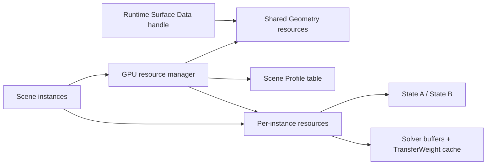
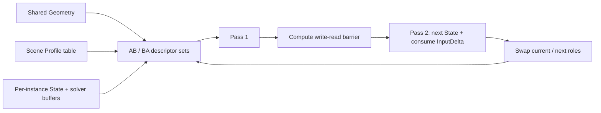
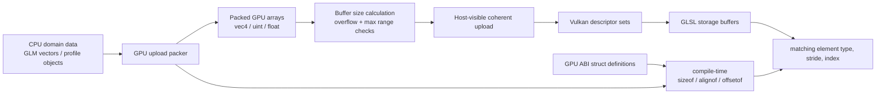

# Surface GPU Data Layout

> **한 줄 요약:** 이 문서는 Surface simulation에서 GPU로 올리는 데이터의 타입과 배치, 소유 범위를 정한다.

상태: **결정 사항**
결정 근거와 검토 대안: [[05_ADR/0010-Dynamic-State-GPU-Buffer-Layout|ADR 0010]], [[05_ADR/0011-GPU-Resource-Initialization-and-ABI|ADR 0011]]
관련: [[0004_Surface-Geometry|Surface Geometry]], [[05_ADR/0005-Per-Texel-GPU-Data-Layout|ADR 0005]], [[05_ADR/0006-Dynamic-State-Registry|ADR 0006]], [[05_ADR/0009-Texel-Profile-Index-Map|ADR 0009]], [[../06_Development/Notes/Surface-State-GPU-Resource|Surface State GPU Resource]]

---

이 문서는 Surface simulation에서 GPU로 올리는 데이터의 타입과 배치, 소유 범위를 정한다. 데이터는 수명과 공유 단위에 따라 세 그룹으로 나뉜다. 전처리로 만들어 여러 instance가 함께 쓰는 **Shared Geometry**, Profile 반응값을 담는 **Profile table**, 그리고 시뮬레이션 상태를 instance마다 따로 보유하는 **Instance State**다.

아래 byte 수는 실제 데이터 payload다. Vulkan 메모리 할당의 heap 단위 올림이나 구현별 allocation overhead는 포함하지 않는다. `uint`는 `uint32`, scalar `float`는 32-bit로 사용한다.

Scene instance가 같은 Runtime Surface Data handle을 참조하면 Geometry 자원을 공유한다. Profile GPU 테이블은 Scene 전체에서 하나를 공유하고, 시뮬레이션 State와 Solver 임시 buffer는 각 instance가 따로 가진다. 공유 범위와 Scene별 Registry 수명은 해당 결정에 따른다 ([[../05_ADR/0027-Scene-State-Registry-and-Shared-Profile-Table|ADR 0027]]).

## GPU 자원 공유 범위



## Descriptor와 두-Pass 갱신



## Shared Geometry

Shared Geometry는 Mesh와 Profile Distribution 조합에 대해 전처리한 texel 정보를 담는다. 같은 조합으로 만들어진 instance끼리 이 버퍼들을 공유할 수 있다. Neighbor도 여기 저장되므로 매 simulation step마다 격자나 UV seam을 다시 분석할 필요가 없다.

| Buffer              | GPU 원소 타입                                            |           개수 | 원소 stride |           총 payload |
| ------------------- | ---------------------------------------------------- | -----------: | --------: | ------------------: |
| `TexelSurfaceIndex` | `uint32`                                             | `texelCount` |       4 B |  `4 × texelCount` B |
| `TexelProfileIndex` | `uint32`                                             | `texelCount` |       4 B |  `4 × texelCount` B |
| `SurfacePosition`   | `vec4`                                               | `texelCount` |      16 B | `16 × texelCount` B |
| `SurfaceNormal`     | `vec4`                                               | `texelCount` |      16 B | `16 × texelCount` B |
| `GeometryScalar`    | 네 `float32` (`MesoVirtualHeight`, `ConcavityWeight`, Mean K, Gaussian K) | `texelCount` | 16 B | `16 × texelCount` B |
| `MesoNormal`        | `vec4`                                                | `texelCount` | 16 B | `16 × texelCount` B |
| `NeighborIndex`     | `uvec4[2]`                                           | `texelCount` |      32 B | `32 × texelCount` B |
| `ReverseNeighborSlots` | `uint32` (8 × 4 bit packed) | `texelCount` | 4 B | `4 × texelCount` B |

디버그 Fragment shader가 Surface grid와 UV chart를 조회하기 위해 아래 보조 buffer도 함께 사용한다. 이 값들은 Solver의 전달 계산 입력이 아니다.

| Buffer | GPU 원소 타입 | 개수 | 원소 stride | 총 payload | 사용처 |
|---|---|---:|---:|---:|---|
| `SurfaceRanges` | `uvec4` (`firstTexel`, `width`, `height`, `texelCount`) | `surfaceCount` | 16 B | `16 × surfaceCount` B | Fragment의 Surface UV를 해당 grid의 local texel index로 변환 |
| `TexelChartIndices` | `uint32` | `texelCount` | 4 B | `4 × texelCount` B | Neighbor가 다른 UV chart를 가로지르는지 seam view에서 판별 |
GeometryScalar에는 mean/Gaussian curvature가 포함되어 texel당 16 B다 ([[../05_ADR/0018-Normal-Map-Meso-Geometry|ADR 0018]]). `MesoNormal` 별도 buffer와 역방향 슬롯 buffer를 포함한 공유 geometry payload는 texel당 108 B다. 현재 복원 normal은 CPU shared geometry 전처리에서 만들며, GPU normal buffer는 렌더링과 geometry/cache 소비자가 같은 결과를 읽도록 보관한다.

- 각 배열의 원소 번호는 Geometry의 local texel index와 일치한다.
- `TexelSurfaceIndex`의 `InvalidSurfaceID`는 Mesh 표면에 대응하지 않는 UV texel을 표시하므로 별도 ValidMask가 필요하지 않다.
- Position과 Normal은 vec4로 저장하고 xyz를 사용한다.
- NeighborIndex의 8개 칸에는 기본 이웃과 UV seam 너머의 topology 이웃이 함께 들어간다.
- 이웃 거리와 방향은 저장하지 않고 두 texel Position 차이에서 계산한다.

`SurfaceRanges`는 Surface별 연속 texel 범위와 2D grid 크기를 보관하고, `TexelChartIndices`는 Mapping 단계의 UV chart 분류를 texel별로 보존한다. 둘 다 Surface 진단 뷰용 보조 데이터다. Surface validity, ID, 이웃 수, seam 시각화에서 사용하며 현재 Solver 수식은 이 배열들을 읽지 않는다.

## Profile table

Profile table은 각 Profile이 Registry의 State channel에 제공하는 반응 매개변수를 보관한다.

- Record는 Profile 하나와 State channel 하나의 조합에 속하는 parameter 묶음이다.
- 예: `Stone Profile + Heat channel` record에는 Capacity, InputFactor, Rate 등이 들어간다.
- Record는 별도 ID 체계가 아니라 GPU 배열의 한 항목이다.

- `profileCount`는 현재 Scene의 고유 Profile handle 수다. 여러 Mesh·Map이 같은 `.SRProfile`을 참조하면 한 번만 저장한다.
- CPU Geometry와 `.Surface`는 Runtime-local Profile index를 유지한다.
- GPU 업로드 시 index를 Scene table index로 변환한다.
- CPU 접촉 입력은 로컬 table을, Shader는 변환된 index와 Scene 공유 table을 사용한다.

Texel은 Shared Geometry의 `TexelProfileIndex`에서 `profileIndex`를 얻고, 처리 중인 State의 Registry `channelIndex`를 사용한다. 이 둘로 2차원 조합(Profile, channel)을 1차원 배열 위치로 바꾼 값이 `recordIndex`다.

| Buffer                  | GPU 원소 타입                   |                                    개수 | 원소 stride |                            총 payload |
| ----------------------- | --------------------------- | ------------------------------------: | --------: | -----------------------------------: |
| `ProfileParameters`     | Profile/channel마다 `vec4[2]` | `profileCount × channelCount` records |      32 B | `32 × profileCount × channelCount` B |
| `ProfileStateSupported` | `uint32`                    |         `profileCount × channelCount` |       4 B |  `4 × profileCount × channelCount` B |

레코드는 Profile-major 순서다. 각 Profile의 channel 레코드가 연달아 온다. 예를 들어 channel이 4개일 때 Profile 1의 channel 2는 `1 * 4 + 2 = 6`이므로 배열의 6번 항목이다. `ProfileParameters`와 `ProfileStateSupported` 모두 이 위치를 사용한다.

```text
recordIndex = profileIndex * channelCount + channelIndex
```

두 vec4에는 각각 아래 매개변수를 순서대로 둔다. 별도 support map은 Profile에서 정의하지 않은 channel과 값이 0인 channel을 구분한다.

```text
vec4[0] = StateCapacity, InputFactor, SaturationTransferFactor, GeometryTransferFactor
vec4[1] = DecayRate, CavityRetentionFactor, AccumulationFactor, CavityFillFactor
```

두 TransferFactor는 CPU에서 기준 Rate를 곱하지 않고 그대로 저장한다. C++/GLSL 공용 기준 Rate `1.0`, `6000.0`을 Solver에서 곱한다. CPU 시간 간격 상한도 같은 정의를 사용한다. 레코드의 슬롯·stride·descriptor 수는 유지한다 ([[05_ADR/0029-Normalized-Transport-Factors|ADR 0029]], [[05_ADR/0033-Geometry-Rate-Recalibration|ADR 0033]]).

## Instance State

각 instance는 같은 Mesh와 Profile을 사용하더라도 시뮬레이션 상태를 독립적으로 가져야 한다. State와 channel별 임시 버퍼는 텍셀×실제 channel 수로 구성한다. TransferWeight는 channel과 무관하게 texel×8 이웃 슬롯, WorldTexelAreas는 texel별 한 값으로 구성한다.

| Buffer       | GPU 원소 타입 |                          개수 |           텍셀당 stride |                         총 payload |
| ------------ | --------- | --------------------------: | -------------------: | --------------------------------: |
| `StateA`     | `float32` | `texelCount × channelCount` | `4 × channelCount` B | `4 × texelCount × channelCount` B |
| `StateB`     | `float32` | `texelCount × channelCount` | `4 × channelCount` B | `4 × texelCount × channelCount` B |
| `OutgoingFluxScale`  | `float32` | `texelCount × channelCount` | `4 × channelCount` B | `4 × texelCount × channelCount` B |
| `InputDelta` | `float32` | `texelCount × channelCount` | `4 × channelCount` B | `4 × texelCount × channelCount` B |
| `TransferWeights` | `float32` | `texelCount × 8` | 32 B | `32 × texelCount` B |
| `RawOutgoing` | `float32` | `texelCount × channelCount` | `4 × channelCount` B | `4 × texelCount × channelCount` B |
| `RawFlux` | `float32` | `texelCount × channelCount × 8` | `32 × channelCount` B | `32 × texelCount × channelCount` B |
| `WorldTexelAreas` | `float32` | `texelCount` | 4 B | `4 × texelCount` B |

면적 buffer는 instance별 binding 20이며 Capacity·Decay 계산과 State heatmap에 사용한다. CPU shared AreaVector를 world로 변환한 값이고 선형 transform 변경 시 갱신한다. Profile Capacity는 기준 면적의 양이며 shader가 `WorldTexelArea / ReferenceArea`를 곱한다. [[../05_ADR/0030-Texel-Area-and-State-Amounts|ADR 0030]]

State 배열은 texel-major AoS다. 한 texel에 속한 channel 값들이 연속으로 저장되며, 원소 위치는 다음 산식으로 구한다. 채널 padding은 두지 않는다.

```text
index = texelIndex * channelCount + channelIndex
```

따라서 하나의 버퍼 payload는 `texelCount × channelCount × sizeof(float)`다. 전체 channel 수는 State Registry가 정하고, C++ 및 shader 코드 모두 고정 channel 개수를 가정하지 않는다.

`StateA`와 `StateB`는 ping-pong에 사용한다. 한 step에서 Current를 읽고 Next에 쓰며, step이 끝나면 역할을 바꾼다. Descriptor set은 A→B와 B→A 구성을 미리 만들어 번갈아 쓴다. 매 step마다 descriptor를 수정하지 않는다.

State A/B는 Capacity 초과량을 포함한 전체 finite·비음수 상태량을 저장한다 ([[05_ADR/0020-State-Overcapacity-Transport|ADR 0020]]).

- `StateCapacity` Profile 필드는 같은 float32 위치와 기본값을 유지하며, 의미를 포화 기준량으로 바꿨다.
- Instance별 texel-major AoS, 채널 padding 없음의 크기·stride·descriptor를 유지한다. 추가 GPU payload는 **0 B**다.
- 초과량용 임시 buffer는 추가하지 않는다.
- Shader의 상한 clamp 두 곳을 제거했다. GPU 회귀에서 source 유출 제한, 여러 이웃의 초과 유입 보존, 서로 다른 Capacity와 입력 소비를 확인했다.

- `OutgoingFluxScale`은 Pass 1에서 계산해 Pass 2에서 읽는 texel·channel별 outgoing flux 제한 비율이다.
- `InputDelta`는 접촉에서 발생한 discrete event의 양을 누적한다.
- 새 event 입력은 첫 Solver update의 Pass 2에서 Next State에 한 번 더하고 update 후 비운다.
- 입력은 해당 update 결과에 반영된다. Pass 1은 입력 전 Current State를 읽으므로 새 양의 neighbor 전파는 다음 update부터 시작한다.
- 지속적으로 작용하는 입력은 별도 rate 모델로 다룬다. 필요하면 DeltaTime을 적용한다.
- State A/B의 시작값은 0이다.

- `TransferWeights`는 유효 Geometry와 instance 선형 변환으로 준비하는 edge cache다.
- Slot 위치: `texelIndex × 8 + neighborSlot`
- 저장값: 해당 slot의 DistanceWeight × NormalWeight × CurvatureWeight × ProfileBoundaryWeight
- 방향별 slot을 각각 저장한다. 대칭 식을 무방향 edge 저장으로 압축하는 최적화는 후속 작업이다.
- Cache는 RawFlux 계산에서 평균 이웃 거리를 반복 계산하지 않게 한다.
- CPU builder는 resource 생성 시와 instance의 회전·scale 등 선형 변환이 바뀔 때 갱신한다. 순수 이동은 영향을 주지 않는다.
- 동적 Geometry scalar나 topology 변경 경로가 추가되면 cache invalidation을 연결해야 한다.

- `RawOutgoing`은 Pass 1이 Current State와 TransferWeights로 계산하는 texel·channel별 제한 전 outgoing 합계다.
- Pass 1은 매 step 모든 항목을 덮어쓴다. Pass 2는 자기 outgoing을 재계산하지 않고 읽는다.
- Invalid/unsupported 항목은 0으로 기록한다.
- 감쇠 후 가용량=0 또는 dt=0이면 RawOutgoing·alpha만 0으로 기록하고 RawFlux 평가·쓰기를 생략한다. 실제 outgoing은 0이며 Pass 2의 Incoming·Input·Next 갱신은 계속 수행한다.
- Pass 1 뒤 `OutgoingFluxScale`·`RawOutgoing`에 compute write→read barrier를 적용한다. Cache ON일 때만 RawFlux를 포함한다.
- Pass 2 read 뒤 다음 step의 Pass 1 write 전에 재사용 barrier를 둔다. Cache OFF에서는 RawFlux를 제외한다.

`RawFlux` 저장 위치는 `neighborSlot × texelCount × channelCount + texelIndex × channelCount + channelIndex`다.

- 캐시 ON에서는 활성 source의 모든 슬롯을 갱신한다. Invalid 이웃이나 rate/weight가 0인 간선은 0으로 덮어쓴다.
- Unsupported/invalid, 가용량=0 또는 dt=0인 source 슬롯은 갱신하지 않아 stale·미초기화 값이 남을 수 있다. 생성·reset 시 clear는 필요 없다.
- Pass 2는 source alpha를 먼저 확인한다. alpha가 0이면 RawFlux를 읽지 않는다.
- alpha가 양수이면 `ReverseNeighborSlots[texel]`에서 `(packed >> (slot × 4)) & 0xf`로 역방향 source 슬롯을 찾고 저장값에 source alpha를 곱한다. `0xf`는 invalid이며 0–7만 조회한다.
- 역방향 슬롯은 Geometry와 공유하고 topology 변경 때 다시 준비한다. RawFlux는 instance별이며 AB/BA가 같은 scratch를 참조한다.
- 캐시 OFF에서는 RawFlux 읽기·쓰기를 생략하지만 buffer와 descriptor 할당은 유지한다.
- 슬롯 배치와 유효성은 각각 결정에 따른다 ([[05_ADR/0021-Directional-RawFlux-Cache|ADR 0021]], [[05_ADR/0025-Inactive-RawFlux-Write-Elision|ADR 0025]]).

## CPU와 GPU 데이터 형식

CPU domain data와 GPU upload representation은 별도 자료형으로 유지한다. CPU 구조체의 compiler padding이나 `glm` 타입 배치가 shader ABI와 우연히 같다고 가정하지 않는다. GPU 업로드용 구조체는 크기·정렬·필드 위치를 검사하고, 각 배열은 원소 수·stride·전체 byte size를 검증한다.

Buffer 크기를 계산할 때 정수 overflow와 device의 storage-buffer range 한도를 확인한다. CPU 또는 GPU 중 어디서 초기화·clear할지는 각 buffer의 memory property, 접근 흐름, 동기화 조건에 따라 정한다.

CPU domain 객체와 shader의 storage layout 사이에는 명시적 packing 단계가 있다. CPU 구조체를 그대로 shader ABI로 재해석하지 않는다.

### CPU 데이터에서 Shader ABI까지



## Solver 캐시 buffer descriptor binding

각 descriptor는 storage buffer 하나를 가리킨다. 기존 Surface debug fragment shader의 binding 12·13을 유지하고, Solver cache는 14·15·19를 사용하고 공유 역방향 슬롯은 18을 사용한다. 전체 descriptor binding count는 21이며 기존 device limit 검증에도 적용한다.

| set 0 binding | Buffer | 소유 범위 | 원소 / 인덱스 |
|---:|---|---|---|
| 0–5 | TexelSurfaceIndices, TexelProfileIndices, Positions, Normals, GeometryScalars, NeighborIndices | Shared Geometry | texel-major |
| 6–7 | ProfileParameters, ProfileSupported | Profile table | `profile × channel + channel` |
| 8–11 | CurrentState, NextState, OutgoingFluxScale, InputDelta | instance | `texel × channelCount + channel` |
| 12–13 | SurfaceRanges, TexelChartIndices | Shared Geometry debug data | Surface / texel |
| 14 | TransferWeights | instance | `texel × 8 + neighborSlot` |
| 15 | RawOutgoing | instance | `texel × channelCount + channel` |
| 16 | TransferWeightDebugAverages | instance | texel별 vec4 |
| 17 | MesoNormals | Shared Geometry | texel별 vec4 |
| 18 | ReverseNeighborSlots | Shared Geometry | texel별 uint32 (8 × 4 bit) |
| 19 | RawFlux | instance | `neighborSlot × texelCount × channelCount + texel × channelCount + channel` |
| 20 | WorldTexelAreas | instance | texel별 float32, stride 4 B |

- AB와 BA descriptor set은 같은 instance cache와 Shared Geometry/Profile buffer를 참조한다. Current/Next만 서로 바뀐다.
- 6×512×512 texel·1 channel 예시의 추가 payload: TransferWeights 48 MiB, RawOutgoing 6 MiB
- CPU preparation의 world position·world normal·mean-neighbor-distance scratch는 cache rebuild 중에만 유지하며 GPU payload에는 포함하지 않는다.

방향별 RawFlux 캐시의 증가분은 6 Surface × 512×512·1채널·8슬롯 기준으로 인스턴스당 48 MiB, 역방향 슬롯 공유 Geometry당 6 MiB다 ([[05_ADR/0021-Directional-RawFlux-Cache|ADR 0021]]).

- Scalar 원소 padding은 없으며 allocator overhead는 제외한다.
- RawFlux는 byte-size overflow, uint32 shader 인덱스 범위, `maxStorageBufferRange`를 검증한다. 한도를 넘으면 명시적으로 거부한다.

Solver push constant는 128 byte다.

- Offset 0–15: dt, channel 수, texel 수, flags
- Offset 16–31: world gravity vec4
- Offset 32–79: 선형 변환의 vec4 column 3개
- Offset 80–127: inverse-transpose의 vec4 column 3개
- 마지막 3개 column의 xyz는 normal matrix, w는 gravity up의 x/y/z다.
- CPU가 dispatch당 한 번 계산하며 크기·offset은 `static_assert`로 검증한다.
- Translation은 edge 차이에서 상쇄되므로 Solver에 전달하지 않는다.
- SolverFlags bit 5는 CPU에서 RawFlux cache OFF pipeline을 선택한다. 두 pass의 specialization constant 0을 false로 설정한다.
- Push constant와 descriptor 배치는 ON/OFF에서 같다.

기본 Surface grid는 Medium 256×256이며 Low 128×128, High 512×512를 선택할 수 있다 ([[05_ADR/0023-Simulation-Resolution-Presets|ADR 0023]]). 위 512 메모리 예시는 High 기준이다.

- float32·8슬롯·1채널·원소 padding 없음에서 Medium RawFlux는 instance당 12 MiB다.
- uint32 역방향 슬롯은 공유 Geometry당 1.5 MiB다.
- 이 추정은 6개 Surface와 allocator overhead 제외를 가정한다.
- 해상도 변경 시 mapping·geometry·GPU buffer·descriptor·Solver를 재생성하고 State를 초기화한다.
