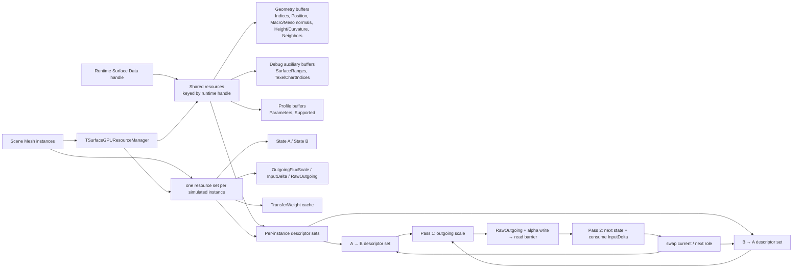
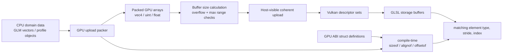

# Surface GPU Data Layout

> **한 줄 요약:** 이 문서는 Surface simulation에서 GPU로 올리는 데이터의 타입과 배치, 소유 범위를 정한다.

상태: **결정 사항** · 결정 근거와 검토 대안: [[05_ADR/Architecture/0010-Dynamic-State-GPU-Buffer-Layout|ADR 0010]], [[05_ADR/Architecture/0011-GPU-Resource-Initialization-and-ABI|ADR 0011]] · 관련: [[0004_Surface-Geometry|Surface Geometry]], [[05_ADR/Architecture/0005-Per-Texel-GPU-Data-Layout|ADR 0005]], [[05_ADR/Architecture/0006-Dynamic-State-Registry|ADR 0006]], [[05_ADR/Assets/0009-Texel-Profile-Index-Map|ADR 0009]], [[../06_Development/Notes/0003-Surface-State-GPU-Resource|Surface State GPU Resource]]

이 문서는 Surface simulation에서 GPU로 올리는 데이터의 타입과 배치, 소유 범위를 정한다. 데이터는 수명과 공유 단위에 따라 세 그룹으로 나뉜다. 전처리로 만들어 여러 instance가 함께 쓰는 **Shared Geometry**, Profile 반응값을 담는 **Profile table**, 그리고 시뮬레이션 상태를 instance마다 따로 보유하는 **Instance State**다.

아래 byte 수는 실제 데이터 payload다. Vulkan 메모리 할당의 heap 단위 올림이나 구현별 allocation overhead는 포함하지 않는다. `uint`는 `uint32`, scalar `float`는 32-bit로 사용한다.

먼저 자원 사이의 관계를 보면 **공유 데이터**와 **instance별 데이터**가 분리되는 이유가 드러난다. Scene instance가 같은 Runtime Surface Data handle을 참조하면 geometry/profile 자원을 함께 쓰고, 시뮬레이션 State와 Solver 임시 buffer는 각 instance가 따로 가진다.



## Shared Geometry

Shared Geometry는 Mesh와 Profile Distribution 조합에 대해 전처리한 texel 정보를 담는다. 같은 조합으로 만들어진 instance끼리 이 버퍼들을 공유할 수 있다. Neighbor도 여기 저장되므로 매 simulation step마다 격자나 UV seam을 다시 분석할 필요가 없다.

| Buffer              | GPU 원소 타입                                            |           개수 | 원소 stride |           총 payload |
| ------------------- | ---------------------------------------------------- | -----------: | --------: | ------------------: |
| `TexelSurfaceIndex` | `uint32`                                             | `texelCount` |       4 B |  `4 × texelCount` B |
| `TexelProfileIndex` | `uint32`                                             | `texelCount` |       4 B |  `4 × texelCount` B |
| `SurfacePosition`   | `vec4`                                               | `texelCount` |      16 B | `16 × texelCount` B |
| `SurfaceNormal`     | `vec4`                                               | `texelCount` |      16 B | `16 × texelCount` B |
| `GeometryScalar`    | 네 `float32` (`MesoVirtualHeight`, `ConcavityWeight`, Mean K, Gaussian K) | `texelCount` | 16 B | `16 × texelCount` B |
| `MesoNormal`        | `vec4`                                                | `texelCount` | 16 B | `16 × texelCount` B |
| `NeighborIndex`     | `uvec4[2]`                                           | `texelCount` |      32 B | `32 × texelCount` B |

디버그 Fragment shader가 Surface grid와 UV chart를 조회하기 위해 아래 보조 buffer도 함께 사용한다. 이 값들은 Solver의 전달 계산 입력이 아니다.

| Buffer | GPU 원소 타입 | 개수 | 원소 stride | 총 payload | 사용처 |
|---|---|---:|---:|---:|---|
| `SurfaceRanges` | `uvec4` (`firstTexel`, `width`, `height`, `texelCount`) | `surfaceCount` | 16 B | `16 × surfaceCount` B | Fragment의 Surface UV를 해당 grid의 local texel index로 변환 |
| `TexelChartIndices` | `uint32` | `texelCount` | 4 B | `4 × texelCount` B | Neighbor가 다른 UV chart를 가로지르는지 seam view에서 판별 |
GeometryScalar는 ADR 0018에서 mean/Gaussian curvature를 추가하며 texel당 16 B가 되었다. MesoNormal 별도 buffer를 포함한 공유 geometry payload는 texel당 104 B다. 현재 Meso normal은 CPU shared geometry 전처리에서 만들며, GPU normal buffer는 렌더링과 geometry/cache 소비자가 같은 결과를 읽도록 보관한다.

각 배열의 원소 번호는 Geometry 안의 local texel index와 일치한다. `TexelSurfaceIndex`의 `InvalidSurfaceID`는 UV 격자에 포함되지만 Mesh 표면에 대응하지 않는 texel을 표시하므로 별도 ValidMask는 필요하지 않다. Position과 Normal은 vec4로 저장하고 xyz를 사용한다. NeighborIndex의 8개 칸에는 기본 격자 이웃과 UV seam 너머의 topology 이웃이 함께 들어간다. 이웃 거리와 방향은 별도로 저장하지 않고 두 texel의 Position 차이에서 계산한다.

`SurfaceRanges`는 Surface별 연속 texel 범위와 2D grid 크기를 보관하고, `TexelChartIndices`는 Mapping 단계의 UV chart 분류를 texel별로 보존한다. 둘 다 Surface 진단 뷰용 보조 데이터다. Surface validity, ID, 이웃 수, seam 시각화에서 사용하며 현재 Solver 수식은 이 배열들을 읽지 않는다.

## Profile table

Profile table은 각 Profile이 Registry의 각 State channel에 제공하는 반응 매개변수를 보관한다. 여기서 record(레코드)는 “Profile 하나와 State channel 하나의 조합에 속하는 매개변수 묶음”을 뜻한다. 예를 들어 `Stone Profile + Heat channel`이 한 레코드이고, 그 안에 Capacity, InputFactor, Rate 같은 값들이 함께 들어 있다. 레코드는 별도의 ID 체계가 아니라 GPU 배열에 저장되는 한 항목이다.

Texel은 Shared Geometry의 `TexelProfileIndex`에서 `profileIndex`를 얻고, 처리 중인 State의 Registry `channelIndex`를 사용한다. 이 둘로 2차원 조합(Profile, channel)을 1차원 배열 위치로 바꾼 값이 `recordIndex`다.

| Buffer                  | GPU 원소 타입                   |                                    개수 | 원소 stride |                            총 payload |
| ----------------------- | --------------------------- | ------------------------------------: | --------: | -----------------------------------: |
| `ProfileParameters`     | Profile/channel마다 `vec4[2]` | `profileCount × channelCount` records |      32 B | `32 × profileCount × channelCount` B |
| `ProfileStateSupported` | `uint32`                    |         `profileCount × channelCount` |       4 B |  `4 × profileCount × channelCount` B |

레코드는 Profile-major 순서다. 각 Profile의 channel 레코드가 연달아 온다. 예를 들어 channel이 4개일 때 Profile 1의 channel 2는 `1 * 4 + 2 = 6`이므로 배열의 6번 항목이다. `ProfileParameters`와 `ProfileStateSupported` 모두 이 위치를 사용한다.

```text
recordIndex = profileIndex * channelCount + channelIndex
```

두 vec4에는 각각 아래 매개변수를 순서대로 둔다. 별도 support map은 Profile에서 정의하지 않은 channel과 값이 0인 channel을 구분한다.

```text
vec4[0] = StateCapacity, InputFactor, SaturationTransferRate, GeometryTransferRate
vec4[1] = DecayRate, CavityRetentionFactor, AccumulationFactor, CavityFillFactor
```

## Instance State

각 instance는 같은 Mesh와 Profile을 사용하더라도 시뮬레이션 상태를 독립적으로 가져야 한다. State와 channel별 임시 버퍼는 텍셀×실제 channel 수로 구성한다. TransferWeight만 channel과 무관하게 texel×8 이웃 슬롯으로 구성한다.

| Buffer       | GPU 원소 타입 |                          개수 |           텍셀당 stride |                         총 payload |
| ------------ | --------- | --------------------------: | -------------------: | --------------------------------: |
| `StateA`     | `float32` | `texelCount × channelCount` | `4 × channelCount` B | `4 × texelCount × channelCount` B |
| `StateB`     | `float32` | `texelCount × channelCount` | `4 × channelCount` B | `4 × texelCount × channelCount` B |
| `OutgoingFluxScale`  | `float32` | `texelCount × channelCount` | `4 × channelCount` B | `4 × texelCount × channelCount` B |
| `InputDelta` | `float32` | `texelCount × channelCount` | `4 × channelCount` B | `4 × texelCount × channelCount` B |
| `TransferWeights` | `float32` | `texelCount × 8` | 32 B | `32 × texelCount` B |
| `RawOutgoing` | `float32` | `texelCount × channelCount` | `4 × channelCount` B | `4 × texelCount × channelCount` B |

State 배열은 texel-major AoS다. 한 texel에 속한 channel 값들이 연속으로 저장되며, 원소 위치는 다음 산식으로 구한다. 채널 padding은 두지 않는다.

```text
index = texelIndex * channelCount + channelIndex
```

따라서 하나의 버퍼 payload는 `texelCount × channelCount × sizeof(float)`다. 전체 channel 수는 State Registry가 정하고, C++ 및 shader 코드 모두 고정 channel 개수를 가정하지 않는다.

`StateA`와 `StateB`는 ping-pong에 사용한다. 한 step에서 Current를 읽고 Next에 쓰며, step이 끝나면 역할을 바꾼다. Descriptor set은 A→B와 B→A 구성을 미리 만들어 번갈아 쓴다. 매 step마다 descriptor를 수정하지 않는다.

[[05_ADR/Simulation/0020-State-Overcapacity-Transport|ADR 0020]]의 State A/B는 Capacity 초과량을 포함한 전체 finite·비음수 상태량을 저장한다. `StateCapacity` Profile 필드는 같은 float32 위치·기본값을 유지하고 의미만 포화 기준량으로 바뀐다. 기존 instance별 texel-major AoS 및 채널 padding 없음의 크기·stride·descriptor를 유지하므로 추가 GPU payload는 **0 B**다. 초과량용 임시 buffer는 추가하지 않는다. Shader의 두 상한 clamp 제거를 구현했고 GPU 실행 검증은 대기 중이다.

`OutgoingFluxScale`은 Pass 1에서 계산해 Pass 2에서 읽는 텍셀·채널별 outgoing flux 제한 비율이다. `InputDelta`는 접촉에서 발생한 discrete event(발생 시점에 한 번 기록되는 접촉 사건)의 양을 누적한다. 이벤트 입력 뒤 처음 실행되는 solver update의 Pass 2가 이를 Next State에 한 번 더하고, 그 update 뒤 비운다. 따라서 입력은 그 update 결과에 즉시 반영되지만 Pass 1은 입력 전 Current State로 flux를 계산하므로, 접촉으로 추가된 양의 이웃 전파는 다음 solver update부터 시작한다. 지속 시간 동안 계속 작용하는 입력은 이 이벤트 입력과 다른 입력 모델이며, 필요하면 DeltaTime을 적용하는 별도 rate 입력으로 다룬다. State A/B의 시작값은 0이다.

`TransferWeights`는 유효 Geometry와 instance의 선형 변환으로 준비하는 edge cache다. `texelIndex × 8 + neighborSlot` 위치에 해당 슬롯의 DistanceWeight × NormalWeight × CurvatureWeight × ProfileBoundaryWeight를 둔다. 방향별 슬롯을 각각 저장하며, 현재 가중치 수식이 대칭이어도 무방향 edge 저장으로 압축하는 최적화는 후속 작업이다. 이 값은 매 RawFlux 계산에서 평균 이웃 거리를 다시 찾지 않도록 한다. 현재 CPU cache builder는 생성 시와 instance의 회전/scale 등 선형 변환이 바뀔 때 갱신한다. 순수 이동은 가중치를 바꾸지 않는다. Geometry scalar나 topology가 동적으로 바뀌는 경로는 아직 없으며, 해당 경로가 추가될 때 cache invalidation을 호출해야 한다.

`RawOutgoing`은 Pass 1이 Current State와 TransferWeights로 계산한 텍셀·채널별 유출 합계다. Pass 1에서 매 step 모든 항목을 덮어쓰고 Pass 2가 자기 쪽 outgoing을 재계산하지 않고 읽는다. invalid 또는 unsupported 항목은 0으로 쓴다. Pass 1 뒤 `OutgoingFluxScale`과 `RawOutgoing`에 compute write→read barrier를 적용하며, Pass 2의 read 뒤 다음 step의 Pass 1 write 전에 재사용 barrier를 둔다.

## CPU와 GPU 데이터 형식

CPU domain data와 GPU upload representation은 별도 자료형으로 유지한다. CPU 구조체의 compiler padding이나 `glm` 타입 배치가 shader ABI와 우연히 같다고 가정하지 않는다. GPU 업로드용 구조체는 크기·정렬·필드 위치를 검사하고, 각 배열은 원소 수·stride·전체 byte size를 검증한다.

Buffer 크기를 계산할 때 정수 overflow와 device의 storage-buffer range 한도를 확인한다. CPU 또는 GPU 중 어디서 초기화·clear할지는 각 buffer의 memory property, 접근 흐름, 동기화 조건에 따라 정한다.

CPU domain 객체와 shader의 storage layout 사이에는 명시적 packing 단계가 있다. CPU 구조체를 그대로 shader ABI로 재해석하지 않는다.



## Solver 캐시 buffer descriptor binding

각 descriptor는 storage buffer 하나를 가리킨다. 기존 Surface debug fragment shader의 binding 12·13을 유지하고, Solver cache는 14·15에 추가했다.

| set 0 binding | Buffer | 소유 범위 | 원소 / 인덱스 |
|---:|---|---|---|
| 0–5 | TexelSurfaceIndices, TexelProfileIndices, Positions, Normals, GeometryScalars, NeighborIndices | Shared Geometry | texel-major |
| 6–7 | ProfileParameters, ProfileSupported | Profile table | `profile × channel + channel` |
| 8–11 | CurrentState, NextState, OutgoingFluxScale, InputDelta | instance | `texel × channelCount + channel` |
| 12–13 | SurfaceRanges, TexelChartIndices | Shared Geometry debug data | Surface / texel |
| 14 | TransferWeights | instance | `texel × 8 + neighborSlot` |
| 15 | RawOutgoing | instance | `texel × channelCount + channel` |

AB와 BA descriptor set 모두 같은 instance cache와 Shared Geometry/Profile buffer를 참조하고, Current/Next만 서로 바뀐다. 선택한 두 추가 payload는 6×512×512 texel·1채널 데모에서 TransferWeights 48 MiB와 RawOutgoing 6 MiB다. CPU preparation의 world position, world normal, mean-neighbor-distance scratch는 현재 cache rebuild 동안만 유지되는 임시 vector이며 이 payload에 포함되지 않는다.
