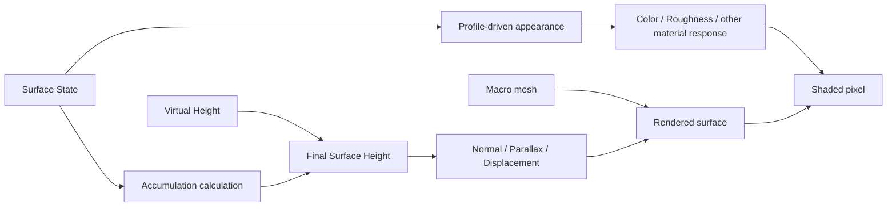

# Surface State Rendering

> **한 줄 요약:** Rendering은 State에 따른 외관 변화와 Accumulation에 따른 형상 높이 변화를 구분한다.

상태: **방향 설계** · 근거: [[08_Assets/Documents/0006_Geometry-Integration.pdf|형상 정보 반영]], [[08_Assets/Documents/0007_Target-Demos.pdf|목표 데모]]

Rendering은 State에 따른 **외관 변화**와 Accumulation에 따른 **형상 높이 변화**를 구분한다.

이 그림은 목표 구조를 나타낸다. 현재 Renderer는 기본 Material 및 Normal Map 표시와 Surface Debug view를 구현했으며, State 기반 Material 반응과 동적 Accumulation 형상은 이 경로에 연결되지 않았다.

## 저장량과 표시 범위

[[05_ADR/Simulation/0020-State-Overcapacity-Transport|ADR 0020]]의 전체 State는 Capacity를 넘을 수 있다. Heatmap과 외관 remap은 필요하면 `clamp(State / Capacity, 0, 1)`을 표시용으로 사용하되 GPU State 및 Transport용 Saturation을 바꾸지 않는다. 따라서 Saturation≥1이 같은 최상위 색이어도 저장된 양이 같다는 뜻은 아니다. 초과량 보존 Shader 변경은 구현했고 GPU 실행 검증은 대기 중이다. 최종 재질 반응·동적 적층은 미구현이다.

## 외관 변화 (State-based Appearance Changes)

- `Wetness`: 재질 내부 수분에 따른 색 / roughness 변화.
- `Burn`: 그을림·탄 정도 변화.
- `Mud`: 외관 변화 + `AccumulationHeight`.
- `SurfaceWater`(확장 예정): 표면 물기 / 고임 + 적층 높이 가능.

## 형상 높이 변화 (Accumulation-based Geometry Height Changes)

최종 Virtual Height는 다음과 같다.

$$
FinalMesoHeight
=
MesoVirtualHeight
+
AccumulationHeight
$$

Simulation 관점의 전체 높이는 다음과 같다.

$$
DynamicFinalHeight
=
MacroHeight + MesoVirtualHeight + AccumulationHeight
$$

Mud·Snow처럼 실제 두께 변화가 중요한 적층은 화면상 외관 변화만으로 표현하기 어려울 수 있다. 적용할 렌더링 방식과 성능 기준은 구현·실험을 통해 검증한다. 현재 검토 항목은 [[06_Development/Notes/0004_Rendering-Implementation|렌더링 구현 검토]]를 본다.

적층 계산은 [[04_Architecture/0004_Surface-Geometry|적층과 Accumulation Height]]을 본다.
