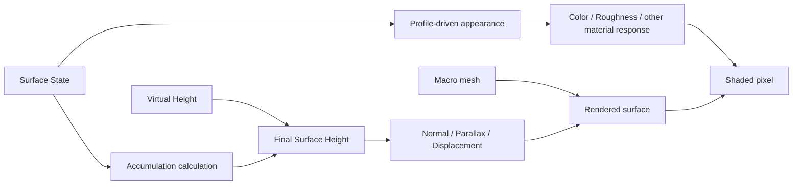

# Surface State Rendering

> **한 줄 요약:** Rendering은 State에 따른 외관 변화와 Accumulation에 따른 형상 높이 변화를 구분한다.

상태: **방향 설계**
근거: [[08_Assets/Documents/0006_Geometry-Integration.pdf|형상 정보 반영]], [[08_Assets/Documents/0007_Target-Demos.pdf|목표 데모]]

---

Rendering은 State에 따른 **외관 변화**와 Accumulation에 따른 **형상 높이 변화**를 구분한다.

## Appearance와 Geometry 반영 흐름

이 그림은 목표 구조를 나타낸다. 현재 구현 범위는 다음과 같다.

- 구현됨: 기본 Material·Normal Map 표시, Surface Debug view, 선택 State의 적층 미리보기와 Texel Inspector
- 미연결: State 기반 Material 반응, 동적 Accumulation 형상

## 저장량과 표시 범위

State는 Capacity를 넘을 수 있다 ([[05_ADR/0020-State-Overcapacity-Transport|ADR 0020]]). Heatmap과 외관 remap은 필요하면 `clamp(State / Capacity, 0, 1)`을 표시용으로 사용하되 GPU State 및 Transport용 Saturation은 바꾸지 않는다.

- Saturation 표시에서 1 이상은 같은 최상위 색이다. Raw State 옵션은 고정 범위의 texel 총량을 표시하고 범위 초과를 구분한다.
- Shader 변경과 선택 GPU 회귀 fixture는 통과했다. 5주차 통합 검증과 timestep 비교는 대기 중이다.
- 최종 재질 반응과 동적 적층은 미구현이다.

## 외관 변화 (State-based Appearance Changes)

- `Wetness`: 재질 내부 수분에 따른 색 / roughness 변화.
- `Burn`: 그을림·탄 정도 변화.
- `Mud`: 외관 변화 + `AccumulationHeight`.
- `SurfaceWater`(확장 예정): 표면 물기 / 고임 + Accumulation Height 가능.

## 형상 높이 변화 (Accumulation-based Geometry Height Changes)

최종 Virtual Height는 다음과 같다.

$$
FinalMesoHeight
=
MesoVirtualHeight
+
AccumulationHeight
$$

Simulation 관점의 전체 높이는 다음과 같다.

$$
DynamicFinalHeight
=
MacroHeight + MesoVirtualHeight + AccumulationHeight
$$

Mud·Snow처럼 실제 두께 변화가 중요한 적층은 화면상 외관 변화만으로 표현하기 어려울 수 있다. 적용할 렌더링 방식과 성능 기준은 구현·실험을 통해 검증한다. 현재 검토 항목은 [[../06_Development/Notes/Rendering-Implementation|렌더링 구현 검토]]를 본다.

적층 계산은 [[04_Architecture/0004_Surface-Geometry|적층과 Accumulation Height]]을 본다.

## 적층 디버그 미리보기

Accumulation은 선택 State의 기준면적 환산량에서 총 높이·Cavity·Following·Fill 비율을 계산한다. Compute는 최신 State와 Meso 높이에서 texel별 표시 위치·법선을 만들고, vertex shader는 그 결과를 같은 UV chart의 연결 삼각형으로 표시한다. Final Geometry와 Accumulation heatmap은 같은 변위 면을 사용한다. Meso Color/Displacement도 texel 연결면을 사용하며 적층을 제외한다. 초기 원본 메시 정점 변위의 밀도 제한은 제거되었지만 texel 중심 경계와 UV chart 사이의 stitching은 미구현이다. 원본 Normal Map은 중복 적용하지 않는다.

Inspector는 같은 GPU 식의 선택 texel 결과를 완료 frame fence 이후 표시한다. 공통 조절형 Height reference는 디버그 설정이며, 실제 Surface별 높이 기준값과 Solver 동적 형상 피드백은 미구현이다. 표시용 compute buffer는 물리적 layer의 합성/순서 또는 최종 Lit rendering 완료를 뜻하지 않는다. [[../05_ADR/0035-Accumulation-Debug-and-Texel-Inspector|ADR 0035]], [[../05_ADR/0036-Texel-Geometry-Preview|ADR 0036]]을 따른다.
