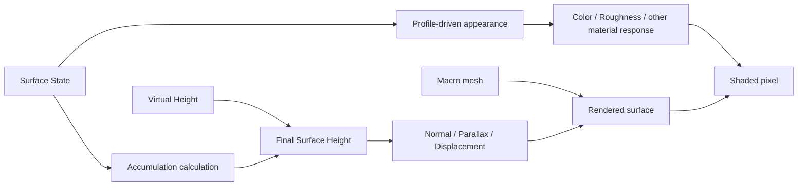

# Surface State Rendering

> **한 줄 요약:** Rendering은 State에 따른 외관 변화와 Accumulation에 따른 형상 높이 변화를 구분한다.

상태: **목표 구조 / Base·Overlay 분리 렌더 경로 코드 반영, 실행 검증 대기**
근거: [[08_Assets/Documents/0006_Geometry-Integration.pdf|형상 정보 반영]], [[08_Assets/Documents/0007_Target-Demos.pdf|목표 데모]]

---

Rendering은 State에 따른 **외관 변화**와 Accumulation에 따른 **형상 높이 변화**를 구분한다.

## Appearance와 Geometry 반영 흐름

이 그림은 목표 구조를 나타낸다. 현재 구현 범위는 다음과 같다.

- 구현됨: 기본 Material·Normal Map, Surface Debug와 Texel Inspector, texel 연결면의 높이 표시·묶음 grid, Wetness·Mud 데모 Lit 반응과 Mud 표시 형상
- 구현됨: 완전히 뒤집힌 데모 Mesh와 Overlay도 보이도록 채운 표면은 양면 렌더링하고, 뒷면에서는 표시용 법선을 카메라 쪽으로 뒤집는다. Wireframe은 기존 뒷면 제거를 유지한다.
- 코드 반영·실행 검증 대기: 각 swapchain image의 framebuffer는 해당 image 전용 depth attachment를 사용한다. 프레임 간 depth 쓰기가 같은 image에 겹치지 않도록 한다.
- 코드 반영·실행 검증 대기: 원본 Mesh를 Base로 그린 뒤 texel 연결면을 적층 윗면으로, State 경계를 옆면으로 그리는 Mud·WaterFilm Overlay 경로 ([[../05_ADR/0041-Base-Surface-and-Accumulation-Overlay|ADR 0041]])
- 코드 반영·시각 검증 대기: 기본 OFF인 `Height-field smoothing`은 선택 State의 렌더링용 적층 높이에만 3×3 가우시안 공간 필터를 적용한다. 같은 Surface·UV chart·Profile·표시 영역의 texel을 사용하며, 윗면과 옆면은 같은 필터 결과를 읽는다.
- 후속 구현: 범용 State 재질 반응, 물리 재질별 다중 layer 순서와 겹침 정책, Overlay의 시각·성능 검증

## 저장량과 표시 범위

State는 Capacity를 넘을 수 있다 ([[05_ADR/0020-State-Overcapacity-Transport|ADR 0020]]). Heatmap과 외관 remap은 필요하면 `clamp(State / Capacity, 0, 1)`을 표시용으로 사용하되 GPU State 및 Transport용 Saturation은 바꾸지 않는다.

- State Heatmap은 선택 State의 `State / (Profile Capacity × AreaScale)`를 표시한다. 100% 초과는 주황색으로 구분한다. 실제 총량은 Texel Inspector에서 확인한다.
- Shader 변경과 선택 GPU 회귀 fixture는 통과했다. 5주차 통합 검증과 timestep 비교는 대기 중이다.
- Wetness·Mud의 Lit 데모 반응과 옵션형 Solver 적층 형상 피드백은 구현됐다. 피드백은 기본 OFF이며, 최종 물리 재질 모델은 미구현이다.

## 외관 변화 (State-based Appearance Changes)

- `Wetness`: 재질 내부 수분에 따른 색 / roughness 변화.
- `Burn`: 그을림·탄 정도 변화.
- `Mud`: 외관 변화 + `AccumulationHeight`.
- `SurfaceWater`(확장 예정): 표면 물기 / 고임 + Accumulation Height 가능.

## 형상 높이 변화 (Accumulation-based Geometry Height Changes)

최종 Virtual Height는 다음과 같다.

$$
FinalMesoHeight
=
MesoVirtualHeight
+
AccumulationHeight
$$

Simulation 관점의 전체 높이는 다음과 같다.

$$
DynamicFinalHeight
=
MacroHeight + MesoVirtualHeight + AccumulationHeight
$$

Mud·Snow처럼 실제 두께 변화가 중요한 적층은 화면상 외관 변화만으로 표현하기 어려울 수 있다. 적용할 렌더링 방식과 성능 기준은 구현·실험을 통해 검증한다. 현재 검토 항목은 [[../06_Development/Notes/Rendering-Implementation|렌더링 구현 검토]]를 본다.

적층 계산은 [[04_Architecture/0004_Surface-Geometry|적층과 Accumulation Height]]을 본다.

## 적층 디버그 미리보기

Accumulation은 선택 State의 Capacity 제한·기준면적 환산량에서 총 높이·Cavity·Following·Fill 비율을 계산한다. Capacity 초과량은 State 저장과 수송에 남지만 해당 State의 형상 기여에는 포함하지 않는다. Solver feedback도 같은 Capacity 제한을 모든 적층 State에 적용해, 화면과 시뮬레이션이 같은 높이 변환을 사용한다. Compute는 최신 State와 Meso 높이에서 texel별 표시 위치·법선을 만들고, vertex shader는 그 결과를 원본 triangle과 texel 중심으로 세분한 연결면에 표시한다. Final Geometry와 Accumulation heatmap은 같은 변위 면을 사용한다. Meso Color/Displacement도 texel 연결면을 사용하며 적층을 제외한다. 초기 원본 메시 정점 변위의 밀도 제한을 제거했고, 원본 position/edge topology의 공통 높이 stencil과 경계 분할로 UV seam을 봉합한다 ([[../05_ADR/0038-Source-Topology-Seam-Stitching|ADR 0038]]). 원본 메시의 열린 경계는 유지한다. 원본 Normal Map은 중복 적용하지 않는다.

Inspector는 같은 GPU 식의 선택 texel 결과를 완료 frame fence 이후 표시한다. `.SRProfile`의 State별 `thicknessPerAmount`를 사용하고, 공통 `Lit height display scale`은 렌더링 전용이다. Simulation도 같은 Profile 두께값을 사용하되 모든 지원 State를 합산하며 표시 배율은 읽지 않는다. 표시용 compute buffer는 Mud·WaterFilm Overlay 윗면 높이에도 각각 재사용한다. 물리적 재질별 다중 layer 순서는 아직 정하지 않았다. [[../05_ADR/0035-Accumulation-Debug-and-Texel-Inspector|ADR 0035]], [[../05_ADR/0036-Texel-Geometry-Preview|ADR 0036]], [[../05_ADR/0039-State-Thickness-Per-Amount|ADR 0039]]을 따른다.

## Wetness·Mud·WaterFilm 데모 Lit

Registry는 로드된 `.SRProfile`의 State 종류를 유지한다. 데모 adapter가 `wetness`·`mud`·`waterfilm` 이름의 현재 ID를 조회하고, Shader는 해당 texel의 Profile 지원과 면적 보정 Capacity를 확인한다. State 샘플링, 효과별 재질 반응, GGX 반사 조명을 별도 모듈로 나눈다. Base Mesh에는 Wetness 외관과 원본 Normal Map을 적용한다. Mud와 WaterFilm은 선택 State 높이로 변위된 texel 연결면을 각 Overlay 윗면으로 그리며, State 경계와 열린 Mesh 경계에는 GPU가 옆면을 만든다. Mud는 불투명 패스이고 WaterFilm은 투명 패스다. Overlay 윗면에는 원본 Normal Map을 중복 적용하지 않는다.

`Lit height display scale`은 Lit과 선택 State 디버그 미리보기가 공유하는 렌더링 설정이다. 표시 설정은 State·Solver에 피드백하지 않는다. 범용 State ID→효과 시스템, 물리 재질별 다중 layer·환경 조명은 후속 설계다. [[../05_ADR/0037-Texel-Grid-and-Demo-Lit-Effects|ADR 0037]]을 따른다.

후속 결정인 [[../05_ADR/0041-Base-Surface-and-Accumulation-Overlay|ADR 0041]]은 단일 변위 Lit 표면을 Base와 적층 Overlay로 분리한다. 기존 texel 연결면은 Overlay 윗면에, GPU가 찾은 State 영역 경계는 옆면에 사용한다. 이 렌더링 변경은 Solver의 높이 계산과 Geometry Feedback을 수정하지 않는다. 현재 코드는 이 경로를 반영했으며 전체 실행·시각 검증이 남아 있다.
