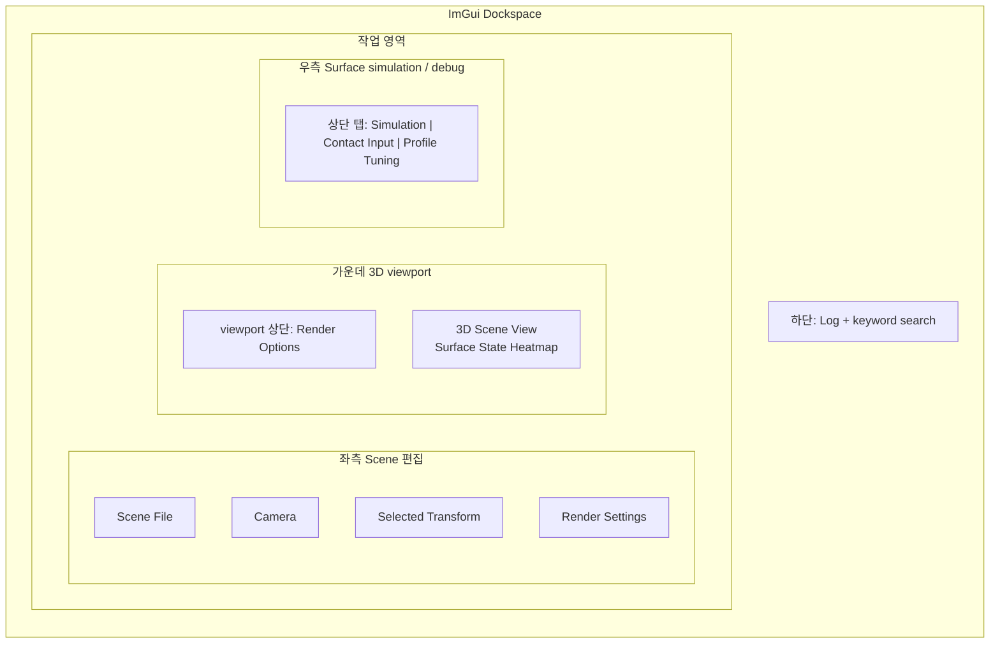
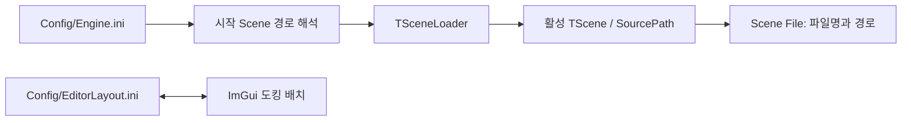
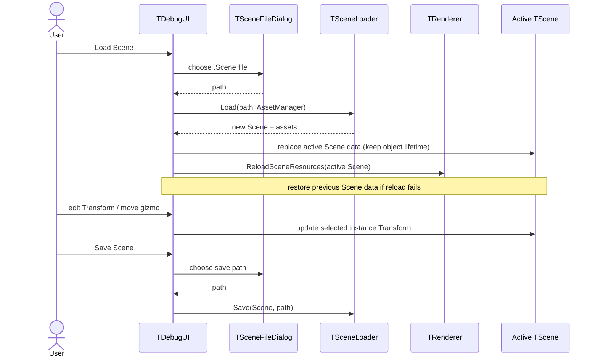

# UI Interface

> **한 줄 요약:** 현재 UI는 렌더링·Surface simulation을 확인하고 Demo Scene을 편집하기 위한 개발 인터페이스다.

상태: **현재 Debug·Scene 편집 UI 구현 기준** · 최종 확인: 2026-09-27 · 관련: [[0001_Engine-Structure|엔진 구조와 데이터 흐름]], [[0009_Rendering|렌더링]], [[0005_Surface-Input|Surface Contact Input]], [[05_ADR/Architecture/0014-Surface-Contact-Target-API|ADR 0014 — Surface Contact Target API]]

## 목적과 범위

현재 UI는 렌더링·Surface simulation을 확인하고 Demo Scene을 편집하기 위한 개발 인터페이스다. `TDebugUI`는 Dear ImGui의 GLFW/Vulkan backend로 UI를 그리고, 입력 설정 및 Scene 편집을 `TApplication`, `TInputSystem`, `TRenderer`, `TScene`에 연결한다. UI는 Solver 계산이나 GPU buffer를 직접 수정하지 않는다.

## 구성요소와 책임

| 구성요소 | 책임 |
|---|---|
| `TDebugUI` | ImGui 창, 렌더·State 진단 선택, Inject 설정, runtime Profile parameter draft/override, Scene 편집, 로그 표시 및 UI 입력 capture 상태 제공 |
| `TInputSystem` | Inject 설정과 키보드 상태를 받아 Debug 접촉 event를 생성하고 Raycast 결과를 접촉 payload로 변환 |
| `TSceneFileDialog` | 플랫폼별 파일 대화상자로 `.Scene` 열기·저장 경로를 얻음 |
| `TSceneLoader` | Scene 파일을 읽어 Scene/Asset을 만들고, Scene instance와 Transform을 파일로 저장 |
| `TApplication` | 매 frame UI를 갱신하고 생성된 접촉 event를 Renderer에 전달 |
| `TRenderer` | Render mode와 선택 State를 반영하고 Surface system을 통해 접촉 입력·Profile override·Scene resource 갱신을 처리 |

## UI 배치와 기능

| 위치 / 창 | 기능 |
|---|---|
| 3D 뷰포트 상단 `Render Options` | View 선택과 State/Weight 등 선택한 렌더 뷰의 보조 선택 |
| 좌측 도킹 영역 `Scene File`, `Camera`, `Selected Transform`, `Render Settings` | Scene 열기·저장, Camera 및 선택 object Transform 조정, Normal strength·Ambient light·Normal Y 반전 설정 |
| 우측 도킹 영역 (창 제목 없음) | 상단 탭 `Simulation`, `Contact Input`, `Profile Tuning`에서 simulation 재생·속도, 접촉 입력, Solver 진단, Profile parameter runtime override를 설정 |
| `Simulation` 탭의 `Solver debug terms` | 상위 항목인 `Transport`와 `Decay` 섹션으로 나누어 세부 항의 runtime on/off 제공. 각 항은 한 행에 표시하고 기본은 모두 on |
| 3D 뷰포트 좌상단 | FPS/frame time, GPU Render, Solver 전체 시간 및 Pass 1·2 시간을 열 맞춤한 사각형 overlay로 표시 |
| 하단 도킹 영역 `Log` | 로그 level 필터링, 대소문자 구분 없는 키워드 검색, 복사·삭제 |
| 중앙 도킹 영역 | 3D Scene viewport. Surface State Heatmap 등 선택한 진단 모드로 Mesh Surface를 색칠한다 |

Dear ImGui docking 기능을 사용한다. 기본 레이아웃은 좌측 Scene·렌더 설정, 우측 Surface simulation·진단 도구, 하단 Log, 가운데 3D viewport다. Render Options 바는 전체 창의 위가 아니라 가운데 영역의 위쪽에 붙는다. 3D pass의 Vulkan viewport와 scissor는 이 바 아래에서 시작하므로 바 영역에는 Scene geometry를 렌더링하지 않는다. 같은 영역을 Camera projection aspect, object 선택, gizmo projection과 Inject crosshair에도 사용한다. 도킹 분할자를 조절하거나 창을 다른 영역으로 옮길 수 있다. 배치는 `Config/EditorLayout.ini`에 저장된다. 로그 기본 높이는 기존 360px에서 약 1.5배인 540px이며, 초기 dock 분할도 화면 높이의 약 36%를 로그에 할당한다. 운영체제별 폰트 후보를 고르고 Korean glyph range를 포함한다. macOS에서는 Apple SD Gothic Neo, Windows에서는 맑은 고딕, Linux에서는 Noto Sans CJK 또는 나눔고딕을 우선하며, 앱 창이 1280×800 이상일 때만 폰트를 15% 키운다. 그보다 작은 창에서는 기본 크기를 유지한다.

모든 ImGui 창은 같은 진한 파랑 accent palette를 사용한다. 내부의 독립 섹션은 본문보다 큰 보통 굵기의 흰색 글꼴로 표시한다. 제목 위쪽에는 여백을 두고 제목 바로 아래 여백은 두지 않으며, 구분선 아래에만 내용과의 간격을 둔다. `Transport`와 `Decay`는 Solver term의 상위 섹션이다. 비활성 설명 문자는 본문보다 어두운 회색으로 표시한다. 프로파일링 overlay는 모서리 반경과 테두리를 없애고 metric/value 열을 맞춰 표시한다.

우측 도킹 창은 별도 제목을 표시하지 않고, 상단 탭 `Simulation`, `Contact Input`, `Profile Tuning`으로 기능을 선택한다. 뷰포트 좌상단 overlay의 모든 프로파일링 값은 1초 구간의 산술 평균이며 1초마다 갱신한다. `Render GPU`는 Scene geometry와 gizmo의 그래픽 렌더 구간을, `Solver Pass 1`과 `Solver Pass 2`는 각 Solver compute dispatch 시간을 Vulkan timestamp query로 측정한다. `Solver GPU`는 두 compute pass 시간의 합이다. 여러 Surface instance가 있으면 해당 pass의 instance별 측정값을 합산한다. ImGui overlay 자체와 CPU frame time은 GPU Render 값에 포함하지 않는다. 완료된 frame slot의 query 결과를 읽으므로 진단 표시를 위해 GPU 대기를 추가하지 않는다. timestamp query를 지원하지 않는 장치에서는 `unavailable`로 표시한다.



`Render Options`는 가운데 3D viewport의 상단 바에서 선택한다. 하나의 View 드롭다운 안에서 `Display`와 `Debug` 제목으로 항목을 구분한다. Display 목록은 Lit, Unlit, Vertex Normal (WS), Normal Texture (TS), Mapped Normal (WS)이고, Debug 목록은 State Heatmap, Validity, Surface ID, Neighbor Count, UV Seam, Outgoing Flux Scale, Solver Transfer Weights, Macro Geometry, Meso다. 한 번에 하나의 View Mode를 선택한다. Meso를 고르면 `Color`와 `Displacement` 라디오 버튼을 선택한다. Color는 signed MesoVirtualHeight를 색으로 표시하고, Displacement는 render vertex UV에서 대응 texel 높이를 읽어 mesh vertex를 변위한다. 따라서 보이는 세부 해상도는 render mesh의 vertex density로 제한된다. State/Weight selector 등 선택된 모드에 직접 필요한 옵션만 상단에 표시한다. Normal strength, Ambient light, Normal Y flip은 좌측 `Render Settings` 창에 둔다. `State Heatmap`은 선택된 State channel의 현재 GPU State 값 `State / Profile Capacity`를 3D Mesh Surface에 실시간 색으로 출력한다. `Relief Shading`은 Meso height 미분에서 복원한 normal로 밝기만 조절해 State 색상 위에 형상 음영을 얹으며, 토글로 끄면 기존 Heatmap 색을 그대로 표시한다. `Solver Transfer Weights`는 State Heatmap과 분리된 팔레트에서 낮은 값을 어두운 자주색, 높은 값을 밝은 청록색으로 표시한다. 별도의 2D UV 텍스처 창은 아직 제공하지 않는다.

Heatmap의 `[0,1]`은 표시 범위다. [[05_ADR/Simulation/0020-State-Overcapacity-Transport|ADR 0020]]에서 State는 Capacity를 초과하고 Transport용 Saturation은 1을 넘을 수 있지만, 표시 색은 `clamp(State / Capacity, 0, 1)`로 제한할 수 있다. 최상위 색만으로 초과량의 크기를 구별할 수 없고 Relief Shading은 표시 밝기만 바꾼다. 이 표시를 Solver에 되돌려 쓰지 않는다. 초과량 보존 Shader 변경은 구현했고 GPU 실행 검증은 대기 중이다.

우측 Simulation 창은 별도 제목 없이 상단 탭 `Simulation`, `Contact Input`, `Profile Tuning`을 제공한다. `Simulation` 탭은 Running/Paused 라디오 버튼, `0.25x`, `0.5x`, `1x`, `2x` 속도 프리셋과 `0.05x`–`4x` Time scale 슬라이더를 제공한다. Pause는 Solver dispatch와 A/B 역할 교환을 멈추지만 접촉 입력은 보존한다. Step은 일시 정지 상태에서 한 Solver update를 실행하고 다시 멈춘다. Reset State는 State A/B 및 입력 누적값을 비우고 Current를 A로 되돌린다. Time scale은 실제 frame Delta Time에 곱해 다음 Solver step부터 적용한다.

같은 창의 `Solver debug terms`는 계산 항의 상위 개념을 기준으로 나눈다. `Transport`에는 SaturationDrive, GeometryDrive, DistanceWeight, NormalWeight, ProfileBoundaryWeight, CurvatureWeight를 두고, `Decay`에는 Decay와 ConcavityRetention을 둔다. 각 세부 항은 한 행에 표시하고 runtime on/off를 제공한다. CurvatureWeight만 기본 off이며 나머지는 on이다. GeometryDrive 아래의 `DirectionDrive: MesoNormal`은 기본 on으로 복원 MesoNormal을 사용하며, off에서는 기본 mesh normal을 사용한다. 이 선택은 중력 투영 법선만 변경하고 Meso height와 TransferWeight의 NormalWeight는 그대로 유지한다. GeometryDrive가 off이면 법선 선택은 효과가 없다. 다음 Solver dispatch에서 두 pass에 동일하게 적용하며 cache rebuild를 유발하지 않는다. SaturationDrive를 끄면 포화도 차이 flux만 사라지고 GeometryDrive는 유지된다. GeometryDrive를 끄면 높이·중력 구동 flux만 사라진다. Decay와 ConcavityRetention은 독립적으로 토글할 수 있으며, Decay를 끄면 ConcavityRetention도 효과가 없다. DistanceWeight, NormalWeight, ProfileBoundaryWeight를 끄면 해당 캐시 가중치를 중립값 1로 둔다. `CurvatureWeight (precomputed)`는 off에서 고정 1.0, on에서 사전 계산된 Meso mean curvature 기반 감쇠를 사용한다. 계산식과 범위는 [[05_ADR/Simulation/0019-Optional-Curvature-Transfer-Weight|ADR 0019]]를 따른다. 캐시 가중치 토글은 GPU 사용이 끝난 뒤 CPU에서 instance별 TransferWeight cache를 다시 만들며 다음 Solver step부터 적용한다. 비캐시 항 토글도 다음 Solver dispatch의 push constant flag에 반영된다. Pause 중에는 변경값이 유지되고 Step 또는 재개 후 첫 Solver step에서 적용된다. 이미 누적된 State는 토글해도 보존되므로 같은 초기 조건 비교에는 reset이 필요하다.

`Profile Tuning` 탭은 현재 Scene에서 참조하는 `.SRProfile`만 선택할 수 있다. State parameter는 임시 draft로 편집하고 `Apply Override`를 눌렀을 때만 활성화한다. 현재 Solver가 읽는 `StateCapacity`, `InputFactor`, `SaturationTransferRate`, `GeometryTransferRate`, `DecayRate`, `CavityRetentionFactor`만 노출하며, 구현되지 않은 parameter는 편집하지 않는다.

Override는 실행 중 메모리에만 보관하며 `.SRProfile` 파일을 수정하지 않는다. 같은 Profile을 여러 Surface나 instance가 공유하면 모두 같은 값을 사용한다. Apply/Restore 시 Renderer는 Graphics queue가 사용 중인 Profile buffer를 다 쓰기를 기다린 뒤 해당 Profile record를 갱신한다. `InputFactor`는 이후 접촉 입력에, 나머지 parameter는 다음 Solver dispatch부터 반영한다. Scene resource를 다시 만들면 현재 Scene에서 사용 가능한 override를 다시 적용한다.

Surface 진단 색은 다음과 같다.

| View | 표시 |
|---|---|
| State Heatmap | 선택한 단일 State의 `State / Profile Capacity`를 0–1 범위로 표시. 짙은 남색 → 파랑 → 청록 → 노랑 gradient를 사용하고, 미지원 State는 회색, invalid texel은 어두운 색으로 표시 |
| Validity | valid texel은 초록색, invalid texel은 빨간색 |
| Surface ID | Surface마다 결정적인 표시 색상 |
| Neighbor Count | 이웃 0개는 어둡게, 8개는 밝게 표시 |
| UV Seam | 다른 UV chart에 속한 이웃이 있는 texel을 분홍색으로 표시 |

## Debug 접촉 입력 흐름

Inject UI는 입력 모드, State와 세기를 설정한다. 실제 키 입력과 Scene hit 처리는 `TInputSystem`이 담당하고, UI는 그 로직을 위한 설정값과 ImGui keyboard capture 상태만 제공한다.

```mermaid
sequenceDiagram
  actor User
  participant UI as TDebugUI
  participant App as TApplication
  participant Input as TInputSystem
  participant Ray as TRaycaster
  participant SurfaceAPI as Surface-bound SubmitContact
  participant SSS as TSurfaceStateSystem
  participant Solver as GPU Solver
  participant Params as Profile GPU buffer
  participant ParameterUI as Simulation Parameters UI
  participant Renderer as TRenderer

  App->>UI: BeginFrame and draw interface
  App->>Input: poll Debug contact using UI settings
  Input->>Input: detect Space press edge
  alt inject mode on and UI does not capture keyboard
    Input->>Ray: cast camera-forward ray
    Ray-->>Input: closest front-facing hit
    Input->>SurfaceAPI: target Surface + contact payload
    SurfaceAPI->>SSS: shared contact submission
    SSS->>SSS: map contact and upload InputDelta
    SSS->>Solver: record compute step
  else otherwise
    Input-->>App: no contact
  end
  Note over Input,SurfaceAPI: Public wrapper is designed; current code returns internal TSurfaceContactInput to App, which submits via TRenderer.

  User->>ParameterUI: edit draft and click Apply Override
  ParameterUI->>Renderer: send Profile / State / parameters
  Renderer->>Renderer: wait for Graphics queue idle
  Renderer->>Params: update selected Profile record
  Note over ParameterUI,Params: Runtime only; Restore writes the original .SRProfile values back.
```

Space를 누르고 있는 동안 반복하지 않고 새로 누른 순간 한 번만 event를 만든다. ImGui가 키보드를 capture 중이면 접촉을 만들지 않는다. 우측 창의 `Contact Input` 탭에서 State, World radius, Strength, Falloff를 조절한다. 법선·입사각 weighting은 적용하지 않는다. 입력 API의 target 결정과 공통 제출 경로는 [[0005_Surface-Input|Surface Contact Input]]을 따른다. 이 경로는 게임 Physics 입력과 같은 공개 API 계약을 사용하도록 설계한다. 현재 C++ 구현은 내부 `TSurfaceContactInput` 및 instance index로 라우팅하며, Surface-bound 공개 wrapper와 Collider adapter는 아직 연결되어 있지 않다.

## 시작 Scene과 설정 파일

`Config/Engine.ini`의 `[Application] StartupScene`이 시작 Scene을 지정한다. 상대 경로는 INI 디렉터리 기준으로 해석하며 절대 경로도 허용한다. 실행 중 Scene을 바꿔도 이 값은 자동 저장하지 않는다. 변경은 다음 앱 실행부터 적용된다. 설정 파일이 없으면 기존 `Assets/Scenes/Demo.Scene`으로 fallback하며, 누락·빈 값·중복 key는 설정 오류다.

도킹 배치는 `Config/EditorLayout.ini`에 보관한다. 두 설정 파일의 위치는 빌드 시 Asset root의 상위 디렉터리에서 결정하므로 앱 실행 디렉터리에 의존하지 않는다. `Scene File` 창은 현재 Scene의 `SourcePath`에서 파일명을 항상 표시하고 hover tooltip으로 전체 경로를 제공한다. Load/Save 성공 시 경로가 갱신된다.



## Scene 편집 흐름

- Scene의 Mesh를 화면에서 클릭해 object를 선택한다. 선택한 object는 `Selected Transform` 창과 렌더링 gizmo에 반영된다.
- Position은 숫자 입력 또는 X/Y/Z 축 이동 gizmo로 편집한다. Rotation과 Scale은 현재 숫자 입력으로 편집한다.
- `Load Scene`은 파일 대화상자와 `TSceneLoader`로 Scene을 읽고 수명이 유지되는 활성 Scene에 새 데이터를 대입한 뒤 Renderer의 Surface/GPU resource를 다시 만든다. 갱신 실패 시 이전 Scene 데이터를 복구한다.
- `Save Scene`은 Mesh 경로, 선택적 `.SurfaceProfileMap` 경로, object Transform을 저장한다. 경로는 저장할 Scene 파일 위치 기준 상대 경로다.
- 현재 Scene 직렬화에는 Camera 설정과 시뮬레이션 State가 포함되지 않는다. Scene 편집 후 State를 보존하는 기능은 제공하지 않는다.



## 경계와 불변 조건

- `TDebugUI`는 State 값을 직접 쓰거나 Solver pass를 dispatch하지 않는다. 입력은 접촉 payload로 전달하고, State 표시는 Renderer가 GPU의 현재 State buffer에서 읽는다. Profile parameter 편집은 Renderer API로 runtime override를 요청하며, asset 파일을 바꾸지 않는다.
- Solver term 진단 토글은 Renderer API를 거쳐 Surface State System에 전달한다. SaturationDrive, GeometryDrive, Decay, ConcavityRetention 활성 상태는 push constant flag로 Solver에 전달하고, DistanceWeight, NormalWeight, ProfileBoundaryWeight 상태는 CPU TransferWeight cache 재생성에 사용한다. 토글은 runtime 전용이며 설정 파일에 저장하지 않는다.
- 공개 API 설계에서는 Debug Raycast와 게임 충돌 입력이 같은 Surface contact 제출 경로를 사용한다. 현재 코드는 Debug 경로만 내부 `TSurfaceContactInput`으로 연결되어 있으며 게임 Collider adapter는 미연결이다. Debug UI 전용 State 갱신 수식이나 buffer는 두지 않는다.
- 현재 입력 조작과 Scene 편집은 Static Mesh instance에 한정된다.
- 텍스트 입력 또는 ImGui 항목 조작 중에는 Space 접촉 event를 막아 UI 조작이 State 입력으로 오인되지 않게 한다. 단순히 UI 창에 포커스가 있다는 이유만으로 Inject 단축키 전체를 차단하지 않는다.

## 관련 문서

- [[0001_Engine-Structure|엔진 구조와 데이터 흐름]]
- [[0009_Rendering|Surface State Rendering]]
- [[0005_Surface-Input|Surface Contact Input]]
- [[../03_Planning/02_Weekly-Details/Week-04/0006_Branch-Surface-Input-Integration|Branch 6 구현 계약]]
