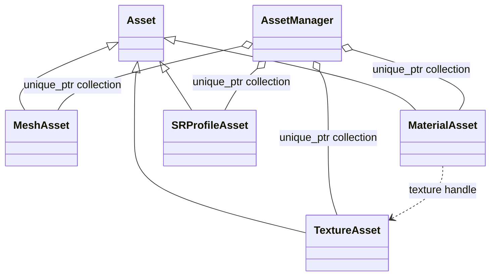
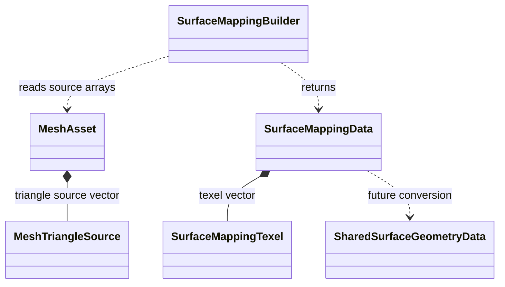
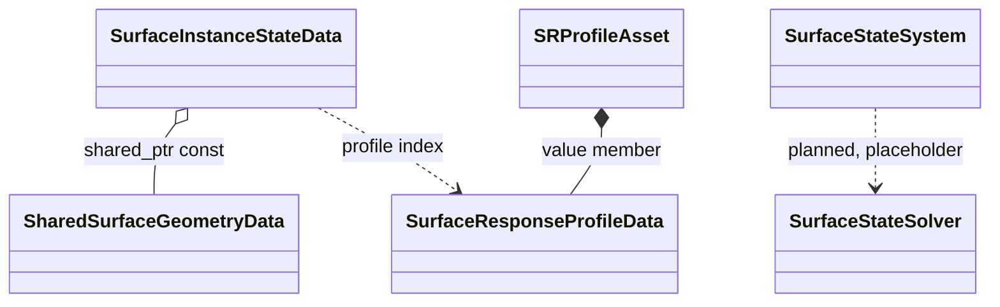

# Asset과 Surface 데이터 흐름

상태: **현재 C++ 코드 기준** · 상위 문서: [[0000_Overview|구현 구조 개요]]

OBJ, MTL, Texture와 `.SRProfile` 파일이 파싱된 뒤 Asset으로 등록되고, Mesh 데이터가 Simulation Mapping과 Surface State 자료형으로 이어지는 과정을 설명한다. 설계된 파일 책임과 현재 구현을 구분해 정리한다. State Registry와 `.Surface` binary cache의 핵심 자료형/API는 구현됐지만, 전처리 파이프라인의 자동 연결은 아직 완료되지 않았다.

관련 설계 문서:

- [[03_Architecture/0003_Assets-and-Profiles|에셋과 프로필]]
- [[05_Development/Notes/0000_Surface-Simulation-Mapping|Surface Simulation Mapping]]
- [[03_Architecture/0002_Surface-State|표면 상태와 데이터 구조]]

## 전체 데이터 흐름

```mermaid
flowchart LR
  OBJ[OBJ file] --> OBJLoader[OBJLoader / tinyobjloader]
  MTL[Referenced MTL] --> OBJLoader
  OBJLoader -->|parsed material_t| MTLLoader[MTLLoader Convert]
  MTLLoader -->|MaterialSourceData| OBJLoader
  OBJLoader -->|OBJLoadResult| AssetManager
  AssetManager -->|texture path| TextureLoader
  TextureLoader -->|TextureData| AssetManager
  AssetManager --> MeshAsset
  AssetManager --> MaterialAsset
  AssetManager --> TextureAsset

  ProfileFile[.SRProfile JSON] --> SRProfileLoader
  AssetManager --> SRProfileLoader
  SRProfileLoader --> SRProfileAsset
  AssetManager --> SRProfileAsset

  MeshAsset -. "Branch 3: preprocessing 연결" .-> Preprocess[SurfacePreprocessor API]
  NormalMap[Normal Map Asset] -. "CPU 입력 통합 미구현" .-> Preprocess
  ProfileDistribution[Profile Distribution] -. "Branch 3: format / loader" .-> Preprocess
  Preprocess -. "Branch 3: cache orchestration" .-> SurfaceFile[.Surface binary cache]
  SurfaceFile -. "Branch 3: Asset registration" .-> SurfaceData[static geometry + texel profile map]
  SRProfileAsset --> Registry[SurfaceStateRegistry]
  SurfaceData -. "ProfileIndex resolution" .-> SRProfileAsset

  MeshAsset -->|Vertex / Triangle source| MappingBuilder[SurfaceMappingBuilder]
  MappingBuilder --> MappingData[SurfaceMappingData]
  MappingData --> MappingValidation[SurfaceMappingValidation]
  MappingData -. "호출자 직접 연결" .-> Preprocess
  Preprocess -->|Build 결과| SharedGeometry[SharedSurfaceGeometryData + ProfileMap]
  SharedGeometry -->|shared_ptr const| InstanceState[SurfaceInstanceStateData]
  Registry -. "channel count 전달: Branch 4; Solver 소비: Branch 5; 입력 해석: Branch 6" .-> InstanceState
  InstanceState -. "Solver 미구현" .-> Solver[SurfaceStateSolver]
```



실선은 현재 코드에 존재하는 호출·생성·참조 관계다. 점선은 자료형이나 설계는 있지만 상위 연결 코드가 아직 구현되지 않은 구간이다.

## 파일 단위 책임과 수명

입력 원본, 생성 캐시와 런타임 상태는 서로 다른 책임과 수명을 가진다.

| 파일·데이터 | 역할 | 생성·갱신 | 현재 코드 상태 |
|---|---|---|---|
| `.obj` | Mesh position/normal/UV/face 및 Surface별 Material 할당의 원본 | 외부 제작·편집 도구에서 생성 | `OBJLoader`로 읽음 |
| `.mtl` | OBJ가 참조하는 Render Material 및 Texture 경로 | 외부 제작·편집 도구에서 생성 | OBJ 파싱 중 `MTLLoader`가 변환 |
| Texture (`.png`, `.jpg` 등) | Albedo, Normal 등의 이미지 입력 | 외부 제작 도구에서 생성 | `TextureAsset`으로 로드·GPU 업로드 |
| `.SRProfile` | State별 반응 파라미터와 Transition | 사용자가 작성·편집 | JSON Loader는 임의 State 이름을 파싱. AssetManager의 Registry 생성 API 구현됨 |
| Profile Distribution | UV 영역 또는 Texel별 SRProfile 배치 입력 | authoring 방식 미확정 | 입력 형식 및 로더 미구현. `feat/shared-geometry-build` 담당 |
| `.Surface` | 전처리된 정적 Geometry/texel 관계와 `Texel → ProfileIndex` map | Mesh, Normal Map, Profile Distribution 또는 입력 변경 시 재생성 | `SurfacePreprocessor::Build`, binary writer/reader 및 metadata 비교 구현. Scene/Asset 자동 호출은 `feat/shared-geometry-build` 담당 |
| `SurfaceInstanceStateData` | Instance별 동적 State와 Overflow | Runtime에서 초기화·갱신 | 동적 channel 자료형 구현. Registry channel count/GPU layout 연결은 `feat/surface-gpu-resources`, Solver 순회는 `feat/surface-solver-2pass`, 입력은 `feat/surface-input-integration` 담당 |

파일 흐름의 목표 형태는 다음과 같다.

```text
.obj + .mtl + textures ─────┐
                             ├─ Surface Preprocessor ─→ .Surface cache
Normal Map ─────────────────┤                         ├─ static geometry / texel relations
Profile Distribution ───────┘                         └─ Texel → ProfileIndex

.SRProfile files ─→ SRProfileAsset collection ─→ SurfaceStateRegistry
       │                                              │
       └── Profile response parameters ──────────────┤
                                                      ▼
  .Surface cache ───────────────────────→ SurfaceInstanceStateData
                                      (Registry-sized dynamic State / Overflow per instance)
```

`.Surface`는 생성 가능한 캐시다. 현재 binary format version 1과 Mesh/Normal Map/Profile map hash, Profile count, per-Surface grid resolution, UV set, preprocess version 비교를 구현했다. Profile Distribution authoring 형식/loader와 cache miss 시 자동 Mapping→Build→Save orchestration은 `feat/shared-geometry-build`에 배정했다. State와 Overflow는 `.Surface`에 직렬화하지 않는다. 설계 세부사항은 [[04_ADR/0006-Dynamic-State-Registry|ADR 0006 — SRProfile 기반 동적 State Registry]]와 [[04_ADR/0007-Surface-Preprocessed-Asset|ADR 0007 — 정적 Surface 전처리 에셋]]을 따른다.

## 1. OBJ와 MTL 파싱

`AssetManager::LoadOBJ`가 `OBJLoader::Load`를 호출한다. `OBJLoader`는 tinyobjloader로 OBJ와 참조된 MTL을 함께 읽고, parsed material을 `MTLLoader::Convert`에 전달한다.

| 입력 | 처리 타입 | 출력 |
|---|---|---|
| OBJ position, normal, UV, face | `OBJLoader` | `Vertex`, index, `MeshTriangleSource`, section |
| MTL material | `MTLLoader` | `MaterialSourceData` |
| MTL texture 이름 | `MTLLoader` | OBJ 기준 디렉토리로 해석된 texture 경로 |

최종 `OBJLoadResult`는 다음 데이터를 값으로 소유한다.

| 필드 | 내용 |
|---|---|
| `Vertices` | 렌더링용으로 조합된 정점 |
| `Indices` | 삼각형 render vertex index |
| `Sections` | index 범위, MTL Material index, Surface ID |
| `Materials` | 변환된 Material 값과 texture 경로 |
| `Triangles` | render index와 OBJ 원본 topology index |

## 2. Asset 생성과 소유

`AssetManager`는 Loader 결과를 장기 수명의 Asset 객체로 바꾸고 유형별 `std::unique_ptr` 벡터에 보관한다. vector index를 Asset handle로 사용한다.

| 타입 | 관계 | 소유 데이터 |
|---|---|---|
| `Asset` | 기반 클래스 | ID, 이름, 원본 경로 |
| `MeshAsset` | `Asset` 상속 | CPU Vertex/Index/Section/Triangle과 GPU Vertex/Index buffer |
| `MaterialAsset` | `Asset` 상속 | Base Color와 Texture handle |
| `TextureAsset` | `Asset` 상속 | GPU image, image view, sampler |
| `SRProfileAsset` | `Asset` 상속 | 검증된 `SurfaceResponseProfileData` |
| `AssetManager` | Asset 소유자 | Mesh, Material, Texture, SRProfile 저장소와 Texture cache |



`MeshSection`의 Material handle과 `MaterialAsset`의 Texture handle은 비소유 참조다. 대상 Asset의 수명은 `AssetManager`가 관리한다. GPU 자원을 만드는 객체는 `VulkanContext`를 참조하지만 Context 자체를 소유하지 않는다.

## 3. Texture 로딩

OBJ Material에 Texture 경로가 있으면 `AssetManager`가 `TextureLoader::LoadRGBA8`을 호출한다. 반환된 CPU 픽셀은 `TextureAsset` 생성자에서 GPU image로 업로드된다.

Texture cache key는 정규화 경로와 색 공간을 조합한다. 같은 파일도 sRGB와 linear 용도는 서로 다른 Texture Asset이 될 수 있다. 경로가 없으면 AssetManager가 만든 기본 색상 또는 기본 Normal Texture handle을 사용한다.

## 4. SRProfile 파싱

`AssetManager::LoadSRProfile`은 새 handle을 정한 뒤 `SRProfileLoader::Load`를 호출한다.

```text
File read
→ JSON parse
→ JSON field/type validation
→ SurfaceResponseProfileData 변환
→ domain validation
→ SRProfileAsset 생성
→ AssetManager 등록
```

`SRProfileAsset`은 Profile 데이터를 값으로 소유한다. MTL Material 이름과 SRProfile handle을 연결하는 `.Scene` 로더는 아직 placeholder이므로, 두 Asset 사이의 자동 연결은 현재 구현되어 있지 않다.

`.SRProfile`의 `states` key를 모으는 `SurfaceStateRegistry`와 정규화, 재현 가능한 ID 배정, Transition endpoint 검증은 구현되어 있다. `AssetManager::GetSurfaceStateRegistry()`가 로드된 Profile 집합을 기준으로 Registry를 지연 생성하고 이후 Profile이 추가되면 cache를 무효화한다. Registry channel count를 instance/GPU layout에 전달하는 일은 Branch 4, Solver 순회는 Branch 5, Contact 입력의 StateId 해석은 Branch 6에 배정했다. 계약은 [[04_ADR/0006-Dynamic-State-Registry|ADR 0006]]을 기준으로 한다.

## 5. `.Surface` 전처리 파일 흐름

`.Surface`는 사람이 직접 편집하는 설정 파일이 아니라 전처리기가 생성하는 바이너리 캐시다. 같은 Mesh의 여러 instance가 정적 결과를 공유하고, 각 texel이 어느 SRProfile 응답을 사용할지 `ProfileIndex`로 참조한다.

| 전처리 입력 | 결과에 미치는 영향 | Cache metadata에서 추적 |
|---|---|---|
| Mesh (`.obj`) | UV rasterization, Surface/Triangle 관계, topology와 seam 이웃 | Mesh content hash, UV set |
| Normal Map | 정적 Normal 및 Meso 형상 파생값 | Normal Map content hash |
| Profile Distribution | Texel별 Profile 배치 | Profile Map content hash |
| Grid / preprocess 설정 | Texel 해상도와 생성 결과 | Resolution, preprocess version |

입력 중 하나라도 바뀌거나 cache version이 맞지 않으면 `SurfaceCache::Load`가 stale 오류를 반환한다. 현재 `SurfacePreprocessor::Build`는 Mapping 결과와 호출자가 제공한 texel Profile index 배열을 정적 geometry/cache payload로 변환하고, `SurfaceCache::Save/Load`가 versioned binary serialization과 metadata 검사를 수행한다. Profile Distribution reader 및 cache miss 자동 재생성은 `feat/shared-geometry-build`에서 연결한다. Normal Map 기반 Meso/Curvature algorithm은 Week-08 experiment에서 후보를 비교한 뒤, 결과에 따라 별도 implementation branch를 계획한다.

## 6. Mesh 원본 topology 보존

OBJ의 position/UV/normal 조합이 다르면 하나의 원본 position이 여러 render vertex로 분리될 수 있다. `MeshTriangleSource`는 Mapping이 UV seam 너머의 실제 mesh 연결을 찾을 수 있도록 원본 index를 함께 보존한다.

| 필드 | 용도 |
|---|---|
| `RenderVertexIndices[3]` | `MeshAsset::Vertices`에서 Position, Normal, UV 읽기 |
| `OriginalPositionIndices[3]` | 원본 mesh edge와 seam 반대편 triangle 탐색 |
| `OriginalUVIndices[3]` | 원본 UV topology와 seam 정보 보존 |
| `Surface` | triangle이 속한 Mesh-local Surface 식별 |

`OBJLoader`가 이를 생성하고 `MeshAsset`이 `Triangles` 벡터로 소유한다.

## 7. Surface Mapping 생성

`SurfaceMappingBuilder::Build`는 Vertex, `MeshTriangleSource`, `SurfaceDefinition` 목록을 읽어 `SurfaceMappingData`를 반환한다.

| 타입 | 관계 | 역할 |
|---|---|---|
| `SurfaceDefinition` | 호출자가 값 제공 | Surface ID와 Simulation resolution |
| `SurfaceMappingBuilder` | 입력 비소유 참조 | UV rasterization, Chart, 기본 이웃과 seam 이웃 생성 |
| `SurfaceMappingTexel` | Mapping Data가 값 소유 | Surface/Triangle/Chart, barycentric, position/normal, 8 neighbor index |
| `SurfaceMappingData` | 반환 결과 | Surface range, mapping texel, warning 목록 소유 |
| `SurfaceMappingValidation` | 읽기 전용 참조 | texel range와 양방향 neighbor 불변조건 검사 |



`SurfaceLocalID`, `LocalTexelIndex`, sentinel, resolution/range와 geometry 자료형은 `SurfaceMappingTypes.h`에서 공통으로 정의한다.

## 8. Shared Geometry 경계

`SharedSurfaceGeometryData`는 Mesh를 사용하는 Instance들이 공유할 Surface range와 `SurfaceTexelGeometry` 배열을 소유한다.

`SurfaceMappingData`와 `SharedSurfaceGeometryData`는 별도 타입이다. `SurfacePreprocessor::Build`는 Mapping 결과를 Geometry texel로 복사하고 이웃 거리를 채운다. 다만 OBJ/Scene load에서 이 API를 호출하고 cache miss 후 저장하는 상위 orchestration은 아직 연결되지 않았다.

| Mapping 결과 | Shared Geometry에서의 용도 |
|---|---|
| Surface/Triangle ID | 유효 texel과 원본 triangle 식별 |
| Barycentric | 원본 mesh 속성 복원 |
| Position/Normal | texel geometry 초기값 |
| Neighbor index | texel graph 연결 |
| Chart ID | mapping 생성·검증용이며 Shared Geometry 저장 여부는 후속 단계에서 결정 |

## 9. Instance State와 Profile 연결

`SurfaceInstanceStateData`는 Instance마다 달라지는 State를 소유하고, Mesh 공유 Geometry를 `std::shared_ptr<const SharedSurfaceGeometryData>`로 참조한다.

| 데이터 | 소유·참조 관계 |
|---|---|
| `SharedSurfaceGeometryData` | 여러 Instance가 공유 소유하며 읽기 전용 접근 |
| `SurfaceStateValues[]` | 각 `SurfaceInstanceStateData`가 자체 소유 |
| `SurfaceProfileMap` | `SharedSurfaceGeometryData`가 `.Surface` payload의 일부로 texel별 ProfileIndex를 정적 소유 |
| `SurfaceResponseProfileData` | `SRProfileAsset`이 값으로 소유 |

`.Surface`의 texel별 Profile index는 공유 `SharedSurfaceGeometryData`에 저장하며, `SurfaceInstanceStateData`는 texel index로 이를 조회한다. Profile index를 SRProfile Asset handle로 해석해 Solver에 전달하는 Scene/Instance 생성 경로는 아직 구현되어 있지 않다. 과거 계획의 Surface별 Profile 배열로 texel Profile map을 대체하지 않는다.



## 현재 미구현 연결

| 연결 | 현재 상태 |
|---|---|
| `.Scene` → Mesh/Material/SRProfile 연결 | `SceneLoader` placeholder |
| `SurfaceMappingData` → `SharedSurfaceGeometryData` | `SurfacePreprocessor::Build` 변환 구현. Mesh/Scene load 및 cache orchestration은 미구현 |
| `.Surface` 파일 생성·로드·cache invalidation | binary serializer/loader와 metadata 판정 구현. 자동 orchestration은 Branch 3 담당 |
| Profile Distribution → texel `SurfaceProfileMap` | authoring 형식과 loader 구현 미완료. Branch 3 담당 |
| Profile collection → `SurfaceStateRegistry` | Registry와 AssetManager 지연 생성 구현. Instance/GPU 연결은 Branch 4, Solver 소비는 Branch 5, 입력은 Branch 6 담당 |
| texel `ProfileIndex` → `SRProfileAssetHandle` | 상위 등록·해석 정책 미구현 |
| Instance State/Profile → Solver | `SurfaceStateSolver` placeholder. Dynamic channel iteration and unsupported Profile-state handling are assigned to Branch 5 |
| 전체 Surface State 수명과 갱신 | `SurfaceStateSystem` placeholder |

## 관련 코드 위치

| 코드 위치 | 역할 |
|---|---|
| `Source/AssetManager/Loaders/` | OBJ, MTL, Texture, SRProfile 파싱과 변환 |
| `Source/AssetManager/Core/AssetManager.*` | Asset 생성, 소유, handle 조회와 Texture cache |
| `Source/AssetManager/Core/Asset.*` | 공통 Asset 식별 정보와 원본 경로 |
| `Source/AssetManager/Assets/` | 개별 Asset 데이터와 GPU 자원 |
| `Source/AssetManager/Assets/MeshSourceData.h` | `Vertex`, `MeshTriangleSource` |
| `Source/SurfaceStateSystem/Mapping/` | Surface Mapping 생성과 검증 |
| `Source/SurfaceStateSystem/Preprocessing/SurfacePreprocessedAsset.*` | Mapping/ProfileMap 변환, cache metadata, `.Surface` binary Save/Load |
| `Source/SurfaceStateSystem/Types/SurfaceMappingTypes.h` | 공통 Surface/texel/geometry 자료형 |
| `Source/SurfaceStateSystem/Types/SurfaceStateRegistry.*` | Profile State 이름과 runtime State ID/index Registry |
| `Source/SurfaceStateSystem/Geometry/SharedSurfaceGeometryData.*` | Mesh 공유 Geometry 저장소 |
| `Source/SurfaceStateSystem/State/SurfaceInstanceStateData.*` | Instance별 State와 Profile index |
| `Source/SurfaceStateSystem/Types/SurfaceStateTypes.*` | State와 Profile 값 자료형 및 검증 |
