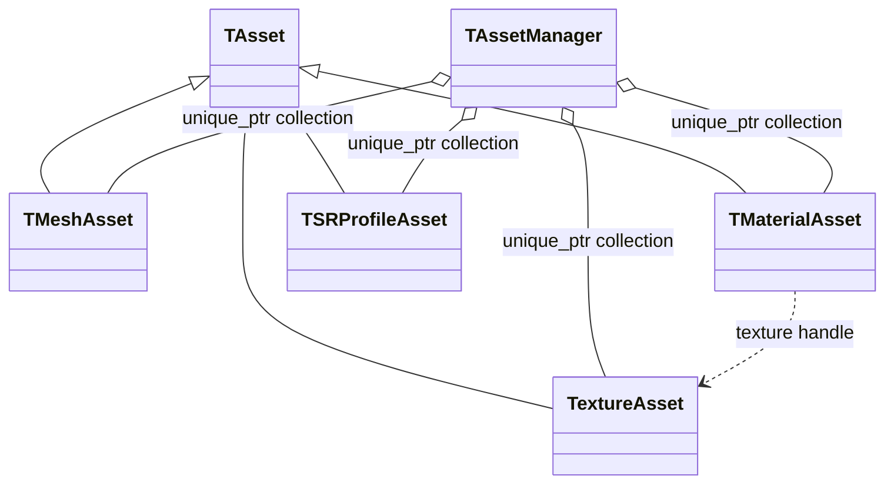
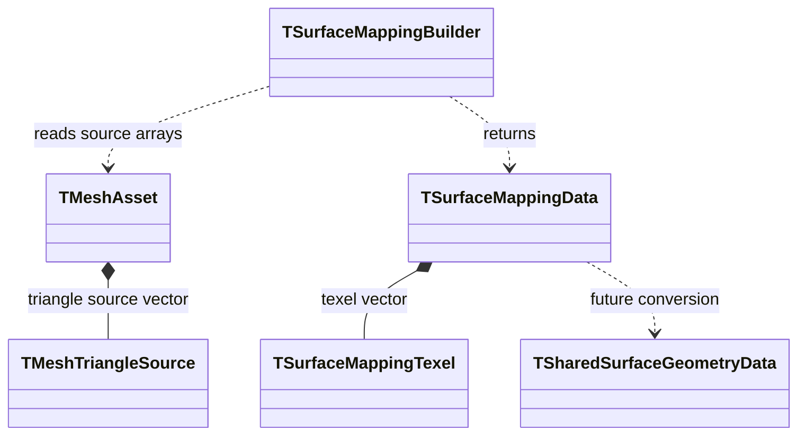
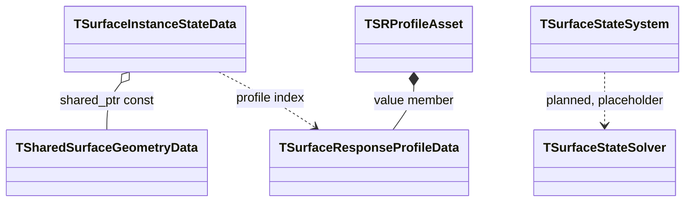

# Asset과 Surface 데이터 흐름

상태: **현재 C++ 코드 기준** · 상위 문서: [[0000_Overview|구현 구조 개요]]

OBJ, MTL, Texture와 `.SRProfile` 파일이 파싱된 뒤 Asset으로 등록되고, Mesh 데이터가 Runtime Simulation Mapping과 Surface State 자료형으로 이어지는 과정을 설명한다. 설계된 파일 책임과 현재 구현을 구분해 정리한다. State Registry와 이전 `.Surface` binary cache API는 구현돼 있으나, 최종 설계는 persistent cache 없이 Runtime load에서 전처리 결과를 메모리에 생성·공유한다.

관련 설계 문서:

- [[03_Architecture/0003_Assets-and-Profiles|에셋과 프로필]]
- [[05_Development/Notes/0000_Surface-Simulation-Mapping|Surface Simulation Mapping]]
- [[03_Architecture/0002_Surface-State|표면 상태와 데이터 구조]]

## 전체 데이터 흐름

```mermaid
flowchart LR
  OBJ[OBJ file] --> TOBJLoader[TOBJLoader / tinyobjloader]
  MTL[Referenced MTL] --> TOBJLoader
  TOBJLoader -->|parsed material_t| TMTLLoader[TMTLLoader Convert]
  TMTLLoader -->|TMaterialSourceData| TOBJLoader
  TOBJLoader -->|TOBJLoadResult| TAssetManager
  TAssetManager -->|texture path| TextureLoader
  TextureLoader -->|TextureData| TAssetManager
  TAssetManager --> TMeshAsset
  TAssetManager --> TMaterialAsset
  TAssetManager --> TextureAsset

  ProfileFile[.SRProfile JSON] --> TSRProfileLoader
  TAssetManager --> TSRProfileLoader
  TSRProfileLoader --> TSRProfileAsset
  TAssetManager --> TSRProfileAsset

  TMeshAsset -->|TAsset/TScene load| Preprocess[TSurfacePreprocessor]
  NormalMap[Normal Map TAsset] -. "CPU 입력 통합 미구현" .-> Preprocess
  ProfileDistribution[Profile Distribution] -->|parsed input| Preprocess
  Preprocess --> SurfaceData[Runtime static geometry + texel profile map]
  TSRProfileAsset --> Registry[TSurfaceStateRegistry]
  SurfaceData -. "ProfileIndex resolution" .-> TSRProfileAsset

  TMeshAsset -->|TVertex / Triangle source| MappingBuilder[TSurfaceMappingBuilder]
  MappingBuilder --> MappingData[TSurfaceMappingData]
  MappingData --> MappingValidation[SurfaceMappingValidation]
  MappingData -. "호출자 직접 연결" .-> Preprocess
  Preprocess -->|Build 결과| SharedGeometry[TSharedSurfaceGeometryData + ProfileMap]
  SharedGeometry -->|shared_ptr const| InstanceState[TSurfaceInstanceStateData]
  Registry -. "channel count 전달: Branch 4; Solver 소비: Branch 5; 입력 해석: Branch 6" .-> InstanceState
  InstanceState -. "Solver 미구현" .-> Solver[TSurfaceStateSolver]
```



실선은 현재 코드에 존재하는 호출·생성·참조 관계다. 점선은 자료형이나 설계는 있지만 상위 연결 코드가 아직 구현되지 않은 구간이다.

## 파일 단위 책임과 수명

입력 원본, Runtime에서 생성되는 공유 데이터와 instance별 상태는 서로 다른 책임과 수명을 가진다.

| 파일·데이터 | 역할 | 생성·갱신 | 현재 코드 상태 |
|---|---|---|---|
| `.obj` | Mesh position/normal/UV/face 및 Surface별 Material 할당의 원본 | 외부 제작·편집 도구에서 생성 | `TOBJLoader`로 읽음 |
| `.mtl` | OBJ가 참조하는 Render Material 및 Texture 경로 | 외부 제작·편집 도구에서 생성 | OBJ 파싱 중 `TMTLLoader`가 변환 |
| Texture (`.png`, `.jpg` 등) | Albedo, Normal 등의 이미지 입력 | 외부 제작 도구에서 생성 | `TextureAsset`으로 로드·GPU 업로드 |
| `.SRProfile` | State별 반응 파라미터와 Transition | 사용자가 작성·편집 | JSON Loader는 임의 State 이름을 파싱. AssetManager의 Registry 생성 API 구현됨 |
| Profile Distribution | Surface/Material 할당별 SRProfile 지정 입력 | `.SurfaceProfileMap`에서 파싱해 각 valid texel의 index로 확장 | Loader와 `LoadOBJ` 전처리 연결 구현. Surface 내부 texel별 Profile authoring은 후속 기능 |
| Runtime Surface Data | 전처리된 정적 Geometry/texel 관계와 `Texel → ProfileIndex` map | Runtime의 Asset/Scene load에서 생성하고 같은 Mesh asset의 instance가 공유 | `LoadOBJ` 경로의 Runtime Build 구현. `.Scene` 로더 연결은 후속 작업이며 binary cache를 사용하지 않음 |
| `TSurfaceInstanceStateData` | Instance별 동적 State (`stateCapacity` 이내) | Runtime에서 초기화·갱신 | 동적 channel 자료형 구현. Registry channel count/GPU layout 연결은 `feat/surface-gpu-resources`, Solver 순회는 `feat/surface-solver-2pass`, 입력은 `feat/surface-input-integration` 담당 |

파일 흐름의 목표 형태는 다음과 같다.

```text
.obj + .mtl + textures ─────┐
                             ├─ Surface Preprocessor ─→ Runtime Surface Data
Normal Map ─────────────────┤                           ├─ static geometry / texel relations
Profile Distribution ───────┘                           └─ Texel → ProfileIndex

.SRProfile files ─→ TSRProfileAsset collection ─→ TSurfaceStateRegistry
       │                                              │
       └── Profile response parameters ──────────────┤
                                                      ▼
  Runtime Shared Geometry ──────────────→ TSurfaceInstanceStateData
                                      (Registry-sized dynamic State per instance; each channel is capacity-limited)
```

최종 설계는 `.Surface` 파일을 만들지 않는다. 각 Runtime의 Asset/Scene load에서 고유 Mesh 및 Profile Distribution 조합을 전처리하고, 결과를 메모리에 보유해 같은 입력의 instance들이 공유한다. 같은 frame이나 instance별로 반복 생성하지 않는다. 현재 코드의 binary serialization/metadata API는 이전 결정의 잔여 구현이므로 Runtime 전처리 흐름에서는 제거하거나 비활성화한다. Profile Distribution 입력 형식/loader는 builder의 입력 계약으로 유지한다. 동적 State는 공유 Geometry가 아니라 instance별 State 데이터가 소유하며, 각 State의 Capacity 초과량은 저장하지 않는다. 현재 결정은 [[04_ADR/0008-Runtime-Surface-Preprocessing|ADR 0008 — Runtime Surface 전처리]]를 따른다.

## 1. OBJ와 MTL 파싱

`TAssetManager::LoadOBJ`가 `TOBJLoader::Load`를 호출한다. `TOBJLoader`는 tinyobjloader로 OBJ와 참조된 MTL을 함께 읽고, parsed material을 `TMTLLoader::Convert`에 전달한다.

| 입력 | 처리 타입 | 출력 |
|---|---|---|
| OBJ position, normal, UV, face | `TOBJLoader` | `TVertex`, index, `TMeshTriangleSource`, section |
| MTL material | `TMTLLoader` | `TMaterialSourceData` |
| MTL texture 이름 | `TMTLLoader` | OBJ 기준 디렉토리로 해석된 texture 경로 |

최종 `TOBJLoadResult`는 다음 데이터를 값으로 소유한다.

| 필드 | 내용 |
|---|---|
| `Vertices` | 렌더링용으로 조합된 정점 |
| `Indices` | 삼각형 render vertex index |
| `Sections` | index 범위, MTL Material index, Surface ID |
| `Materials` | 변환된 Material 값과 texture 경로 |
| `Triangles` | render index와 OBJ 원본 topology index |

## 2. Asset 생성과 소유

`TAssetManager`는 Loader 결과를 장기 수명의 Asset 객체로 바꾸고 유형별 `std::unique_ptr` 벡터에 보관한다. vector index를 Asset handle로 사용한다.

| 타입 | 관계 | 소유 데이터 |
|---|---|---|
| `TAsset` | 기반 클래스 | ID, 이름, 원본 경로 |
| `TMeshAsset` | `TAsset` 상속 | CPU Vertex/Index/Section/Triangle과 GPU Vertex/Index buffer |
| `TMaterialAsset` | `TAsset` 상속 | Base Color와 Texture handle |
| `TextureAsset` | `TAsset` 상속 | GPU image, image view, sampler |
| `TSRProfileAsset` | `TAsset` 상속 | 검증된 `TSurfaceResponseProfileData` |
| `TAssetManager` | Asset 소유자 | Mesh, Material, Texture, SRProfile 저장소와 Texture cache |



`TMeshSection`의 Material handle과 `TMaterialAsset`의 Texture handle은 비소유 참조다. 대상 Asset의 수명은 `TAssetManager`가 관리한다. GPU 자원을 만드는 객체는 `TVulkanContext`를 참조하지만 Context 자체를 소유하지 않는다.

## 3. Texture 로딩

OBJ Material에 Texture 경로가 있으면 `TAssetManager`가 `TextureLoader::LoadRGBA8`을 호출한다. 반환된 CPU 픽셀은 `TextureAsset` 생성자에서 GPU image로 업로드된다.

Texture cache key는 정규화 경로와 색 공간을 조합한다. 같은 파일도 sRGB와 linear 용도는 서로 다른 Texture Asset이 될 수 있다. 경로가 없으면 AssetManager가 만든 기본 색상 또는 기본 Normal Texture handle을 사용한다.

## 4. SRProfile 파싱

`TAssetManager::LoadSRProfile`은 새 handle을 정한 뒤 `TSRProfileLoader::Load`를 호출한다.

```text
File read
→ JSON parse
→ JSON field/type validation
→ TSurfaceResponseProfileData 변환
→ domain validation
→ TSRProfileAsset 생성
→ TAssetManager 등록
```

`TSRProfileAsset`은 Profile 데이터를 값으로 소유한다. MTL Material 이름과 SRProfile handle을 연결하는 `.Scene` 로더는 아직 placeholder이므로, 두 Asset 사이의 자동 연결은 현재 구현되어 있지 않다.

`.SRProfile`의 `states` key를 모으는 `TSurfaceStateRegistry`와 정규화, 재현 가능한 ID 배정, Transition endpoint 검증은 구현되어 있다. `TAssetManager::GetSurfaceStateRegistry()`가 로드된 Profile 집합을 기준으로 Registry를 지연 생성하고 이후 Profile이 추가되면 cache를 무효화한다. Registry channel count를 instance/GPU layout에 전달하는 일은 Branch 4, Solver 순회는 Branch 5, Contact 입력의 StateId 해석은 Branch 6에 배정했다. 계약은 [[04_ADR/0006-Dynamic-State-Registry|ADR 0006]]을 기준으로 한다.

## 5. Runtime Surface 전처리 흐름

`.Surface` 파일은 사용하지 않는다. 각 애플리케이션 Runtime의 Asset/Scene load 중 고유 Mesh와 Profile Distribution 조합을 전처리해 결과를 메모리에 만든다. 같은 조합을 사용하는 여러 instance가 결과를 공유하며, 각 유효 texel은 dense Profile Map에 저장된 `ProfileIndex`로 별도 Profile 응답 테이블을 직접 조회한다. 인접 texel이 같은 Profile이어도 기본안에서는 texel마다 인덱스를 저장한다. 상세 결정은 [[../04_ADR/0009-Texel-Profile-Index-Map|ADR 0009]]를 따른다.

| 전처리 입력 | 결과에 미치는 영향 | Runtime 처리 |
|---|---|---|
| Mesh (`.obj`) | UV rasterization, Surface/Triangle 관계, topology와 seam 이웃 | load 시 Mapping/Geometry build |
| Normal Map | 정적 Normal 및 Meso 형상 파생값 | 입력이 있으면 전처리 때 사용 |
| Profile Distribution | Texel별 Profile 배치 | 파싱 후 Profile map 구성 |
| Grid / preprocess 설정 | Texel 해상도와 생성 결과 | 현재 설정으로 Runtime 결과 생성 |

전처리 결과의 파일 경로, source hash, cache version 및 stale 판정은 두지 않는다. Runtime 세션 안에서는 같은 입력 조합의 결과를 재사용해 Mesh별 중복 전처리를 방지한다. Runtime 중 입력 Asset이 교체되면 대응하는 메모리 결과를 다시 만든다.

`TAssetManager`/Scene load는 입력을 모아 Runtime builder에 전달한다. Builder는 Simulation Mapping, shared geometry와 texel Profile map을 생성한다. 검증 실패는 잘못된 Asset/입력 식별 정보와 함께 load 오류로 보고한다. 생성된 결과는 Runtime Asset/resource로 등록해 instance들이 참조한다. persistent `SurfaceCache::Save/Load`, metadata fingerprint 및 cache miss/stale 분기는 목표 흐름에 포함하지 않는다. Normal Map 기반 Meso/Curvature algorithm은 Week-08 experiment에서 후보를 비교한 뒤 별도 구현 범위를 결정한다.

## 6. Mesh 원본 topology 보존

OBJ의 position/UV/normal 조합이 다르면 하나의 원본 position이 여러 render vertex로 분리될 수 있다. `TMeshTriangleSource`는 Mapping이 UV seam 너머의 실제 mesh 연결을 찾을 수 있도록 원본 index를 함께 보존한다.

`Surface`는 삼각형의 **MTL Material 그룹을 식별하는 로컬 ID**다. OBJ 로더는 각 MTL Material index에 하나의 `TSurfaceLocalID`를 대응시키며, 해당 Material을 사용하는 모든 삼각형에 같은 ID를 부여한다. 이때 면의 인접성이나 연결 여부는 검사하지 않는다. 따라서 같은 Material을 쓰는 서로 떨어진 면도 같은 ID를 공유하고, Material이 다르면 인접한 면이어도 서로 다른 ID를 받는다.

이 ID는 기하학적으로 연결된 표면 조각의 식별자가 아니다. 실제 texel 이웃과 UV seam 연결은 `OriginalPositionIndices` 등 원본 topology를 사용해 별도로 계산한다. 현재 구현에서 `TSurfaceLocalID`는 Surface별 Mapping 정의와 texel의 Surface 소속을 정하는 구분자로 쓰인다.

| 필드                           | 용도                                              |
| ---------------------------- | ----------------------------------------------- |
| `RenderVertexIndices[3]`     | `TMeshAsset::Vertices`에서 Position, Normal, UV 읽기 |
| `OriginalPositionIndices[3]` | 원본 mesh edge와 seam 반대편 triangle 탐색              |
| `OriginalUVIndices[3]`       | 원본 UV topology와 seam 정보 보존                      |
| `Surface`                    | triangle이 속한 Mesh-local Surface 식별              |

`TOBJLoader`가 이를 생성하고 `TMeshAsset`이 `Triangles` 벡터로 소유한다.


## 7. Surface Mapping 생성

`TSurfaceMappingBuilder::Build`는 Vertex, `TMeshTriangleSource`, `TSurfaceDefinition` 목록을 읽어 `TSurfaceMappingData`를 반환한다.

| 타입 | 관계 | 역할 |
|---|---|---|
| `TSurfaceDefinition` | 호출자가 값 제공 | Surface ID와 Simulation resolution |
| `TSurfaceMappingBuilder` | 입력 비소유 참조 | UV rasterization, Chart, 기본 이웃과 seam 이웃 생성 |
| `TSurfaceMappingTexel` | Mapping Data가 값 소유 | Surface/Triangle/Chart, barycentric, position/normal, 8 neighbor index |
| `TSurfaceMappingData` | 반환 결과 | Surface range, mapping texel, warning 목록 소유 |
| `SurfaceMappingValidation` | 읽기 전용 참조 | texel range와 양방향 neighbor 불변조건 검사 |



`TSurfaceLocalID`, `TLocalTexelIndex`, sentinel, resolution/range와 geometry 자료형은 `SurfaceMappingTypes.h`에서 공통으로 정의한다.

## 8. Shared Geometry 데이터 구성

`TSharedSurfaceGeometryData`는 Mesh를 사용하는 Instance들이 공유할 Surface range와 `TSurfaceTexelGeometry` 배열을 소유한다.

`TSurfaceMappingData`와 `TSharedSurfaceGeometryData`는 별도 타입이다. Runtime 전처리 builder는 Mapping 결과를 Geometry texel로 변환한다. OBJ/Scene load에서 builder를 호출하고 결과를 메모리 Asset으로 등록하는 상위 연결이 필요하며, persistent cache 저장 단계는 없다.

| Mapping 결과 | Shared Geometry에서의 용도 |
|---|---|
| Surface/Triangle ID | 유효 texel과 원본 triangle 식별 |
| Barycentric | 원본 mesh 속성 복원 |
| Position/Normal | texel geometry 초기값 |
| Neighbor index | texel graph 연결 |
| Chart ID | mapping 생성·검증용이며 Shared Geometry 저장 여부는 후속 단계에서 결정 |

## 9. Instance State와 Profile 연결

`TSurfaceInstanceStateData`는 Instance마다 달라지는 State를 소유하고, Mesh 공유 Geometry를 `std::shared_ptr<const TSharedSurfaceGeometryData>`로 참조한다.

| 데이터 | 소유·참조 관계 |
|---|---|
| `TSharedSurfaceGeometryData` | 여러 Instance가 공유 소유하며 읽기 전용 접근 |
| `TSurfaceStateValues[]` | 각 `TSurfaceInstanceStateData`가 자체 소유 |
| `SurfaceProfileMap` | Runtime `TSharedSurfaceGeometryData`가 texel별 ProfileIndex를 메모리에서 정적 소유 |
| `TSurfaceResponseProfileData` | `TSRProfileAsset`이 값으로 소유 |

Runtime 전처리의 texel별 Profile index는 공유 `TSharedSurfaceGeometryData`에 저장하며, `TSurfaceInstanceStateData`는 texel index로 이를 조회한다. Profile index를 SRProfile Asset handle로 해석해 Solver에 전달하는 Scene/Instance 생성 경로는 아직 구현되어 있지 않다. 과거 계획의 Surface별 Profile 배열로 texel Profile map을 대체하지 않는다.



## 현재 미구현 연결

| 연결 | 현재 상태 |
|---|---|
| `.Scene` → Mesh/Material/SRProfile 연결 | `SceneLoader` placeholder |
| `TSurfaceMappingData` → `TSharedSurfaceGeometryData` | Build 변환 API 구현. Mesh/Scene load에서 Runtime 호출·등록 연결 필요 |
| Runtime 전처리 결과 수명 | load 시 생성하고 메모리에서 같은 입력의 instance 간 공유. persistent cache 저장·로드는 하지 않음 |
| `.SurfaceProfileMap` → texel `ProfileIndex` map | Surface별 Profile 파싱, 검증 및 valid texel로의 확장 구현 완료. Surface 내부의 세밀한 Profile authoring은 후속 기능 |
| Profile collection → `TSurfaceStateRegistry` | Registry와 AssetManager 지연 생성 구현. Instance/GPU 연결은 Branch 4, Solver 소비는 Branch 5, 입력은 Branch 6 담당 |
| texel `ProfileIndex` → `TSRProfileAssetHandle` | 상위 등록·해석 정책 미구현 |
| Instance State/Profile → Solver | `TSurfaceStateSolver` placeholder. Dynamic channel iteration and unsupported Profile-state handling are assigned to Branch 5 |
| 전체 Surface State 수명과 갱신 | `TSurfaceStateSystem` placeholder |

## 관련 코드 위치

| 코드 위치 | 역할 |
|---|---|
| `Source/AssetManager/Loaders/` | OBJ, MTL, Texture, SRProfile 파싱과 변환 |
| `Source/AssetManager/Core/AssetManager.*` | Asset 생성, 소유, handle 조회와 Texture cache |
| `Source/AssetManager/Core/Asset.*` | 공통 Asset 식별 정보와 원본 경로 |
| `Source/AssetManager/Assets/` | 개별 Asset 데이터와 GPU 자원 |
| `Source/AssetManager/Assets/MeshSourceData.h` | `TVertex`, `TMeshTriangleSource` |
| `Source/SurfaceStateSystem/Mapping/` | Surface Mapping 생성과 검증 |
| `Source/SurfaceStateSystem/Preprocessing/SurfaceRuntimeData.*` | Runtime Mapping/ProfileMap 변환 후 메모리에서 공유하는 정적 Surface data |
| `Source/SurfaceStateSystem/Types/SurfaceMappingTypes.h` | 공통 Surface/texel/geometry 자료형 |
| `Source/SurfaceStateSystem/Types/SurfaceStateRegistry.*` | Profile State 이름과 runtime State ID/index Registry |
| `Source/SurfaceStateSystem/Geometry/SharedSurfaceGeometryData.*` | Mesh 공유 Geometry 저장소 |
| `Source/SurfaceStateSystem/State/SurfaceInstanceStateData.*` | Instance별 State와 Profile index |
| `Source/SurfaceStateSystem/Types/SurfaceStateTypes.*` | State와 Profile 값 자료형 및 검증 |
