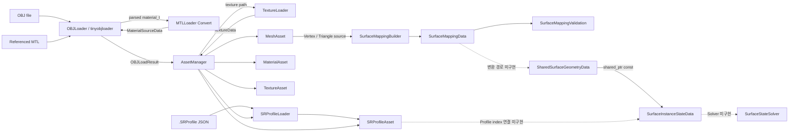
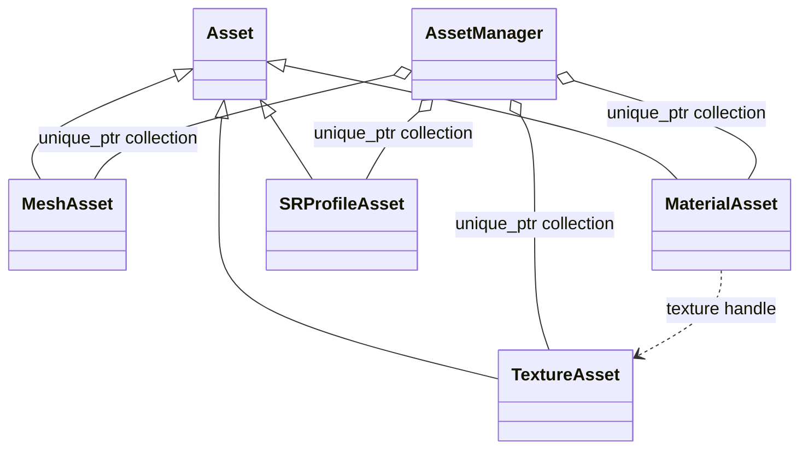
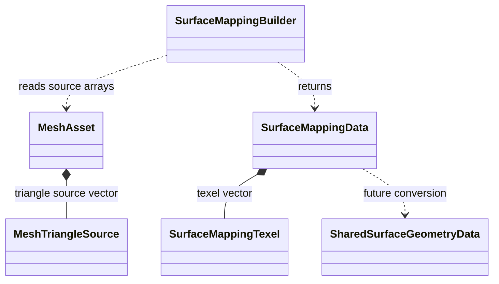
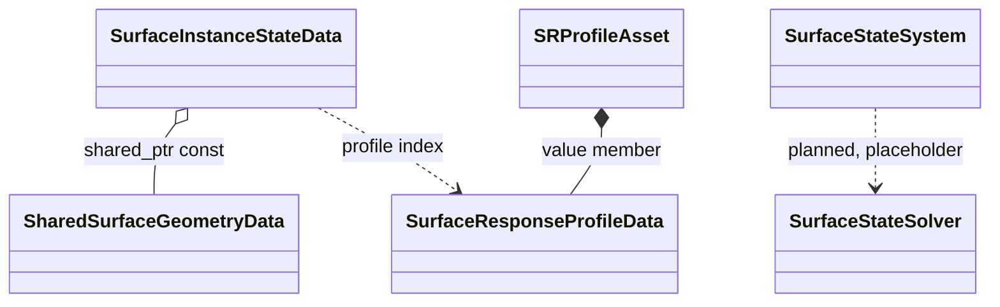

# Asset과 Surface 데이터 흐름

상태: **현재 C++ 코드 기준** · 상위 문서: [[0000_Overview|구현 구조 개요]]

OBJ, MTL, Texture와 `.SRProfile` 파일이 파싱된 뒤 Asset으로 등록되고, Mesh 데이터가 Simulation Mapping과 Surface State 자료형으로 이어지는 과정을 설명한다.

관련 설계 문서:

- [[03_Architecture/0003_Assets-and-Profiles|에셋과 프로필]]
- [[05_Development/Notes/0000_Surface-Simulation-Mapping|Surface Simulation Mapping]]
- [[03_Architecture/0002_Surface-State|표면 상태와 데이터 구조]]

## 전체 데이터 흐름



실선은 현재 코드에 존재하는 호출·생성·참조 관계다. 점선은 자료형이나 설계는 있지만 상위 연결 코드가 아직 구현되지 않은 구간이다.

## 1. OBJ와 MTL 파싱

`AssetManager::LoadOBJ`가 `OBJLoader::Load`를 호출한다. `OBJLoader`는 tinyobjloader로 OBJ와 참조된 MTL을 함께 읽고, parsed material을 `MTLLoader::Convert`에 전달한다.

| 입력 | 처리 타입 | 출력 |
|---|---|---|
| OBJ position, normal, UV, face | `OBJLoader` | `Vertex`, index, `MeshTriangleSource`, section |
| MTL material | `MTLLoader` | `MaterialSourceData` |
| MTL texture 이름 | `MTLLoader` | OBJ 기준 디렉토리로 해석된 texture 경로 |

최종 `OBJLoadResult`는 다음 데이터를 값으로 소유한다.

| 필드 | 내용 |
|---|---|
| `Vertices` | 렌더링용으로 조합된 정점 |
| `Indices` | 삼각형 render vertex index |
| `Sections` | index 범위, MTL Material index, Surface ID |
| `Materials` | 변환된 Material 값과 texture 경로 |
| `Triangles` | render index와 OBJ 원본 topology index |

## 2. Asset 생성과 소유

`AssetManager`는 Loader 결과를 장기 수명의 Asset 객체로 바꾸고 유형별 `std::unique_ptr` 벡터에 보관한다. vector index를 Asset handle로 사용한다.

| 타입 | 관계 | 소유 데이터 |
|---|---|---|
| `Asset` | 기반 클래스 | ID, 이름, 원본 경로 |
| `MeshAsset` | `Asset` 상속 | CPU Vertex/Index/Section/Triangle과 GPU Vertex/Index buffer |
| `MaterialAsset` | `Asset` 상속 | Base Color와 Texture handle |
| `TextureAsset` | `Asset` 상속 | GPU image, image view, sampler |
| `SRProfileAsset` | `Asset` 상속 | 검증된 `SurfaceResponseProfileData` |
| `AssetManager` | Asset 소유자 | Mesh, Material, Texture, SRProfile 저장소와 Texture cache |



`MeshSection`의 Material handle과 `MaterialAsset`의 Texture handle은 비소유 참조다. 대상 Asset의 수명은 `AssetManager`가 관리한다. GPU 자원을 만드는 객체는 `VulkanContext`를 참조하지만 Context 자체를 소유하지 않는다.

## 3. Texture 로딩

OBJ Material에 Texture 경로가 있으면 `AssetManager`가 `TextureLoader::LoadRGBA8`을 호출한다. 반환된 CPU 픽셀은 `TextureAsset` 생성자에서 GPU image로 업로드된다.

Texture cache key는 정규화 경로와 색 공간을 조합한다. 같은 파일도 sRGB와 linear 용도는 서로 다른 Texture Asset이 될 수 있다. 경로가 없으면 AssetManager가 만든 기본 색상 또는 기본 Normal Texture handle을 사용한다.

## 4. SRProfile 파싱

`AssetManager::LoadSRProfile`은 새 handle을 정한 뒤 `SRProfileLoader::Load`를 호출한다.

```text
File read
→ JSON parse
→ JSON field/type validation
→ SurfaceResponseProfileData 변환
→ domain validation
→ SRProfileAsset 생성
→ AssetManager 등록
```

`SRProfileAsset`은 Profile 데이터를 값으로 소유한다. MTL Material 이름과 SRProfile handle을 연결하는 `.Scene` 로더는 아직 placeholder이므로, 두 Asset 사이의 자동 연결은 현재 구현되어 있지 않다.

## 5. Mesh 원본 topology 보존

OBJ의 position/UV/normal 조합이 다르면 하나의 원본 position이 여러 render vertex로 분리될 수 있다. `MeshTriangleSource`는 Mapping이 UV seam 너머의 실제 mesh 연결을 찾을 수 있도록 원본 index를 함께 보존한다.

| 필드 | 용도 |
|---|---|
| `RenderVertexIndices[3]` | `MeshAsset::Vertices`에서 Position, Normal, UV 읽기 |
| `OriginalPositionIndices[3]` | 원본 mesh edge와 seam 반대편 triangle 탐색 |
| `OriginalUVIndices[3]` | 원본 UV topology와 seam 정보 보존 |
| `Surface` | triangle이 속한 Mesh-local Surface 식별 |

`OBJLoader`가 이를 생성하고 `MeshAsset`이 `Triangles` 벡터로 소유한다.

## 6. Surface Mapping 생성

`SurfaceMappingBuilder::Build`는 Vertex, `MeshTriangleSource`, `SurfaceDefinition` 목록을 읽어 `SurfaceMappingData`를 반환한다.

| 타입 | 관계 | 역할 |
|---|---|---|
| `SurfaceDefinition` | 호출자가 값 제공 | Surface ID와 Simulation resolution |
| `SurfaceMappingBuilder` | 입력 비소유 참조 | UV rasterization, Chart, 기본 이웃과 seam 이웃 생성 |
| `SurfaceMappingTexel` | Mapping Data가 값 소유 | Surface/Triangle/Chart, barycentric, position/normal, 8 neighbor index |
| `SurfaceMappingData` | 반환 결과 | Surface range, mapping texel, warning 목록 소유 |
| `SurfaceMappingValidation` | 읽기 전용 참조 | texel range와 양방향 neighbor 불변조건 검사 |



`SurfaceLocalID`, `LocalTexelIndex`, sentinel, resolution/range와 geometry 자료형은 `SurfaceMappingTypes.h`에서 공통으로 정의한다.

## 7. Shared Geometry 경계

`SharedSurfaceGeometryData`는 Mesh를 사용하는 Instance들이 공유할 Surface range와 `SurfaceTexelGeometry` 배열을 소유한다.

현재 `SurfaceMappingData`와 `SharedSurfaceGeometryData`는 별도 타입이며, Mapping 결과를 Shared Geometry에 복사하고 추가 Geometry 값을 계산하는 전처리 연결 코드는 아직 구현되지 않았다.

| Mapping 결과 | Shared Geometry에서의 용도 |
|---|---|
| Surface/Triangle ID | 유효 texel과 원본 triangle 식별 |
| Barycentric | 원본 mesh 속성 복원 |
| Position/Normal | texel geometry 초기값 |
| Neighbor index | texel graph 연결 |
| Chart ID | mapping 생성·검증용이며 Shared Geometry 저장 여부는 후속 단계에서 결정 |

## 8. Instance State와 Profile 연결

`SurfaceInstanceStateData`는 Instance마다 달라지는 State를 소유하고, Mesh 공유 Geometry를 `std::shared_ptr<const SharedSurfaceGeometryData>`로 참조한다.

| 데이터 | 소유·참조 관계 |
|---|---|
| `SharedSurfaceGeometryData` | 여러 Instance가 공유 소유하며 읽기 전용 접근 |
| `SurfaceStateValues[]` | 각 `SurfaceInstanceStateData`가 자체 소유 |
| `SurfaceProfileIndex[]` | 각 Instance가 Surface ID 순서에 맞춰 자체 소유 |
| `SurfaceResponseProfileData` | `SRProfileAsset`이 값으로 소유 |

현재 `SurfaceProfileIndex`를 `AssetManager`의 `SRProfileAssetHandle`과 연결하는 Scene/Instance 생성 경로, 그리고 Solver가 Profile index를 해석하는 경로는 구현되어 있지 않다.



## 현재 미구현 연결

| 연결 | 현재 상태 |
|---|---|
| `.Scene` → Mesh/Material/SRProfile 연결 | `SceneLoader` placeholder |
| `SurfaceMappingData` → `SharedSurfaceGeometryData` | 전처리 변환 미구현 |
| `SRProfileAssetHandle` → `SurfaceProfileIndex` | 상위 등록·매핑 정책 미구현 |
| Instance State/Profile → Solver | `SurfaceStateSolver` placeholder |
| 전체 Surface State 수명과 갱신 | `SurfaceStateSystem` placeholder |

## 관련 코드 위치

| 코드 위치 | 역할 |
|---|---|
| `Source/AssetManager/Loaders/` | OBJ, MTL, Texture, SRProfile 파싱과 변환 |
| `Source/AssetManager/Core/AssetManager.*` | Asset 생성, 소유, handle 조회와 Texture cache |
| `Source/AssetManager/Core/Asset.*` | 공통 Asset 식별 정보와 원본 경로 |
| `Source/AssetManager/Assets/` | 개별 Asset 데이터와 GPU 자원 |
| `Source/AssetManager/Assets/MeshSourceData.h` | `Vertex`, `MeshTriangleSource` |
| `Source/SurfaceStateSystem/Mapping/` | Surface Mapping 생성과 검증 |
| `Source/SurfaceStateSystem/Types/SurfaceMappingTypes.h` | 공통 Surface/texel/geometry 자료형 |
| `Source/SurfaceStateSystem/Geometry/SharedSurfaceGeometryData.*` | Mesh 공유 Geometry 저장소 |
| `Source/SurfaceStateSystem/State/SurfaceInstanceStateData.*` | Instance별 State와 Profile index |
| `Source/SurfaceStateSystem/Types/SurfaceStateTypes.*` | State와 Profile 값 자료형 및 검증 |
