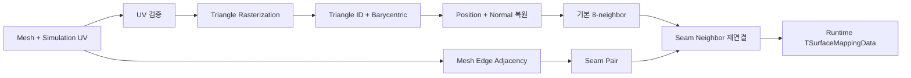

# Surface Simulation Mapping

상태: **4주차 구현 기본안 / 자동 UV 생성과 복잡 경계 검증 필요** · 관련 문서: [[03_Architecture/0005_Surface-Geometry|형상 정보]], [[05_Development/Notes/0001_Geometry-Preprocessing|형상 정보 전처리]], [[05_Development/Notes/0003_Surface-State-GPU-Resource|GPU Resource]]

이 문서는 Mesh의 연속 표면을 Solver가 처리할 **texel graph**로 변환하는 방법을 정의한다. 출력은 `TSharedSurfaceGeometryData` 생성의 입력이다.

## 핵심 결정

| 항목 | 결정 |
|---|---|
| Simulation UV | 렌더링 UV와 논리적으로 분리된 전용 UV를 사용한다. |
| 4주차 범위 | 자동 unwrap은 구현하지 않는다. 조건을 만족하도록 미리 준비한 UV를 사용한다. OBJ의 기존 `vt`를 임시로 Simulation UV로 읽을 수 있다. |
| 해상도 | 모든 Surface에 `512 × 512`를 사용한다. 한 곳의 코드 상수로 고정하며 `.Scene` override와 UI 설정은 두지 않는다. |
| 생성 시점 | CPU에서 Scene load 때 생성하고 Runtime 메모리에 둔다. 같은 Mesh와 Profile Distribution 입력을 쓰는 instance끼리 공유하며 매 frame 재생성하지 않는다. |
| Mesh→Texel | UV triangle rasterization과 barycentric coordinate를 사용한다. |
| 유효성 | Mesh 표면에 대응하는 texel만 `ValidMask = 1`이다. |
| 이웃 | texel당 최대 8개의 `NeighborIndex`를 저장한다. Distance는 위치 차이에서 필요할 때 계산하며 저장하지 않는다. |
| UV seam | Mesh topology로 seam 반대편 texel을 찾아 일반 이웃과 같은 표에 연결한다. Shader에는 seam 전용 분기를 두지 않는다. |
| 무효 인덱스 | `InvalidTexelIndex = 0xFFFFFFFF`를 사용한다. |

전용 UV를 실제 Asset에 별도 채널로 저장하는 최종 파일 형식은 후속 과제다. Mapping 결과는 Runtime에서 만들며 `.Surface` 전처리 캐시 파일은 사용하지 않는다.

## 입력과 출력

### 입력

- Mesh position, normal, triangle index
- triangle별 Surface ID
- Simulation UV
- 고정 해상도 `512 × 512`
- 선택적으로 Normal / Height detail

### 현재 Material 단위 처리와 후속 확장

현재 개발 범위에서는 `TSurfaceLocalID`를 MTL Material별 시뮬레이션 영역으로 사용한다. OBJ 로더는 각기 다른 MTL Material index에 서로 다른 ID를 부여하고, 같은 Material을 사용하는 삼각형에는 같은 ID를 부여한다. 삼각형의 기하학적 인접성은 ID 배정에 관여하지 않으므로, 떨어진 면도 같은 Material이면 같은 ID를 공유한다. 이는 구현을 진행하기 위한 현재 단순화다.

후속 Profile Distribution 구현에서는 같은 MTL Material 안에서도 서로 다른 SRProfile을 배치할 수 있어야 한다. 따라서 MTL 기준 `TSurfaceLocalID`만으로 Profile 경계를 표현하지 않는다. texel별 `SurfaceProfileMap`/`ProfileIndex`가 Profile 배치를 나타내며, 같은 Material 안에서 Profile이 달라지는 경우에도 해당 경계를 유지해야 한다. 당장 Surface ID 체계를 재설계하지 않고 현재 MTL 단위 처리를 유지하며, Profile Distribution 연결 단계에서 필요한 세분화를 구현한다.

`TSurfaceLocalID`는 Mesh 안에서 dense index로 `0`부터 부여한다. `0xFFFFFFFF`는 `InvalidSurfaceID`로 예약한다. 현재 각 ID의 texel grid는 Shared Geometry 안에서 연속된 mesh-local range를 차지한다. Profile 연결은 이 Surface ID를 MTL과 SRProfile이 항상 일대일이라는 가정으로 해석하지 않고, texel별 Profile Map을 기준으로 한다.

### 출력

| 데이터 | 단위 | 용도 |
|---|---:|---|
| `ValidMask` | texel | Solver 참여 여부 |
| `TriangleID` | texel | 원본 triangle 추적 |
| `Barycentric` | texel | 표면 속성 복원 |
| `SurfacePosition` | texel | 거리, 높이, 전달 방향 계산 |
| `SurfaceNormal` | texel | Normal/Direction 계열 계산 |
| `SurfaceID` | texel | Surface와 Profile 연결 |
| `NeighborIndex[8]` | texel × 8 | seam을 포함한 실제 이웃 |

`TriangleID`와 `Barycentric`은 Runtime Mapping 결과에 두어 Geometry를 복원하는 데 사용하고, 이후 필요하지 않으면 해제할 수 있다. Solver가 직접 필요로 하지 않으면 GPU에는 올리지 않는다. Distance는 CPU Mapping이나 GPU buffer에 저장하지 않는다. Solver가 `Position[j] - Position[i]`에서 거리와 방향을 계산한다. GPU에서 invalid texel은 `TexelSurfaceIndex = InvalidSurfaceID`로 표시한다. 자세한 packed layout은 [[04_ADR/0005-Per-Texel-GPU-Data-Layout|Per-Texel GPU Data Layout ADR]]을 따른다.

## 전체 생성 순서



Runtime 전처리는 Mesh topology와 UV, 필요한 Normal Map 데이터, Profile Distribution 및 현재 grid 설정을 입력으로 받는다. 같은 입력 조합의 전처리 결과는 Runtime 메모리에서 공유하고, 입력이 교체되면 다시 생성한다. 디스크 cache 경로, fingerprint, version 및 stale 판정은 사용하지 않는다. 전처리 연결은 [[02_Planning/02_Weekly-Details/Week-04/0003_Branch-Shared-Geometry-Build|Branch 3 계획]]을 따른다.

## 1. Simulation UV 검증

전처리 전에 다음 조건을 검사한다.

1. 모든 UV가 `[0,1]` 안에 있다.
2. 모든 UV triangle 면적이 epsilon보다 크다.
3. 의도하지 않은 triangle overlap이 없다.
4. 서로 다른 chart 사이에 최소 한 texel의 padding이 있다.
5. 각 triangle의 Surface ID가 유효하다.
6. non-manifold edge를 탐지해 경고 또는 오류로 보고한다.

4주차에는 검증 실패를 자동 보정하지 않는다. Asset, Surface, triangle ID와 실패 원인을 출력하고 mapping 생성을 중단한다.

## 2. Mesh → Texel Mapping

각 Surface의 UV triangle을 고정된 `512 × 512` grid에 CPU로 rasterize한다.

1. UV를 texel 좌표로 변환한다.
2. triangle의 texel-space bounding box만 순회한다.
3. texel 중심이 triangle 내부인지 edge function으로 판정한다.
4. 공유 edge의 중복 판정은 top-left rule로 결정한다.
5. 유효한 texel에는 `TriangleID`와 barycentric coordinate `(b0, b1)`을 기록한다. `b2 = 1-b0-b1`로 복원한다.

```text
SurfacePosition = b0 × P0 + b1 × P1 + b2 × P2
SurfaceNormal   = normalize(b0 × N0 + b1 × N1 + b2 × N2)
```

한 triangle이 해상도보다 너무 작아 texel 중심을 하나도 포함하지 못하면 전처리 경고를 낸다. 보수적 rasterization은 후속 품질 개선으로 두고, 4주차 테스트 Asset은 모든 triangle이 최소 한 texel을 갖도록 준비한다.

## 3. Valid Texel

```text
ValidMask[i] = 1  Mesh 표면에 대응하며 필수 형상 값이 유효함
ValidMask[i] = 0  UV 빈 공간 또는 사용할 수 없는 표본
```

- invalid texel의 `TriangleID`와 모든 `NeighborIndex`는 `InvalidTexelIndex`다.
- invalid texel의 State는 항상 0이며 Input, Transport, Decay에서 제외한다.
- valid texel도 Mesh의 실제 open boundary에서는 이웃이 8개보다 적을 수 있다.
- State를 렌더링용으로 변환할 때 invalid texel이 선형 보간에 섞이지 않게 별도 마스킹한다.

## 4. 기본 8-neighbor

같은 UV chart 안에서 다음 offset을 후보로 사용한다.

```text
(-1,-1) ( 0,-1) ( 1,-1)
(-1, 0)          ( 1, 0)
(-1, 1) ( 0, 1) ( 1, 1)
```

후보가 valid이고 같은 chart에 속하면 이웃으로 등록한다. chart가 다르면 UV에서 가까워도 연결하지 않는다.

```text
NeighborIndex[i][k] = j
Distance(i, j) = max(length(Position[j] - Position[i]), distanceEpsilon)
```

`Distance` 식은 저장 배열이 아니라 Solver에서 이웃을 처리할 때 계산하는 값이다. 4주차에는 Mesh local space의 chord length를 사용한다. 곡면을 따른 geodesic distance는 필요성이 확인된 뒤 검토한다.

이웃 slot은 저장 위치일 뿐, seam 이후에도 동·서·남·북 같은 전역 방향을 뜻하지 않는다. `DirectionDrive`는 slot 번호가 아니라 `Position[j] - Position[i]`로 계산한다.

## 5. UV Seam 연결

UV seam은 UV에서는 분리됐지만 Mesh topology에서는 같은 edge를 공유하는 두 triangle의 경계다.

### Seam 판정

- 원래 Mesh position index 두 개를 정렬한 무방향 edge key를 만든다.
- edge에 triangle 두 개가 연결되고 양쪽 UV endpoint가 epsilon 안에서 일치하지 않으면 seam이다.
- triangle 하나만 연결되면 실제 open boundary다.
- triangle이 세 개 이상 연결된 non-manifold edge는 4주차 자동 연결 대상에서 제외한다.

### Seam Table 생성

1. 양쪽 edge의 endpoint 방향을 맞춰 같은 edge parameter `t ∈ [0,1]`가 같은 3D 위치를 가리키게 한다.
2. 양쪽 UV edge에 접한 valid boundary texel을 모은다.
3. 각 texel의 edge 위 최근접점에서 `t`를 구한다.
4. 반대쪽 edge에서 같은 `t`에 가장 가까운 valid texel을 찾는다.
5. 3D 거리와 Surface topology를 검사한다.
6. 기존 invalid neighbor slot을 seam 상대 texel로 교체하고 양방향으로 등록한다.

최종 GPU 데이터에는 seam을 별도로 표시하지 않는다. 일반 이웃과 동일한 `NeighborIndex[8]`에 병합한다. seam 쌍의 거리는 다른 이웃과 동일하게 위치 차이에서 계산한다.

서로 다른 Surface가 실제 Mesh edge를 공유할 때도 topology 연결은 유지할 수 있다. 이때 전달량은 [[03_Architecture/0004_Surface-State-Update|Propagation Solver]]의 `ProfileBoundaryWeight`가 조절한다.

## 불변조건

전처리 완료 후 다음 조건을 모두 검사한다.

- 자기 자신을 이웃으로 갖지 않는다.
- 한 texel의 이웃 목록에 중복이 없다.
- `i → j`가 있으면 `j → i`도 있다.
- 양방향 이웃이 같은 두 위치를 가리킨다. 계산되는 양방향 거리는 동일하다.
- 이웃 수가 8을 넘지 않는다.
- 모든 이웃 index가 같은 Runtime mapping 범위 안에 있다.
- invalid texel은 이웃으로 참조되지 않는다.

## 구현 순서

1. 단일 triangle rasterization과 barycentric 시각화
2. `ValidMask`, Position, Normal 생성
3. 단일 chart의 8-neighbor 및 Position 기반 on-demand Distance 검증
4. Mesh edge adjacency와 seam 검출
5. seam texel pair와 양방향 불변조건 검사
6. 여러 Surface와 Surface ID 처리
7. 동일 Mesh를 사용하는 instance들이 같은 Runtime mapping/geometry 결과를 공유하는지 확인
8. GPU resource 업로드 연결

## 확인할 사례

- UV 빈 공간에서 State가 변하지 않는다.
- triangle 공유 edge에 한 texel 폭의 균열이 생기지 않는다.
- seam을 가로지르는 전파가 끊기지 않는다.
- 공간상 가깝지만 topology상 분리된 표면이 연결되지 않는다.
- open boundary와 seam이 구분된다.
- 회전된 instance에서도 mapping은 유지되고 world gravity 변환만 달라진다.
- `.Scene`이 선택한 같은 Mesh와 Profile Distribution 조합을 쓰는 여러 instance가 한 Runtime mapping/geometry 결과를 공유한다.

## 미결 사항

- Render UV와 전용 Simulation UV를 함께 보존할 최종 Asset 형식
- 자동 UV unwrap과 chart padding 생성 도구
- 얇은 triangle용 보수적 rasterization
- non-manifold edge와 복잡한 vertex seam 처리
- geodesic distance가 필요한 품질 기준
