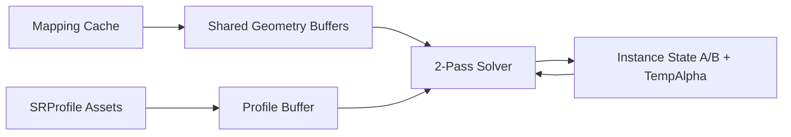
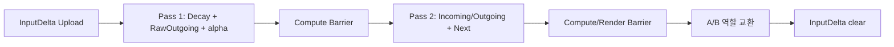

# Surface State GPU Resource

상태: **4주차 Vulkan 구현 기본안 / 실제 성능과 동적 형상 배치 검증 필요** · 관련 문서: [[04_ADR/0005-Per-Texel-GPU-Data-Layout|Per-Texel GPU Data Layout ADR]], [[03_Architecture/0002_Surface-State|표면 상태]], [[03_Architecture/0004_Surface-State-Update|Propagation Solver]], [[05_Development/Notes/0002_Next-State-Calculation|Next State 계산]], [[05_Development/Notes/0000_Surface-Simulation-Mapping|Surface Simulation Mapping]]

이 문서는 CPU의 Surface State 설계를 Vulkan GPU resource로 배치하고 2-Pass Solver가 읽고 쓰는 방법을 정의한다. 상태 갱신 수식의 기준은 [[03_Architecture/0004_Surface-State-Update|Propagation Solver]]다.

## 핵심 결정

| 항목 | 결정 |
|---|---|
| 기본 resource | seam 때문에 불규칙한 index 접근이 필요하므로 Storage Buffer를 사용한다. |
| State 형식 | `.SRProfile`에서 구성한 Registry의 `ChannelCount`만큼 동적으로 저장한다. 실제 GPU AoS/SoA layout과 stride는 GPU Resource 구현에서 결정한다. |
| ping-pong | instance마다 State A/B를 만들고 solver step마다 Current/Next 역할을 교환한다. |
| TempState | Pass 1에서 각 texel의 Registry channel별 `alpha`를 저장한다. State와 마찬가지로 channel count 기반 layout을 사용하며 영구 State가 아니다. |
| Input | discrete event를 `InputDelta`에 모아 Pass 2에서 한 번 반영한다. `DeltaTime`을 곱하지 않는다. |
| Profile 연결 | Surface별 Profile index table을 두며 하나의 Surface는 하나의 Profile만 사용한다. |
| 인덱스 | Neighbor는 공유 Geometry 내부 local texel index를 저장한다. instance State 접근은 `ChannelIndex`를 포함한 layout helper로 계산한다. |

Storage Image는 규칙적인 2D 접근에는 유리하지만 seam neighbor를 처리하려면 별도 index가 필요하다. 4주차에는 SSBO를 기준 데이터로 두고, 렌더링에 필터링 가능한 texture가 필요하면 파생 resource를 만든다.

## 데이터 소유권



| 데이터 | 공유 단위 | 갱신 |
|---|---|---|
| mapping, base geometry, neighbor | 같은 Mesh + 전처리 cache | Asset 변경 시 |
| Profile parameter | 같은 `.SRProfile` | Profile reload 시 |
| Surface→Profile index | instance | Scene 연결 변경 시 |
| State A/B, TempAlpha, InputDelta | instance | solver step마다 |

## 인덱스 구조

공유 Geometry의 texel index는 `0 .. geometryTexelCount-1` local 범위다. 이웃도 이 local index를 저장하므로 같은 Geometry를 여러 instance가 공유할 수 있다.

```cpp
struct SurfaceRangeGPU {
    uint firstLocalTexel;
    uint texelCount;
    uint width;
    uint height;
};

struct SurfaceInstanceGPU {
    uint geometryIndex;
    uint stateBaseIndex;
    uint surfaceProfileBaseIndex;
    uint flags;
};
```

State 접근은 다음과 같다.

```text
stateIndex = getStateIndex(instance, localTexelIndex, channelIndex)
profileIndex = SurfaceProfileIndex[
  instance.surfaceProfileBaseIndex + TexelSurfaceIndex[localTexelIndex]
]
```

`getStateIndex`의 물리적인 산식은 선택한 AoS/SoA layout에 따라 다르며, 이웃 texel에서도 같은 helper를 사용한다.

`TexelSurfaceIndex`는 mapping cache의 local Surface ID다. `SurfaceProfileIndex`는 각 instance의 Surface가 사용할 `SurfaceResponseProfileDataGPU` index다.

## Shared Surface Geometry Buffer

자료 성격별 SoA buffer를 사용한다.

| Buffer | texel당 형식 | 용도 |
|---|---|---|
| `TexelSurfaceIndexBuffer` | `uint` | Surface/Profile 조회. invalid texel은 `InvalidSurfaceID = 0xFFFFFFFF` |
| `SurfacePositionBuffer` | `vec4` | `xyz`: Mesh local position |
| `SurfaceNormalBuffer` | `vec4` | `xyz`: Mesh local normal |
| `GeometryScalarBuffer` | texel당 `{ float MesoVirtualHeight; float ConcavityWeight; }` | 실제 사용하는 두 형상 scalar |
| `NeighborIndexBuffer` | `uvec4[2]` | 최대 8개 local neighbor index |

invalid 여부는 `TexelSurfaceIndexBuffer[index] == InvalidSurfaceID`로 판정한다. 실제 Surface ID는 이 예약값을 사용할 수 없다. 거리와 방향은 `SurfacePosition[j] - SurfacePosition[i]`에서 계산하므로 별도 NeighborDistance buffer는 두지 않는다. Geometry scalar 구조체는 두 float만 포함하며, CPU와 GLSL 양쪽에서 크기가 8바이트인지 검증한다. Position/Normal에는 `vec4`를 사용하고 CPU 업로드 구조체에는 크기와 필드 offset에 대한 `static_assert`를 둔다.

`TriangleID`와 `Barycentric`은 Solver 필수 입력이 아니므로 CPU cache에 둔다. GPU 디버그 시각화가 필요할 때만 별도 read-only buffer로 올린다.

Accumulation으로 변하는 instance별 Position/Normal/Curvature는 base geometry와 분리된 dynamic geometry resource가 필요하다. 이웃 거리도 갱신된 Position 차이에서 계산한다. 4주차 첫 구현은 정적 base geometry를 사용하고, 동적 overlay의 정확한 배치는 후속 단계에서 확정한다.

### 저장 항목 검증

- Solver 입력에 Raw Curvature가 필요한지, `ConcavityWeight` 등 파생값만 저장하면 되는지 확인한다.
- Dynamic Geometry overlay에 Position / Normal / Curvature 중 어떤 값을 포함할지와 Instance별 저장 구조를 정한다.

현재 4주차 기본안은 정적 Shared Geometry를 사용한다. 동적 적층 형상을 후속 Simulation에 반영하는 구체적인 저장 구조는 요구사항과 메모리·성능 측정을 바탕으로 확정한다.

## Surface Instance State Buffer

```glsl
layout(std430) buffer StateBuffer      { float state[];      };
layout(std430) buffer TempAlphaBuffer  { float alpha[];      };
layout(std430) buffer InputDeltaBuffer { float inputDelta[]; };
```

위 선언은 Registry 기반 scalar channel을 표현하는 논리 예시이며 최종 AoS/SoA 선택은 GPU Resource 구현 시 확정한다. `ChannelIndex`는 Registry에서 얻고, State와 Profile parameter lookup에 동일하게 적용한다.

`Wetness`, `Heat`, `Burn`, `Mud`는 기본 demo Profile에 선언될 수 있는 State 이름이다. Solver, Buffer와 Profile layout은 이 이름들을 하드코딩하지 않는다.

`SurfaceWater`는 Wetness의 별칭이 아니다. 별도 State로 Registry에 선언할 수 있으며, 별도 물리 layer가 필요한지는 그 동작을 구현할 때 결정한다.

### State A/B ping-pong

```text
Step N:     A = Current, B = Next
Step N + 1: B = Current, A = Next
```

- Current는 step 동안 read-only다.
- 각 invocation은 자기 `NextState[i]`만 쓴다.
- Barrier가 끝나기 전에 역할을 바꾸지 않는다.
- `A→B`, `B→A` descriptor set을 미리 만들어 교대로 사용한다.

### TempState

`TempState`의 4주차 실제 resource 이름은 `TempAlphaBuffer`다.

```text
TempAlpha[i].channel = alpha[i].channel
```

Pass 1은 raw outgoing 합으로 `alpha`를 계산해 저장한다. Pass 2는 이웃의 `alpha`를 읽고 `j → i` raw flux를 재계산한다. 8방향 raw flux를 별도 저장하지 않아 메모리를 줄이는 대신 계산량이 증가하므로 [[05_Development/Experiments/0000_Solver-Pass-Comparison|Solver Pass 비교]]에서 측정한다.

### InputDelta

4주차에는 CPU가 같은 frame의 contact event를 texel별 dense `InputDelta`로 합산해 upload한다. Buffer는 instance resource 생성 시 할당해 재사용하며, 매 frame 새로 할당하지 않는다.

- Input은 event 양이므로 `DeltaTime`을 곱하지 않는다.
- Pass 1의 Transport와 Decay는 Current State를 기준으로 계산한다.
- Pass 2에서 `Current + InputDelta + Incoming - Outgoing - Decay`를 Next에 기록한다.
- 소비한 `InputDelta`는 Pass 2 이후 0으로 clear한다.

따라서 이번 frame에 들어온 Input은 같은 step의 outgoing에 즉시 사용되지 않고 다음 step부터 Transport에 참여한다. 이는 현재 [[03_Architecture/0004_Surface-State-Update|Solver 수식]]의 처리 순서를 따른다.

## SRProfile GPU Representation

Profile parameter는 Registry channel index로 조회한다. 논리적으로 각 parameter는 `(ProfileIndex, ChannelIndex)` 쌍에 대응한다. Registry 크기를 지원하는 물리적인 SSBO 배열, stride와 AoS/SoA layout은 GPU Resource 구현에서 선택하고 검증한다.

- `Saturation`은 저장하지 않고 `State / stateCapacity`로 계산한다.
- CPU Asset loader가 모든 `stateCapacity > 0`을 검증한 뒤 upload한다.
- JSON을 GPU 구조체 메모리에 직접 역직렬화하지 않고 명시적으로 변환한다.
- 동일 Profile 사이의 `ProfileBoundaryWeight`는 `1.0`이다. 서로 다른 Profile의 결합식은 Solver 설계의 미결 사항이다.

## Descriptor 기준안

binding 번호는 구현 시작점이며 Renderer 전역 규칙과 충돌하면 조정할 수 있다.

| Binding | Resource | 접근 |
|---:|---|---|
| 0 | Instance / Surface Range | read-only |
| 1 | TexelSurfaceIndex / InvalidSurfaceID 검사 | read-only |
| 2 | Position / Normal | read-only |
| 3 | Geometry Scalar | read-only |
| 4 | Neighbor Index | read-only |
| 5 | Profile Buffer | read-only |
| 6 | Surface Profile Index | read-only |
| 7 | Current State | read-only |
| 8 | Next State | write-only |
| 9 | TempAlpha | Pass 1 write / Pass 2 read |
| 10 | InputDelta | read-only, 이후 clear |

실제 구현에서는 관련 buffer를 하나의 큰 allocation에 pack할 수 있다. 논리적 binding과 바이트 오프셋을 분리해 문서의 데이터 소유권을 유지한다.

Push constant에는 자주 변하는 작은 값만 둔다.

```cpp
struct SolverPushConstants {
    float deltaTime;
    uint instanceIndex;
    uint localTexelCount;
    uint flags;
    vec4 gravityLocal;
};
```

CPU는 instance transform을 사용해 World Gravity를 Mesh local space로 변환한다. Position과 Normal이 local space에 있으므로 Shader는 `gravityLocal`로 `DirectionDrive`를 계산한다.

## Solver 실행과 동기화



### Pass 1 → Pass 2

`TempAlphaBuffer`에 다음 dependency를 둔다.

```text
srcStage  = COMPUTE_SHADER
srcAccess = SHADER_STORAGE_WRITE
dstStage  = COMPUTE_SHADER
dstAccess = SHADER_STORAGE_READ
```

### Pass 2 → 다음 사용

- 다음 solver step: `COMPUTE_SHADER / SHADER_STORAGE_WRITE → COMPUTE_SHADER / SHADER_STORAGE_READ`
- 렌더링이 읽는 경우: 목적 Shader stage와 `SHADER_STORAGE_READ`를 포함한다.
- SSBO 기준안에는 image layout transition이 없다.

`vkCmdFillBuffer`로 InputDelta를 clear하면 `TRANSFER_WRITE`가 다음 compute read보다 먼저 보이도록 barrier를 둔다.

## 메모리 기준

Registry State channel 수를 `C`라 할 때, padding이 없는 32-bit scalar layout의 State A/B, TempAlpha, InputDelta는 각각 texel당 `4C` bytes이며 네 버퍼 합계는 `16C` bytes다. 예를 들어 demo Profile이 4개 State를 등록하면 64 bytes/texel이지만, 이는 고정 layout 크기가 아니다. 실제 allocation은 선택한 GPU layout과 alignment에 따라 달라질 수 있다.

```text
State A       4C B
State B       4C B
TempAlpha     4C B
InputDelta    4C B
합계          16C B/texel
```

공유 Geometry, allocator 정렬, frame-in-flight 복제는 별도다. 해상도와 instance 수를 정할 때 함께 측정한다.

## 검증 항목

- A/B 역할을 교환해도 같은 초기조건에서 결과가 반복된다.
- instance 사이 State와 Surface→Profile mapping이 섞이지 않는다.
- invalid texel은 항상 0이고 dispatch에서 계산을 건너뛴다.
- seam 이웃은 일반 이웃과 같은 Shader 경로를 사용한다.
- `stateCapacity > 0` 검증으로 NaN/Inf가 발생하지 않는다.
- 실제 outgoing 합이 Decay 이후 가용 State를 넘지 않는다.
- Pass 사이 Vulkan validation 경고가 없다.
- 렌더링이 최신 ping-pong buffer를 읽는다.

## 미결 사항

- 다른 Profile 경계의 `ProfileBoundaryWeight` 결합식
- 동적 Accumulation geometry의 instance overlay 배치
- GPU에서 contact event가 겹칠 때의 reduce/atomic 방식
- Registry channel 수에 맞는 AoS/SoA, alignment 및 성능 검증
- raw flux 재계산과 임시 flux buffer의 성능 비교
- 최종 descriptor set 번호와 frame-in-flight별 resource 수
