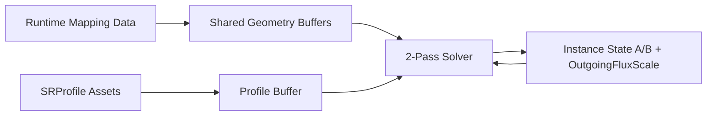
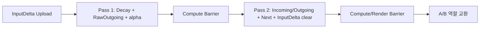

# Surface State GPU Resource

> **한 줄 요약:** 이 문서는 CPU의 Surface State 설계를 Vulkan GPU resource로 배치하고 2-Pass Solver가 읽고 쓰는 방법을 정의한다.

상태: **4주차 Vulkan 구현 기본안 / 실제 성능과 동적 형상 배치 검증 필요** · 관련 문서: [[05_ADR/0005-Per-Texel-GPU-Data-Layout|Per-Texel GPU Data Layout ADR]], [[04_Architecture/0002_Surface-State|표면 상태]], [[04_Architecture/0006_Surface-State-Update|Propagation Solver]], [[Next-State-Calculation|Next State 계산]], [[Surface-Simulation-Mapping|Surface Simulation Mapping]]

이 문서는 CPU의 Surface State 설계를 Vulkan GPU resource로 배치하고 2-Pass Solver가 읽고 쓰는 방법을 정의한다. 상태 갱신 수식의 기준은 [[04_Architecture/0006_Surface-State-Update|Propagation Solver]]다.

## 면적과 누적 시간 확장 — 2026-09-29

현재 State는 texel 총량이다. Profile Capacity에 `AreaScale=WorldArea/(1/256²)`를 곱해 런타임 포화 기준량을 구한다. 입력·Decay에도 같은 환산을 적용하며 포화도는 상한 없이 Geometry mobility에 재사용한다. SaturationDrive OFF에서도 mobility는 유지한다.

GPU에 instance별 scalar `float32 WorldTexelAreas[N]`를 binding 20으로 추가했다. stride 4 B, payload 4N B, 전체 storage descriptor binding 수는 21이다. CPU shared `AreaVector`는 float32×3이며 `.Surface` format 4의 140-byte 레코드 끝에 직렬화한다. 과거 0 B 추가 기록은 Capacity 초과 clamp 제거만의 비용이다.

frame에 여러 step을 기록할 때 매번 barrier와 A/B 교환을 수행하고 InputDelta를 한 번만 소비한다. timestamp pool은 frame당 최대 8회×instance 수의 Pass 1·2 구간을 수용하고 실제 기록한 구간만 읽는다. 전체 시간은 모든 반복 합이다. [[../../05_ADR/0030-Texel-Area-and-State-Amounts|ADR 0030]], [[../../05_ADR/0031-Geometry-Transport-Mobility|ADR 0031]], [[../../05_ADR/0032-Accumulated-Simulation-Timestep|ADR 0032]]

## 핵심 결정

| 항목 | 결정 |
|---|---|
| 기본 resource | seam 때문에 불규칙한 index 접근이 필요하므로 Storage Buffer를 사용한다. |
| State 형식 | `.SRProfile` Registry의 `ChannelCount`에 따라 동적으로 저장한다. ADR 0010의 texel-major AoS와 packed `float32` 배열을 구현한다. |
| ping-pong | instance마다 State A/B를 만들고 solver step마다 Current/Next 역할을 교환한다. |
| OutgoingFluxScale | Pass 1에서 각 texel의 Registry channel별 `alpha`를 저장한다. State와 같은 channel count 기반 packed layout을 쓰며 영구 State가 아니다. |
| Input | discrete event를 `InputDelta`에 모아 Pass 2에서 한 번 반영한다. `DeltaTime`을 곱하지 않는다. |
| Profile 연결 | 공유 Geometry에 texel당 `uint32 ProfileIndex`를 저장한다. 같은 Profile을 쓰는 texel도 인덱스를 각각 보유한다. |
| 인덱스 | Neighbor는 공유 Geometry 내부 local texel index를 저장한다. instance State 접근은 `ChannelIndex`를 포함한 layout helper로 계산한다. |

Storage Image는 규칙적인 2D 접근에는 유리하지만 seam neighbor를 처리하려면 별도 index가 필요하다. 4주차에는 SSBO를 기준 데이터로 두고, 렌더링에 필터링 가능한 texture가 필요하면 파생 resource를 만든다.

## Branch 4 구현 및 검증 상태

현재 MVP는 host-visible/coherent storage buffer를 사용한다. Geometry는 Runtime Surface Data 조합별로 upload하고, Profile 파라미터와 지원 여부는 Scene 전체의 고유 Profile 테이블로 한 번 upload한다. CPU Geometry의 Runtime-local Profile index는 GPU 업로드 시 Scene 테이블 index로 변환한다. Instance별 State A/B, OutgoingFluxScale, InputDelta, RawOutgoing은 생성 시 0으로 초기화하며 TransferWeights는 Geometry와 instance 선형 transform으로 생성한다. Instance마다 descriptor와 State/cache buffer를 따로 소유한다. 같은 Runtime handle의 Geometry와 Scene 전체의 Profile buffer를 각각 공유한다. 세부 binding은 아래 표를 따른다.

GPU resource CTest는 두 instance용 자원을 만들고, 공유 Geometry binding, 분리된 State handle, AB/BA Current/Next, 생성 초기값과 Geometry/Profile packed 값을 Vulkan buffer readback으로 검사한다. Renderer를 5 frame 실행한 Vulkan validation smoke run에서는 GPU resource 생성과 정상 종료·파괴가 완료됐고 validation error는 없었다.

Validation best-practices는 각 buffer에 별도 `VkDeviceMemory`를 할당하는 현재 `TGPUBuffer` 방식과 기존 depth attachment에 작은 allocation 경고를 남긴다. 이는 API/synchronization 오류가 아니라 suballocation 및 transient attachment 권고이며, allocation 최적화는 후속 작업이다. InputDelta의 solver 소비 후 clear와 CPU/GPU 동기화도 solver/input 구현에서 연결한다.

## 데이터 소유권



| 데이터 | 공유 단위 | 갱신 |
|---|---|---|
| mapping, base geometry, neighbor | `.Scene`이 선택한 같은 Mesh/Profile Distribution 조합의 Runtime 결과 | Runtime Asset 변경 시 재생성 |
| Profile parameter·지원 여부 | Scene GPU resource manager의 고유 `.SRProfile` 테이블 하나 | Scene 교체 시 재생성, Runtime Profile Tuning 시 해당 record 갱신 |
| Texel→Profile index map | 같은 Geometry/Profile Distribution 조합의 Runtime Geometry | 전처리 입력 변경 시 재생성 |
| State A/B, OutgoingFluxScale, InputDelta, RawOutgoing | instance | solver step마다 |
| TransferWeights | instance | 생성 및 transform/geometry cache invalidation |

## 인덱스 구조

공유 Geometry의 texel index는 `0 .. geometryTexelCount-1` local 범위다. 이웃도 이 local index를 저장하므로 같은 Geometry를 여러 instance가 공유할 수 있다.

```cpp
struct TSurfaceRangeGPU {
    uint firstLocalTexel;
    uint texelCount;
    uint width;
    uint height;
};

struct TSurfaceInstanceGPU {
    uint geometryIndex;
    uint stateBaseIndex;
    uint flags;
};
```

State 접근은 다음과 같다.

```text
stateIndex = getStateIndex(instance, localTexelIndex, channelIndex)
profileIndex = TexelProfileIndex[localTexelIndex]
```

`getStateIndex`는 ADR 0010의 `texelIndex * channelCount + channelIndex` 산식을 사용하며, 이웃 texel에서도 같은 helper를 사용한다.

`TexelSurfaceIndex`는 Runtime mapping의 local Surface ID이며 invalid texel 판정에 사용한다. GPU `TexelProfileIndex`는 각 texel이 사용하는 Scene 공유 Profile 테이블의 index를 저장한다. CPU Geometry와 `.Surface`는 로컬 테이블 index를 유지하고 업로드 단계에서 변환한다. 같은 Profile을 쓰는 인접 texel도 index를 따로 보유한다. Dense lookup은 [[05_ADR/0009-Texel-Profile-Index-Map|ADR 0009]], Scene별 공유·전환 수명은 [[05_ADR/0027-Scene-State-Registry-and-Shared-Profile-Table|ADR 0027]]을 따른다.

Scene 전환은 현재 Scene의 Runtime Profile 테이블만으로 Registry를 구성하고 GPU 자원을 재생성한다. 성공 시 Inject/Heatmap 선택과 이전 State ID 기반 튜닝 값을 초기화하며, 준비 실패 시 기존 Registry/GPU 자원을 유지한다. Profile 자산 캐시의 추가 로드는 활성 Registry를 변경하지 않는다. 동일 Scene의 해상도 변경은 현재 튜닝 값을 유지한다. `MDSS_SceneResources` CTest가 서로 다른 Mesh와 로컬 Profile 순서, 미지원 State 입력, 해상도 전환 및 GPU 생성 실패 복원을 검사한다.

## Shared Surface Geometry Buffer

자료 성격별 SoA buffer를 사용한다.

| Buffer | texel당 형식 | 용도 |
|---|---|---|
| `TexelSurfaceIndexBuffer` | `uint` | local Surface ID 및 invalid texel 판정. invalid texel은 `InvalidSurfaceID = 0xFFFFFFFF` |
| `TexelProfileIndexBuffer` | `uint` | texel별 Profile 테이블 조회. dense 1:1 texel map |
| `SurfacePositionBuffer` | `vec4` | `xyz`: Mesh local position |
| `SurfaceNormalBuffer` | `vec4` | `xyz`: Mesh local normal |
| `GeometryScalarBuffer` | texel당 `{ MesoVirtualHeight, ConcavityWeight, MesoMeanCurvature, MesoGaussianCurvature }` float 4개 | 높이, Solver 파생값과 형상 분석 곡률 |
| `MesoNormalBuffer` | texel당 `vec4` | 높이 미분에서 재구성한 mesh-local 유효 normal |
| `NeighborIndexBuffer` | `uvec4[2]` | 최대 8개 local neighbor index |

invalid 여부는 `TexelSurfaceIndexBuffer[index] == InvalidSurfaceID`로 판정한다. 실제 Surface ID는 이 예약값을 사용할 수 없다. 거리와 방향은 `SurfacePosition[j] - SurfacePosition[i]`에서 계산하므로 별도 NeighborDistance buffer는 두지 않는다. Geometry scalar는 네 float(16 B)이며 CPU와 GLSL의 stride를 맞춘다. Position/Normal/MesoNormal에는 `vec4`를 사용하고 CPU 업로드 구조체에는 크기와 필드 offset에 대한 `static_assert`를 둔다.

`TriangleID`와 `Barycentric`은 Solver 필수 입력이 아니므로 CPU Runtime mapping data에 두고 Geometry 생성 후 필요하지 않으면 해제한다. GPU 디버그 시각화가 필요할 때만 별도 read-only buffer로 올린다.

Accumulation으로 변하는 instance별 Position/Normal/Curvature는 base geometry와 분리된 dynamic geometry resource가 필요하다. 이웃 거리도 갱신된 Position 차이에서 계산한다. 4주차 첫 구현은 정적 base geometry를 사용하고, 동적 overlay의 정확한 배치는 후속 단계에서 확정한다.

### 저장 항목 검증

- Solver 입력에 Raw Curvature가 필요한지, `ConcavityWeight` 등 파생값만 저장하면 되는지 확인한다.
- Dynamic Geometry overlay에 Position / Normal / Curvature 중 어떤 값을 포함할지와 Instance별 저장 구조를 정한다.

현재 4주차 기본안은 정적 Shared Geometry를 사용한다. 동적 적층 형상을 후속 Simulation에 반영하는 구체적인 저장 구조는 요구사항과 메모리·성능 측정을 바탕으로 확정한다.

## Surface Instance State Buffer

```glsl
layout(std430) buffer StateBuffer      { float state[];      };
layout(std430) buffer OutgoingFluxScaleBuffer { float outgoingFluxScale[]; };
layout(std430) buffer InputDeltaBuffer { float inputDelta[]; };
```

위 선언은 Registry 기반 scalar channel을 표현하는 논리 예시다. State 계열 buffer는 ADR 0010의 texel-major AoS 규칙을 따른다. `ChannelIndex`는 Registry에서 얻고, State와 Profile parameter lookup에 동일하게 적용한다.

`Wetness`, `Heat`, `Burn`, `Mud`는 기본 demo Profile에 선언될 수 있는 State 이름이다. Solver, Buffer와 Profile layout은 이 이름들을 하드코딩하지 않는다.

`SurfaceWater`는 Wetness의 별칭이 아니다. 별도 State로 Registry에 선언할 수 있으며, 별도 물리 layer가 필요한지는 그 동작을 구현할 때 결정한다.

### State A/B ping-pong

```text
Step N:     A = Current, B = Next
Step N + 1: B = Current, A = Next
```

- Current는 step 동안 read-only다.
- 각 invocation은 자기 `NextState[i]`만 쓴다.
- Barrier가 끝나기 전에 역할을 바꾸지 않는다.
- `A→B`, `B→A` descriptor set을 미리 만들어 교대로 사용한다.

### OutgoingFluxScale

`OutgoingFluxScaleBuffer`는 각 texel/channel의 outgoing flux 제한 비율을 저장한다.

```text
OutgoingFluxScale[i].channel = alpha[i].channel
```

Pass 1은 raw outgoing 합으로 `OutgoingFluxScale`을 계산해 저장한다. Pass 2는 이웃의 `OutgoingFluxScale`과 `RawFluxBuffer`의 `j → i` 방향 슬롯을 읽는다. 자신의 outgoing 합계는 `RawOutgoingBuffer`에서 재사용한다. [[05_ADR/0021-Directional-RawFlux-Cache|ADR 0021]]에서 방향·채널별 raw flux 저장을 추가했다.

### TransferWeights

`TransferWeightsBuffer`는 `texel × 8 + neighborSlot` 순서의 float 배열이다. CPU cache builder는 `Position + Normal × MesoVirtualHeight`와 instance transform으로 유효 world position, inverse-transpose normal을 만들고 MeanNeighborDistance를 텍셀별 한 번 계산한다. 그 뒤 DistanceWeight × NormalWeight × 선택적 CurvatureWeight(기본 1.0; [[05_ADR/0019-Optional-Curvature-Transfer-Weight|ADR 0019]]) × ProfileBoundaryWeight를 각 슬롯에 기록한다. Profile이 같으면 `ProfileBoundaryWeight`는 1.0, 다르면 0.5다.

초기 cache는 instance GPU resource 생성 시 준비한다. 현재 `TSurfaceStateSystem::RecordStep`은 scale 또는 TransferWeight 설정 변경 시 Graphics queue 완료를 기다린 뒤 정적 cache를 다시 계산·업로드한다. 순수 translation과 회전은 현재 거리·normal 내적의 값에 영향을 주지 않는다. Geometry feedback OFF에서는 이 정적 cache를 재사용한다.

Geometry feedback ON에서는 매 Solver step의 높이를 마지막 형상 build에 사용한 높이와 비교해 instance별 `HeightDirty`를 기록한다. 바뀐 텍셀과 `NeighborIndex`로 연결된 1-hop 이웃만 Position·Normal·MeanNeighborDistance를 다시 만들고 `GeometryDirty`로 표시한다. TransferWeight는 GeometryDirty 텍셀과 그 1-hop 이웃에서만 다시 계산해 2-hop 영향 범위까지 포함한다. 나머지 슬롯은 이전 값을 유지한다. MeanNeighborDistance는 동적 Position 레코드의 `w`에 텍셀당 한 번 저장하며, 마지막 build 높이는 동적 Normal 레코드의 `w`에 보관한다. `HeightDirty`와 `GeometryDirty`는 기존 instance별 `AccumulationHeights` SSBO에서 높이 평면 뒤에 각각 texel당 `float32` 1개씩 두 평면으로 저장한다. 높이 pass는 `GeometryDirty`를 먼저 0으로 지워, 형상 pass가 생략된 step에도 지난 표시가 남지 않게 한다. 추가 크기는 8 bytes/texel이며 allocator overhead는 제외한다. 같은 buffer에 64개 선형 텍셀 작업그룹마다 `float32` 변경 요약과 12-byte indirect dispatch 명령을 더 둔다. 요약 전체가 0이면 형상·가중치 workgroup 수를 0으로 설정해 두 pass를 건너뛴다. 변경이 하나라도 있으면 현재는 두 pass 모두 전체 텍셀 범위를 dispatch하고, 각 invocation이 이웃 변경 여부를 확인해 필요한 결과만 갱신한다. 따라서 이 단계는 변경이 전혀 없는 step의 broad phase이며 희소 타일 압축은 아직 아니다. 기존 descriptor binding을 공유해 overlay와 렌더 파이프라인의 기기별 storage-buffer 한도를 지킨다. scale·가중치 설정·feedback 토글 후에는 전체 형상/가중치를 한 번 다시 만든다. 이 dirty 판정은 렌더링의 16/32 활성 타일과 별개다. 현재 Geometry scalar/topology를 runtime에서 수정하는 경로는 없으며, 추후 추가할 때 resource manager의 `InvalidateTransferWeightCache`를 호출해야 한다. 실제 GPU 시간 이득은 장면별 변경 텍셀 비율과 함께 측정한다.

동일한 edge의 양 방향 슬롯은 현재 대칭 가중치 식에서 같은 값을 갖지만 각 방향 슬롯을 별도로 저장한다. 무방향 edge 저장으로 압축하는 방식은 후속 최적화 후보로만 남아 있다.

### RawOutgoing

`RawOutgoingBuffer`는 `texel × channelCount + channel` 위치에 Pass 1의 유출 합계를 저장한다. 모든 지원되지 않는 texel/channel에는 0을 기록한다. 매 실행 step에 Pass 1이 전체 유효 범위를 덮어쓰므로 초기 clear는 필요 없고, Pass 2는 자신의 outgoing 합계를 다시 계산하지 않는다. 초기 합계 저장은 rawFlux 평가 상한을 텍셀·채널당 24→16회로 줄였다. 현재는 방향별 RawFlux도 저장해 Pass 2 재계산을 제거하므로 상한은 8회다.

### RawFlux와 역방향 슬롯

`RawFluxBuffer`는 instance별 float32 scratch이며 `slot × texelCount × channelCount + texel × channelCount + channel`로 조회한다. Pass 1이 모든 슬롯을 매 step 덮어쓰므로 생성·reset 시 clear하지 않는다. invalid 이웃·지원되지 않는 채널·invalid texel은 0을 기록한다. Pass 2는 공유 uint32 `ReverseNeighborSlots`에서 이웃 source의 역방향 슬롯을 읽어 flux에 source alpha를 곱한다. 8개 슬롯 번호는 4 bit씩 packed하며 0xf가 invalid다. UV seam도 실제 이웃 배열에서 역방향을 찾아 CPU pack 단계에 준비한다. Pass 1 write→Pass 2 read와 Pass 2 read→다음 Pass 1 write의 barrier에 RawFlux를 포함한다. 6×512×512·1채널·8슬롯·scalar padding 없음에서 RawFlux 인스턴스당 48 MiB, 역방향 슬롯 공유 Geometry당 6 MiB가 추가되며 allocator overhead는 제외한다.

### InputDelta

접촉은 discrete event(발생 시점에 한 번 기록되는 접촉 사건) 입력으로 취급한다. CPU는 같은 frame에 발생한 이벤트 양을 texel별 dense `InputDelta`로 합산해 upload한다. 이벤트 뒤 처음 실행되는 solver update에서 한 번 반영하고, 그 update 뒤 clear한다. Buffer는 instance resource 생성 시 할당해 재사용하며, 매 frame 새로 할당하지 않는다. 지속 시간 동안 계속 작용하는 입력은 `InputDelta`와 구분되는 별도 rate 입력으로 정의한다.

- Input은 event 양이므로 `DeltaTime`을 곱하지 않는다.
- Pass 1의 Transport와 Decay는 Current State를 기준으로 계산한다.
- Pass 2에서 `Current + InputDelta + Incoming - Outgoing - Decay`를 Next에 기록한다.
- 소비한 `InputDelta`는 Pass 2 이후 0으로 clear한다.

InputDelta는 discrete event(발생 시점에 한 번 기록되는 접촉 사건) 입력 뒤 처음 실행되는 solver update의 Pass 2에서 Next State에 한 번 더하고, 그 update 뒤 0으로 clear한다. 따라서 접촉 입력은 해당 update 결과에 바로 반영된다. 다만 Pass 1의 outgoing 계산은 InputDelta를 더하기 전 Current State를 기준으로 하므로, 접촉으로 추가된 양의 neighbor transport는 다음 solver update부터 시작한다. 이는 discrete event를 한 번 반영하는 현재 계획의 정책이며, GPU가 강제하는 제약은 아니다.

## SRProfile GPU Representation

Profile 레코드의 전달 필드는 실제 Rate 대신 `[0,1]`의 `SaturationTransferFactor`, `GeometryTransferFactor`를 저장한다. 최초 upload와 Runtime override 모두 Factor를 그대로 pack하며 Solver에서 기준 속도 `1.0`, `100.0`을 적용한다 ([[05_ADR/0029-Normalized-Transport-Factors|ADR 0029]]).

Profile parameter는 `(ProfileIndex, ChannelIndex)` 조합을 사용하며, ADR 0010의 Profile-major record 배치와 index 산식을 따른다.

- `Saturation`은 저장하지 않고 `State / stateCapacity`로 계산한다. [[05_ADR/0020-State-Overcapacity-Transport|ADR 0020]]에서 전달용 비율은 상한 clamp하지 않으며 State A/B에 전체 초과량을 보존한다. 기존 float32 AoS·채널 수·padding 없음의 ABI를 유지해 추가 GPU payload는 0 B다. Shader의 상한 clamp 제거는 구현했고 빌드는 통과했다. GPU 회귀에서 source 유출 제한·여러 이웃의 초과 유입 보존·서로 다른 Capacity와 입력 소비를 확인했다.
- CPU Asset loader가 모든 `stateCapacity > 0`을 검증한 뒤 upload한다.
- JSON을 GPU 구조체 메모리에 직접 역직렬화하지 않고 명시적으로 변환한다.
- 동일 Profile 사이의 `ProfileBoundaryWeight`는 `1.0`, 서로 다른 Profile 사이에서는 고정 `0.5`다. 이 값은 Solver 공통 규칙이며 Profile parameter나 추가 GPU ABI 필드는 필요하지 않다. 세부 weight 계약은 [[05_ADR/0016-Transport-Transfer-Weights|ADR 0016]]을 따른다.

## Descriptor binding

Descriptor layout은 아래 binding을 각각 별도의 storage buffer로 연결한다. Geometry와 Profile 자료는 CPU/GPU ABI 문서대로 SoA buffer로 분리한다. 지원 여부 배열도 parameter 배열과 별도 buffer다. Binding 12·13과 16·17은 Surface debug view 및 cache 진단에 사용한다.

| Binding | Buffer | Shader 원소 형식 | 접근 |
|---:|---|---|---|
| 0 | `TexelSurfaceIndexBuffer` | `uint[]` | read-only |
| 1 | `TexelProfileIndexBuffer` | `uint[]` | read-only |
| 2 | `SurfacePositionBuffer` | `vec4[]` | read-only |
| 3 | `SurfaceNormalBuffer` | `vec4[]` | read-only |
| 4 | `GeometryScalarBuffer` | texel당 네 `float` | vertex / fragment / compute read-only |
| 5 | `NeighborIndexBuffer` | texel당 `uvec4[2]` | read-only |
| 6 | `ProfileParametersBuffer` | `(ProfileIndex, ChannelIndex)`당 세 `vec4` (48 B, 세 번째의 `x`가 `ThicknessPerAmount`, `y`가 `CavityTransportRetentionFactor`) | read-only |
| 7 | `ProfileSupportedBuffer` | `uint[]` | read-only |
| 8 | Current State | packed `float[]` | read-only |
| 9 | Next State | packed `float[]` | write-only |
| 10 | `OutgoingFluxScaleBuffer` | packed `float[]` | Pass 1 write / Pass 2 read |
| 11 | `InputDeltaBuffer` | packed `float[]` | Pass 2 read/write; consume then clear |
| 12 | `SurfaceRangesBuffer` | packed `uvec4[]` | debug fragment Surface grid lookup |
| 13 | `TexelChartIndicesBuffer` | packed `uint[]` | debug fragment UV chart lookup |
| 14 | `TransferWeightsBuffer` | packed `float[]`, `texel × 8 + neighborSlot` | cache preparation / Pass 1 read |
| 15 | `RawOutgoingBuffer` | packed `float[]`, `texel × channelCount + channel` | Pass 1 write / Pass 2 read |
| 16 | `TransferWeightDebugAverageBuffer` | texel당 `vec4` | fragment read-only |
| 17 | `MesoNormalBuffer` | texel당 `vec4[]` | vertex / fragment / compute read-only |
| 18 | `ReverseNeighborSlotBuffer` | texel당 `uint32`, 8 × 4 bit packed | Shared Geometry / Pass 2 read |
| 19 | `RawFluxBuffer` | packed `float[]`, slot-major·texel/channel 순서 | instance / Pass 1 write / Pass 2 read |

각 binding의 descriptor type은 `VK_DESCRIPTOR_TYPE_STORAGE_BUFFER`, descriptor count는 1이다. AB와 BA descriptor set을 함께 생성해 Current/Next State의 반대 방향 연결을 제공한다. set은 해당 instance의 State/cache buffers와 Mesh의 공유 Geometry/Profile buffers를 참조한다.

Push constant에는 자주 변하는 작은 값만 둔다. CPU 구조체는 GPU upload 구조와 마찬가지로 크기와 offset을 compile-time 검증한다.

```cpp
struct TSolverPushConstants {
    float deltaTime;
    uint stateChannelCount;
    uint localTexelCount;
    uint flags;
    vec4 gravityWorld;
    vec4 modelLinearColumns[3];
    vec4 normalMatrixAndUpColumns[3];
};
```

현재 Solver push constant는 128 byte이며, CPU가 instance의 inverse-transpose와 world gravity의 up 축을 dispatch당 한 번 준비한다. 마지막 세 column의 xyz는 normal matrix이고 w는 up의 x/y/z다. Shader는 source 법선을 world로 변환하고 local endpoint 차이에 instance 선형 변환을 적용하여 world gravity와 함께 DirectionDrive를 계산한다. source 공통 형상은 invocation당 재사용하며 [[05_ADR/0022-Pass1-Source-Reuse|ADR 0022]]를 따른다.

## Solver 실행과 동기화



### Pass 1 → Pass 2

`OutgoingFluxScaleBuffer`와 `RawOutgoingBuffer`에 Pass 1 write→Pass 2 read dependency를 둔다.

```text
srcStage  = COMPUTE_SHADER
srcAccess = SHADER_STORAGE_WRITE
dstStage  = COMPUTE_SHADER
dstAccess = SHADER_STORAGE_READ
```

### Pass 2 → 다음 사용

- 다음 solver step: `COMPUTE_SHADER / SHADER_STORAGE_WRITE → COMPUTE_SHADER / SHADER_STORAGE_READ`
- 렌더링이 읽는 경우: 목적 Shader stage와 `SHADER_STORAGE_READ`를 포함한다.
- SSBO 기준안에는 image layout transition이 없다.

현재 MVP Solver는 Pass 2에서 InputDelta를 직접 clear하므로 다음 step에서 재사용하기 전 compute shader write→read/write buffer dependency를 둔다. 실제 CPU event upload와 frame-in-flight 동기화는 Branch 6 입력 연결에서 처리한다.

## 메모리 기준

Registry State channel 수를 `C`라 할 때, padding이 없는 32-bit scalar layout의 State A/B, OutgoingFluxScale, InputDelta, RawOutgoing은 각각 texel당 `4C` bytes다. TransferWeights는 채널과 무관하게 texel당 `8 × 4 = 32` bytes다. 다섯 State/임시 scalar buffer 합계는 texel당 `20C` bytes이고, TransferWeights 32 bytes/texel을 더한다. 실제 allocation은 선택한 GPU layout과 alignment에 따라 달라질 수 있다.

```text
State A            4C B
State B            4C B
OutgoingFluxScale  4C B
InputDelta         4C B
RawOutgoing        4C B
TransferWeights    32 B
합계               20C + 32 B/texel
```

공유 Geometry, allocator 정렬, frame-in-flight 복제는 별도다. 해상도와 instance 수를 정할 때 함께 측정한다.

## 검증 항목

- A/B 역할을 교환해도 같은 초기조건에서 결과가 반복된다.
- instance별 State와 공유 Geometry의 texel Profile map이 분리된다.
- invalid texel은 항상 0이고 dispatch에서 계산을 건너뛴다.
- seam 이웃은 일반 이웃과 같은 Shader 경로를 사용한다.
- finite·양수 Capacity를 검증해 0 나눗셈을 막는다. 큰 State/작은 Capacity, float32 연산 overflow 및 NaN/Inf는 별도로 검사한다.
- 실제 outgoing 합이 Decay 이후 가용 State를 넘지 않는다.
- Pass 사이 synchronization과 resource 사용에 Vulkan validation 오류가 없다. 현재 smoke run에서는 오류가 없었고, best-practices 최적화 권고는 아래에 별도로 기록했다.
- 렌더링이 최신 ping-pong buffer를 읽는다.

## 미결 사항

- 동적 Accumulation geometry의 instance overlay 배치
- GPU에서 contact event가 겹칠 때의 reduce/atomic 방식
- Registry channel 수에 맞는 AoS 인덱싱, alignment 및 성능 검증
- 방향별 RawFlux cache의 실제 Scene GPU 시간·대역폭 검증 (구현은 ADR 0021 완료)
- 최종 descriptor set 번호와 frame-in-flight별 resource 수
