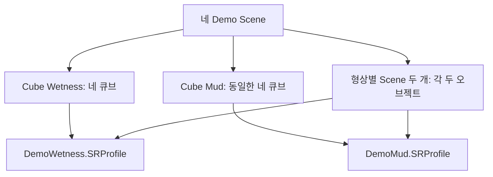

# Dev Demo — 개발 검증용 Scene 구성

> **한 줄 요약:** 개발 검증용 Cube Scene 두 개와 형상별 Scene 두 개로 Wetness·Mud 상태 전달을 비교한다.

상태: **Cube Scene 두 개·형상별 Scene 두 개·Profile·Map·대리석 자산 생성 완료** / Mud 동적 적층은 미구현 · 2026-09-28

## 목적과 공통 규칙

Cube 데모 두 개는 동일한 형상·머티리얼·Transform·Simulation UV·해상도를 사용하고 Profile 연결만 달리한다. 각 Cube Scene은 오브젝트 네 개를 포함한다. Geometry 비교는 Bunny와 Mountain별 Scene 하나에 같은 형상의 오브젝트 두 개를 두고, 각각 Wetness와 Mud Profile을 연결한다. 비교 시 입력 위치, 반경, 세기와 시간 간격도 동일하게 유지한다.

| Scene 파일명 | 목적 | Profile 구성 |
|---|---|---|
| `Demo_Cubes_Wetness.Scene` | 브릭의 Virtual Meso Geometry 유무와 회전에 따른 중력 투영·물 상태 전파 비교 | `DemoWetness.SRProfile` |
| `Demo_Cubes_Mud.Scene` | 같은 큐브에서 Mud의 전달·잔류·실제 적층을 비교 | `DemoMud.SRProfile` |
| `Bunny.Scene` | Bunny의 Macro 형상에서 Wetness와 Mud 전달 비교 | Wetness·Mud 각 1개 오브젝트 |
| `Mountain.Scene` | Mountain의 Macro 형상에서 Wetness와 Mud 전달 비교 | Wetness·Mud 각 1개 오브젝트 |

물 데모는 현재 Surface State 기반 Wetness 예시다. 체적 물·자유 표면 유체 시뮬레이션을 의미하지 않는다. Mud 데모의 완료 조건은 Heatmap 변화뿐 아니라 **Accumulation Height와 렌더 형상의 변화**다. 정적인 Virtual Height Displacement는 Mud 적층의 대체물이 아니다.



## 1. Cube Wetness

| 오브젝트 구분 | 쌍 | 회전 | 머티리얼 | Normal Map | Profile / State |
|---|---|---|---|---|---|
| Brick Upright | A | 없음 | 기존 BrickCube | 기존 BrickCubeNormal | DemoWetness / `wetness` |
| Marble Upright | A | 없음 | 흰 대리석 | 없음 | DemoWetness / `wetness` |
| Brick Rotated | B | 있음 | 기존 BrickCube | 기존 BrickCubeNormal | DemoWetness / `wetness` |
| Marble Rotated | B | 있음 | 흰 대리석 | 없음 | DemoWetness / `wetness` |

두 쌍을 나란히 배치하고 각 쌍 안에서도 큐브가 겹치지 않도록 한다. 네 큐브의 크기는 같다. 회전 쌍의 두 큐브에는 같은 회전값을 사용한다. 회전값은 `[20, 35, 0]` degrees다. 브릭은 X=-1.15, 대리석은 X=1.15이며 무회전 쌍은 Y=-1.1, 회전 쌍은 Y=1.1이다. 회전 후 bounding box의 바닥을 Z=0에 맞춘다. 월드는 Z-up이며 중력은 `(0, 0, -1)`이다.

대리석 재질은 [ambientCG Marble001](https://ambientcg.com/view?id=Marble001)이다. 흰색·Clean 재질이며 1K PNG를 사용할 수 있다. Base Color만 연결하고 Normal/Displacement Map을 연결하지 않아 매끈한 비교군으로 둔다. [CC0 라이선스](https://docs.ambientcg.com/license/)는 원본 자산을 프로젝트에 포함하는 것을 허용한다. 현재 렌더러에서 광택까지 재현된다는 뜻은 아니다.

MarbleCube는 BrickCube와 같은 형상·UV·Surface 분할을 사용하고 MTL만 분리한다. 현재 큐브의 여섯 Surface 구조를 유지해 재질 변경과 Surface topology 변경의 효과가 섞이지 않게 한다.

## 2. Cube Mud

| 오브젝트 구분 | 쌍 | 회전 | 머티리얼 | Normal Map | Profile / State |
|---|---|---|---|---|---|
| Brick Upright | A | 없음 | 기존 BrickCube | 기존 BrickCubeNormal | DemoMud / `mud` |
| Marble Upright | A | 없음 | 흰 대리석 | 없음 | DemoMud / `mud` |
| Brick Rotated | B | Wetness 씬과 동일 | 기존 BrickCube | 기존 BrickCubeNormal | DemoMud / `mud` |
| Marble Rotated | B | Wetness 씬과 동일 | 흰 대리석 | 없음 | DemoMud / `mud` |

Wetness 씬과 Mesh·머티리얼·위치·회전·크기를 그대로 공유한다. Scene 형식에서는 `.SurfaceProfileMap`을 명시하므로 씬의 Map 경로도 Wetness용에서 Mud용으로 바뀐다. Map의 Surface ID와 분할은 같고 연결되는 Profile만 다르다.

## 3. 형상별 Wetness / Mud Scene

통합 `Demo_Geometry_Wetness_Mud.Scene`은 제거하고 Bunny와 Mountain Scene으로 나눈다. 각 Scene에는 같은 형상의 오브젝트 두 개를 두고 Wetness와 Mud `.SurfaceProfileMap`을 각각 연결한다. 파일은 `Assets/Scenes/`에 저장한다.

| Scene 내 오브젝트 | 형상 | 머티리얼 | Normal Map | Profile / State |
|---|---|---|---|---|
| Bunny Wetness | StanfordBunny | 동일한 기본 재질 | 없음 | DemoWetness / `wetness` |
| Bunny Mud | StanfordBunny | Bunny Wetness와 동일 | 없음 | DemoMud / `mud` |
| Mountain Wetness | Mountain | 동일한 Base Color 재질 | 없음 | DemoWetness / `wetness` |
| Mountain Mud | Mountain | Mountain Wetness와 동일 | 없음 | DemoMud / `mud` |

같은 형상의 Wetness/Mud 오브젝트는 Mesh·머티리얼·회전·크기를 공유하고 X축으로 나란히 배치한다(X=-1.25, +1.25). 산은 최대 폭 1.8, 토끼는 최대 폭 1.0으로 균일 scale을 적용한다. 형상 쌍의 중심을 원점에 맞추고 바닥은 Z=0에 둔다. 두 Mesh의 Y-up 원본 축 보정을 위해 X축 90도 회전만 적용한다. 각 Mesh의 UV와 Simulation UV는 유지한다. Normal Map이 없으므로 Virtual Height는 기본값 0이고 Macro 위치·법선으로 비교한다. 현재 Mountain OBJ의 Plane에는 face가 없으며 Landscape만 Surface 0으로 로드된다. 두 Map 모두 Surface 0에 Profile을 연결한다. 크기 산정에서도 미참조 Plane 꼭짓점은 제외한다.

## Profile 동작과 완료 조건

| Profile | 의도 | 적층 | 검증 |
|---|---|---|---|
| DemoWetness | 물 입력, 경사에 따른 전달, 일정한 감쇠 | `accumulationFactor = 0` | State Heatmap으로 전달·감쇠와 회전 효과 비교 |
| DemoMud | 더 높은 잔류와 낮은 이동성의 Mud 입력 | `accumulationFactor > 0`; `State × accumulationFactor`를 형상에 반영 | 반복 입력으로 높이가 증가하고 Accumulation 표시·Displacement에서 확인 |

아래 수치는 시각 디버깅을 위한 초기값이며 물성 보정값이 아니다. Profile Tuning 또는 파일 수정으로 조정한다.

| Parameter | DemoWetness | DemoMud |
|---|---:|---:|
| `stateCapacity` | 1.0 | 2.0 |
| `inputFactor` | 1.0 | 1.0 |
| `saturationTransferRate` | 0.2 | 0.03 |
| `geometryTransferRate` | 50.0 | 0.5 |
| `decayRate` | 0.03 | 0.005 |
| `cavityRetentionFactor` | 0.5 | 0.9 |
| `accumulationFactor` | 0.0 | 0.15 |
| `cavityFillFactor` | 0.0 | 0.8 |

현재 `AccumulationFactor`는 데이터 계약과 GPU 레코드에는 있지만 동적 적층 계산·렌더 형상 갱신은 연결되지 않았다. Mud를 선언하는 것만으로는 적층이 발생하지 않는다. Week-07의 Accumulation 구현과 검증이 필요하다. Wetness/Mud는 고정 enum이 아니라 각 `.SRProfile`의 `states` key로 선언한다.

## 파일 배치

| 위치 | 파일 |
|---|---|
| `Assets/Scenes/` | `Demo_Cubes_Wetness.Scene`, `Demo_Cubes_Mud.Scene` |
| `Assets/Scenes/` | `Bunny.Scene`, `Mountain.Scene` |
| `Assets/SurfaceProfiles/` | `DemoWetness.SRProfile`, `DemoMud.SRProfile` |
| `Assets/SurfaceProfiles/` | `BrickCube_Wetness.SurfaceProfileMap`, `BrickCube_Mud.SurfaceProfileMap` |
| `Assets/SurfaceProfiles/` | `MarbleCube_Wetness.SurfaceProfileMap`, `MarbleCube_Mud.SurfaceProfileMap` |
| `Assets/SurfaceProfiles/` | `StanfordBunny_Wetness.SurfaceProfileMap`, `StanfordBunny_Mud.SurfaceProfileMap` |
| `Assets/SurfaceProfiles/` | `Mountain_Wetness.SurfaceProfileMap`, `Mountain_Mud.SurfaceProfileMap` |
| `Assets/Meshes/MarbleCube/` | `MarbleCube.obj`, `MarbleCube.mtl`, `MarbleCubeAlbedo.png` |

Wetness/Mud 쌍은 같은 형상 Mesh와 재질을 공유하고 Profile Map과 instance State는 각각 가진다. 기존 `Demo.Scene`과 `DemoStone.SRProfile`은 현재 실행 가능한 데모로 유지한다. 개발용 Cube Scene 두 개와 형상 Scene 두 개, Profile 2개, Map 8개 및 대리석 자산을 사용한다. 토끼·산·브릭 Mesh는 기존 파일을 재사용한다. 대리석 자산 출처는 `Assets/Meshes/MarbleCube/README.md`에 기록했다.

## 시작 Scene과 UI 설정 — 구현됨

`Config/Engine.ini`의 `[Application] StartupScene`을 변경하고 앱을 다시 실행한다. 상대 경로는 실행 위치가 아니라 INI 디렉터리 기준이며 절대 경로도 허용한다.

```ini
[Application]
StartupScene=../Assets/Scenes/Demo_Cubes_Wetness.Scene
```

기본 시작 씬은 Cube Wetness이며 다른 개발 검증 Scene 경로로 바꿀 수 있다. INI가 없으면 기존 Demo.Scene을 사용하고 경고를 남긴다. 값이 없거나 비어 있거나 중복되면 설정 오류를 보고한다. 파일이 존재하지 않으면 Scene loader가 오류를 보고한다. UI의 Load Scene은 현재 실행 중인 Scene만 바꾸고 Engine.ini는 수정하지 않는다.

Scene File 창은 현재 파일명을 항상 표시하며 마우스를 올리면 전체 경로를 보여준다. 성공한 Load/Save 후에도 현재 경로와 일치한다. 도킹 배치 파일은 `Config/EditorLayout.ini`로 변경하고 기존 `MDSS_EditorLayout.ini`의 저장된 배치를 이동했다. 배치 파일은 Git 추적에서 제외한다.

## 관련

- [[../03_Planning/01_Weekly-Overview/Week-07|Week-07 — Mud 및 중간 Demo]]
- [[../04_Architecture/0004_Surface-Geometry|형상 정보와 적층]]
- [[../04_Architecture/0010_UI-Interface|UI Interface]]
- [[../03_Planning/00_Project-Overview/0002_Final_Demo|최종 목표 데모]]
