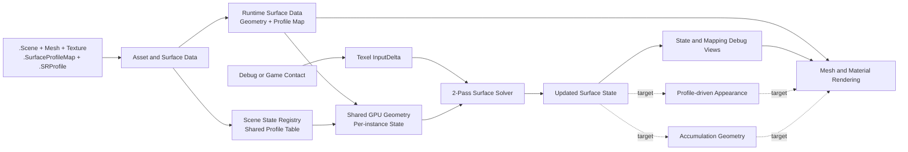

# 시스템 흐름 지도

> **한 줄 요약:** MDSS Engine의 기능이 여러 모듈과 문서를 거쳐 실행되는 과정을 주제별 Flow Map으로 연결한다.

상태: **현재 구현과 확정 설계 기준** · 세부 정의: [[04_Architecture/0000_Overview|Architecture Overview]]

Flow Map은 시스템을 처음부터 끝까지 읽기 위한 진입점이다. 각 문서는 입력이 어디서 생기고, 어떤 데이터로 바뀌며, 누가 저장하고 소비하는지를 하나의 흐름으로 보여준다. 데이터의 정확한 의미와 수식은 Architecture, 결정 근거는 ADR, 임시 구현 검토는 Development Notes를 기준으로 한다.

## 권장 읽기 순서

| 순서 | 문서 | 파악할 내용 |
|---:|---|---|
| 1 | [[0001_Asset-and-Surface-Data-Flow\|Asset과 Surface 데이터 흐름]] | 원본 파일이 Runtime Surface Data와 GPU 자원이 되는 과정 |
| 2 | [[0002_Surface-Simulation-Flow\|Surface Simulation 흐름]] | State가 입력·전달·감쇠를 거쳐 다음 값으로 갱신되는 과정 |
| 3 | [[0003_Contact-Input-Flow\|Contact Input 흐름]] | Debug 또는 게임 접촉이 texel별 `InputDelta`가 되는 과정 |
| 4 | [[0004_Rendering-Flow\|Rendering 흐름]] | Mesh·Material·Surface State가 화면 출력으로 이어지는 과정 |

## 전체 연결

실선은 현재 실행 경로에 연결된 흐름이고, 점선은 설계가 정의됐지만 최종 렌더링 경로에는 아직 연결되지 않은 흐름이다.

## 문서별 경계

| Flow Map | 시작 | 끝 | 다루지 않는 내용 |
|---|---|---|---|
| Asset과 Surface Data | 원본·설정 파일 | Runtime Surface Data, Registry, GPU 자원 연결 | State 수식의 상세 정의 |
| Surface Simulation | 준비된 Geometry·Profile·State와 입력 | 갱신된 Current State | 접촉 대상을 찾는 UI·Physics 과정 |
| Contact Input | Debug ray 또는 게임 collision | Solver가 한 번 소비할 `InputDelta` | Transport·Decay 수식 |
| Rendering | Scene Mesh·Material과 현재 Surface State | 화면의 기본 렌더링·진단 출력 | Solver 내부 계산 |

## 상태 표기

- **현재 연결**: 현재 C++ 실행 경로에서 이어지는 단계.
- **일부 연결**: Debug 경로나 제한된 입력처럼 일부만 구현된 단계.
- **설계 목표**: Architecture에는 정의됐지만 실행 경로에는 아직 연결되지 않은 단계.

Flow Map은 구현 상태를 빠르게 파악하기 위한 요약이다. 충돌이 있으면 Architecture의 데이터 의미, ADR의 결정, 코드에서 확인한 실제 구현 상태를 각각 기준으로 삼는다.
