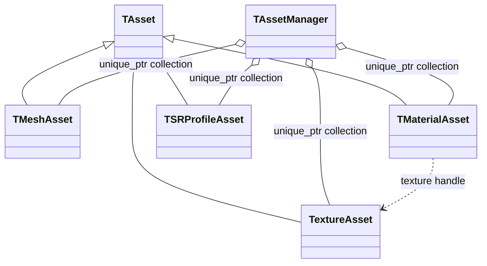
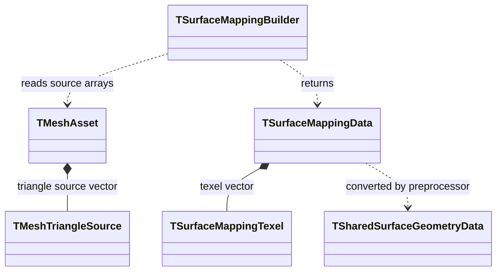
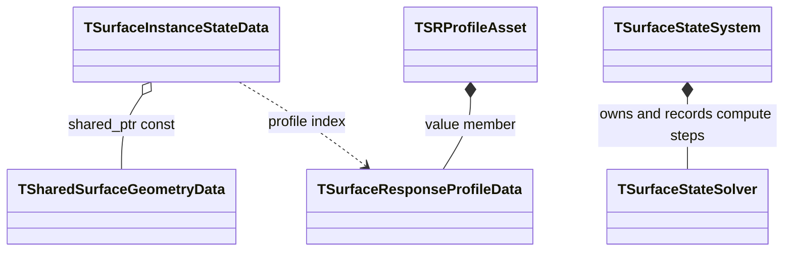

# Asset과 Surface 데이터 흐름

> **한 줄 요약:** OBJ, MTL, Texture와 `.SRProfile` 파일이 파싱된 뒤 Asset으로 등록되고, Mesh 데이터가 Runtime Simulation Mapping과 Surface State 자료형으로 이어지는 과정을 설명한다.

상태: **현재 C++ 코드 기준** · 상위 지도: [[0000_Overview|시스템 흐름 지도]]

OBJ, MTL, Texture와 `.SRProfile` 파일이 파싱된 뒤 Asset으로 등록되고, Mesh 데이터가 Runtime Simulation Mapping과 Surface State 자료형으로 이어지는 과정을 설명한다. Scene load는 해상도별 `.Surface` 캐시를 검증해 읽고, cache miss에는 전처리한 뒤 결과를 저장하며 Runtime 메모리에서도 공유한다. 현재 계약은 [[05_ADR/0026-Resolution-Surface-Cache|ADR 0026]]을 따른다.

관련 설계 문서:

- [[04_Architecture/0003_Assets-and-Profiles|에셋과 프로필]]
- [[05_ADR/0012-Scene-Profile-Distribution-Reference|ADR 0012 — Scene별 Surface Profile Map 참조]]
- [[06_Development/Notes/Surface-Simulation-Mapping|Surface Simulation Mapping]]
- [[04_Architecture/0002_Surface-State|표면 상태와 데이터 구조]]

## 전체 데이터 흐름

```mermaid
flowchart LR
  OBJ[OBJ file] --> TOBJLoader[TOBJLoader / tinyobjloader]
  MTL[Referenced MTL] --> TOBJLoader
  TOBJLoader -->|parsed material_t| TMTLLoader[TMTLLoader Convert]
  TMTLLoader -->|TMaterialSourceData| TOBJLoader
  TOBJLoader -->|TOBJLoadResult| TAssetManager
  TAssetManager -->|texture path| TextureLoader
  TextureLoader -->|TextureData| TAssetManager
  TAssetManager --> TMeshAsset
  TAssetManager --> TMaterialAsset
  TAssetManager --> TextureAsset

  ProfileFile[.SRProfile JSON] --> TSRProfileLoader
  TAssetManager --> TSRProfileLoader
  TSRProfileLoader --> TSRProfileAsset
  TAssetManager --> TSRProfileAsset

  SceneFile[.Scene JSON] --> TSceneLoader
  TAssetManager --> TSceneLoader
  TSceneLoader -->|OBJ path| TAssetManager
  TSceneLoader -->|selected SurfaceProfileMap path| TAssetManager

  TMeshAsset -->|Mesh + selected distribution| Preprocess[TSurfacePreprocessor]
  NormalMap[Normal Map TAsset] -->|CPU sample| Preprocess
  ProfileDistribution[Profile Distribution] -->|parsed input| Preprocess
  Preprocess --> SurfaceData[Runtime static geometry + texel profile map]
  Cache[Resolution-specific .Surface cache] <--> SurfaceData
  TSRProfileAsset --> Registry[TSurfaceStateRegistry]
  SurfaceData -. "ProfileIndex resolution" .-> TSRProfileAsset

  TMeshAsset -->|TVertex / Triangle source| MappingBuilder[TSurfaceMappingBuilder]
  MappingBuilder --> MappingData[TSurfaceMappingData]
  MappingData --> MappingValidation[SurfaceMappingValidation]
  MappingData -. "호출자 직접 연결" .-> Preprocess
  Preprocess -->|Build 결과| SharedGeometry[TSharedSurfaceGeometryData + ProfileMap]
  SharedGeometry -->|shared_ptr const| InstanceState[TSurfaceInstanceStateData]
  Registry -. "channel count 전달: Branch 4; Solver 소비: Branch 5; 입력 해석: Branch 6" .-> InstanceState
  Application[TApplication] -->|owns| StateSystem[TSurfaceStateSystem]
  Renderer[TRenderer] -. "records compute and reads resources" .-> StateSystem
  StateSystem --> GPUResources[TSurfaceGPUResourceManager]
  StateSystem --> Solver[TSurfaceStateSolver: 2-Pass compute]
```



실선은 현재 코드에 존재하는 호출·생성·참조 관계다. 점선은 자료형이나 설계는 있지만 상위 연결 코드가 아직 구현되지 않은 구간이다. `.Scene` object가 `surfaceProfileMap`과 해상도를 지정하면 해당 입력의 `.Surface` 캐시를 읽거나 전처리해 Runtime Surface Data를 만들고, GPU 2-Pass dispatch를 기록한다. 현재 Debug 접촉 입력과 State 진단 뷰가 Solver 경로에 연결되어 있다. State 기반 Material 반응과 동적 Accumulation geometry는 아직 연결되지 않았다.

## 파일 단위 책임과 수명

입력 원본, Runtime에서 생성되는 공유 데이터와 instance별 상태는 서로 다른 책임과 수명을 가진다.

| 파일·데이터 | 역할 | 생성·갱신 | 현재 코드 상태 |
|---|---|---|---|
| `.obj` | Mesh position/normal/UV/face 및 Surface별 Material 할당의 원본 | 외부 제작·편집 도구에서 생성 | `TOBJLoader`로 읽음 |
| `.mtl` | OBJ가 참조하는 Render Material 및 Texture 경로 | 외부 제작·편집 도구에서 생성 | OBJ 파싱 중 `TMTLLoader`가 변환 |
| Texture (`.png`, `.jpg` 등) | Albedo, Normal 등의 이미지 입력 | 외부 제작 도구에서 생성 | `TextureAsset`으로 로드·GPU 업로드 |
| `.SRProfile` | State별 반응 파라미터와 Transition | 사용자가 작성·편집 | JSON Loader는 임의 State 이름을 파싱. AssetManager의 Registry 생성 API 구현됨 |
| Profile Distribution | Surface/Material 할당별 SRProfile 지정 입력 | `.Scene` object가 선택한 `.SurfaceProfileMap`에서 파싱해 각 valid texel의 index로 확장 | `TSceneLoader`가 선택 경로를 `TAssetManager`에 전달. Surface 내부 texel별 Profile authoring은 후속 기능 |
| Runtime Surface Data | 전처리된 정적 Geometry/texel 관계와 `Texel → ProfileIndex` map | 해상도별 캐시 load 또는 cache miss 시 생성·저장 | `TSurfaceRuntimeDataHandle`로 같은 입력 조합의 instance가 공유 |
| `TSurfaceInstanceStateData` | Instance별 CPU State | Runtime에서 초기화·갱신 | State는 finite·비음수 전체 양을 저장하며 `stateCapacity`를 넘을 수 있다. GPU instance buffer는 `TSurfaceGPUResourceManager`가 소유 |

파일 흐름의 목표 형태는 다음과 같다.

```text
.Scene ── selects ──> .obj + .SurfaceProfileMap ─┐
.obj + .mtl + textures ───────────────────────────┼─ Surface Preprocessor ─→ Runtime Surface Data
Normal Map ──────────────────────────────────────┤                           ├─ static geometry / texel relations
.SurfaceProfileMap ── references ──> .SRProfile ─┘                           └─ Texel → ProfileIndex

.SRProfile files ─→ TSRProfileAsset collection ─→ TSurfaceStateRegistry
       │                                              │
       └── Profile response parameters ──────────────┤
                                                      ▼
  Runtime Shared Geometry ──────────────→ TSurfaceInstanceStateData
                                      (Registry-sized dynamic State per instance; Capacity is not a storage limit)
```

현재는 [[05_ADR/0026-Resolution-Surface-Cache|ADR 0026]]에 따라 최종 CPU Geometry와 Profile map을 해상도별 `.Surface` 캐시에 저장한다. Cache hit에서는 유효성을 검증해 Runtime data를 복원하고, missing/stale/corrupt cache는 Runtime 전처리로 대체한다. 같은 Mesh, Profile Distribution, 해상도 조합의 instance는 Runtime 결과를 공유한다. Dynamic State는 공유 Geometry가 아니라 instance별 데이터가 소유하며, `stateCapacity`는 저장 상한이 아니다. Capacity 초과량을 포함한 State A/B에 관한 계약은 [[05_ADR/0020-State-Overcapacity-Transport|ADR 0020]]을 따른다.

## 1. OBJ와 MTL 파싱

`TAssetManager::LoadOBJ`가 `TOBJLoader::Load`를 호출한다. `TOBJLoader`는 tinyobjloader로 OBJ와 참조된 MTL을 함께 읽고, parsed material을 `TMTLLoader::Convert`에 전달한다.

| 입력 | 처리 타입 | 출력 |
|---|---|---|
| OBJ position, normal, UV, face | `TOBJLoader` | `TVertex`, index, `TMeshTriangleSource`, section |
| MTL material | `TMTLLoader` | `TMaterialSourceData` |
| MTL texture 이름 | `TMTLLoader` | OBJ 기준 디렉토리로 해석된 texture 경로 |

최종 `TOBJLoadResult`는 다음 데이터를 값으로 소유한다.

| 필드 | 내용 |
|---|---|
| `Vertices` | 렌더링용으로 조합된 정점 |
| `Indices` | 삼각형 render vertex index |
| `Sections` | index 범위, MTL Material index, Surface ID |
| `Materials` | 변환된 Material 값과 texture 경로 |
| `Triangles` | render index와 OBJ 원본 topology index |

## 2. Asset 생성과 소유

`TAssetManager`는 Loader 결과를 장기 수명의 Asset 객체로 바꾸고 유형별 `std::unique_ptr` 벡터에 보관한다. vector index를 Asset handle로 사용한다.

| 타입 | 관계 | 소유 데이터 |
|---|---|---|
| `TAsset` | 기반 클래스 | ID, 이름, 원본 경로 |
| `TMeshAsset` | `TAsset` 상속 | CPU Vertex/Index/Section/Triangle과 GPU Vertex/Index buffer |
| `TMaterialAsset` | `TAsset` 상속 | Base Color와 Texture handle |
| `TextureAsset` | `TAsset` 상속 | GPU image, image view, sampler |
| `TSRProfileAsset` | `TAsset` 상속 | 검증된 `TSurfaceResponseProfileData` |
| `TAssetManager` | Asset 소유자 | Mesh, Material, Texture, SRProfile 저장소와 Texture cache |



`TMeshSection`의 Material handle과 `TMaterialAsset`의 Texture handle은 비소유 참조다. 대상 Asset의 수명은 `TAssetManager`가 관리한다. GPU 자원을 만드는 객체는 `TVulkanContext`를 참조하지만 Context 자체를 소유하지 않는다.

## 3. Texture 로딩

OBJ Material에 Texture 경로가 있으면 `TAssetManager`가 `TextureLoader::LoadRGBA8`을 호출한다. 반환된 CPU 픽셀은 `TextureAsset` 생성자에서 GPU image로 업로드된다.

Texture cache key는 정규화 경로와 색 공간을 조합한다. 같은 파일도 sRGB와 linear 용도는 서로 다른 Texture Asset이 될 수 있다. 경로가 없으면 AssetManager가 만든 기본 색상 또는 기본 Normal Texture handle을 사용한다.

## 4. SRProfile 파싱

`TAssetManager::LoadSRProfile`은 새 handle을 정한 뒤 `TSRProfileLoader::Load`를 호출한다.

```text
File read
→ JSON parse
→ JSON field/type validation
→ TSurfaceResponseProfileData 변환
→ domain validation
→ TSRProfileAsset 생성
→ TAssetManager 등록
```

`TSRProfileAsset`은 Profile 데이터를 값으로 소유한다. `TSceneLoader`는 Scene object의 Mesh 경로와 선택적 `.SurfaceProfileMap` 경로를 해석하고, AssetManager가 map에 선언된 `.SRProfile`들을 로드해 Runtime Surface Data에 연결한다.

`.SRProfile`의 `states` key를 모으는 `TSurfaceStateRegistry`와 정규화, 재현 가능한 ID 배정, Transition endpoint 검증은 구현되어 있다. 초기 구현은 전체 캐시 Profile의 지연 Registry를 사용했다. 현재는 `TAssetManager::BuildSurfaceStateRegistry(Scene)`가 현재 Scene의 Profile 집합으로 Registry를 만들고, Renderer가 이를 설치해 GPU 자원을 준비한다. 실패하면 이전 Registry를 복원한다. 자산 캐시 로드는 활성 Registry를 변경하지 않는다. GPU Profile 테이블은 Scene 전체에서 중복 handle을 제거해 공유하며 Geometry의 로컬 Profile index를 업로드 시 변환한다. 계약은 [[05_ADR/0006-Dynamic-State-Registry|ADR 0006]]과 [[05_ADR/0027-Scene-State-Registry-and-Shared-Profile-Table|ADR 0027]]을 따른다.

## 5. Runtime Surface 전처리 흐름

`.Scene` object가 Mesh, Profile Distribution과 grid 해상도를 선택한다. AssetManager는 이 입력 조합을 식별해 해상도별 `.Surface` 캐시를 조회한다. Cache hit에서는 검증된 Geometry와 dense texel `ProfileIndex` map을 복원하고, cache miss/stale/corrupt에는 Runtime 전처리 후 캐시에 저장한다. 동일 Mesh/Map/해상도 입력의 instance는 하나의 Runtime Surface Data handle을 공유한다. Profile index와 Scene 참조 계약은 [[05_ADR/0009-Texel-Profile-Index-Map|ADR 0009]], [[05_ADR/0012-Scene-Profile-Distribution-Reference|ADR 0012]], [[05_ADR/0026-Resolution-Surface-Cache|ADR 0026]]을 따른다.

| 전처리 입력 | 결과에 미치는 영향 | Runtime 처리 |
|---|---|---|
| Mesh (`.obj`) | UV rasterization, Surface/Triangle 관계, topology와 seam 이웃 | load 시 Mapping/Geometry build |
| Normal Map | TransferNormal, Virtual Meso Height·normal·curvature | 입력 fingerprint에 포함되며 cache miss 전처리에 사용 |
| `.Scene` Profile Map reference | object가 사용할 Profile 배치 입력 선택 | Scene load 시 상대 경로 해석 |
| Profile Distribution | Texel별 Profile 배치 | 파싱 후 Profile map 구성 |
| Grid / preprocess 설정 | Texel 해상도와 생성 결과 | 해상도별 캐시 key와 전처리에 반영 |

캐시 경로는 Mesh와 Profile Distribution identity 및 grid 해상도로 분리한다. Fingerprint는 Mesh·Normal Map·Profile map 입력과 전처리 버전을 검증한다. `.SRProfile` 반응값은 Geometry cache에 포함하지 않으며 Registry와 Profile table에서 별도로 관리한다. 파일 형식과 stale/corrupt fallback 기준은 ADR 0026을 따른다.

`TSceneLoader`가 `.Scene`의 상대 경로를 해석해 OBJ를 로드하고 `surfaceProfileMap`이 지정되면 해상도와 입력 경로를 `TAssetManager::LoadSurfaceData`에 전달한다. AssetManager는 descriptor/fingerprint로 캐시를 조회하고, valid cache를 읽거나 builder 결과를 저장한다. cache 저장에 실패해도 유효한 Runtime Geometry로 계속 실행한다. 원본 입력 오류는 load 실패로 처리한다. 생성·복원된 결과는 Runtime Asset으로 등록해 같은 조합의 instance들이 참조한다. 상세 cache format과 검증은 [[05_ADR/0026-Resolution-Surface-Cache|ADR 0026]]을 따른다.

## 6. Mesh 원본 topology 보존

OBJ의 position/UV/normal 조합이 다르면 하나의 원본 position이 여러 render vertex로 분리될 수 있다. `TMeshTriangleSource`는 Mapping이 UV seam 너머의 실제 mesh 연결을 찾을 수 있도록 원본 index를 함께 보존한다.

`Surface`는 삼각형의 **MTL Material 그룹을 식별하는 로컬 ID**다. OBJ 로더는 각 MTL Material index에 하나의 `TSurfaceLocalID`를 대응시키며, 해당 Material을 사용하는 모든 삼각형에 같은 ID를 부여한다. 이때 면의 인접성이나 연결 여부는 검사하지 않는다. 따라서 같은 Material을 쓰는 서로 떨어진 면도 같은 ID를 공유하고, Material이 다르면 인접한 면이어도 서로 다른 ID를 받는다.

이 ID는 기하학적으로 연결된 표면 조각의 식별자가 아니다. 실제 texel 이웃과 UV seam 연결은 `OriginalPositionIndices` 등 원본 topology를 사용해 별도로 계산한다. 현재 구현에서 `TSurfaceLocalID`는 Surface별 Mapping 정의와 texel의 Surface 소속을 정하는 구분자로 쓰인다.

| 필드                           | 용도                                              |
| ---------------------------- | ----------------------------------------------- |
| `RenderVertexIndices[3]`     | `TMeshAsset::Vertices`에서 Position, Normal, UV 읽기 |
| `OriginalPositionIndices[3]` | 원본 mesh edge와 seam 반대편 triangle 탐색              |
| `OriginalUVIndices[3]`       | 원본 UV topology와 seam 정보 보존                      |
| `Surface`                    | triangle이 속한 Mesh-local Surface 식별              |

`TOBJLoader`가 이를 생성하고 `TMeshAsset`이 `Triangles` 벡터로 소유한다.


## 7. Surface Mapping 생성

`TSurfaceMappingBuilder::Build`는 Vertex, `TMeshTriangleSource`, `TSurfaceDefinition` 목록을 읽어 `TSurfaceMappingData`를 반환한다.

| 타입 | 관계 | 역할 |
|---|---|---|
| `TSurfaceDefinition` | 호출자가 값 제공 | Surface ID와 Simulation resolution |
| `TSurfaceMappingBuilder` | 입력 비소유 참조 | UV rasterization, Chart, 기본 이웃과 seam 이웃 생성 |
| `TSurfaceMappingTexel` | Mapping Data가 값 소유 | Surface/Triangle/Chart, barycentric, position/normal, 8 neighbor index |
| `TSurfaceMappingData` | 반환 결과 | Surface range, mapping texel, warning 목록 소유 |
| `SurfaceMappingValidation` | 읽기 전용 참조 | texel range와 양방향 neighbor 불변조건 검사 |



`TSurfaceLocalID`, `TLocalTexelIndex`, sentinel, resolution/range와 geometry 자료형은 `SurfaceMappingTypes.h`에서 공통으로 정의한다.

## 8. Shared Geometry 데이터 구성

`TSharedSurfaceGeometryData`는 Mesh를 사용하는 Instance들이 공유할 Surface range와 `TSurfaceTexelGeometry` 배열을 소유한다.

`TSurfaceMappingData`와 `TSharedSurfaceGeometryData`는 별도 타입이다. Runtime 전처리 builder는 Mapping 결과를 Geometry texel로 변환한다. Scene load에서 builder 또는 해상도별 `.Surface` cache loader를 호출하고, 결과를 Runtime data handle로 등록한다.

| Mapping 결과 | Shared Geometry에서의 용도 |
|---|---|
| Surface/Triangle ID | 유효 texel과 원본 triangle 식별 |
| Barycentric | 원본 mesh 속성 복원 |
| Position/Normal | texel geometry 초기값 |
| Neighbor index | texel graph 연결 |
| Chart ID | UV chart 식별자로 Geometry와 `.Surface` cache에 저장 |

## 9. Instance State와 Profile 연결

`TSurfaceInstanceStateData`는 Instance마다 달라지는 State를 소유하고, Mesh 공유 Geometry를 `std::shared_ptr<const TSharedSurfaceGeometryData>`로 참조한다.

| 데이터 | 소유·참조 관계 |
|---|---|
| `TSharedSurfaceGeometryData` | 여러 Instance가 공유 소유하며 읽기 전용 접근 |
| `TSurfaceStateValues[]` | 각 `TSurfaceInstanceStateData`가 자체 소유 |
| `SurfaceProfileMap` | `.Scene` 선택에 따라 생성한 Runtime `TSharedSurfaceGeometryData`가 texel별 ProfileIndex를 메모리에서 정적 소유 |
| `TSurfaceResponseProfileData` | `TSRProfileAsset`이 값으로 소유 |

Runtime 전처리의 texel별 Profile index는 Mesh/Map 조합에 해당하는 공유 `TSharedSurfaceGeometryData`에 저장하며, 각 Scene instance는 해당 Runtime Surface Data handle을 통해 이를 참조한다. `TSurfaceInstanceStateData`는 texel index로 Profile map을 조회한다. 과거 계획의 Surface별 Profile 배열로 texel Profile map을 대체하지 않는다.



## 구현 상태와 남은 연결

| 연결 | 현재 상태 |
|---|---|
| `.Scene` → Mesh/SurfaceProfileMap 연결 | 구현됨. `TSceneLoader`가 경로·해상도를 읽고 AssetManager가 Runtime Surface Data를 준비한다. |
| `TSurfaceMappingData` → `TSharedSurfaceGeometryData` | 구현됨. 전처리 결과를 Runtime data handle로 등록한다. |
| Runtime 전처리 결과 수명 | 구현됨. 해상도별 `.Surface` 캐시를 읽거나 cache miss에 생성·저장하고, 같은 입력 instance끼리 Runtime 메모리에서도 공유한다. |
| `.SurfaceProfileMap` → texel `ProfileIndex` map | 구현됨. Surface별 Profile을 검증해 valid texel로 확장한다. Surface 내부의 세밀한 Profile authoring은 후속 기능이다. |
| Scene Profile collection → `TSurfaceStateRegistry` | 구현됨. Scene별 Registry와 공유 Profile GPU table을 준비하며 instance별 State resource를 구성한다. |
| texel `ProfileIndex` → Profile table entry | GPU upload 때 Runtime Surface의 local index를 Scene 공유 Profile table index로 변환한다. |
| GPU State/Profile → Solver | 구현됨. `TSurfaceStateSolver`가 2-pass compute와 State A/B 교환을 기록한다. 회귀 fixture는 있으나 GPU readback 및 실제 Scene별 성능 검증은 별도 범위다. |
| Contact input → Solver | Debug contact 경로가 구현되어 InputDelta를 Solver에 전달한다. Surface-bound 공개 wrapper와 게임 Physics/Collider adapter는 미연결이다. |
| Solver State → rendering | State 진단 뷰는 구현됨. State 기반 Material 반응과 동적 Accumulation geometry 반영은 후속 작업이다. |

## 관련 코드 위치

| 코드 위치 | 역할 |
|---|---|
| `Source/AssetManager/Loaders/` | OBJ, MTL, Texture, SRProfile 파싱과 변환 |
| `Source/AssetManager/Core/AssetManager.*` | Asset 생성, 소유, handle 조회와 Texture cache |
| `Source/AssetManager/Core/Asset.*` | 공통 Asset 식별 정보와 원본 경로 |
| `Source/AssetManager/Assets/` | 개별 Asset 데이터와 GPU 자원 |
| `Source/AssetManager/Assets/MeshSourceData.h` | `TVertex`, `TMeshTriangleSource` |
| `Source/SurfaceStateSystem/Mapping/` | Surface Mapping 생성과 검증 |
| `Source/SurfaceStateSystem/Preprocessing/SurfaceRuntimeData.*` | Runtime Mapping/ProfileMap 변환 후 메모리에서 공유하는 정적 Surface data |
| `Source/SurfaceStateSystem/Preprocessing/SurfaceCache.*` | 해상도별 `.Surface` cache fingerprint, load/save와 validation |
| `Source/SurfaceStateSystem/Types/SurfaceMappingTypes.h` | 공통 Surface/texel/geometry 자료형 |
| `Source/SurfaceStateSystem/Types/SurfaceStateRegistry.*` | Profile State 이름과 runtime State ID/index Registry |
| `Source/SurfaceStateSystem/Geometry/SharedSurfaceGeometryData.*` | Mesh 공유 Geometry 저장소 |
| `Source/SurfaceStateSystem/State/SurfaceInstanceStateData.*` | Instance별 State와 Profile index |
| `Source/SurfaceStateSystem/Types/SurfaceStateTypes.*` | State와 Profile 값 자료형 및 검증 |
