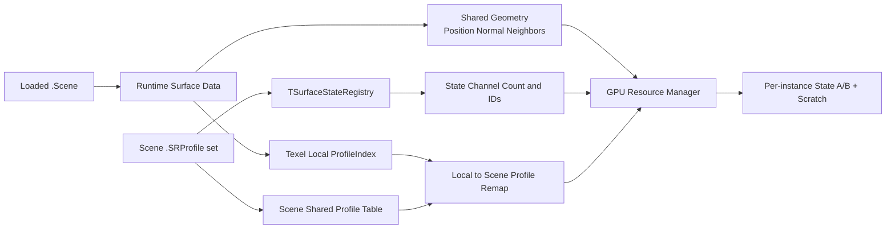
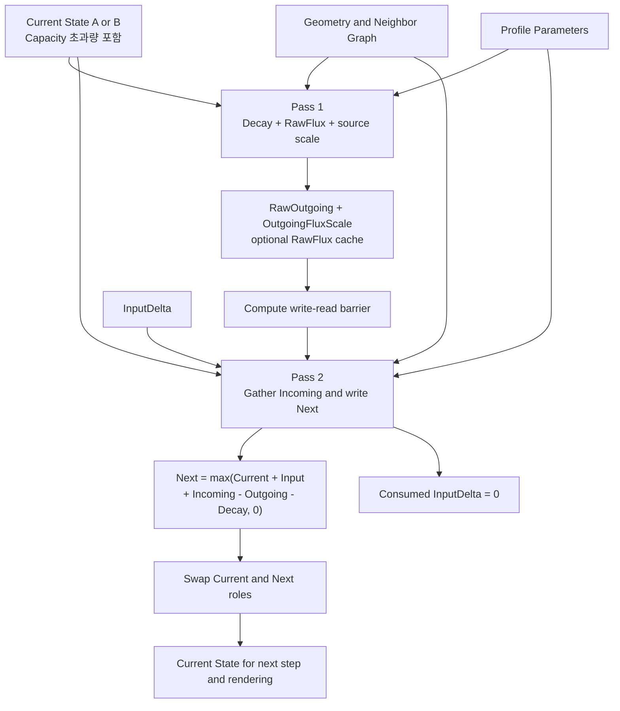

# Surface Simulation 흐름

> **한 줄 요약:** 준비된 Surface Geometry·Profile·State가 입력, 2-Pass Transport와 Decay를 거쳐 다음 State로 갱신되는 실행 흐름을 설명한다.

상태: **현재 GPU Solver 경로 기준 · State Transition과 동적 Geometry 갱신 미연결** · 상위 지도: [[0000_Overview|시스템 흐름 지도]]

이 문서는 Simulation 한 step에서 데이터가 이동하는 순서를 설명한다. State와 파라미터의 의미 및 수식은 [[04_Architecture/0002_Surface-State|표면 상태와 데이터 구조]]와 [[04_Architecture/0006_Surface-State-Update|Surface State Update]]가 기준이다.

## 준비 단계

Simulation을 시작하기 전에 Scene에서 정적 Surface 데이터와 instance별 동적 자원을 준비한다.



Geometry와 Profile 배치는 같은 Runtime Surface Data를 사용하는 instance끼리 공유한다. State A/B와 `InputDelta`는 instance마다 별도로 가진다. Registry의 State 수가 GPU State 채널 수를 결정하며 State 종류를 고정된 전역 목록으로 가정하지 않는다.

## 한 Solver step



### 단계별 데이터 책임

| 단계 | 읽기 | 쓰기 | 핵심 역할 |
|---|---|---|---|
| 입력 준비 | Pending contact | `InputDelta` | 새 접촉량을 State 채널별 dense buffer에 누적·업로드 |
| Pass 1 | Current State, Geometry, Profile | `RawOutgoing`, `OutgoingFluxScale`, 선택적 `RawFlux` | source가 보낼 후보량과 보유량 제한 비율 계산 |
| Barrier | Pass 1 결과 | 없음 | Pass 2가 scratch 값을 안전하게 읽도록 동기화 |
| Pass 2 | Current State, scratch, 이웃, `InputDelta` | Next State, `InputDelta` clear | 이웃 유입을 gather하고 입력·전달·감쇠를 합산 |
| A/B 교환 | Current/Next 역할 | 다음 Current 지정 | 새 State를 다음 step과 렌더링에서 읽을 수 있게 전환 |

## State 값이 이동하는 방식

```text
외부 접촉
  → InputDelta
  → 현재 texel의 Next State
  → 다음 step의 Current State
  → 이웃 방향 RawFlux
  → 이웃 texel의 Next State
```

- `stateCapacity`는 저장 상한이 아니라 Saturation 계산의 기준량이다.
- Transport는 `State / Capacity`를 사용하므로 Saturation은 1을 넘을 수 있다.
- 한 step에 받은 양은 같은 step에서 다시 전달하지 않고 A/B 교환 뒤 다음 step에서 전달 후보가 된다.
- 이웃이 없거나 rate·weight가 0이면 Capacity 초과량도 현재 texel에 남을 수 있다.
- 추가 Overflow 채널이나 단일 `TempState` buffer를 사용하지 않는다.

## Geometry와 Profile의 사용 지점

| 입력 | Solver에서의 사용 |
|---|---|
| Position·Height·중력 방향 | `GeometryDrive`, 이웃 방향과 거리 계산 |
| Normal·Curvature·Concavity | `TransferWeight`, Decay 잔류 효과 |
| Neighbor graph | 보낼 이웃과 gather할 source texel 결정 |
| Texel `ProfileIndex` | texel에 적용할 상태별 반응 파라미터 선택 |
| State Registry | State 이름을 GPU 채널 index로 연결 |

정적 Geometry가 바뀌지 않는 동안 계산한 TransferWeight는 재사용할 수 있다. Accumulation으로 Geometry가 변하는 목표 경로에서는 관련 Geometry revision과 cache도 다시 준비해야 한다.

## 현재 구현 경계

| 구간 | 상태 |
|---|---|
| Scene Registry와 공유 Profile table 준비 | 현재 연결 |
| Instance별 State A/B 및 Solver scratch | 현재 연결 |
| Debug Contact의 `InputDelta` 업로드 | 현재 연결 |
| 2-Pass Transport·Decay와 A/B 교환 | 현재 연결 |
| Capacity 초과 State 보존 | 구현 및 선택 GPU 회귀 통과, 통합 검증 대기 |
| State Transition | 의미만 정의, Solver 적용 미구현 |
| Accumulation 기반 동적 Geometry 갱신 | 설계 목표, 렌더링·Solver 재연결 미구현 |

## 세부 문서

- 수식과 의미: [[04_Architecture/0006_Surface-State-Update|Surface State Update]]
- GPU 데이터 배치: [[04_Architecture/0008_Surface-GPU-Data-Layout|Surface GPU Data Layout]]
- Compute 순서: [[06_Development/Notes/Next-State-Calculation|Next State 계산 메모]]
- GPU resource와 barrier: [[06_Development/Notes/Surface-State-GPU-Resource|Surface State GPU Resource]]
- 최적화와 cache: [[04_Architecture/0007_Simulation-Optimization|Simulation Optimization]]
