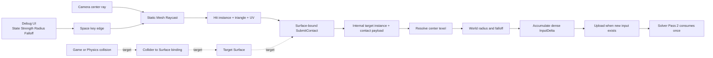
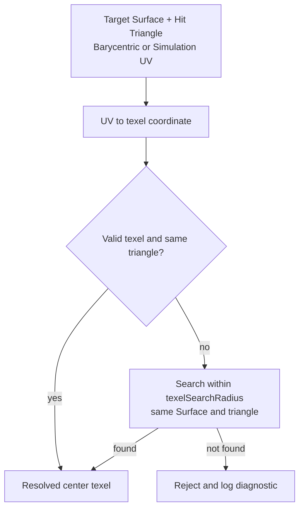
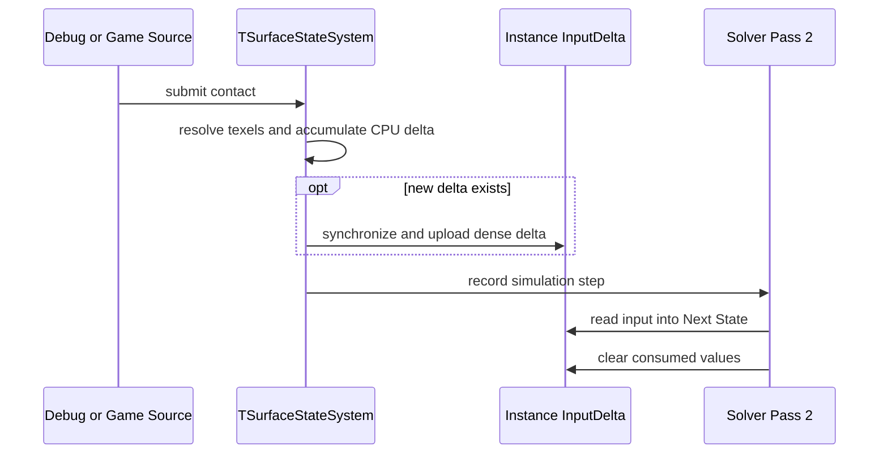

# Contact Input 흐름

> **한 줄 요약:** Debug ray 또는 게임 collision에서 발생한 접촉이 대상 Surface를 찾고 texel별 `InputDelta`로 변환되어 Solver에 한 번 적용되는 과정을 설명한다.

상태: **Debug 입력 경로 연결 · Surface-bound 공개 API와 게임 Physics adapter 미연결** · 상위 지도: [[0000_Overview|시스템 흐름 지도]]

이 문서는 접촉의 출처부터 Solver 입력까지의 라우팅을 설명한다. 공개 API와 각 필드의 의미는 [[04_Architecture/0005_Surface-Input|Surface Contact Input]]이 기준이다.

## 두 입력 출처의 합류



현재 Debug 경로는 hit instance를 내부 `TSurfaceContactInput`의 대상 정보로 변환해 `TSurfaceStateSystem`에 전달한다. 설계된 공개 API에서는 호출 대상인 Surface가 target을 나타내므로 게임 코드가 내부 instance ID나 texel index를 payload에 넣지 않는다.

## 1. 접촉 생성

| 출처 | 대상 Surface 결정 | 현재 상태 |
|---|---|---|
| Debug 입력 | 중앙 카메라 ray가 맞힌 Static Mesh instance | 현재 연결 |
| 게임·Physics 입력 | Scene에 등록한 Collider–Surface 관계 | 설계 목표 |

공통 payload는 State 종류, 월드 위치·방향, 영향 반경, 세기, falloff와 중심 texel fallback 범위를 가진다. 입력 출처가 달라도 대상 Surface가 정해진 뒤에는 같은 처리 경로를 사용한다.

## 2. 월드 접촉을 중심 texel로 변환



Fallback은 UV가 빈 texel이나 경계를 가리킬 때 중심을 보정한다. 같은 Triangle에 유효 texel이 없으면 검색 반경을 늘려도 해결되지 않으므로 입력을 거부한다. 이 단계의 `texelSearchRadius`는 실제 접촉 크기인 월드 공간 `radius`와 별개다.

## 3. 영향 texel과 입력량 계산

중심 texel을 찾은 뒤 각 valid texel의 월드 위치를 비교해 `radius` 안의 대상을 고른다.

```text
normalizedDistance = clamp(distance / radius, 0, 1)
linearWeight       = 1 - normalizedDistance
contactWeight      = falloff == 0 ? 1 : pow(linearWeight, falloff)
InputDelta        += strength × contactWeight × InputFactor
```

| 값 | 역할 |
|---|---|
| `radius` | 월드 공간에서 영향을 받을 texel 범위 |
| `falloff` | 중심에서 멀어질수록 입력이 줄어드는 형태 |
| `strength` | 외부 접촉 자체의 세기 |
| State 종류 | Registry에서 누적할 State 채널 선택 |
| `InputFactor` | texel Profile에 따라 최종 입력 반응 조정 |

## 4. 누적, 업로드와 소비



여러 접촉은 Solver가 실행되기 전까지 같은 instance와 State 채널의 `InputDelta`에 누적될 수 있다. Solver Pass 2는 이를 Next State에 한 번 더한 뒤 소비한 값을 비운다. Pause 중 입력을 유지하는 UI 동작과 Step 실행은 [[04_Architecture/0010_UI-Interface|UI Interface]]를 따른다.

## 실패와 진단 지점

| 실패 지점 | 결과 |
|---|---|
| Ray가 Surface를 맞히지 못함 | 접촉을 만들지 않음 |
| State 이름을 Registry에서 찾지 못함 | 입력 거부 및 진단 |
| Hit Triangle에 유효 texel이 없음 | 입력 거부 및 Surface·triangle·UV 정보 기록 |
| 대상 instance GPU 자원이 없음 | 입력을 업로드하지 않고 자원 상태 진단 |
| 입력 값이 유효 범위를 벗어남 | 공개 경계 또는 내부 검증에서 거부 |

## 현재 구현 경계

| 구간 | 상태 |
|---|---|
| Debug UI 설정과 Space 입력 | 현재 연결 |
| 중앙 Raycast와 hit instance 결정 | 현재 연결 |
| 중심 texel fallback, radius·falloff 적용 | 현재 연결 |
| CPU 누적, GPU 업로드, Pass 2 소비·clear | 현재 연결 |
| Surface-bound 공개 wrapper | Architecture 계약, 미연결 |
| Collider–Surface 등록과 Physics adapter | 설계 목표, 미연결 |

## 세부 문서

- 공개 API와 접촉 필드: [[04_Architecture/0005_Surface-Input|Surface Contact Input]]
- State 입력 수식: [[04_Architecture/0006_Surface-State-Update|Surface State Update]]
- UI 조작: [[04_Architecture/0010_UI-Interface|UI Interface]]
- 업로드 동기화 결정: [[05_ADR/0013-InputDelta-Host-Upload-Synchronization|ADR 0013]]
- 대상 Surface API 결정: [[05_ADR/0014-Surface-Contact-Target-API|ADR 0014]]
