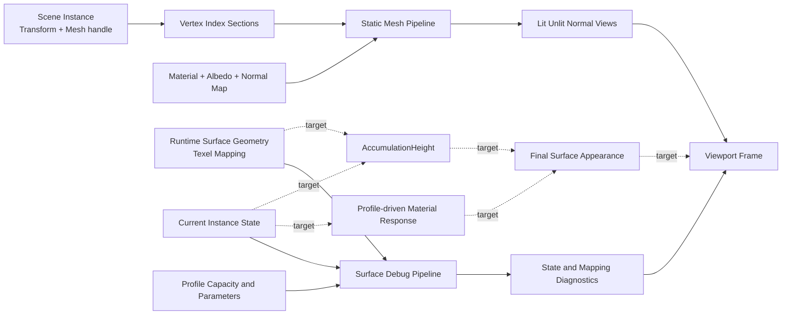
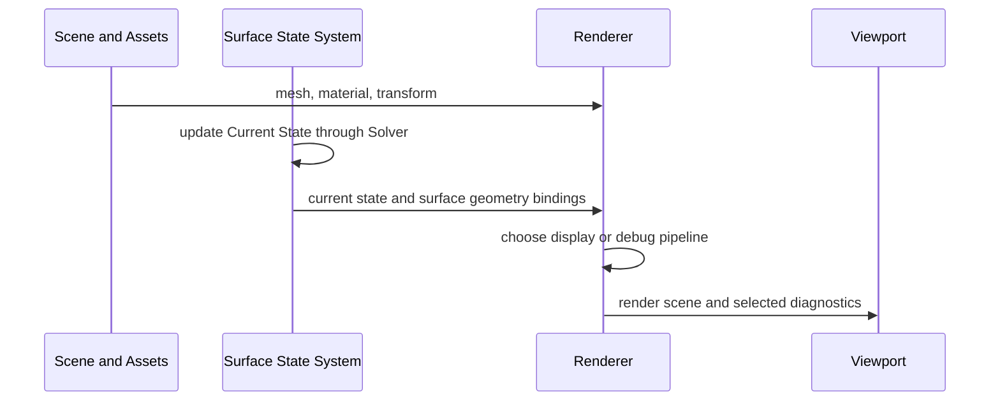
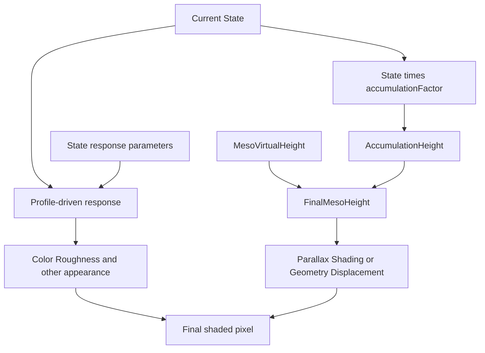

# Rendering 흐름

> **한 줄 요약:** Scene의 Mesh·Material과 현재 Surface State가 기본 렌더링 및 진단 뷰로 출력되고, 향후 외관·적층 변화로 연결되는 경로를 설명한다.

상태: **기본 Material·Normal Map·Surface Debug view 연결 · State 기반 최종 Material과 동적 Accumulation 미연결** · 상위 지도: [[0000_Overview|시스템 흐름 지도]]

이 문서는 렌더링에 들어오는 데이터와 화면 출력까지의 연결을 설명한다. 외관과 형상 변화의 의미는 [[04_Architecture/0009_Rendering|Surface State Rendering]]이 기준이다.

## 렌더링 입력의 두 경로

기본 Mesh 렌더링과 Surface 진단 렌더링은 현재 연결되어 있다. State가 Material 색·roughness를 직접 바꾸는 경로와 Accumulation이 실제 표시 형상을 바꾸는 경로는 설계 목표다.

## Frame에서의 데이터 흐름

현재 Solver에서 A/B 역할 교환이 끝난 State가 이후 진단 렌더링에서 Current State로 읽힌다. UI가 선택한 Display 또는 Debug view가 pipeline과 표시 옵션을 정하지만 GPU State 자체를 수정하지 않는다.

## 기본 표시 경로

| 입력 | 처리 | 출력 |
|---|---|---|
| Mesh vertex/index와 instance transform | Static Mesh vertex stage | 화면상의 기본 형상 |
| Albedo·Material 값 | Lit 또는 Unlit shading | 기본 색과 조명 반응 |
| Normal Texture | tangent-space normal 변환 | Normal Map이 반영된 shading |
| Camera와 render settings | view/projection 및 조명 설정 | Viewport 장면 |

## Surface 진단 경로

| Debug view | 주로 읽는 데이터 | 확인 목적 |
|---|---|---|
| State Heatmap | Current State, texel Profile Capacity | 선택 State의 표시용 포화도 |
| Validity·Surface ID | Runtime Surface Geometry | mapping 유효 영역과 Surface 구분 |
| Neighbor Count·UV Seam | texel neighbor graph | 연결 수와 seam 연결 확인 |
| Outgoing Flux Scale·Transfer Weights | Solver scratch와 cache | 전달 계산 진단 |
| Texel Grid·Area Heatmap | Simulation mapping | 해상도와 면적 분포 확인 |
| Macro Geometry·Meso | Position, Normal, Virtual Height 등 | Solver 형상 입력 확인 |

Heatmap은 알아보기 쉽도록 `clamp(State / Capacity, 0, 1)`을 사용할 수 있다. 이 clamp는 표시 전용이며 State 저장값과 Transport에 사용하는 Saturation을 바꾸지 않는다. 따라서 Capacity를 넘는 서로 다른 양이 같은 최상위 색으로 보일 수 있다.

## 목표 외관 경로

State 기반 외관 반응은 Profile별로 달라질 수 있다. 적층 상태는 `AccumulationHeight`를 만들고 기존 `MesoVirtualHeight`와 결합한다. Parallax, shading 또는 실제 Geometry displacement 중 어떤 표시 방식을 채택할지는 구현·성능 실험 후 결정한다.

## 현재 구현 경계

| 구간 | 상태 |
|---|---|
| Mesh·Material·Texture 기본 렌더링 | 현재 연결 |
| Normal Texture와 normal 관련 display view | 현재 연결 |
| State Heatmap과 Surface Mapping 진단 | 현재 연결 |
| Solver State → Profile 기반 최종 Material 반응 | 미연결 |
| State → `AccumulationHeight` 생성 | 미연결 |
| Accumulation → render displacement/parallax | 방식 검토 중 |
| 동적 Geometry → 후속 Solver Geometry 입력 | 설계 목표, 미연결 |

## 세부 문서

- 외관·형상 반영 의미: [[04_Architecture/0009_Rendering|Surface State Rendering]]
- 적층과 동적 Geometry: [[04_Architecture/0004_Surface-Geometry|형상 정보와 적층]]
- UI view와 표시 옵션: [[04_Architecture/0010_UI-Interface|UI Interface]]
- 구현 방식 검토: [[06_Development/Notes/Rendering-Implementation|렌더링 구현 검토]]
- Accumulation 렌더링 안건: [[05_ADR/0028-Accumulation-Height-and-Normal-Map|ADR 0028]]
